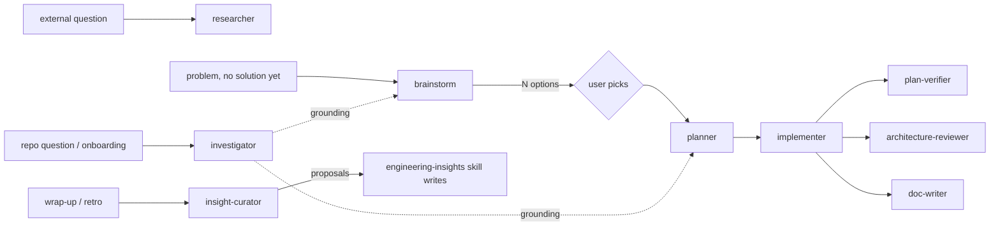

# Development Plan — helper agent set (brainstorm, investigator, insight-curator) + hook hardening

**Status:** ready
**Citations valid as of:** `5fd80ec` (dirty tree — `.claude/agents/*`, `.claude/hooks/readonly-bash*`, `AGENTS.md`, `INSIGHTS.md`, `docs/README.md` uncommitted)

## Goal

Add three read-only subagents (`brainstorm`, `investigator`, `insight-curator`), narrow `researcher` to external-only research, and close 8 evasions + 4 over-deny classes in the shared read-only Bash hook they all depend on.

**Acceptance:** `node --test .claude/hooks/readonly-bash.test.mjs` passes with every must-deny and must-still-allow probe below plus a `git ls-files` sweep; the three new agent files exist with valid frontmatter; `.claude/agents/README.md` and `.claude/skills/README.md` describe ten agents; `git status --short` shows changes only under `.claude/`.

## Out of scope

- Any change in `client/`, `server/`, `reviewer-core/`, `e2e/`, or root `AGENTS.md` beyond the one naming-convention row in step 10.
- `docs/` is in scope only for step 10 (`docs/README.md` routing row + this plan's own home in `docs/plans/`); no feature documentation is written by this task.
- **Never add `readonly-bash.mjs` to `.claude/settings.json`.** A settings-level `PreToolUse` hook is live in the same session (root `INSIGHTS.md:40`) and would deny the implementer's own Bash calls mid-task. It stays per-subagent frontmatter only.
- Renaming/deleting `researcher`; retrofitting a `hooks:` block onto `planner` (deliberate — record in README *Known limits*).
- Committing, pushing, running `/pr-self-review`, `claude plugin validate` (false green — root `INSIGHTS.md:48`).

## Context

**INSIGHTS applied (root):** `:51` (quoted-path vs command-word scopes, `/bin/rm` boundary, wrapper rules), `:52` (every tightening needs a paired must-still-allow probe; run the gate, don't read it), `:50` (per-subagent `hooks:` do NOT fire for the authoring session — safe to edit and test the hook standalone), `:40` (never put a gated phrase inline in a Bash call), `:47`/`:48` (`tools:` is an allowlist; `claude plugin validate` is a false green), `:49` (write-code agents get `Skill`, read-only agents read `SKILL.md` with `Read`), `:29` (AGENTS.md files do not name skills/agents), `:44` (`git worktree list` is how you find where `main` lives).

**History:** `5fd80ec feat(agents): add planner and implementer…` and the uncommitted 4-agent branch are the template. No prior `brainstorm`/`investigator`/`insight-curator` work exists.

## Modules & files

### .claude/hooks
- `.claude/hooks/readonly-bash.mjs:23-69` — new command-position boundary constant; rewrite of the shell-wrapper, interpreter, utility-name, runner, secrets and git rules; backslash-escape normalisation at `:84`.
- `.claude/hooks/readonly-bash.test.mjs:140-256` — ~25 new probes (both directions) + an `evaluate()`-importing `git ls-files` sweep.

### .claude/agents
- `.claude/agents/brainstorm.md` — new.
- `.claude/agents/investigator.md` — new.
- `.claude/agents/insight-curator.md` — new.
- `.claude/agents/researcher.md:1-6,48-114,181` — frontmatter narrowed (drop `Bash`), Mode 1 / Format A removed, boundary paragraph added.
- `.claude/agents/planner.md:51` — routing line: research → `researcher` (external) or `investigator` (repo).
- `.claude/agents/README.md` — table, Flow, 3 new sections, researcher section, Sources (AI…), 3 rule→source tables, Known limits.

### .claude/skills
- `.claude/skills/README.md:24-39` — "All seven agents" → ten, with the new agents placed on the `Skill`-vs-`Read` split.

## Component map

| Module | Component | Status | Layer | Path | Depends on | Step |
|---|---|---|---|---|---|---|
| .claude | `readonly-bash` probes | changed | hook test | `.claude/hooks/readonly-bash.test.mjs` | `evaluate()` | 1, 3 |
| .claude | `readonly-bash` gate | changed | hook | `.claude/hooks/readonly-bash.mjs` | — | 2 |
| .claude | `ls-files` sweep test | new | hook test | `.claude/hooks/readonly-bash.test.mjs` | `evaluate()`, `git ls-files` | 3 |
| .claude | `brainstorm` | new | agent | `.claude/agents/brainstorm.md` | `readonly-bash.mjs`, `planner` | 4 |
| .claude | `investigator` | new | agent | `.claude/agents/investigator.md` | `readonly-bash.mjs`, `mermaid-diagram` SKILL.md | 5 |
| .claude | `insight-curator` | new | agent | `.claude/agents/insight-curator.md` | `readonly-bash.mjs`, `engineering-insights` SKILL.md, 6× INSIGHTS.md | 6 |
| .claude | `researcher` | changed | agent | `.claude/agents/researcher.md` | `investigator` (routing) | 7 |
| .claude | `planner` routing line | changed | agent | `.claude/agents/planner.md:51` | `investigator`, `researcher` | 7 |
| .claude | agents README | changed | docs | `.claude/agents/README.md` | all agent files | 8 |
| .claude | skills README | changed | docs | `.claude/skills/README.md` | all agent files | 8 |
| .claude | `engineering-insights` | reused | skill | `.claude/skills/engineering-insights/SKILL.md` | — | 6 |
| .claude | `settings.json` | reused | config | `.claude/settings.json` | — | — |

## Diagrams

Target routing after this change (what the README Flow must show).

## Steps

### 1. Add the failing probes first (both directions)

Module `.claude`; depends on: —

Append new `node --test` cases to the existing file, grouped as "third self-review pass".

**Must-deny:** `bash -lc`, `bash -ic`, `bash -xc`, `zsh -lc`; `./scripts/dev.sh`, `bash scripts/dev.sh`, `sh scripts/e2e.sh`, `source scripts/dev.sh`; `node --eval=…`, `node -p`, `node --print`, `python3 --command`; `npx rimraf server/src`, `pnpm dlx x`, `npm exec -- x`, `yarn dlx x`, `bunx x`, `deno run x.ts`; `cat ~/.dev*/*.json`, `grep -r . ~/.dev*`, `ls ~/.d*`; `git worktree add ../x`, `git submodule update --init`, bare `git stash`, `git stash push -m x`, `git config user.name x`, `git config --unset x`, `git config --edit`; `\rm -rf x`; `if true; then rm -rf x; fi`; `sudo rm -rf x`; `time rm x`.

**Must-still-allow:** `cat server/src/db/schema/eval.ts`, `cat client/messages/en/eval.json`, `diff server/src/vendor/shared/contracts/eval-ci.ts client/src/vendor/shared/contracts/eval-ci.ts`, `cat docs/install.md`, `ls client/src/app/touch/`, `rg -n mkdir .claude/hooks` (unquoted), `cat scripts/dev.sh`, `rg -n "pnpm install" scripts/dev.sh`, `git worktree list`, `git submodule status`, `git stash list`, `git stash show`, `git config user.email`, `git config --get user.email`, `node --test .claude/hooks/readonly-bash.test.mjs`, `./node_modules/.bin/vitest run`, `pnpm test`, `cat server/src/adapters/secrets/local.ts`, `cat server/.env.example`.

- **Files:** `.claude/hooks/readonly-bash.test.mjs`
- **Skills:** `security` (constraints only)
- **Verify:** `node --test .claude/hooks/readonly-bash.test.mjs` — expect the new cases to FAIL and the existing 39 to pass; record the failing list.

### 2. Rewrite the hook's rules around command position, subcommands and runners

Module `.claude`; depends on: 1. Apply in this order.

**F1 — command-position boundary.** Add a second boundary constant beside `CMD` (`readonly-bash.mjs:27`) matching only a command *word*: start of string, or after `;` `&&` `||` `|` `(` `` ` `` `{`, or after `then`/`do`/`else`/`elif`, optionally through prefix words (`sudo|env|time|nice|nohup|command|exec|builtin` with their flags and `VAR=val`), keeping the existing optional `(?:[\w./-]*/)?` path prefix. Move the name-only rules onto it: `rm`, `mv`, `cp`, `tee`, `xargs`, `eval`, and the `(truncate|dd|ln|chmod|chown|shred|install|mkdir|rmdir|touch)` list (`:39-40,46,50-51,55`). **This alone clears all four over-deny classes in the argument position.**

**F2 — shell wrappers.** `-c` may sit inside a short-flag cluster (`-lc`, `-ic`, `-xc`) or arrive as `--command`; and a shell *running a script file* is the same hop — deny any `*.sh`/`*.bash`/`*.zsh` at command position (so `./scripts/dev.sh` and `bash scripts/dev.sh` are denied, while `cat scripts/dev.sh` is not), plus `source`/`.` of a file. Rationale for the header comment: `scripts/dev.sh:79` `pnpm install`, `:86` `npm ci`, `:90` `pnpm db:migrate`, `:94` `pnpm db:seed`.

**F3 — interpreters.** Extend `:48` to `-p`/`--print`/`--eval`/`--command`/`--exec` and `=`-attached forms, keeping cluster support. **`node --test <file>` must stay allowed** — it is this task's own Verify command.

**F4 — runners, allowlisted not enumerated.** Deny `npx`, `bunx`, `pnpm|npm|yarn` + `dlx|exec`, `deno run`, `bun run|x` at command position. Do not attempt to inspect the payload. State the sanctioned alternative in the deny reason and the header: `./node_modules/.bin/<bin>` (already documented in `implementer.md` and in the tests at `readonly-bash.test.mjs:119-121`).

**F5 — secrets by shape, not by literal.** Widen `:65` so a HOME-anchored path whose first segment starts with a dot is denied even when globbed (`~/.dev*/*.json`, `~/.d*`, `"$HOME"/.dev*`), keeping the `.devdigest/self-review` carve-out and the `secrets.json` literal. Probe that `server/src/adapters/secrets/local.ts` stays readable.

**F6 — git by subcommand.** Split `worktree`, `submodule`, `stash` out of the enumerated list at `:32` and deny only their mutating subcommands (`worktree add|remove|move|prune|lock|unlock|repair`, `submodule add|update|init|deinit|set-url|set-branch|sync|foreach`, `stash push|pop|apply|drop|clear|save|create|store|branch` **and the bare `git stash`**, which stashes). Re-shape `:38` so `git config` is denied on a write (a value argument, or `--add|--unset|--replace-all|--rename-section|--remove-section|--edit|-e`) and allowed on a read (`--get*`, `--list`, `-l`, or a bare key).

**F8 — normalisation.** Beside the line-continuation fix at `:84`, strip a backslash immediately preceding a command word, so `\rm -rf x` is denied. **Accept `RM=rm; $RM x` as a known limit** (needs shell variable tracking; document in the header and in README *Known limits*, together with "a tracked `node <script>` can still be run").

- **Files:** `.claude/hooks/readonly-bash.mjs`
- **Skills:** `security`
- **Verify:** `node --test .claude/hooks/readonly-bash.test.mjs` — all cases from step 1 and the original 39 pass.

### 3. Make the over-deny sweep permanent

Module `.claude`; depends on: 2

Add a test importing `{ evaluate }` from `readonly-bash.mjs` directly (the `main()` path is already guarded at `readonly-bash.mjs:106`, so importing is side-effect free) asserting `evaluate(`cat ${f}`) === null` for every path from `git ls-files`, run with `execFileSync('git', ['ls-files'], { cwd })` — `execFile`, not a shell (`security/SKILL.md:106`) — with `cwd` derived from `import.meta.url` (root `AGENTS.md:111`), never `.claude/…` from cwd. 875 tracked files today; keep it one `spawnSync`-free test so it stays under a second.

Extend the hook's header comment with the fix strategy: enumerate the mutating *subcommand*, allowlist the *runner*, and never enumerate a binary NAME that a file could also be called (`security/SKILL.md:171` "whitelist, not blacklist"; `:161` fail-closed).

- **Files:** `.claude/hooks/readonly-bash.test.mjs`, `.claude/hooks/readonly-bash.mjs`
- **Skills:** `security`
- **Verify:** `node --test .claude/hooks/readonly-bash.test.mjs` — sweep green over all tracked files.

### 4. Write `.claude/agents/brainstorm.md`

Module `.claude`; depends on: 3. New agent in the house style — YAML frontmatter, `## Hard constraints`, `## Step 0 — clarify`, fixed output format, explicit "not for" list.

**Settled decisions:**

- `tools: Read, Glob, Grep, Bash`; `model: opus` (divergence plus self-critique is the judgment-heavy half of the job); **`hooks:` block wiring `readonly-bash.mjs`** — an option-generating agent is the one most tempted to "just try it". No `AskUserQuestion` (uniform with the newer agents: unclear input returns a `## Clarification needed` block; the option *pick* belongs to the caller's turn).
- **Option space before options.** Name the axes of variation first, then choose options that differ on an axis — verbalizing the distribution rather than sampling N times (AJ). Materiality test, stated literally: *two options are the same option if one becomes the other by changing a constant, a file name or a library vendor.*
- **Exactly 4–6 options**, one a baseline (smallest reversible change / do nothing) and one breaking an assumption stated in the brief. Say in the file that "rule of three" is a practitioner heuristic with no controlled study behind it (AM), and that 4 is this repo's convention (3 substantive + baseline).
- **No self-ranking.** No numeric scores, no aggregate winner — position/verbosity/self-enhancement bias in LLM judges (AC). A single `## Leaning` paragraph, labelled a recommendation and carrying its own strongest counter-argument, is allowed; a decision is not.
- **Anti-sycophancy.** If the caller names a preferred option, it appears as one option among the set and receives the strongest counter-case in writing; no option may be dropped because the caller seemed to dislike it (AK — matching user beliefs is among the most predictive features of human preference).
- **Per-option required fields** (forced structure, because prose alternatives sections degenerate — MADR's *Considered Options* / *Decision Drivers* exist for exactly this, Q/R): sketch with `path:line` landing sites; fits/conflicts with each numbered decision driver; cost and reversibility (one-way vs two-way door); **de-risking step labelled spike (disposable probe) or tracer bullet (thin production-quality end-to-end slice)** (AV, secondary); a kill criterion. Rejected options must be tied to the drivers they fail — AL's definition of a useless alternatives section.
- **Not for:** producing a plan (`planner`), implementing, reviewing, repo investigation (`investigator`), external research (`researcher`).
- Repo rules: read the `INSIGHTS.md` of every module the problem concerns (root when cross-cutting) and say in one line what applies; English always; report ≤200 lines.

- **Files:** `.claude/agents/brainstorm.md`
- **Skills:** none
- **Verify:** `head -1` is `---` and `rg -n '^(name|description|tools|model|hooks):'` lists all five — frontmatter checked by hand, never with `claude plugin validate` (root `INSIGHTS.md:48`).

### 5. Write `.claude/agents/investigator.md`

Module `.claude`; depends on: 3. New agent, two modes.

**Settled decisions:**

- `tools: Read, Glob, Grep, Bash`; **no web tools at all** (`tools:` is an allowlist, so their absence is the enforcement — root `INSIGHTS.md:47`); `model: sonnet` (search-and-report precedent, and it is the highest-volume agent: subagent research runs ~15x the tokens of chat, E); **`hooks:` block** — it is the heaviest `Bash` user of the three.
- **Mode A — targeted search.** Inherit the method now in `researcher.md:56-79` (INSIGHTS first, then `AGENTS.md`, then follow the real call path route → service → repository → adapter, then history: `git log --oneline --all -S'…'`, reverted commits, `DROP COLUMN` migrations, then corroborate against the live DB read-only). Add the grep-vs-symbol rule (AN): grep generates hypotheses, reading the definition and its callers verifies them — never report a call-graph claim from a match count alone.
- **Mode B — onboarding brief.** Sections: *Map* (entry points), *Data flow* (`entry:line → step:line → …`, optionally **one** Mermaid `flowchart`/`sequenceDiagram` after reading `.claude/skills/mermaid-diagram/SKILL.md` with `Read` — the `doc-writer` precedent, no `Skill` tool), *Conventions this area follows* (each with the `AGENTS.md` line or `SKILL.md` section that owns it), *Seams* (where new code attaches), *Traps* (cited `INSIGHTS.md` entries + verified gotchas), *Read in this order* (≤8 files), *Verify before you trust* (commands the caller can re-run).
- **Coverage statement is mandatory in both modes** — an explicit "I searched X (commands listed) and found nothing" section, plus a *Commands run* list and `path:line` on every claim. Mark in the README rule table as **this repo's own convention**; no primary source prescribes a report schema or negative-result rule for investigation subagents.
- Length caps, justified by context isolation (a subagent may spend tens of thousands of tokens and return a 1,000–2,000-token distillation — F): Mode A ≤150 lines, Mode B ≤300 lines, links not pasted code.
- **Routing paragraph**, because Claude Code routes on `description` alone (A) and specialization only works when routing is unambiguous (AW): repo/code/history/config → `investigator`; docs, specs, changelogs, library behaviour, prior art → `researcher`; a question needing both is split, `investigator` first, and it says so rather than guessing at the web half.
- **Not for:** editing anything, planning (`planner`), option generation (`brainstorm`), review (`architecture-reviewer`, `/pr-self-review`), external/web research.

- **Files:** `.claude/agents/investigator.md`
- **Skills:** none (reads `mermaid-diagram/SKILL.md` with `Read` at runtime)
- **Verify:** `rg -n '^(name|description|tools|model|hooks):'` shows five keys and `tools:` contains no `Web*`/`Skill`/`Agent`/`Write`/`Edit`.

### 6. Write `.claude/agents/insight-curator.md`

Module `.claude`; depends on: 3. New agent that proposes, never writes.

**Settled decisions:**

- `tools: Read, Glob, Grep, Bash`; `model: opus` (the documented failure mode is over-merging — collapsing two lessons that share vocabulary and destroying the narrower one — a precision judgment, the same reason `architecture-reviewer` is opus); **`hooks:` block, load-bearing here**: the hook blocks `>`/`>>`, `tee` and `sed -i`, i.e. exactly the Bash write path an agent forbidden from editing `INSIGHTS.md` might otherwise reach for.
- **Scope:** the six files — `INSIGHTS.md`, `client/INSIGHTS.md`, `server/INSIGHTS.md`, `server/src/modules/repo-intel/INSIGHTS.md`, `reviewer-core/INSIGHTS.md`, `e2e/INSIGHTS.md`. Read them lazily per `engineering-insights/SKILL.md:35-52` (section map first).
- **Writes nothing, including `INSIGHTS.md`** — `engineering-insights/SKILL.md` owns every write (its `allowed-tools` lists `Edit(**/INSIGHTS.md)`/`Write(**/INSIGHTS.md)`). Every proposal must be executable by that skill unchanged: append-only (`SKILL.md:147`), the fixed section list (`:121-131`, never invent a section), the entry format `- YYYY-MM-DD · <what> — <why>. path:line (symbol)` (`:135-143`), corrections as `- YYYY-MM-DD · Supersedes YYYY-MM-DD "<first words>": <new truth>` (`:149`). The curator emits the literal bullet text to paste, with today's date from `date +%F`, never guessed.
- **Never propose deleting or editing an existing bullet** — pruning is the human's job (`SKILL.md:148,157`); a stale entry gets a `Supersedes` bullet or a flagged prune candidate, matching the ADR convention of **superseded** (a newer decision replaces it, with a pointer) vs **deprecated** (the thing it described is gone) — Q/R.
- **Staleness is proven, not guessed:** for each cited `path:line`/symbol run `git ls-files --error-unmatch <path>` and `rg -n '<symbol>'` and report the command's result; line drift alone is not staleness (`SKILL.md:114`).
- **Near-duplicate detection is lexical** (shingling / Jaccard — AT) and cannot see paraphrase, while the threshold's real danger here is over-merging. Encode the guard: a cluster is only proposed as a merge when the two entries make the *same* actionable claim; if they differ in a load-bearing particular, report **keep-both**, naming the particular. No paraphrase claims without quoting both entries.
- **Promotion proposals (lesson → rule)** operationalise the repo's own existing rule (`SKILL.md:152-155`). Targets: a skill, a hook, an `AGENTS.md`, or `docs/`. Each must be Retromat-shaped (AR) — small, concrete, inside this repo's control, with a first step and a review trigger — and must cite the ≥2 entries (or the "broke an entry I had already read" event) that justify it.
- **Caps (this repo's choice, stated as such):** ≤8 duplicate/near-duplicate clusters, ≤8 stale entries, **≤3 promotions** (AR's 2–3 action items per retro, a practitioner heuristic, not a study), ≤5 "also noticed" one-liners. "Nothing to propose" is a valid terminal state.
- **Blameless framing** (AS: "You can't 'fix' people, but you can fix systems") — proposals target the system (a hook, a rule, a skill), never a session or an author; and the reason it proposes rather than rewrites is the asymmetry in Claude Code's own memory docs (AU): private auto-memory is written silently, but `/init` presents a reviewable proposal and suggests rather than overwrites. `INSIGHTS.md` is the shared, checked-in layer.
- **Output sections:** *Bottom line* (files read, entries scanned, counts), *Duplicate & near-duplicate clusters*, *Stale entries* (with the evidence command), *Promotion proposals*, *Also noticed*, *Coverage / not examined*, *Could not establish*, *Ready-to-append bullets* (verbatim, grouped by target file and section).
- **Not for:** writing or pruning `INSIGHTS.md`, editing `AGENTS.md`/skills/hooks, code review, deciding a lesson is wrong on its own authority.

- **Files:** `.claude/agents/insight-curator.md`
- **Skills:** none (reads `engineering-insights/SKILL.md` with `Read` at runtime)
- **Verify:** `rg -n '^(name|description|tools|model|hooks):'`; `rg -n 'Supersedes'` shows the exact `engineering-insights` line format.

### 7. Narrow `researcher` and fix the routing line in `planner`

Module `.claude`; depends on: 5

- **Tools decision: `tools: Read, Glob, Grep, WebFetch, WebSearch, AskUserQuestion` — drop `Bash`.** Reason: the only local grounding an external question needs is "which version/config do we actually run", which `Read` + `Grep` cover (`package.json`, a lockfile, a named config file); everything needing `Bash` — `git log`, call-path tracing, `psql \d` — is now `investigator`'s job by definition. Dropping `Bash` makes the boundary mechanical rather than aspirational and removes the need for a `hooks:` block (the hook matches `Bash` only). Keeps `AskUserQuestion` and `model: sonnet`.
- **Boundary sentence to encode:** `researcher` may open local files only to pin a version, a config value or a contract that an external claim is about — a handful of files, named in the report; it may not trace a call path, read git history, or explain how an area of this codebase works. The moment the answer depends on this repo's own behaviour, it stops and names `investigator`.
- Rewrite the `description` around external research only, with an explicit "not for: repo questions or onboarding — that is `investigator`".
- Delete "Mode 1 — repo research" and "Format A" (`researcher.md:48-114`); collapse the mode table; keep Format B plus a short *Local grounding* subsection; update the closing "Not for" line (`:181`) to name `investigator`, `brainstorm` and `planner`.
- `planner.md:51` currently routes every research/review question to `researcher`; change it to route repo questions to `investigator` and external ones to `researcher`.

- **Files:** `.claude/agents/researcher.md`, `.claude/agents/planner.md`
- **Skills:** none
- **Verify:** `rg -n '^tools:' .claude/agents/researcher.md` shows no `Bash`; `rg -n 'investigator' .claude/agents/researcher.md .claude/agents/planner.md` shows the routing in both; `rg -n 'Format A|repo research' .claude/agents/researcher.md` returns nothing.

### 8. Update the two READMEs

Module `.claude`; depends on: 4, 5, 6, 7. Follow `.claude/agents/README.md:308-319` ("Changing an agent").

- **At-a-glance table:** three new rows, `researcher`'s Tools cell corrected; "None of the seven" → ten (`:19`).
- **Flow block** (`:25-42`): `brainstorm → user picks → planner` upstream; `investigator` as the repo-facing counterpart of `researcher` and as a grounding feeder into `brainstorm`/`planner`; `insight-curator` on the wrap-up lane, its output consumed by the `engineering-insights` skill. Keep consistent with the *Diagrams* flowchart above.
- **Three new per-agent sections** in the existing shape (Responsibility / Permissions / Must NOT re-derive / Input / Output / Not for), and a rewritten `researcher` section (`:44-55`) stating the external-only scope and the no-`Bash` decision with its reason.
- **Sources table**, continuing at **AI**:

| # | Source | Type |
|---|---|---|
| AI | arXiv:2604.18005 — diversity collapse in multi-agent LLM ideation | preprint, search summary |
| AJ | arXiv:2510.01171 — Verbalized Sampling / typicality bias | preprint, search summary |
| AK | arXiv:2310.13548 — Towards Understanding Sycophancy (Anthropic) | paper, search summary |
| AL | Design Docs at Google (industrialempathy.com) | insider account, secondary, fetched |
| AM | danlebrero — the belligerent contrarian and the rule of three | practitioner, secondary (explicitly not validated) |
| AN | zzet.org — code search for AI agents: grep vs symbol resolution | practitioner, secondary, fetched |
| AO | GAO-01-1015R — Survey of NASA's Lessons Learned Process | primary, fetched |
| AP | Nextgov — NASA LLIS cost and underuse | secondary, search summary |
| AQ | PMI — Lessons Learned: Sharing Knowledge | standards-body, **search summary, not fetched** |
| AR | Retromat — What's a good action item? | practitioner, fetched (**do not attribute to Google SRE**) |
| AS | Google SRE Book — Postmortem Culture | primary, fetched |
| AT | Broder et al. 1997 — Syntactic Clustering of the Web (shingling/MinHash) | paper, search summary |
| AU | Claude Code docs — How Claude remembers your project | Anthropic docs, fetched |
| AV | artima.com — Tracer Bullets and Prototypes | secondary, search summary |
| AW | claude.com/blog — When to use multi-agent systems (and when not to) | Anthropic blog, fetched |

  Reuse existing letters where they already cover a claim: **AC** (arXiv:2306.05685, LLM-judge bias), **Q**/**R** (ADR + MADR, superseded/deprecated), **G** (sectioning vs voting; one consideration per call), **E** (~15x tokens, division-of-labour failures, vague instructions), **F** (context isolation, 1,000–2,000-token distillation), **A** (routing on `description`; frontmatter schema).
- **Three new rule→source subsections**, one per agent, each row naming the rule and its letters — and a row marked "this repo's convention" for: the 4-option floor, the mandatory coverage/negative-results statement, the `path:line` anchors, and the curator's caps.
- **Known limits** (`:289-306`): add the two accepted hook limits (`RM=rm; $RM x` variable indirection; a tracked `node <script>` can still be run), the fact that the hook now guards five agents while `planner` stays prompt-enforced, `researcher`'s loss of `Bash`, that the per-subagent `hooks:` shape is still not runtime-verified (root `INSIGHTS.md:50`), and that the curator's duplicate detection is lexical and can miss paraphrase.
- `.claude/skills/README.md:24-39`: "All seven agents" → ten, with `brainstorm`, `investigator` and `insight-curator` on the read-a-`SKILL.md`-with-`Read` side (`investigator` → `mermaid-diagram`, `insight-curator` → `engineering-insights`); keep the "adding an agent does not require a `routing.json` change" sentence — it still holds, and none of the three writes code, so **the planner's "Lazy skill reading" table needs no new row**.

- **Files:** `.claude/agents/README.md`, `.claude/skills/README.md`
- **Skills:** none
- **Verify:** `rg -n 'brainstorm|investigator|insight-curator' .claude/agents/README.md .claude/skills/README.md` hits the table, the Flow, a per-agent section and a rule→source row for each; `rg -n 'AI \||AW \|' .claude/agents/README.md` shows the new source letters.

### 9. Whole-set consistency pass

Module `.claude`; depends on: 8. No new content — verify the set.

Confirm every agent file starts with `---`, carries `name`/`description`/`tools`/`model`; that each `description` says both when to use and when not to; that no new agent lists `Agent`, `Skill`, `Write` or `Edit`; and that the three `hooks:` blocks are byte-identical to `architecture-reviewer.md:6-12`. Confirm root `AGENTS.md` needs no edit (it names no agent or skill by design — root `INSIGHTS.md:29`) and that `.claude/settings.json` is unchanged.

- **Files:** — (read-only checks)
- **Verify:** `for f in .claude/agents/*.md; do head -1 "$f"; done`; `rg -n '^tools:' .claude/agents/*.md`; `rg -n 'readonly-bash.mjs' .claude/agents/*.md` returns five agents; `git status --short` shows only `.claude/**`.

### 10. Make "plans live in `docs/plans/`" a rule across the agent set

Module `.claude` + `docs`; depends on: 8. User instruction, added after the plan was drafted.

`docs/README.md` already carries the routing row and a **Plans — the rule** section (written before this step; verify it is present and consistent, do not duplicate it). This step propagates that rule to every agent that touches a plan.

- **`.claude/agents/planner.md`** — its Output section must end by stating that the caller saves the returned plan to `docs/plans/NNNN-<slug>.md` (next unused 4-digit prefix, never renumbered) before handing it to `implementer`. `planner` itself still has no `Write` and must NOT be given one — say so explicitly so a future reader does not "fix" the asymmetry.
- **`.claude/agents/implementer.md`** — accepts a plan by path under `docs/plans/`; a plan pasted inline is still accepted but it says in its report which path the plan came from, or that it had none. It must never edit the plan file to match what it built — deviations go in its `Deviations` section (this is already its rule; tie it to the file).
- **`.claude/agents/plan-verifier.md`** — its Input section names `docs/plans/NNNN-<slug>.md` as the canonical plan location; the compliance matrix's `Source` column cites `docs/plans/<file>:<line>` rather than "the plan".
- **`.claude/agents/doc-writer.md`** — `docs/README.md` is already its only authority for destinations, so the new row is inherited automatically. Add one line to its "not for" list: it does not write or update plans; `docs/plans/` is not one of its destinations.
- **`.claude/agents/README.md`** — one line in the Flow block showing the plan is persisted (`planner → docs/plans/NNNN-<slug>.md → implementer`), and the `planner`/`implementer`/`plan-verifier` sections updated to match.
- **Root `AGENTS.md`** — add one row to the *Naming conventions* table: `Plan` · `docs/plans/NNNN-<slug>.md`, 4-digit sequential prefix, never renumbered · `docs/plans/0001-helper-agent-set.md`. This is a file-naming convention, not an agent or skill name, so it does not conflict with root `INSIGHTS.md:29`. **This is the only root `AGENTS.md` edit this task makes** — it supersedes the "root `AGENTS.md` needs no edit" line in step 9 and in *Do-not-touch*.

- **Files:** `.claude/agents/planner.md`, `.claude/agents/implementer.md`, `.claude/agents/plan-verifier.md`, `.claude/agents/doc-writer.md`, `.claude/agents/README.md`, `AGENTS.md`
- **Skills:** none
- **Verify:** `rg -n 'docs/plans' .claude/agents/*.md AGENTS.md docs/README.md` — hits `planner`, `implementer`, `plan-verifier`, `doc-writer`, the agents README, the `AGENTS.md` naming row and the `docs/README.md` row and rule section; `ls docs/plans/` shows `0001-helper-agent-set.md`; `rg -n '^tools:' .claude/agents/planner.md` still shows no `Write`.

## Skills for implementer

| Step | Skill | Rule from the skill that governs this step |
|---|---|---|
| 1–3 | `security` | "Deny by default" (`SKILL.md:47`) and fail-closed (`:161`) — an unmatched rule must never grant; "whitelist, not blacklist" (`:171`) is why F4 allowlists the runner instead of enumerating payloads; ASI02 Tool Misuse (`:204`); command injection (`:106`) — use `execFile`, not a shell, for the `git ls-files` sweep. |
| 4–9 | none | No project skill covers `.claude/` agent prose; `.claude/skills/README.md` and `.claude/agents/README.md` are the conventions of record. |

## Architecture constraints

- Scripts under `.claude/` locate siblings via `import.meta.url`, never `.claude/…` from cwd (root `AGENTS.md:111`) — applies to the sweep test's `cwd`.
- `tools:` is an allowlist; omitting `Skill`/`Agent`/`Write`/`Edit`/`Web*` is the enforcement, not a convention (root `INSIGHTS.md:47,49`). Read-only agents read a `SKILL.md` with `Read`.
- Never put a gated phrase inline in a Bash call: exercise the hook only through `node --test` / `spawnSync`-fed stdin (root `INSIGHTS.md:40`, `readonly-bash.test.mjs:1-4`). `gate.mjs` and `rebase-before-commit.mjs` are live for this session from `.claude/settings.json`; `readonly-bash.mjs` is not (root `INSIGHTS.md:50`).
- Every tightening ships with a paired must-still-allow probe, in the same test file, both directions (root `INSIGHTS.md:52`).
- `claude plugin validate` is a false green for agent frontmatter — hand-check only (root `INSIGHTS.md:48`).
- Nothing outside `.claude/` changes; no module test suite, typecheck or `arch:check` is required or meaningful for this task.

## Do-not-touch that this task hits

- `.claude/settings.json` — off-limits here for a concrete reason: a settings-level hook is live in the authoring session and would deny the implementer's own commands. The sanctioned route is the per-subagent `hooks:` frontmatter block.
- Root `AGENTS.md` — checked, no change needed (root `INSIGHTS.md:29`).
- Existing `INSIGHTS.md` bullets — append-only; the curator proposes, `engineering-insights` writes.
- Lock files, migrations, `vendor/shared`, `e2e/specs/*.flow.json` — untouched by this task.

## Verification (whole task)

- `node --test .claude/hooks/readonly-bash.test.mjs` — all pre-existing 39 plus ~25 new probes plus the `git ls-files` sweep pass. A pass means: every listed evasion is denied, every listed read is still allowed, and no tracked file is unreadable by `cat`.
- `rg -n '^(name|description|tools|model):' .claude/agents/*.md` — ten agents, four keys each.
- `rg -n 'readonly-bash.mjs' .claude/agents/*.md` — five agent files carry the hook block.
- `git status --short` — changes confined to `.claude/`, no stray files, nothing committed.

## Risks

- **The command-position boundary (F1) is the single riskiest edit**: too strict and `rm` after `then`/`sudo`/a backtick slips through; too loose and the over-denies come back. Mitigation: step 1's must-deny probes include `then rm`, `sudo rm`, `time rm`, and step 3's sweep catches the reverse. Re-run both after every regex tweak.
- **Denying `*.sh` at command position could deny a legitimate read** if the boundary leaks into argument position — `cat scripts/dev.sh` and `rg -n x scripts/e2e.sh` are explicit probes.
- **F5 (secrets by shape) can over-deny a HOME path an agent legitimately reads** (e.g. `~/.claude/…`). Accepted: for a read-only agent a false deny costs one reported command (`readonly-bash.mjs:17-19`). Probe `server/src/adapters/secrets/local.ts` stays allowed.
- **Routing ambiguity between `researcher` and `investigator`** is the failure mode Anthropic names (E, AW). Mitigation: both `description`s carry the same one-sentence boundary, and `investigator` owns the "both" case by splitting explicitly.
- **`brainstorm` degenerating into one idea with four skins** — the materiality test and the axes-first rule are the guard; if a review finds sibling options, tighten the test, not the count.
- **`insight-curator` over-merging** — the keep-both default is the guard; a merge proposal must quote both entries.
- **README drift**: three new agents touch six places in `.claude/agents/README.md`; step 8's Verify greps each one.

## Resolved (were the planner's open questions)

- **Missing source URLs** — both now have them and get letters: **AW** `claude.com/blog/building-multi-agent-systems-when-and-how-to-use-them` (Anthropic, fetched — the 3–10x figure and "telephone game"); **AV** `artima.com/articles/tracer-bullets-and-prototypes` (secondary, search summary). Cite the 15x figure from **E** as before.
- **Does `planner` also get the `hooks:` block?** — No. Out of scope; record it in README *Known limits* as the remaining prompt-enforced gap.

## Could not establish

- Whether the per-subagent `hooks:` block actually fires at runtime, and whether it adds to or replaces the `.claude/settings.json` hooks — unchanged since root `INSIGHTS.md:50`. The three new blocks are copied verbatim from a shape already in the repo, so they inherit whatever behaviour the existing two have.
- Exact regex shapes for F1–F8 — deliberately left to the implementer. Every fix is specified as an invariant plus its probe pair, not as a pattern to paste.
- Whether any additional tracked file trips a *widened* rule — unknowable before the widening exists; that is what step 3's sweep is for.

## Insight candidates

- Command-gate over-denial has a cheap, complete oracle: `evaluate('cat <f>')` over `git ls-files`. It found four blocked tracked files (`server/src/db/schema/eval.ts`, `client/messages/en/eval.json`, both `vendor/shared/contracts/eval-ci.ts`) in seconds — including the one that blocks `architecture-reviewer`'s own vendor-drift diff.
- The generalisable rule behind every over-deny in this hook: enumerating a *binary name* is safe only for names no file is ever called; otherwise enumerate the mutating *subcommand* (`worktree add`, not `worktree`), allowlist the *runner* (`npx`) rather than its payload, and anchor name rules to command position, not to any whitespace.
- The `Skill`-vs-`Read` split (root `INSIGHTS.md:49`) now has a third axis worth recording: a read-only agent whose forbidden action is a *file write* gains real enforcement from the `Bash` hook (no `>`/`tee`/`sed -i`), which is why `insight-curator` gets the block even though its prompt already forbids writing.
