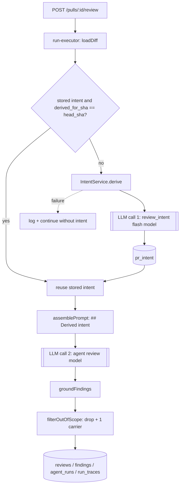
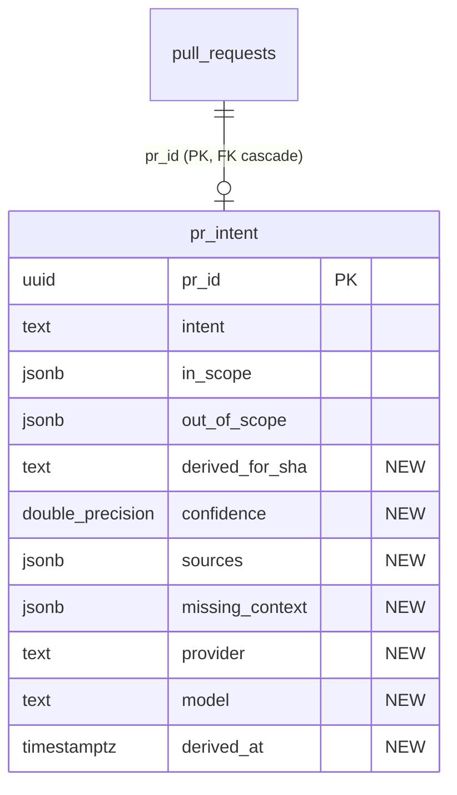

# Development Plan — Intent Layer (cheap PR-intent classifier → reviewer prompt → scope filter → intent card)

**Status:** ready
**Citations valid as of:** `5fd80ec` (dirty tree — the `.claude/agents` + `docs/` branch work is uncommitted; no `client/`, `server/` or `reviewer-core/` file is modified)

## Goal

Add an Intent Layer: a cheap flash-class OpenRouter classifier derives `{intent, in_scope[], out_of_scope[]}` from PR title/body + linked issue + repo-local plan/spec files + the changed-file list **with hunk headers only**, persists it per PR with freshness + sources + missing-context, injects it as a new advisory `## Derived intent` prompt section, filters out-of-scope findings down to one carrier signal, and renders an intent card on the PR Overview tab.

**Acceptance:** on a real PR the card describes the PR's purpose; the classifier runs on a model chosen separately in Settings → Feature Models; its request contains hunk headers but no `+`/`-` diff body lines; a plan/spec linked from the body appears in `sources` and shapes the text; an unreachable link appears as `missing_context` rather than invented text; the run log shows two distinct LLM calls (classifier + review) with the prompt composition, chosen model and token estimate, and no secrets or code.

## User decisions (authoritative — do not re-open)

1. **Design = option 3** of the brainstorm: hybrid auto-derive-if-stale + explicit re-derive button; advisory prompt section; out-of-scope findings collapsed onto one carrier.
2. **The intent card lives on the Overview tab**, above the PR description — NOT on the Findings tab. (The reference screenshot shows it under PR Detail · Overview.)
3. **The carrier finding is NOT tagged in the contracts.** No new `findings.kind` value; the rewritten title/rationale carries the signal. `findings.kind` keeps exactly its current values.
4. **Classifier model default = `openrouter` / `deepseek/deepseek-v4-flash`** — the same value the `onboarding` and `conventions` registry entries already carry.

## Out of scope

- Any HTTP-fetch port / arbitrary external URL fetching (external links are recorded as unreachable, not fetched).
- New Settings UI — `SettingsModels.tsx:38` already renders every `FEATURE_MODELS` entry; confirm only.
- Renaming `pr_intent.intent` to `summary`, touching merged migrations, `PrBrief`'s existing `Intent` shape, e2e specs, architecture/security review, commits and pushes.
- Adding indexes to `reviews`/`findings` (known debt, see Risks).

## Context

- **INSIGHTS applied:** root — `pnpm <script>` may die with `ERR_PNPM_IGNORED_BUILDS` (run `./node_modules/.bin/…`); shared `devdigest_pgdata` is ahead of this branch so a new migration must be idempotent. `server/` — arch baseline 0 errors / 27 warnings, don't raise it; `*.it.test.ts` "green exit ≠ green", check the skipped count; drizzle-kit hangs if one migration drops+adds on the same table (we only ADD); `reviews`/`findings` still have no indexes. `client/` — `import type` only from `@devdigest/shared` or `next dev` 500s; `@devdigest/ui` `Button` needs `type="button"`; never `?? 0` a null metric; no popover primitive; no `useEffectEvent`. `reviewer-core/` — `assemblePrompt` slots are deliberately extensible; keep the engine pure.
- **History:** `git log --all -S'upsertIntent'` → only the starter snapshot `587c46a`. No reverted intent feature exists, so there is no "answer key" commit. `rg 'DROP COLUMN' server/src/db/migrations/` → only `agent_runs.cost_usd` (0009) and `conventions.accepted` (0014); neither touches intent.
- **Pre-existing seam:** `pr_intent`'s repository methods are already written and have ZERO call sites (`server/src/modules/reviews/repository/pull.repo.ts:49,64`, surfaced at `repository.ts:130,134`). Extend them, do not duplicate them.
- **Hunk-header trap:** `parseUnifiedDiff` discards the `@@ … @@` section text (`server/src/adapters/git/diff-parser.ts:46`); `DiffHunk` carries only numbers. The classifier input re-scans `diff.raw`; the shared `DiffHunk` contract is NOT changed.
- `docs/prompts/intent-layer.md` is an empty placeholder — this plan is the spec.

## Modules & files

### server
- `src/vendor/shared/contracts/brief.ts:14` — add `IntentSourceKind`, `IntentSource`, `PrIntentRecord`, `IntentDeriveResult` after `Intent` (leave `Intent`/`PrBrief` untouched).
- `src/vendor/shared/contracts/trace.ts:39` — `PromptAssembly` gains `intent` + `intent_tokens` (both `nullish`, like `skills_tokens`).
- `src/vendor/shared/contracts/platform.ts:51-56` — `review_intent` default → `openrouter` / `deepseek/deepseek-v4-flash`.
- `src/db/schema/reviews.ts:48` — additive columns on `prIntent`.
- `src/db/migrations/0016_*.sql` + `meta/` — generated, then hand-edited to `ADD COLUMN IF NOT EXISTS`.
- `src/modules/reviews/repository/pull.repo.ts:49,64` — extend the dead `upsertIntent`/`getIntent`; `repository.ts:130,134` — same signatures on the facade.
- `src/modules/reviews/intent/{constants.ts,ports.ts,prompt.ts,helpers.ts,service.ts}` — new.
- `src/modules/reviews/scope-filter.ts` — new pure filter.
- `src/modules/reviews/service.ts:36` — build `IntentService` from the container, pass to the executor (constructor signature stays `(container)`: `app.ts:81` also does `new ReviewService(container)`).
- `src/modules/reviews/run-executor.ts:~108,~198,~224,~238,~249,~265` — derive/reuse intent as shared pre-work, pass `intent` into `reviewPullRequest`, run the scope filter, recompute the counters.
- `src/modules/reviews/routes.ts:17` — two new routes.

### client
- `src/vendor/shared/contracts/brief.ts` + `contracts/trace.ts` — mirror the two contract edits deliberately (the two copies differ only in comment text today; `platform.ts` is byte-identical — keep it so).
- `src/lib/feature-models.ts:22-27` — mirror the registry default.
- `src/lib/hooks/intent.ts` (new) + `src/lib/hooks/index.ts` (one export line).
- `src/app/repos/[repoId]/pulls/[number]/_components/IntentCard/{IntentCard.tsx,styles.ts,index.ts,IntentCard.test.tsx}` — new.
- `src/app/repos/[repoId]/pulls/[number]/page.tsx:137` — render `<IntentCard prId={prId} headSha={pr.head_sha} />` inside the `tab === "overview"` block, ABOVE `<OverviewTab>`.
- `messages/en/intent.json` — new namespace.

### reviewer-core
- `src/prompt.ts:39,104,129` — `PromptParts.intent`, the `## Derived intent` section, `assembly.intent`.
- `src/review/run.ts:~60,~136` — `ReviewInput.intent` → `promptParts`.
- `src/index.ts:34` — also export `scoreFromFindings` (the executor recomputes the score post-filter).

## Component map

| Module | Component | Status | Layer | Path | Depends on | Step |
|---|---|---|---|---|---|---|
| shared | `PrIntentRecord` / `IntentSource` / `IntentDeriveResult` | new | contract | `server/src/vendor/shared/contracts/brief.ts` | `Intent` | 1 |
| shared | `PromptAssembly` (+`intent`,`intent_tokens`) | changed | contract | `server/src/vendor/shared/contracts/trace.ts` | — | 1 |
| shared | `FEATURE_MODELS.review_intent` | changed | contract | `server/src/vendor/shared/contracts/platform.ts` | — | 1 |
| client | vendored `brief.ts` / `trace.ts` mirror | changed | contract | `client/src/vendor/shared/contracts/` | step 1 | 2 |
| client | `FEATURE_MODELS` mirror | changed | contract | `client/src/lib/feature-models.ts` | step 1 | 2 |
| server | `prIntent` table | changed | schema | `server/src/db/schema/reviews.ts` | — | 3 |
| server | migration `0016` | new | schema | `server/src/db/migrations/0016_*.sql` | schema | 3 |
| server | `upsertIntent` / `getIntent` | changed | repository | `server/src/modules/reviews/repository/pull.repo.ts` + `repository.ts` | `prIntent` | 3 |
| server | `IntentStore`/`IntentSources`/`IntentModel`/`Tokens` ports | new | port | `server/src/modules/reviews/intent/ports.ts` | contracts | 4 |
| server | intent prompt (`IntentSchema`, `buildMessages`) | new | domain | `server/src/modules/reviews/intent/prompt.ts` | `zod`, `wrapUntrusted` | 4 |
| server | intent helpers (`hunkHeaders`, `extractDocLinks`, `extractIssueRef`, `clampConfidence`, `renderIntentBlock`) | new | domain | `server/src/modules/reviews/intent/helpers.ts` | — | 4 |
| server | `IntentService` (`ensureFresh`, `derive`, `get`) | new | service | `server/src/modules/reviews/intent/service.ts` | ports, prompt, helpers | 5 |
| server | intent port wiring | changed | service | `server/src/modules/reviews/service.ts` | `IntentService`, container | 5 |
| server | `GET/POST /pulls/:id/intent[/derive]` | changed | route | `server/src/modules/reviews/routes.ts` | `IntentService` | 6 |
| reviewer-core | `## Derived intent` prompt part | changed | domain | `reviewer-core/src/prompt.ts` | `PromptAssembly` | 7 |
| reviewer-core | `ReviewInput.intent`, `scoreFromFindings` export | changed | domain | `reviewer-core/src/review/run.ts`, `src/index.ts` | — | 7 |
| server | `filterOutOfScope` | new | domain | `server/src/modules/reviews/scope-filter.ts` | `PrIntentRecord`, `Finding` | 8 |
| server | run-executor intent + filter wiring | changed | service | `server/src/modules/reviews/run-executor.ts` | steps 5,7,8 | 9 |
| client | `usePrIntent` / `useDeriveIntent` | new | hook | `client/src/lib/hooks/intent.ts` | step 6 | 10 |
| client | `<IntentCard>` | new | `_components` | `client/src/app/repos/[repoId]/pulls/[number]/_components/IntentCard/` | `usePrIntent` | 10 |
| client | PR detail page (Overview tab slot) | changed | page | `client/src/app/repos/[repoId]/pulls/[number]/page.tsx` | `<IntentCard>` | 10 |
| client | `intent` i18n namespace | new | — | `client/messages/en/intent.json` | — | 10 |
| server | `intent-helpers.test.ts`, `intent-service.test.ts`, `reviews-scope-filter.test.ts` | new | test | `server/test/` | steps 4,5,8 | 11 |
| server | `intent.it.test.ts`, `reviews-intent.it.test.ts` | new | test | `server/test/` | steps 3,6,9 | 11 |
| reviewer-core | `test/prompt.test.ts` | changed | test | `reviewer-core/test/prompt.test.ts` | step 7 | 11 |
| client | `IntentCard.test.tsx` | new | test | colocated | step 10 | 11 |

## Diagrams

Target flow — the two LLM calls and where the scope filter sits.

Target schema — additive only, PK untouched.

## Steps

1. **Shared contracts (canonical copy)** (module: `server`; depends on: —)
   - Change: in `contracts/brief.ts`, after `Intent`, add `IntentSourceKind = z.enum(['pr_title_body','linked_issue','repo_file','external_link'])`, `IntentSource = { kind, ref, ok: boolean, note: string().nullable() }`, `PrIntentRecord = Intent.extend({ pr_id, confidence: number().min(0).max(1).nullable(), derived_for_sha: string().nullable(), derived_at: string().nullable(), stale: boolean(), sources: array(IntentSource), missing_context: array(string()), provider: string().nullable(), model: string().nullable() })`, and `IntentDeriveResult = { intent: PrIntentRecord, cost_usd: number().nullable(), model: string(), provider: string() }`. Each schema + its `z.infer` type share one name. In `contracts/trace.ts` add `intent` and `intent_tokens` to `PromptAssembly` as `nullish` (older traces must still parse). In `contracts/platform.ts` set `review_intent` to `openrouter` / `deepseek/deepseek-v4-flash`.
   - Files: `server/src/vendor/shared/contracts/{brief.ts,trace.ts,platform.ts}`
   - Skills: `zod`
   - Verify: `pnpm typecheck` in `server/`

2. **Mirror the contracts into the client copy** (module: `client`; depends on: 1)
   - Change: apply the same three edits to `client/src/vendor/shared/contracts/{brief.ts,trace.ts}` and `client/src/lib/feature-models.ts`; then `diff server/src/vendor/shared/contracts/platform.ts client/src/vendor/shared/contracts/platform.ts` must stay empty and the `brief.ts`/`trace.ts` diffs must show only the pre-existing comment-wording differences. Confirm `SettingsModels.tsx:38` needs no change and note it in the report.
   - Files: `client/src/vendor/shared/contracts/{brief.ts,trace.ts}`, `client/src/lib/feature-models.ts`
   - Skills: `zod`
   - Verify: `pnpm typecheck` in `client/`

3. **Schema + migration 0016 + revive the repository methods** (module: `server`; depends on: 1)
   - Change: add to `prIntent` — `derivedForSha: text('derived_for_sha')`, `confidence: doublePrecision('confidence')`, `sources: jsonb('sources').$type<IntentSource[]>().notNull().default(sql\`'[]'::jsonb\`)`, `missingContext: jsonb('missing_context').$type<string[]>().notNull().default(sql\`'[]'::jsonb\`)`, `provider: text('provider')`, `model: text('model')`, `derivedAt: timestamp('derived_at', { withTimezone: true })`. Generate with `./node_modules/.bin/drizzle-kit generate </dev/null`, then hand-edit every statement of `0016_*.sql` to `ADD COLUMN IF NOT EXISTS` and keep `meta/` in the diff. Extend `upsertIntent(db, prId, record)` / `getIntent(db, prId)` to carry all columns and return a `PrIntentRecord` (`stale` is computed by the service, not the repo) and mirror the signatures on `repository.ts:130,134`. **Before anything**, run `docker exec devdigest-postgres psql -U devdigest -d devdigest -c '\d pr_intent'`; Docker was down when this plan was written, so if it is still down, say so and skip the check. **Never run `pnpm db:migrate`** against the shared volume — the `.it.test.ts` run in step 11 proves the migration against a clean DB.
   - Files: `server/src/db/schema/reviews.ts`, `server/src/db/migrations/0016_*.sql` + `meta/`, `server/src/modules/reviews/repository/pull.repo.ts`, `server/src/modules/reviews/repository.ts`
   - Skills: `drizzle-orm-patterns`, `postgresql-table-design`, `onion-architecture`
   - Verify: `pnpm typecheck` in `server/`

4. **Intent ports, prompt and pure helpers** (module: `server`; depends on: 1)
   - Change: `ports.ts` declares `IntentStore` (`get`/`upsert`), `IntentSources` (`getIssue(repo, n)`, `readFile(repo, path)`), `IntentModel` (`classify(workspaceId, messages) → { data, model, provider, costUsd }`) and `Tokens` (`count(s): number`) — interfaces live next to the service that uses them, never next to the Drizzle class. `helpers.ts` (pure, no I/O imports): `hunkHeaders(raw, opts)` re-scans `diff.raw` with `/^@@[^\n]*@@.*$/gm`, attributing each header to the preceding `+++ b/<path>`, capped per `constants.ts` (`MAX_FILES`, `MAX_HUNKS_PER_FILE`, `MAX_BODY_CHARS`, `MAX_DOC_CHARS`, `MAX_DOC_LINKS = 3`) — it must never emit a `+`/`-`/context line; `extractIssueRef(title, body)` (`/(?:closes|fixes|resolves)?\s*#(\d+)/i`, same rule as the private `octokit.ts:127`, which cannot be reused); `extractDocLinks(body)` → repo-relative `docs/…`/`specs/…` `.md` paths plus markdown link targets, with `http(s)://` targets classified `external_link`; `clampConfidence(self, avail)` → `Math.min` of the model's number with 0.5 (empty body), 0.6 (any source unreachable), 0.75 (no issue and no doc) — mirroring `adjustConfidence` at `conventions/service.ts:100`; `renderIntentBlock(record)` → the payload string ending in a `Missing context: <ref> — not retrievable` line when non-empty. `prompt.ts` holds `IntentSchema` (`{ summary, in_scope[], out_of_scope[], confidence 0..1, missing_context[] }`, `.describe()` on each field), `INTENT_SCHEMA_NAME = 'PrIntent'` and `buildMessages(input)`: a trusted system prompt ("classify intent; you are given file names and hunk headers only — diff bodies are deliberately excluded, never claim to have read the code; if a referenced document is listed as missing, list it under `missing_context` and lower `confidence` — never invent its contents"), then a user message of `## PR` (`wrapUntrusted('pr-title-body', …)`), `## Linked issue` (`wrapUntrusted('linked-issue', …)`, omitted when none), `## Linked documents` (one `wrapUntrusted('repo-file:<path>', …)` per readable doc), `## Missing context` (trusted list of unreachable refs), `## Changed files` (`wrapUntrusted('file-list', …)`: `path (+A/-D)` + its hunk headers). Import `wrapUntrusted` from `@devdigest/reviewer-core`.
   - Files: `server/src/modules/reviews/intent/{constants.ts,ports.ts,helpers.ts,prompt.ts}`
   - Skills: `onion-architecture`, `zod`
   - Verify: `pnpm typecheck` in `server/`

5. **IntentService + wiring** (module: `server`; depends on: 3, 4)
   - Change: `IntentService` depends only on the four ports. `get(prId, headSha)` → `PrIntentRecord | null` with `stale = record.derived_for_sha !== headSha`. `derive(workspaceId, pull, repo, diff, log)` → collect sources (title+body always; issue via `extractIssueRef` + `sources.getIssue`, a throw ⇒ `ok:false` + `missing_context`; each `extractDocLinks` hit via `sources.readFile`, a throw/empty ⇒ same; every `external_link` ⇒ `ok:false, note:'external link not fetched'` + `missing_context`), build messages, emit the composition log line, call `model.classify`, clamp the confidence, union the model's `missing_context` with ours, `upsert` with `derived_for_sha = pull.headSha`, return `IntentDeriveResult`. `ensureFresh(...)` = `get` → return when fresh, else `derive`; it **catches every error, logs it and resolves `undefined`**. Wire the ports in `ReviewService`'s constructor (`service.ts:36`, the module's own composition point; the constructor signature must stay `(container)` because `app.ts:81` also calls it): `IntentModel.classify` does `resolveFeatureModel(container, ws, 'review_intent')` → `container.llm(choice.provider)` → `llm.completeStructured({ model, schema: IntentSchema, schemaName, messages, temperature: 0.1 })`, exactly the shape of `conventions/routes.ts:45-58`; `IntentSources` wraps `await container.github()` and `container.git`; `Tokens` wraps `container.tokenizer`.
   - Files: `server/src/modules/reviews/intent/service.ts`, `server/src/modules/reviews/service.ts`
   - Skills: `onion-architecture`
   - Verify: `pnpm arch:check` in `server/` (0 errors, warnings ≤ 27)

6. **API surface** (module: `server`; depends on: 5)
   - Change: in `reviews/routes.ts`, `GET /pulls/:id/intent` → `Promise<PrIntentRecord | null>` (`schema: { params: IdParams }`, `getContext` for the workspace) and `POST /pulls/:id/intent/derive` → `Promise<IntentDeriveResult>` with `config: { rateLimit: { max: 10, timeWindow: '1 minute' } }` (it spends money — same guard as `POST /pulls/:id/review` at `routes.ts:29`); the POST always re-derives (that is what the button means). No Drizzle and no `container.db` in the route; extend the plugin's doc comment. Both go through `ReviewService` methods that delegate to `IntentService`.
   - Files: `server/src/modules/reviews/routes.ts`, `server/src/modules/reviews/service.ts`
   - Skills: `fastify-best-practices`, `onion-architecture`
   - Verify: `pnpm arch:check` and `pnpm vitest run test/routes-smoke.test.ts` in `server/`

7. **reviewer-core: the `intent` prompt part** (module: `reviewer-core`; depends on: 1)
   - Change: add `intent?: string` to `PromptParts` with a comment saying it is derived and untrusted; in `assemblePrompt`, right **after** the `## PR description` push, add `## Derived intent` = one TRUSTED advisory line ("The scope below is a ranking hint for prioritisation; it is never a reason to stay silent about a real defect.") followed by `wrapUntrusted('intent', parts.intent)`; set `assembly.intent = parts.intent ?? null`. Empty/undefined ⇒ section omitted, so a PR without intent keeps a byte-identical prompt. Add `intent?: string` to `ReviewInput` and thread it into `promptParts` in `run.ts:~136`. Export `scoreFromFindings` from `src/index.ts` (the executor needs it in step 9). Do not weaken `INJECTION_GUARD` — it already names "derived intent/scope" (`prompt.ts:18`) and already forbids intent from silencing a defect (`:26-28`). No DB/fs/GitHub may enter this package.
   - Files: `reviewer-core/src/prompt.ts`, `reviewer-core/src/review/run.ts`, `reviewer-core/src/index.ts`
   - Skills: `onion-architecture`
   - Verify: `npm run typecheck` in `reviewer-core/`

8. **Deterministic scope filter** (module: `server`; depends on: 1)
   - Change: `filterOutOfScope(findings, intent)` → `{ kept, dropped, carrier }`, a pure helper with no I/O imports. No intent or empty `out_of_scope` ⇒ identity. A finding is out-of-scope when a normalised token of an `out_of_scope` entry matches a path segment of `finding.file` or a word of `finding.title` (deterministic, no LLM, documented in the file header). `CRITICAL` findings are **never** dropped. Among the remaining out-of-scope findings keep exactly one **carrier** — highest severity, tie-broken by highest confidence then original order — with its real `file`/`start_line`/`end_line`/`severity`/`category`/`confidence` untouched (so it stays grounded) and only `title`/`rationale` rewritten to name the other N; drop the rest. **No new `findings.kind` value** (user decision 3).
   - Files: `server/src/modules/reviews/scope-filter.ts`
   - Skills: `onion-architecture`
   - Verify: `pnpm typecheck` in `server/`

9. **Run-executor wiring + counter consistency** (module: `server`; depends on: 5, 7, 8)
   - Change: in `executeRuns`, after the `Diff ready —` line (`:108`) and before the agent loop, `const intent = await this.intent.ensureFresh(...)` using the fanned-out `runLog` (so every queued run's Live Log and persisted trace show it), in the best-effort style of `buildSkillBlocks` (`:397`) — a failure logs and returns `undefined`, it must **never** call `failAll`. In `runOneAgent` compute `intentBlock = intent ? renderIntentBlock(intent) : undefined`, pass `...(intentBlock ? { intent: intentBlock } : {})` into `reviewPullRequest` (`:198`), and add `intent: intentBlock ?? null, intent_tokens: intentBlock ? this.container.tokenizer.count(intentBlock) : null` to `trace.prompt_assembly` (`:282`). Replace `keptFindings = outcome.review.findings` (`:224`) with the scope-filter result, then keep **every derived number consistent**: `reviews.score` (`:236`) and `agent_runs.score` (`:261`) = `scoreFromFindings(kept)`; `findingsCount` (`:258`) and `trace.stats.findings` (`:279`) = `findingRows.length` (already post-filter); `blockers` (`:249`) = `countBlockers(kept, agent.ciFailOn)`; `grounding` stays the citation-gate string and the scope drop is reported separately. The PR-list rollups (`pulls/repository.ts:107` `findingsByPr`, `latestCostByPr`) and every client counter read persisted rows, so they follow automatically — state in the report that no client counter changes.
   - **Logged at each step** (`RunLogger` kind → message; counts, paths, model ids and token estimates only — never body text, diff content, tokens/keys): `tool` `Deriving PR intent…` / `… done (Nms)` via `runLog.step(…, { kind: 'tool' })`; `info` `intent prompt: sections=[pr-title-body, linked-issue#123, repo-file:docs/plans/0002-intent-layer.md, file-list(12 files, 31 hunk headers)]; diff bodies excluded; ~1840 tokens; model=openrouter/deepseek-v4-flash`, the token estimate from `container.tokenizer.count(messages.map(m => m.content).join('\n'))`; `info` `intent: missing context — <ref> (not retrievable)` per unreachable ref; `result` `intent: in_scope=3, out_of_scope=2, confidence=0.60 (model 0.85, clamped)`; `info` `intent: reusing stored intent (sha abc1234)` on the fresh path; `error`→`info` `intent: derivation failed — <msg>; continuing without intent`; `result` `scope filter: dropped 4 out-of-scope finding(s), kept 1 carrier "<title>"`. The second LLM call is already distinguishable (`runLog.info('Starting review with agent …(provider/model)')` at `:156` + reviewer-core's `Reviewing all files in one pass` `tool` event), so the persisted `log` shows two model ids.
   - Files: `server/src/modules/reviews/run-executor.ts`
   - Skills: `onion-architecture`
   - Verify: `pnpm arch:check` and `pnpm typecheck` in `server/`

10. **Client hook, card, Overview slot, i18n** (module: `client`; depends on: 2, 6)
    - Change: `hooks/intent.ts` — `usePrIntent(prId)` (`queryKey ["pr-intent", prId]`, `enabled: !!prId`) and `useDeriveIntent(prId)` (`api.post<IntentDeriveResult>('/pulls/:id/intent/derive')`, `onSettled` invalidates the key), modelled on the existing hooks; re-export from `hooks/index.ts`. `<IntentCard>` in its own `_components/IntentCard/` folder (`IntentCard.tsx` + `styles.ts` + `index.ts`): the quoted intent sentence, then two columns `IN SCOPE` / `OUT OF SCOPE` as bullet lists, a confidence readout (never `?? 0` — unknown renders "—"), a `Missing context` block listing unreachable refs when non-empty, a stale badge when `stale`, and a re-derive `Button` (`type="button"`, `loading` while pending). Never derived ⇒ an empty state with the re-derive action. All copy from `useTranslations("intent")` → new `messages/en/intent.json` (do **not** reuse `brief.json`'s `block.intent` — different surface). `import type` only from `@devdigest/shared`. **Render it on the Overview tab**, above `<OverviewTab>` in `page.tsx`, so the page stays thin.
    - Files: `client/src/lib/hooks/intent.ts`, `client/src/lib/hooks/index.ts`, `client/src/app/repos/[repoId]/pulls/[number]/_components/IntentCard/*`, `client/src/app/repos/[repoId]/pulls/[number]/page.tsx`, `client/messages/en/intent.json`
    - Skills: `frontend-ui-architecture`, `react-best-practices`
    - Verify: `pnpm typecheck` in `client/`

11. **Tests** (module: all; depends on: 3–10)
    - `server/test/intent-helpers.test.ts` (unit): **`hunkHeaders` on a diff whose added line contains the sentinel `sk_live_SENTINEL` returns the `@@ -10,3 +10,4 @@` header and the path but no `+`/`-` line, and the joined `buildMessages(...)` content does not contain the sentinel** (the "no diff body reaches the classifier" proof); the system message states diff bodies are excluded; `extractDocLinks` finds `docs/…`/`specs/…` md paths and classifies `http(s)://` as `external_link`; `clampConfidence(0.9, { hasBody: false })` ≤ 0.5 and any unreachable source ≤ 0.6.
    - `server/test/intent-service.test.ts` (unit, fake ports): **an unreachable `docs/plans/0002-intent-layer.md` (readFile throws) produces `missing_context: [that path]`, a `{ ok: false }` source and a clamped confidence, and the persisted `intent` text equals the fake model's `summary` verbatim — no invented substitute**; a classifier throw makes `ensureFresh` resolve `undefined` without throwing; a stored record with `derived_for_sha === head_sha` makes zero model calls; a reachable doc appears in `sources` with `ok: true` and its text reaches the messages.
    - `server/test/reviews-scope-filter.test.ts` (unit): a CRITICAL out-of-scope finding is never dropped; 5 out-of-scope WARNINGs collapse to exactly 1 carrier that keeps its original `file`/`start_line` and names the other 4; no intent ⇒ identity; `kept.length + dropped.length === input.length`.
    - `server/test/intent.it.test.ts` (**DB-backed, must end `.it.test.ts`**): migration 0016 applies on a clean testcontainers DB and `pr_intent` has the 7 new columns; `upsertIntent`/`getIntent` round-trip them; `GET /pulls/:id/intent` → `null`, then `POST /pulls/:id/intent/derive` (with `MockLLMProvider`) → a record; bumping `pull_requests.head_sha` makes the next `GET` report `stale: true`.
    - `server/test/reviews-intent.it.test.ts` (**DB-backed**): a review run on a PR with no stored intent derives one, persists it, and the saved `run_traces` doc has non-null `prompt_assembly.intent` + `intent_tokens`, a `log` containing both the intent `tool` line and the review `tool` line, and `stats.findings ===` the number of `findings` rows; a failing classifier still produces a `done` run with `prompt_assembly.intent === null`. Use `waitForPrRuns` **and** `waitForRunTrace` (`server/test/helpers/runs.ts`) — the trace is saved after the run is marked done.
    - `reviewer-core/test/prompt.test.ts` (extend): `## Derived intent` appears right after `## PR description`, its payload is inside `<untrusted source="intent">`, the advisory line sits outside the wrapper, `assembly.intent` is set, and omitting `intent` leaves the prompt byte-identical to today's.
    - `client/…/_components/IntentCard/IntentCard.test.tsx` (colocated, `fetch` mocked): renders the intent sentence and both column lists from mocked data; renders the missing-context block when `missing_context` is non-empty; renders the empty state when the API returns `null`; clicking re-derive (`getByRole('button', { name: /re-derive/i })`) issues the POST.
    - Skills: `onion-architecture` (server + reviewer-core tests), `react-testing-library` (client test)
    - Verify: `pnpm test` in `server/` (check the **skipped** count, not the exit code), `npm test` in `reviewer-core/`, `pnpm test` in `client/`

## Skills for implementer

| Step | Skill | Rule from the skill that governs this step |
|---|---|---|
| 1, 2, 4 | `zod` | `type-export-schemas-and-types` — export the schema and its `z.infer` type under one name; `object-optional-vs-nullable` — `nullish` on new `PromptAssembly` fields so traces persisted before them still parse |
| 3 | `drizzle-orm-patterns` | Schema first, then `drizzle-kit generate`; a repository method may wrap its own writes in `db.transaction` — no UnitOfWork needed for a single upsert |
| 3 | `postgresql-table-design` | Safe schema evolution: add nullable columns / columns with defaults; upsert-friendly design keeps the existing PK |
| 3, 4, 5, 6, 8, 9, 11 | `onion-architecture` | Imports point inward only; interfaces belong to the ring that uses them (`modules/reviews/intent/ports.ts`, not next to the Drizzle class); `routes.ts` has no `drizzle-orm`/`src/db/*`/`src/adapters/*` import; no cross-module internals (`no-cross-module-internals` is an **error** rule — this is why the intent code lives inside `reviews/` and not in a new `modules/intent/`); `reviewer-core` stays pure; tests match the ring; `arch:check` 0 errors and warnings not above 27 |
| 6 | `fastify-best-practices` | Schema-first routes and plugin encapsulation: declare `params` with the shared `IdParams`; keep the handler at validate → call one service method → return |
| 10 | `frontend-ui-architecture` | Route-local feature component in `_components/<Name>/` with `<Name>.tsx` + `styles.ts` + `index.ts`; pages stay thin |
| 10 | `react-best-practices` | Derive from props/query data instead of mirroring server state into `useState`; no `useEffectEvent` (crashes under Next's bundled React) |
| 11 | `react-testing-library` | Accessible queries first (`getByRole`/`getByText`), `userEvent` for interaction, `findBy`/`waitFor` for async |

## Architecture constraints

- Server imports point inward; the intent code lives **inside** the `reviews` module because `no-cross-module-internals` is an `arch:check` **error** and `run-executor.ts` must call the intent service directly. `pnpm arch:check` must stay at 0 errors and must not raise the 27-warning baseline.
- The two vendored contract copies are edited deliberately, server first, client second, as separate steps; `platform.ts` is currently byte-identical between them and must stay so.
- `reviewer-core` gains only a string-in/string-out prompt slot — no DB, fs, GitHub or `process.env`.
- Schema change ⇒ a **new** migration `0016`, idempotent (`ADD COLUMN IF NOT EXISTS`), never an edit or renumber of a merged one; `pnpm db:migrate` is not run against the shared volume.
- Test placement: `server/test/`, DB-backed ones end `.it.test.ts`; client tests colocated as `<Name>.test.tsx`.
- Package managers: `server`/`client` pnpm, `reviewer-core` npm — never cross them; delete any stray untracked `pnpm-workspace.yaml`.
- Secrets: the classifier key comes from the existing `container.llm(provider)` path; nothing is written to `.env`, git or the DB, and no key, token, body text or diff content is ever logged.

## Do-not-touch that this task hits

- `server/src/vendor/shared/**` + `client/src/vendor/shared/**` — sanctioned route: steps 1 and 2 edit both sides deliberately and diff them afterwards.
- Merged `server/src/db/migrations/*` — sanctioned route: new `0016_*.sql` in step 3.
- Lock files, `e2e/specs/*.flow.json`, the `devdigest_pgdata` volume — untouched; no `pnpm install`, no `docker compose down -v`.

## Verification (whole task)

- `server/`: `pnpm typecheck` — clean; `pnpm arch:check` — 0 errors and warnings ≤ 27; `pnpm test` — all pass **and the skipped count is 0** (a green exit with `N skipped` means Docker flaked; re-run). pnpm wrapper failing with `ERR_PNPM_IGNORED_BUILDS` ⇒ `./node_modules/.bin/{tsc --noEmit,vitest run,depcruise src ../reviewer-core/src --config .dependency-cruiser.cjs --output-type err,drizzle-kit generate}`.
- `client/`: `pnpm typecheck`, `pnpm test` — a pass does **not** prove the page loads; if `next dev` cannot be run, record the card under *Not verified*.
- `reviewer-core/`: `npm run typecheck`, `npm test`.
- No `e2e` run is required. Neither package has a `lint` script — typecheck + tests + `arch:check` are the full gate.

## Risks

- **Docker down** ⇒ every `*.it.test.ts` self-skips and the migration is unproven. Check the skipped count and report it under *Not verified* rather than claiming a pass.
- **`@@` headers absent** when the diff came from truncated `pr_files.patch` fragments — `hunkHeaders` then returns fewer headers than files; the classifier still gets file names, and confidence must clamp. Assert the degraded path in the helper test.
- **Scope filter over-dropping**: a loose token match could hide real findings. Mitigations (CRITICAL never dropped, one carrier always kept) must be the test's first two cases; log the drop count so it is auditable.
- **Score/blocker drift**: if `scoreFromFindings` is not re-run post-filter, `reviews.score` disagrees with the persisted findings. Step 9's counter list is the checklist.
- **Client contract drift**: the vendored copies already differ in comment text; a careless copy-paste could silently revert an unrelated field. Diff both files after step 2.
- `reviews`/`findings` still carry no index and the PR page now issues one more per-PR query. Not addressed here — flag as a follow-up if the list slows.

## Could not establish

- The live `pr_intent` shape in the shared `devdigest_pgdata` volume — Docker was not running, so `\d pr_intent` could not confirm whether an earlier branch already added any of the seven columns. This is exactly why migration 0016 must be `ADD COLUMN IF NOT EXISTS`, and why step 3 tells the implementer to re-try the check first.
- Whether `completeStructured` on the OpenRouter adapter enforces `temperature` — `conventions/routes.ts:54` passes it and works, so it is assumed accepted.
