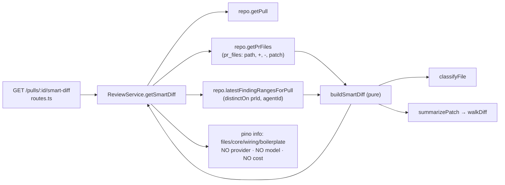
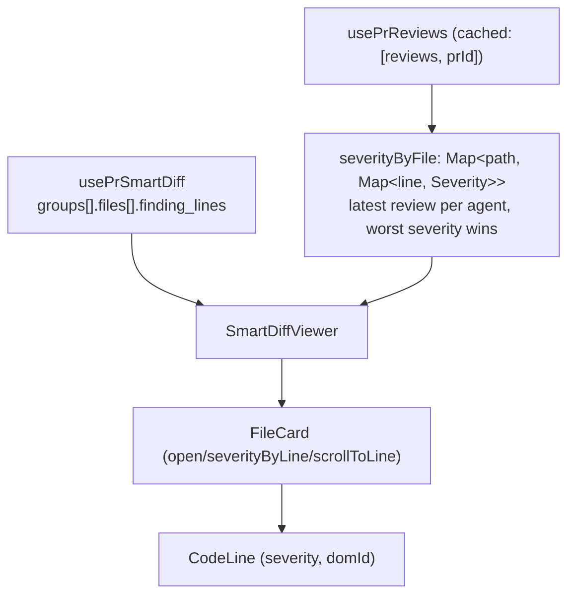

# 0004 — Smart Diff (reviewer-ordered diff)

**Status:** ready · **Citations valid as of:** `59eb758` (clean tree)

## Goal

Sort a PR's changed files by review risk (`core` / `wiring` / `boilerplate`) with a
deterministic path+size classifier, serve them at `GET /pulls/:id/smart-diff` as the
existing `SmartDiff` contract with **no model call**, and render them in the existing
"Files changed" tab via a new `SmartDiffViewer` that reuses `diff-viewer`'s
`FileCard` / `CodeLine` / `parsePatch`.

**Acceptance:** lock files land in `boilerplate` regardless of size and start collapsed;
per-file finding badges are clickable and scroll to the right line; calling the endpoint
produces no provider/model/cost log line and no new `agent_runs` row; every threshold and
pattern lives in a `constants.ts`.

## Chosen options (binding spec — do not re-open)

1. **Per-line severity → client-side join.** The server returns the `SmartDiff` contract
   VERBATIM; `brief.ts` and `review-api.ts` are untouched in both vendored copies.
   `SmartDiffViewer` builds a `Map<number, Severity>` per file by joining the
   `/pulls/:id/reviews` payload the page already fetches, expanding `start_line..end_line`.
   Ordering from `client/src/lib/severity.ts:14-29`; on a line collision the worst severity wins.
2. **Findings set → latest per agent.** New repository query using
   `selectDistinctOn([reviews.prId, reviews.agentId]).where(kind='review').orderBy(prId, agentId, desc(createdAt))`,
   modelled on `PullsRepository.latestScores` (`server/src/modules/pulls/repository.ts:79-86`).
   Lines contributed by different agents are deduped.
3. **Classifier → path patterns + size thresholds.** Path-segment-anchored regexes (the
   `risks/constants.ts` anchoring convention) plus an exact lock-file basename list, plus
   numeric caps over `additions`/`deletions` from `pr_files`. Patterns and thresholds both
   live in a `constants.ts`. Lock files are provably `boilerplate` regardless of size.
4. **Client → new `SmartDiffViewer` composing existing parts**, at
   `client/src/app/repos/[repoId]/pulls/[number]/_components/SmartDiffViewer/`, owning group
   headers, the Smart/Original toggle, collapsed boilerplate and badges, reusing
   `client/src/components/diff-viewer/`'s `FileCard`, `CodeLine` and `parsePatch`.
5. **`pseudocode_summary` → derived from the patch**, server-side and deterministic, via the
   shared walker `server/src/lib/diff-lines.ts`. Null patch → null field → chip hidden.
   Regex and caps in the same `constants.ts`. A real-input probe is a Verification item.
6. **`split_suggestion` → minimal.** `total_lines` summed, `too_big = total_lines > SPLIT_LINES`,
   `proposed_splits: []`. Nothing rendered.
7. **Demo → existing dev-DB PRs**, no seed edit, no token: PR #1 for grouping + collapsed
   boilerplate, PR #4 for badges + click-to-line. PR #482 is unusable for diff shots.

## Out of scope

- Writing tests (a separate `test-writer` agent does this — see *Handed to test-writer*).
- Any contract edit in `server/src/vendor/shared/**` or `client/src/vendor/shared/**`. The
  chosen design needs **zero** contract changes.
- Any migration (no schema change is required — do not run `db:generate`).
- Editing `server/src/db/seed.ts`, `e2e/specs/*.flow.json`, any lock file.
- Re-opening the seven chosen options; architecture/security review; committing or pushing.
- `proposed_splits` content and any split-suggestion UI.

## Context

**INSIGHTS applied:**

- root `INSIGHTS.md` 2026-09-20 "keyword/heuristic matcher needs a direct probe on realistic
  input" — Step 11 is that probe, over real `pr_files` rows.
- `client/INSIGHTS.md` 2026-09-19 — client imports from `@devdigest/shared` must be
  `import type` only; `SmartDiffRole` cannot be iterated at runtime.
- `client/INSIGHTS.md` 2026-09-20 — `Badge` silently drops `aria-label`; wrap it in a labelled `<span>`.
- `client/INSIGHTS.md` 2026-09-20 — `MonoLink` renders a `<button>` when `href` is unset; assert
  the role actually rendered.
- `client/INSIGHTS.md` 2026-09-18 — derive a count and the list it describes in the same component
  (here both come from `finding_lines`).
- `client/AGENTS.md` — `React.useEffectEvent` crashes in the browser under Next 15.5; use a ref.
- `server/INSIGHTS.md` 2026-09-20 — a pure helper shared by a module and an adapter lives in
  `src/lib/`; `walkDiff` already does, so a module importing it is `arch:check`-clean.
- `server/INSIGHTS.md` 2026-09-20 — both-ends-anchored regexes; the `risks/constants.ts`
  path-segment anchoring convention.
- `server/AGENTS.md` — DB-backed tests end `.it.test.ts`; a green exit code is not green (check
  the skipped count).

**History:** `git log --all -S'smart-diff'` / `-S'SmartDiff'` → the contract has existed since the
starter import; no implementation, no reverted attempt. `server/src/modules/index.ts:22` already
names "intent/smart-diff" as a reviews-module lesson. No `DROP COLUMN` touches `pr_files`.

**Assumptions:**

- New i18n strings go in a **new namespace file `client/messages/en/smartDiff.json`**, used as
  `useTranslations("smartDiff")`. Rationale: `client/src/i18n/request.ts:19` auto-loads every
  `*.json` in `messages/en/`, and `intent.json` is the precedent for a PR-detail feature area
  owning its own file. Do **not** extend `shell.json`'s `diffViewer` block (that belongs to the
  shared viewer) or `prReview.json`.
- Group ordering in the response is fixed `core → wiring → boilerplate`; a group with zero files
  is still emitted (`files: []`) so the UI has a stable three-section layout.
- `pr_files.patch` from GitHub is a **bare per-file patch starting at `@@`**, with no
  `+++ b/<path>` header (`server/src/adapters/github/octokit.ts:110`). `walkDiff`
  (`server/src/lib/diff-lines.ts`) skips every line while `path` is empty, so the summary helper
  must prepend a synthetic `+++ b/<path>\n` line before walking. Load-bearing; without it every
  summary silently comes back `null`.

## Modules & files

### server

| File | Status | Role |
|---|---|---|
| `server/src/modules/reviews/smart-diff/constants.ts` | **new** | Lock-file basenames, boilerplate/wiring path regexes, size thresholds, `SPLIT_LINES`, export-symbol regex + caps |
| `server/src/modules/reviews/smart-diff/classify.ts` | **new** | `classifyFile(path, additions, deletions): SmartDiffRole`, pure |
| `server/src/modules/reviews/smart-diff/helpers.ts` | **new** | `summarizePatch(path, patch)`, `expandFindingLines(rows)`, `sortFiles` |
| `server/src/modules/reviews/smart-diff/build.ts` | **new** | `buildSmartDiff(files, findingRows): SmartDiff`, pure |
| `server/src/modules/reviews/smart-diff/index.ts` | **new** | Barrel |
| `server/src/modules/reviews/repository/review.repo.ts` | changed | Add `latestFindingRangesForPull(db, prId)` |
| `server/src/modules/reviews/repository.ts` | changed | Delegate `latestFindingRangesForPull(prId)` |
| `server/src/modules/reviews/service.ts` | changed | Add `getSmartDiff(workspaceId, prId, logger?)` after `getRisks` (`service.ts:266-298`) |
| `server/src/modules/reviews/routes.ts` | changed | `GET /pulls/:id/smart-diff` after `/risks` (`routes.ts:172-179`); extend the module docblock (`routes.ts:11-19`) |

### client

| File | Status | Role |
|---|---|---|
| `client/src/lib/hooks/smart-diff.ts` | **new** | `usePrSmartDiff(prId)`, modelled on `client/src/lib/hooks/risks.ts` |
| `client/src/lib/hooks/index.ts` | changed | `export * from "./smart-diff";` |
| `client/src/components/diff-viewer/CodeLine/CodeLine.tsx` | changed | Two new optional props (severity marker + DOM id) |
| `client/src/components/diff-viewer/FileCard/FileCard.tsx` | changed | Optional controlled-open, severity map, line-id prefix, scroll target |
| `client/src/components/diff-viewer/styles.ts` | changed | `severityBorderFor(sev)` + marker style |
| `client/src/components/diff-viewer/index.ts` | changed | Also export `FileCard`, `parsePatch`, `type Line` |
| `client/src/app/repos/[repoId]/pulls/[number]/_components/SmartDiffViewer/{SmartDiffViewer.tsx,constants.ts,helpers.ts,styles.ts,index.ts}` | **new** | The viewer |
| `client/src/app/repos/[repoId]/pulls/[number]/_components/DiffTab/DiffTab.tsx` | changed | Render `SmartDiffViewer` instead of `DiffViewer` directly |
| `client/messages/en/smartDiff.json` | **new** | i18n namespace |

## Component map

| Module | Component | Status | Layer | Path | Depends on | Step |
|---|---|---|---|---|---|---|
| server | `smart-diff constants` | new | domain | `server/src/modules/reviews/smart-diff/constants.ts` | — | 1 |
| server | `classifyFile` | new | domain | `server/src/modules/reviews/smart-diff/classify.ts` | constants | 2 |
| server | `summarizePatch` | new | domain | `server/src/modules/reviews/smart-diff/helpers.ts` | `walkDiff`, constants | 3 |
| server | `buildSmartDiff` | new | domain | `server/src/modules/reviews/smart-diff/build.ts` | classify, helpers, constants | 4 |
| server | `latestFindingRangesForPull` | new | repository | `server/src/modules/reviews/repository/review.repo.ts` | `t.reviews`, `t.findings` | 5 |
| server | `ReviewRepository` | changed | repository | `server/src/modules/reviews/repository.ts` | review.repo | 5 |
| server | `ReviewService.getSmartDiff` | changed | service | `server/src/modules/reviews/service.ts` | repo, `buildSmartDiff` | 6 |
| server | `GET /pulls/:id/smart-diff` | changed | route | `server/src/modules/reviews/routes.ts` | `ReviewService` | 6 |
| server | `getPrFiles` | reused | repository | `server/src/modules/reviews/repository/pull.repo.ts:29` | `t.prFiles` | 6 |
| server | `SmartDiff` contract | reused | contract | `server/src/vendor/shared/contracts/brief.ts:146-178` | — | 6 |
| client | `usePrSmartDiff` | new | hook | `client/src/lib/hooks/smart-diff.ts` | `api` | 7 |
| client | `CodeLine` | changed | shared component | `client/src/components/diff-viewer/CodeLine/CodeLine.tsx` | styles | 8 |
| client | `FileCard` | changed | shared component | `client/src/components/diff-viewer/FileCard/FileCard.tsx` | `CodeLine`, `parsePatch` | 8 |
| client | `diff-viewer barrel` | changed | shared component | `client/src/components/diff-viewer/index.ts` | `FileCard`, helpers | 8 |
| client | `SmartDiffViewer` | new | `_components` | `.../_components/SmartDiffViewer/SmartDiffViewer.tsx` | `usePrSmartDiff`, `usePrReviews`, `FileCard`, `DiffViewer` | 9 |
| client | `smartDiff helpers` | new | `_components` | `.../SmartDiffViewer/helpers.ts` | `@/lib/severity` | 9 |
| client | `smartDiff constants` | new | `_components` | `.../SmartDiffViewer/constants.ts` | — | 9 |
| client | `smartDiff.json` | new | i18n | `client/messages/en/smartDiff.json` | — | 9 |
| client | `DiffTab` | changed | `_components` | `.../_components/DiffTab/DiffTab.tsx` | `SmartDiffViewer` | 10 |
| client | `usePrReviews` | reused | hook | `client/src/lib/hooks/reviews.ts:51` | `api` | 9 |
| client | `sortBySeverity` / `SEVERITIES` | reused | lib | `client/src/lib/severity.ts:14-29` | — | 9 |

## Diagrams

Request path — deterministic, DB-only, no adapter and no LLM.



Client join — the server owns *which* lines are flagged, the client owns their colour.



## Steps

### 1. Smart-diff constants (server)

Create `smart-diff/constants.ts` with a docblock in the style of `risks/constants.ts`.
Exports, all named and commented:

- `LOCK_BASENAMES: ReadonlySet<string>` — `package-lock.json`, `pnpm-lock.yaml`, `yarn.lock`,
  `npm-shrinkwrap.json`, `bun.lockb`, `Cargo.lock`, `composer.lock`, `Gemfile.lock`,
  `poetry.lock`, `Pipfile.lock`, `go.sum`.
- `GENERATED_PATH_RE` — path-segment-anchored:
  `(^|\/)(dist|build|out|coverage|node_modules|\.next|__snapshots__|generated|vendor|fixtures)(\/|$)`.
- `GENERATED_FILE_RE` — `\.(min\.js|min\.css|snap|map|lock|svg|png|jpg|jpeg|gif|ico|woff2?|pdf)$`.
- `WIRING_PATH_RE` —
  `(^|\/)(config|configs|routes?|middleware|migrations|scripts|\.github|docs?|messages|types?|constants|schema|schemas)(\/|\.[^/]+$|$)`.
- `WIRING_BASENAMES` — `index.ts`, `index.tsx`, `package.json`, `tsconfig.json`, `Dockerfile`,
  `docker-compose.yml`, `.env.example`, `README.md`.
- `BOILERPLATE_MIN_CHANGED_LINES = 800` — size cap above which even a non-matching path is
  mechanical churn.
- `WIRING_MAX_CHANGED_LINES = 6` — a change this small is wiring, not substance.
- `SPLIT_LINES = 400` — `too_big` threshold.
- `EXPORT_SYMBOL_RE` —
  `/^\s*export\s+(?:default\s+)?(?:async\s+)?(?:const|let|function|class|type|interface|enum)\s+([A-Za-z_$][\w$]*)/`,
  capture group 1 only. Both-ends discipline: the capture is a bare JS identifier, so no diff
  text can leak into the summary.
- `MAX_SUMMARY_SYMBOLS = 4`, `MAX_SUMMARY_SCAN_LINES = 2000`, `MAX_FINDING_RANGE_LINES = 200`.

*Skills:* `onion-architecture` · *Verify:* `pnpm typecheck` in `server/`

### 2. Path + size classifier (server; depends on 1)

`classify.ts` exports `classifyFile(path: string, additions: number, deletions: number): SmartDiffRole`
(type imported from `@devdigest/shared`). Evaluation order is **fixed and must be implemented in
this order**, with a comment saying why rule 1 precedes the size rules:

1. basename ∈ `LOCK_BASENAMES` → `boilerplate` (size-independent; the acceptance criterion).
2. `GENERATED_PATH_RE` or `GENERATED_FILE_RE` → `boilerplate`.
3. `additions + deletions >= BOILERPLATE_MIN_CHANGED_LINES` → `boilerplate`.
4. basename ∈ `WIRING_BASENAMES` or `WIRING_PATH_RE` → `wiring`.
5. `additions + deletions <= WIRING_MAX_CHANGED_LINES` → `wiring`.
6. else → `core`.

Pure: no imports besides `constants.js`, `node:path`'s `posix.basename` and the `import type`.

*Skills:* `onion-architecture` · *Verify:* `pnpm typecheck` in `server/`

### 3. Deterministic `pseudocode_summary` (server; depends on 1)

`helpers.ts` exports `summarizePatch(path: string, patch: string | null): string | null`.

- Returns `null` immediately when `patch` is null/empty (13 of 67 dev-DB `pr_files` rows).
- Walk with ``walkDiff(`+++ b/${path}\n${patch}`)`` — the synthetic `+++` header is **required**;
  `walkDiff` (`server/src/lib/diff-lines.ts`) drops every line while `path` is `''`. Add a
  one-line comment stating this.
- Keep only `kind === 'add'` events, stop after `MAX_SUMMARY_SCAN_LINES`, match
  `EXPORT_SYMBOL_RE`, dedupe symbols preserving order, cap at `MAX_SUMMARY_SYMBOLS`.
- Zero symbols → `null` (chip hidden). Otherwise `exports ${symbols.join(', ')}` (+ `, …` when
  truncated).

Also in `helpers.ts`:

- `expandFindingLines(rows: {file, startLine, endLine}[]): Map<string, number[]>` — per file,
  expand `startLine..max(startLine, endLine)`, cap each range at `MAX_FINDING_RANGE_LINES`,
  dedupe across agents into a `Set`, return ascending arrays.
- `sortFiles(files)` — findings count desc, then `additions + deletions` desc, then `path` asc.

*Skills:* `onion-architecture` · *Verify:* `pnpm typecheck` in `server/`

### 4. `buildSmartDiff` (server; depends on 2, 3)

`build.ts` exports
`buildSmartDiff(files: {path, additions, deletions, patch}[], findingRows: {file, startLine, endLine}[]): SmartDiff`.
Emits all three groups in `core, wiring, boilerplate` order even when empty; `finding_lines: []`
for an unflagged file; `pseudocode_summary` null when the helper returns null;
`split_suggestion = { total_lines: Σ(additions+deletions), too_big: total_lines > SPLIT_LINES, proposed_splits: [] }`.
`index.ts` re-exports `buildSmartDiff`, `classifyFile`, `summarizePatch`.

*Skills:* `onion-architecture`, `zod` · *Verify:* `pnpm typecheck && pnpm arch:check` in `server/`
(arch:check must stay **0 errors**)

### 5. Latest-per-agent findings query (server)

In `review.repo.ts`, add
`latestFindingRangesForPull(db, prId): Promise<{file: string; startLine: number; endLine: number}[]>`.
Two queries, modelled on `PullsRepository.latestScores` (`server/src/modules/pulls/repository.ts:79-86`):

1. `db.selectDistinctOn([t.reviews.prId, t.reviews.agentId], { id: t.reviews.id }).from(t.reviews).where(and(eq(t.reviews.prId, prId), eq(t.reviews.kind, 'review'))).orderBy(t.reviews.prId, t.reviews.agentId, desc(t.reviews.createdAt))`
2. `db.select({ file, startLine, endLine }).from(t.findings).where(inArray(t.findings.reviewId, ids))`,
   short-circuiting to `[]` when `ids.length === 0`.

Comment that `reviews.agentId` is nullable, so all NULL-agent reviews collapse into one
distinct-on group — accepted (seeded reviews have no agent). Delegate from `ReviewRepository` in
`repository.ts` next to `reviewsForPull`.

*Skills:* `drizzle-orm-patterns`, `onion-architecture` · *Verify:* `pnpm typecheck && pnpm arch:check` in `server/`

### 6. Service + route (server; depends on 4, 5)

`ReviewService.getSmartDiff(workspaceId, prId, logger?)` after `getRisks`, under a
`// ==== Smart Diff ====` banner. It: `getPull` → `NotFoundError('Pull request not found')`;
`this.repo.getPrFiles(pull.id)`; `this.repo.latestFindingRangesForPull(pull.id)`;
`buildSmartDiff(...)`. **Do not call `loadDiff`, `PullsService.getDetail`, or any adapter** —
zero network I/O on this route.

One pino line mirroring the `risks` style (counts only, never a matched line's text, never a
provider/model/cost field):

```
logger?.info({ prId, files, core, wiring, boilerplate, totalLines, findingLines },
  `smart-diff: N files → core×a, wiring×b, boilerplate×c`)
```

Route: `app.get('/pulls/:id/smart-diff', { schema: { params: IdParams } }, async (req): Promise<SmartDiff> => {...})`
immediately after `/risks` (`routes.ts:172-179`). No `config.rateLimit` — like `/risks` it spends
no money. `import type { SmartDiff }` alongside `PrRisks` at `routes.ts:4`. Add the route to the
module docblock.

*Skills:* `fastify-best-practices`, `onion-architecture` · *Verify:* `pnpm typecheck && pnpm arch:check && pnpm test`
in `server/` (check the *skipped* count, not just the exit code — `server/AGENTS.md`)

### 7. Client hook (client; depends on 6)

`client/src/lib/hooks/smart-diff.ts`, a near-copy of `hooks/risks.ts`: `usePrSmartDiff(prId)` →
``useQuery({ queryKey: ["pr-smart-diff", prId], queryFn: () => api.get<SmartDiff>(`/pulls/${prId}/smart-diff`), enabled: !!prId })``,
with `import type { SmartDiff } from "@devdigest/shared"` (**type-only**). Append
`export * from "./smart-diff";` to the hooks barrel.

*Skills:* `react-best-practices`, `frontend-ui-architecture` · *Verify:* `pnpm typecheck` in `client/`

### 8. Thread severity through `CodeLine` / `FileCard` (client)

Exactly these prop additions, **all optional so the existing `DiffViewer` call path is unchanged**:

- `CodeLine` (`CodeLine.tsx:14-24`) gains `severity?: Severity | null` (contract `Severity`,
  `import type`) and `domId?: string`. When `severity` is set: apply a 3px coloured left border
  via a new `severityBorderFor(sev)` in `styles.ts` (`var(--crit)` / `var(--warn)` / `var(--sugg)`,
  `client/src/vendor/ui/styles.css:25-30`) merged onto the `lineRowFor(ln.kind)` object, and
  render a right-aligned marker `<span>` after `s.lineText`. When `severity` is `undefined`,
  nothing renders and the row is byte-identical to today. `domId` goes on the row wrapper `div`
  (`cs.rowWrap`).
- `FileCard` (`FileCard.tsx:33`) gains `open?: boolean` + `onOpenChange?: (open: boolean) => void`
  (controlled mode; the uncontrolled `useState` + `AUTO_EXPAND_MAX_LINES` default stays when
  `open` is `undefined`), `severityByLine?: ReadonlyMap<number, Severity>` (keyed by **new-side**
  line number, i.e. `ln.newNo`), `lineIdPrefix?: string`, `scrollToLine?: number | null`. When
  `lineIdPrefix` is set, each `CodeLine` gets ``domId={`${lineIdPrefix}-L${ln.newNo}`}``. A
  `React.useEffect` keyed on `[scrollToLine, isOpen]` calls
  `document.getElementById(...)?.scrollIntoView({ block: "center" })` when open and non-null.
  **Do not use `React.useEffectEvent`** (`client/AGENTS.md`: it crashes in the browser).
- `styles.ts`: add `severityBorderFor(sev)` and `lineMarker`.
- `index.ts`: additionally export `FileCard`, `parsePatch`, `type Line`.

*Skills:* `react-best-practices`, `frontend-ui-architecture` · *Verify:* `pnpm typecheck && pnpm test`
in `client/` (existing diff-viewer-touching tests stay green)

### 9. `SmartDiffViewer` (client; depends on 7, 8)

New `_components/SmartDiffViewer/` under `client/src/app/repos/[repoId]/pulls/[number]/`.

- `constants.ts` — local `GROUP_ORDER = ["core", "wiring", "boilerplate"] as const` and
  `GROUP_META: Record<SmartDiffRole, { labelKey: string; blurbKey: string; defaultOpen: boolean }>`
  with `boilerplate.defaultOpen = false`. **Derive the runtime list locally; never import
  `SmartDiffRole` as a value** (`client/INSIGHTS.md` 2026-09-19: a runtime import of a vendored
  `z.enum` 500s the page under `next dev`). Keep `SmartDiffRole` as an `import type` so the
  `Record` stays exhaustive under `tsc`.
- `helpers.ts` — `buildSeverityByFile(reviews: ReviewRecord[]): Map<string, Map<number, Severity>>`:
  keep `kind === "review"`, take the newest `created_at` per `agent_id` (mirroring the server's
  distinct-on rule; `null` agent ids collapse into one group), expand `start_line..end_line`, and
  on collision keep the **worse** severity using the `SEVERITIES` order from
  `client/src/lib/severity.ts:14-29`.
- `SmartDiffViewer.tsx` — props `{ prId, files, commenting }`. Calls `usePrSmartDiff(prId)` and
  `usePrReviews(prId)` (the latter hits the page's existing `["reviews", prId]` cache entry — no
  extra request). Renders:
  - header `REVIEWER-ORDERED DIFF`;
  - a stat line `N files +A −D` (totals summed from the smart-diff groups);
  - a **Smart order / Original order** toggle (local `useState<"smart" | "original">`, default `"smart"`);
  - `"original"` mode → `<DiffViewer files={files} commenting={commenting} />` verbatim;
  - `"smart"` mode → one section per `GROUP_ORDER` entry with its label + blurb, then a `FileCard`
    per file. Patch text comes from the `files: PrFile[]` prop matched by `path` (the contract
    carries no patch); a smart-diff path with no matching `PrFile` renders with `patch: null`.
  - Per-file header extras: a red dot when `finding_lines.length > 0`, an `N findings` badge, and
    the `pseudocode_summary` chip only when non-null.
  - **Badge behaviour (acceptance):** the badge is a real `<button>` (not `Badge` — `Badge` drops
    `aria-label`, `client/INSIGHTS.md` 2026-09-20; if `Badge` supplies the visual, wrap it in
    `<span aria-label=…>` with the Badge content `aria-hidden`). Clicking sets the card `open` and
    sets `scrollToLine` to `finding_lines[i]`, advancing `i` cyclically on repeated clicks.
  - `severityByLine` per file = for each line in the server's `finding_lines`, the severity from
    `buildSeverityByFile`, or `null` when the client has none. **`finding_lines` is the single
    authoritative flagged-line set**: the badge count and the rendered markers both derive from
    it, so they cannot disagree; the reviews payload supplies colour only.
  - Loading / error / `prId === null` → fall back to `<DiffViewer files commenting />` so the tab
    never regresses.
- `styles.ts`, `index.ts`.

Also: `client/messages/en/smartDiff.json` with `header`, `stats`, `order.smart`, `order.original`,
`groups.core.{label,blurb}`, `groups.wiring.{label,blurb}`, `groups.boilerplate.{label,blurb}`,
`findingsBadge`, copy from the user's mock ("Core logic — The substance of the change — review
closely", "Wiring — Hooks the core into the app", "Boilerplate — Generated / mechanical — skim").
Use `useTranslations("smartDiff")`.

*Skills:* `frontend-ui-architecture`, `react-best-practices`, `next-best-practices` · *Verify:*
`pnpm typecheck && pnpm test` in `client/`

### 10. Wire into the Files changed tab (client; depends on 9)

`DiffTab.tsx` keeps its `SectionLabel` ("Files changed · N files") and comment toggle unchanged,
and replaces `<DiffViewer files={files} commenting={commenting} />` with
`<SmartDiffViewer prId={prId} files={files} commenting={commenting} />`. No change to `page.tsx`
or `PrDetailHeader.tsx`.

*Skills:* `frontend-ui-architecture` · *Verify:* `pnpm typecheck && pnpm test` in `client/`

### 11. Real-input probe of the classifier and summariser (server; depends on 6)

No repo file. Write a throwaway `tsx` script **in the scratchpad** that imports `classifyFile` and
`summarizePatch` from `server/src/modules/reviews/smart-diff/index.js` and feeds them **every real
row** of the dev DB's `pr_files` (67 rows), printing `role \t path \t +a -d \t summary`. Root
`INSIGHTS.md` 2026-09-20 mandates this for any heuristic matcher: reading and typechecking miss
the whole bug class.

Feed it real rows, e.g.
`docker exec devdigest-postgres psql -U devdigest -d devdigest -At -F '|' -c "select path, additions, deletions, coalesce(patch,'') from pr_files order by path"`
(read-only), and run with `./node_modules/.bin/tsx <scratchpad>/smart-diff-probe.ts` from `server/`.

Pass criteria to check and state in the report:

- (a) every `*lock*`/`go.sum` path prints `boilerplate`, whatever its size;
- (b) no summary contains anything but `exports ` + comma-separated JS identifiers — no diff text,
  no quoted strings, no env values;
- (c) at least one real `core` file gets a non-null summary and the patch-less rows get `null`;
- (d) the `core` group is not dominated by generated files.

Scratchpad only — delete the script afterwards; add nothing to `server/scripts/`.

*Verify:* the probe's printed output plus `git status --short` showing no new tracked files under `server/`

### 12. Live endpoint + no-model-call proof (server + client; depends on 10)

No change. Boot `./scripts/dev.sh`, capture the API's stdout, then run the checks in
*Verification (whole task)*.

## Skills for implementer

| Step | Skill | Rule from the skill that governs this step |
|---|---|---|
| 1–4 | `onion-architecture` | Copy a clean module's shape (`reviews`); pure domain files under `modules/**` may not import `src/adapters/` or do I/O — `smart-diff/*` takes only its arguments plus `src/lib/diff-lines.js`. |
| 4 | `zod` | The response is the existing inferred `SmartDiff` type; schema and inferred type share one name, and no new schema is authored. |
| 5 | `drizzle-orm-patterns` | Query building lives in the repository ring only; no Drizzle in a route or service. `selectDistinctOn` requires its distinct columns to lead `orderBy`. |
| 5, 6 | `onion-architecture` | Imports point inward: `routes.ts` → `service.ts` → ports ← `repository.ts`. `pnpm arch:check` must stay at 0 errors. |
| 6 | `fastify-best-practices` | Route handlers stay thin and delegate to the service; params validated with the shared `IdParams` schema through `fastify-type-provider-zod`, not a hand-rolled `parse`. |
| 7, 9, 10 | `frontend-ui-architecture` | Colocate by default: a feature component belongs in the route's `_components/<Name>/`; promote to `src/components/` only on a second consumer. Import through the barrel, never past it. |
| 8, 9 | `react-best-practices` | Derive, don't store: `severityByFile` is a `useMemo` over the query payloads, never mirrored into state. Optional props keep existing call sites untouched. |
| 9 | `next-best-practices` | `"use client"` at the top of every interactive component under `app/**`; no server-only API in a client component. |

## Architecture constraints

- `pnpm arch:check` in `server/` must report **0 errors** (warnings may not rise above the current 27).
- Layering: `routes.ts` → `service.ts` → `repository.ts`. `smart-diff/*` is pure domain — no
  `src/adapters/` import, no `container.db`, no fs/network.
- `smart-diff/helpers.ts` imports `walkDiff` from `../../../lib/diff-lines.js`. That top-level
  `src/lib/` placement is deliberate (`server/INSIGHTS.md` 2026-09-20) and is the only legal
  shared home; do not copy the walker.
- **No contract edit.** `SmartDiff`/`SmartDiffFile`/`SmartDiffGroup`/`SmartDiffRole` already exist
  in both vendored copies and are byte-identical; `SmartDiffResponse = SmartDiff` already aliases
  at `review-api.ts:59-61`, and `client/src/lib/types.ts:35` already re-exports `SmartDiff`.
  Nothing to add, nothing to mirror, nothing to diff.
- **No migration.** The feature reads only existing columns (`pr_files.path/additions/deletions/patch`,
  `reviews.pr_id/agent_id/kind/created_at`, `findings.file/start_line/end_line/severity`). Do not
  run `pnpm db:generate` or `pnpm db:migrate`.
- Client: every `@devdigest/shared` import is `import type`. `SmartDiffRole` values are
  re-declared locally in `SmartDiffViewer/constants.ts`.
- Client: UI primitives come from the `@devdigest/ui` barrel only; the new diff-viewer exports
  come from `@/components/diff-viewer`, not a deep path.
- Server tests live in `server/test/` (`*.it.test.ts` when DB-backed); client tests are colocated
  `<Name>.test.tsx`. The implementer writes none of them.

## Do-not-touch that this task hits

- `server/src/vendor/shared/**`, `client/src/vendor/shared/**` — **not touched**; the design is
  explicitly zero-contract-change.
- `server/src/db/migrations/**` — not touched; no schema change.
- `server/src/db/seed.ts` — not touched; the demo uses the existing dev-DB PRs.
- `e2e/specs/05-pr-diff.flow.json` — not edited. It asserts `src/config.ts` renders after clicking
  "Files changed". The new UI keeps it passing because (a) collapsing a `FileCard` hides only its
  body, never its path header, and (b) the loading/error path falls back to the existing
  `DiffViewer`. Confirm with `npm run e2e:hermetic` in `e2e/` (step 12).
- All four lock files, `devdigest_pgdata` — not touched. `server`/`client` are pnpm, `e2e` is npm;
  check `git status --short` for a stray `pnpm-workspace.yaml` before reporting.

## Verification (whole task)

Run these, in order, and quote the output in the report.

- `server/`: `pnpm typecheck` — 0 errors.
- `server/`: `pnpm arch:check` — **0 errors**, warnings ≤ 27.
- `server/`: `pnpm test` — all green, and the **skipped** count unchanged from the pre-change
  baseline (`server/AGENTS.md`: a green exit code is not green).
- `client/`: `pnpm typecheck` — 0 errors.
- `client/`: `pnpm test` — all green (existing diff-viewer and PR-detail suites included).
- `e2e/`: `npm run e2e:hermetic` — `05-pr-diff.flow.json` still passes.
- **Probe (mandated by root INSIGHTS):** run the step-11 scratchpad probe over all real `pr_files`
  rows and report its four pass criteria verbatim.
- **Live endpoint, real data** (API on :3001 via `./scripts/dev.sh`):
  1. `curl -s localhost:3001/repos | jq -r '.[0].id'` → `REPO`;
     `curl -s localhost:3001/repos/$REPO/pulls | jq -r '.[] | select(.number==1) | .id'` → `PR1`,
     same for `number==4` → `PR4`.
  2. `curl -s localhost:3001/pulls/$PR1/smart-diff | jq '{groups: [.groups[] | {role, n: (.files|length)}], split: .split_suggestion}'`
     — three groups, 57 files total across them.
  3. Lock-file proof:
     `curl -s localhost:3001/pulls/$PR1/smart-diff | jq -r '.groups[] | select(.role!="boilerplate") | .files[].path' | grep -Ei 'lock|go\.sum'`
     → **must print nothing** (exit 1).
  4. Findings proof:
     `curl -s localhost:3001/pulls/$PR4/smart-diff | jq '[.groups[].files[] | select(.finding_lines|length>0)] | {files: length, lines: ([.[].finding_lines[]]|length)}'`
     — non-zero, consistent with PR #4's 9 findings.
- **No-model-call proof** (acceptance criterion), around the two curls above:
  1. `SELECT count(*) FROM agent_runs;` before and after — identical:
     `docker exec devdigest-postgres psql -U devdigest -d devdigest -At -c 'select count(*) from agent_runs'`
  2. API stdout between the two snapshots contains **no** line matching `Resolving .* provider` and
     **no** line matching `Starting review with agent`, and the `smart-diff:` line carries **no**
     `provider`, `model`, `cost` or `usage` field. Check with
     `grep -E 'Resolving .* provider|Starting review with agent|"(provider|model|cost_usd|costUsd)"' <api-stdout>`
     → prints nothing.
  3. The one emitted line is the counts-only `smart-diff: N files → core×a, wiring×b, boilerplate×c`,
     mirroring `risks:` (`service.ts:290-293`).
- **UI check** (web on :3000, dev DB):
  - PR **#1** (57 files, +8907): Files changed tab shows the three labelled sections, `Boilerplate`
    cards collapsed on first paint, `Core logic` cards expanded; the Smart/Original toggle flips
    back to today's flat list and back.
  - PR **#4** ("Demo/rate limiting", 6 patched files, 9 findings): a file header shows the red dot
    and the `N findings` badge; clicking the badge opens the card and scrolls the flagged line into
    view with its coloured left border and right-hand severity marker; a second click advances to
    the next flagged line.
  - Do **not** use PR #482 for diff screenshots (zero patch text). Do not set a `GITHUB_TOKEN`; the
    endpoint performs no GitHub call by construction.

## Handed to test-writer

Write these after the implementer finishes; none is the implementer's job.

- `server/test/smart-diff-classify.test.ts` — `classifyFile`: every `LOCK_BASENAMES` entry →
  `boilerplate` at 1 line and at 10 000 lines (the acceptance criterion); `dist/`, `*.min.js`,
  `__snapshots__/` → `boilerplate`; `src/config.ts`, `src/modules/x/routes.ts`, `package.json`, a
  3-line edit to a core file → `wiring`; `src/modules/reviews/service.ts` with a 120-line change →
  `core`; rule-order regressions (a lock file inside `src/` stays `boilerplate`; a huge `core` path
  flips at exactly `BOILERPLATE_MIN_CHANGED_LINES`).
- `server/test/smart-diff-helpers.test.ts` — `summarizePatch`: **a real patch copied out of the dev
  DB** (per the root INSIGHTS probe rule, not an invented fixture); `null` patch → `null`; a patch
  adding no export → `null`; truncation at `MAX_SUMMARY_SYMBOLS`; a sentinel proving no diff text
  (e.g. an added line containing `DEPLOY_TOKEN=ghp_…`) reaches the summary; the missing-`+++`-header
  regression (bare patch through `walkDiff` yields nothing).
- `server/test/smart-diff-build.test.ts` — all three groups present even when empty; group order;
  `finding_lines` deduped across two agents flagging the same line; `MAX_FINDING_RANGE_LINES` cap;
  `too_big` at exactly `SPLIT_LINES` and `SPLIT_LINES + 1`; `proposed_splits` always `[]`; the
  result round-trips `SmartDiff.parse`.
- `server/test/smart-diff.it.test.ts` (DB-backed, `.it.test.ts` per `server/AGENTS.md`) —
  `latestFindingRangesForPull` returns the newest review **per agent** with three agents on one PR
  (the single-latest-row bug this design exists to avoid); `kind='summary'` rows excluded; a PR with
  no reviews → `[]`.
- `client/src/app/repos/[repoId]/pulls/[number]/_components/SmartDiffViewer/SmartDiffViewer.test.tsx`
  — three sections with the mock's labels; boilerplate collapsed and core expanded initially; the
  Smart/Original toggle swaps the rendering; the badge count equals `finding_lines.length`; clicking
  the badge opens the card and calls `scrollIntoView` on the right line id, advancing on a second
  click; assert the badge with `getByRole("button", { name: /findings/ })` — **not**
  `queryByRole("link")` (`client/INSIGHTS.md` 2026-09-20); a patch-less file renders without a
  summary chip.
- `client/src/app/.../SmartDiffViewer/helpers.test.ts` — `buildSeverityByFile`: worst severity wins
  on a shared line; only the newest review per `agent_id` counts; `kind === "summary"` ignored;
  `null` agent ids collapse into one group.
- `client/src/components/diff-viewer/FileCard.test.tsx` / `CodeLine.test.tsx` — existing
  uncontrolled behaviour unchanged when the new props are omitted (the regression that matters for
  `DiffViewer`); controlled `open` overrides `AUTO_EXPAND_MAX_LINES`; a line with a severity gets
  the coloured border and marker, one without gets neither.

## Risks

- **`walkDiff` on a bare patch silently yields nothing.** The `+++ b/<path>` prefix is easy to omit
  and fails soundlessly — every `pseudocode_summary` comes back `null` with typecheck green. The
  step-11 probe is the only thing that catches it; require at least one non-null summary in its output.
- **Classifier thresholds are guesses until the probe runs.** `BOILERPLATE_MIN_CHANGED_LINES = 800`
  and `WIRING_MAX_CHANGED_LINES = 6` are starting points; if PR #1's `core` group is dominated by
  generated files or near-empty, tune the constants (not the code) and re-run the probe. Record the
  final values.
- **`reviews.agentId` is nullable.** `selectDistinctOn([prId, agentId])` treats all NULL-agent
  reviews as one group, so the seeded (agent-less) review contributes at most one row. Expected;
  seeded PRs show fewer finding lines than agent-run PRs.
- **`reviews`/`findings` carry no index** (`server/INSIGHTS.md` 2026-09-19). This adds a second
  per-view query on `findings.review_id`; note it as the next migration candidate rather than
  adding one here.
- **Client/server finding-set divergence.** If the client's latest-per-agent rule drifts from the
  server's, a flagged line loses only its colour, never its marker — because `finding_lines` is
  authoritative. Do not "fix" it by rendering markers from the client map.
- **e2e hermetic run needs Docker and a freshly-seeded DB.** If `05-pr-diff` fails, check the
  seeding cause before blaming the new UI, and confirm `src/config.ts` is in the DOM via either the
  smart sections or the fallback viewer.
- **PR #482 has zero patch text.** Judge "does the diff render" only on PR #1 or #4.

## Open questions

None blocks a step. Two judgement calls with stated defaults:

- Exact threshold values — default as in step 1, tuned by the step-11 probe and reported.
- Whether the Smart/Original toggle persists in the URL (`?order=`) — default **no**, local
  `useState` only; nothing asks for it and the tab already owns `?tab`.
