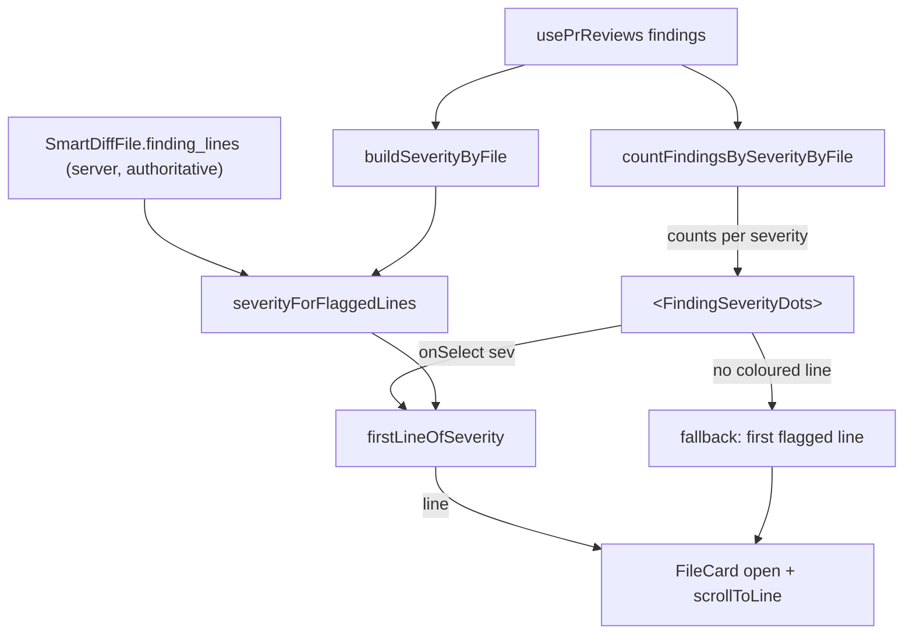

# 0006 — Checklist gaps

## Goal

Close the five mandatory gaps a homework-checklist audit found (criteria 1 & 7, 27, 11, 29, 19 & 20) without regressing the 26 criteria already MET, and size the optional bonus (criterion 30). Acceptance: a new read-only `security-reviewer` agent exists and is documented; every Smart Diff file header shows one clickable dot-with-count per present severity that jumps to that severity's first finding; `review_intent`'s default model differs from the reviewer agents' model in all three registry copies (byte-identical vendored pair); `server/insights/INSIGHTS.md` and `client/insights/INSIGHTS.md` resolve as symlinks to `../INSIGHTS.md`; and one captured run trace shows both the intent call and the agent call with different models.

## Out of scope

- Re-auditing the 30 criteria (a researcher already did — trust it) and touching anything already passing.
- Re-opening `docs/plans/0004-smart-diff.md` / `0005-smart-diff-ui-fidelity.md` or regressing their fixes: findings counted **not** lines; `severityForFlaggedLines` intersecting with the server's `finding_lines`; `["pr-smart-diff", prId]` invalidated in all four mutations in `client/src/lib/hooks/reviews.ts`; `SEV` reuse in `client/src/components/diff-viewer/styles.ts`; the `diff-viewer` barrel exporting exactly `DiffViewer` / `FileCard` / `DiffCommentApi`.
- Writing or repairing tests (a `test-writer` runs after — see *Handed to test-writer*), committing, pushing, running `/pr-self-review`, architecture or security review of this diff.
- Changing `SmartDiffFile.finding_lines` (stays a flat `number[]`), `server/src/db/seed.ts`, the five reviewer agents' models, migrations, `e2e/specs/*.flow.json`, any lock file.
- Restarting or killing the dev servers already running on :3000/:3001.

## Context

- **INSIGHTS applied**
  - root `INSIGHTS.md:61` — project decision (2026-09-20): the read-only `Bash` hook was **removed**; per-agent `hooks:` blocks are gone and each read-only agent carries an explicit allowed/denied command list **in its own prompt**, duplicated on purpose. Gap A's new file must follow this, not add a `hooks:` block.
  - root `INSIGHTS.md:13` — a reviewer subagent that appends to any `INSIGHTS.md` mid-run invalidates a `/pr-self-review` verdict. The new agent must be told not to write insights and to hand candidates back in its reply.
  - root `INSIGHTS.md:55` — an agent that only *reads* rules gets no `Skill` tool and reads `SKILL.md` with `Read` (`tools:` being an allowlist is the enforcement). Applies to `security-reviewer`.
  - `client/INSIGHTS.md` (Tool & Library Notes, 2026-09-20) — `@devdigest/ui`'s `Badge` destructures a fixed prop list with no `...rest`, so `aria-label` passed to it is **silently dropped**; wrap in a labelled `` with `aria-hidden` content instead. Directly governs Gap B's chips.
  - `client/INSIGHTS.md` (Codebase Patterns, 2026-09-21) — the current findings dot has no text child, so `toHaveTextContent` fails while `toHaveAccessibleName` works. Gap B gives the dots a **visible count**, which changes that; say so to `test-writer`.
  - `client/INSIGHTS.md` (Recurring Errors) + `client/AGENTS.md` — `@devdigest/shared` imports stay `import type` only; `React.useEffectEvent` is banned; UI primitives only via the `@devdigest/ui` barrel.
  - `server/INSIGHTS.md` — nothing that bears on these gaps (the Intent-Layer entries concern the scope filter, not model selection).
- **History**
  - `.claude/agents/README.md:22-24` and `:496-511` record the *deliberate* earlier decision that security review stays the user's manual `/pr-self-review` gate rather than an agent. Note: the researcher attributed this to root `INSIGHTS.md`; it is **not** there (`grep -i security INSIGHTS.md` → no match) — it lives in `.claude/agents/README.md`. We are reversing it because the checklist requires a `security-reviewer` agent; the new agent is a *reviewer*, the gate stays `/pr-self-review`.
  - `docs/plans/0002-intent-layer.md:17,39` chose `deepseek/deepseek-v4-flash` for `review_intent` explicitly *because* it matched the other features' default. Gap C knowingly reverses that one line.
  - No prior work exists for per-severity Smart Diff chips or for `?finding=<id>` deep links (`rg "finding=" client/src/app` → no matches).
- **Assumptions**
  1. Dev DB has **no** `feature_models` settings override (verified: `select key,value from settings where key='feature_models'` → 0 rows), so the registry default in the contract is what actually runs. If a user later sets an override in Settings → Models, the contract default stops mattering; acceptable.
  2. `qwen/qwen3.7-flash` is present on the account's OpenRouter list (user-confirmed) and supports structured output. Step 7 is what proves the second half.
  3. A file with findings the client cannot colour (count > 0 but no line inside `finding_lines`) is rare; the chip still renders and its click falls back to the file's first flagged line.

## Gaps and effort estimates

Sizing key: **S** ≈ a single focused edit pass, no new component, ≤3 files. **M** ≈ one new artefact plus its doc/wiring ripple. **L** ≈ new component + helper + i18n + integration, or a cross-module data-threading change. Points for the total: S=1, M=2, L=4.

| Gap | Criteria | Size | Justification |
|---|---|---|---|
| A — `security-reviewer` agent | 1, 7 | **M** (2) | One new ~130-line prompt file, but it must be *substantively* distinct from `architecture-reviewer` (criterion 10): a different method (source→sink data-flow tracing vs ring placement), a different finding schema, and a stated relationship to the `security` skill, the built-in `/security-review` and the `/pr-self-review` gate. Plus five mechanical doc touch-points the repo's own "Adding an agent" checklist (`.claude/agents/README.md:528-540`) demands. No code, no tests, no runtime risk. |
| B — per-severity dots + navigation | 27 | **L** (4) | Two new pure helpers, one new nested component folder, new i18n keys, a style change, a rewritten click model (severity-targeted instead of round-robin), and it invalidates two existing test blocks. The largest item by far; also the only one a user sees. |
| C — intent model ≠ review model | 11 | **S** (1) | Three one-line edits. Small only because the *proof* it still works is Gap E; the coordinated vendored-pair edit needs care but is mechanical. |
| D — insights path | 29 | **S** (1) | Two `ln -s` invocations plus verification. Zero content duplication. |
| E — demonstrate criteria 19/20 | 19, 20 | **S** (1) *(gated)* | No code change — one DB row removed, one real review run, one trace captured. Small in effort, but it is the **only step that spends OpenRouter credit**, so it needs the user's explicit go-ahead. |
| **Mandatory total (A–E)** | | **9 points** | ≈ one focused session; Gap B is ~45% of it. |
| F — `?finding=<id>` deep link | 30 (BONUS) | **L** (4) — **OPTIONAL** | Requires threading a finding **id** (or the finding object) from `SmartDiffViewer` through `FileCard` → `CodeLine`, because the line badge today knows only a `Severity` (`CodeLine.tsx:26-28,77-83`) — a prop-threading change the user previously declined for a different feature. Plus `useSearchParams` highlight + scroll + per-card DOM ids in `FindingsTab`. Does not affect pass/fail. |
| **Grand total with F** | | **13 points** | |

## Modules & files

### `.claude/` (Gap A)
- `.claude/agents/security-reviewer.md` — **new**. Frontmatter `name` / `description` / `tools: Read, Glob, Grep, Bash` / `model: opus`. No `Write`, no `Edit`, no `Skill`, no `hooks:` block.
- `.claude/agents/README.md:7-21` — new row in the At-a-glance table (Tools `Read, Glob, Grep, Bash`, Writes files `no`).
- `.claude/agents/README.md:22-24` — "None of the ten…" → eleven; delete "security review is still not — `/pr-self-review` remains the gate" and replace with the new split (agent reviews, gate still gates).
- `.claude/agents/README.md:26-46` — add `security-reviewer` to the Flow block, as a sibling of `architecture-reviewer` under `implementer`.
- `.claude/agents/README.md` — new per-agent section after `## architecture-reviewer` (`:224-247`), same six bullets (Responsibility / Permissions / Must NOT re-derive / Input / Output / Not for).
- `.claude/agents/README.md:496-511` — "the six agents that keep it (`architecture-reviewer`, …)" → seven, listing `security-reviewer`.
- `.claude/skills/README.md:24-32` — "All ten agents … (`brainstorm`, …)" → eleven, and add `security-reviewer` to the "agents that only read for rules" list.
- `.claude/agents/planner.md:26-29` — the disclaimer "security review is still the user's `/pr-self-review` before a PR" becomes stale; reword to "security review is `security-reviewer`'s and the user's `/pr-self-review` gate". Leave the skill table row at `:101` unchanged.

### client (Gap B)
- `.../SmartDiffViewer/helpers.ts:57-69` — replace `countFindingsByFile` with `countFindingsBySeverityByFile(reviews): Map<string, Record<Severity, number>>`, built from the same `latestFindingsPerAgent` (`:25-35`) and `countBySeverity` from `@/lib/severity`. Keep the "findings, not lines" property and its comment.
- `.../SmartDiffViewer/helpers.ts` — add `firstLineOfSeverity(markers: ReadonlyMap<number, Severity>, severity: Severity): number | null` (lowest key whose value equals `severity`). It takes the **markers** map (the output of `severityForFlaggedLines`, `:71-89`), so navigation can never target a line outside the server's `finding_lines`.
- `.../SmartDiffViewer/_components/FindingSeverityDots/FindingSeverityDots.tsx` — **new** component (PascalCase, own folder — mirrors `RunTraceDrawer/_components/TraceBody/`). Props: `counts: Record<Severity, number>`, `flaggedLineCount: number`, `onSelect(severity: Severity): void`, `onSelectFallback(): void`.
- `.../SmartDiffViewer/_components/FindingSeverityDots/styles.ts` — **new**: `dot(color: string)` style factory (the old flat `findingDot` becomes per-severity) with a visible count.
- `.../SmartDiffViewer/_components/FindingSeverityDots/index.ts` — **new** barrel.
- `.../SmartDiffViewer/SmartDiffViewer.tsx:59-65,84-103,138-140,216` — swap the single dot + round-robin for the new component; `handleBadgeClick` becomes `handleSeverityClick(severity)`; memo renamed `findingCountsByFile`.
- `.../SmartDiffViewer/styles.ts` — delete `findingDot` (moved and parameterised).
- `client/messages/en/smartDiff.json` — add `severityFindingsBadge`; keep `flaggedLinesBadge`; delete `findingsBadge` only if it ends up unreferenced.
- `docs/specs/smart-diff.md:175-185` — the paragraph naming `countFindingsByFile` and "the badge" is now wrong; update to the per-severity dots.

### client + server (Gap C)
- `server/src/vendor/shared/contracts/platform.ts:52-57` — `review_intent.defaultModel` → `'qwen/qwen3.7-flash'`.
- `client/src/vendor/shared/contracts/platform.ts:52-57` — the byte-identical mirror, same edit.
- `client/src/lib/feature-models.ts:21-27` — the **third** copy (confirmed: it exists precisely because the client may not import shared *values*); same edit.
- `docs/specs/intent-layer.md:74` — the documented default.

### repo root (Gap D)
- `server/insights/INSIGHTS.md` — **new** symlink → `../INSIGHTS.md`.
- `client/insights/INSIGHTS.md` — **new** symlink → `../INSIGHTS.md`.

### no file changes (Gap E)
- Evidence only, from `server/src/modules/reviews/run-executor.ts:117-122` (`Deriving PR intent`) and `:171` (`Starting review with agent "…"`), plus `server/src/modules/reviews/intent/service.ts:141-143` (the `intent prompt: …` log) vs `:202` (`intent: reusing stored intent`).

## Component map

| Module | Component | Status | Layer | Path | Depends on | Step |
|---|---|---|---|---|---|---|
| `.claude` | `security-reviewer` agent | new | agent prompt | `.claude/agents/security-reviewer.md` | `security` skill, `pr-self-review/references/routing.json` | 3 |
| `.claude` | agents README | changed | doc | `.claude/agents/README.md` | `security-reviewer` | 4 |
| `.claude` | skills README | changed | doc | `.claude/skills/README.md` | `security-reviewer` | 4 |
| `.claude` | `planner` prompt | changed | agent prompt | `.claude/agents/planner.md` | `security-reviewer` | 4 |
| client | `countFindingsBySeverityByFile` | new (replaces `countFindingsByFile`) | helper | `.../SmartDiffViewer/helpers.ts` | `latestFindingsPerAgent`, `@/lib/severity` | 5 |
| client | `firstLineOfSeverity` | new | helper | `.../SmartDiffViewer/helpers.ts` | `severityForFlaggedLines` output | 5 |
| client | `severityForFlaggedLines` | reused (unchanged) | helper | `.../SmartDiffViewer/helpers.ts:71-89` | `finding_lines` | 5 |
| client | `<FindingSeverityDots>` | new | `_components` | `.../SmartDiffViewer/_components/FindingSeverityDots/FindingSeverityDots.tsx` | `SEV`, `SEVERITIES`, `next-intl` | 6 |
| client | `FindingSeverityDots` styles | new | `_components` | `.../FindingSeverityDots/styles.ts` | `SEV[sev].c/.bg` | 6 |
| client | `<SmartDiffFileRow>` (in `SmartDiffViewer.tsx`) | changed | `_components` | `.../SmartDiffViewer/SmartDiffViewer.tsx:26-123` | `<FindingSeverityDots>`, `firstLineOfSeverity` | 7 |
| client | `<SmartDiffViewer>` | changed | `_components` | `.../SmartDiffViewer/SmartDiffViewer.tsx:132-230` | `countFindingsBySeverityByFile` | 7 |
| client | `smartDiff` messages | changed | i18n | `client/messages/en/smartDiff.json` | — | 6 |
| client | `<FileCard>` | reused (**unchanged**) | cross-route component | `client/src/components/diff-viewer/FileCard/FileCard.tsx:63-72` | `pathAdornment: ReactNode` already generic | 7 |
| server | `FEATURE_MODELS` (canonical) | changed | contract | `server/src/vendor/shared/contracts/platform.ts:52-57` | — | 1 |
| client | `FEATURE_MODELS` (mirror) | changed | contract | `client/src/vendor/shared/contracts/platform.ts:52-57` | server copy (byte-identical) | 1 |
| client | `FEATURE_MODELS` (runtime copy) | changed | `lib` | `client/src/lib/feature-models.ts:21-27` | mirrors the contract | 1 |
| server | `insights/` symlink | new | doc | `server/insights/INSIGHTS.md` → `../INSIGHTS.md` | — | 2 |
| client | `insights/` symlink | new | doc | `client/insights/INSIGHTS.md` → `../INSIGHTS.md` | — | 2 |
| docs | smart-diff spec | changed | doc | `docs/specs/smart-diff.md:175-185` | Gap B | 8 |
| docs | intent-layer spec | changed | doc | `docs/specs/intent-layer.md:74` | Gap C | 1 |

## Diagrams

Gap B data flow — which map is authoritative for what (the count comes from the client join; the *target line* never escapes the server's `finding_lines`).

## Steps

1. **Gap C — retarget `review_intent` to `qwen/qwen3.7-flash` (coordinated vendored edit)** (module: `server` + `client`; depends on: —)
   - Change: set `defaultModel: 'qwen/qwen3.7-flash'` on the `review_intent` entry in **all three** registries, then prove the vendored pair is still byte-identical. **This deliberately edits two files in the root `AGENTS.md` "Do not touch" vendored set** — that is the sanctioned route for a contract change (server first, then the mirror), not an exception being taken. Do not touch any other entry (`onboarding` and `conventions` keep `deepseek/deepseek-v4-flash`). Do not touch `server/src/db/seed.ts` or the agents' models.
   - Files: `server/src/vendor/shared/contracts/platform.ts`, `client/src/vendor/shared/contracts/platform.ts`, `client/src/lib/feature-models.ts`, `docs/specs/intent-layer.md`
   - Skills: `zod` (the file is a zod-contract module), `typescript-expert`
   - Verify: `diff server/src/vendor/shared/contracts/platform.ts client/src/vendor/shared/contracts/platform.ts` → **no output** (this is exactly what `checks.mjs:120-146` `shared-contract-drift` enforces, and a one-sided edit is a *critical* there); `rg -n "qwen/qwen3.7-flash" server/src client/src` → exactly 3 hits; `cd server && pnpm typecheck && pnpm test`; `cd client && pnpm typecheck && pnpm test`.

2. **Gap D — `insights/INSIGHTS.md` symlinks** (module: repo root; depends on: —)
   - Change: create the two directories and relative symlinks, mirroring the repo's existing `CLAUDE.md -> AGENTS.md` convention (`ls -l server/CLAUDE.md` → `AGENTS.md`). Do **not** copy content and do **not** move the real files; every existing link keeps working.
   - Files: `server/insights/INSIGHTS.md`, `client/insights/INSIGHTS.md`
   - Commands (exact): `mkdir -p server/insights client/insights` then `ln -s ../INSIGHTS.md server/insights/INSIGHTS.md` and `ln -s ../INSIGHTS.md client/insights/INSIGHTS.md` — both run from the repo root, target written **relative**, never absolute.
   - Skills: none
   - Verify: `test -L server/insights/INSIGHTS.md && readlink server/insights/INSIGHTS.md` → `../INSIGHTS.md` (same for `client/`); `head -1 server/insights/INSIGHTS.md` → `# server — Insights` (proves it resolves); `git add -N server/insights/INSIGHTS.md client/insights/INSIGHTS.md && git ls-files -s server/insights/INSIGHTS.md client/insights/INSIGHTS.md` → mode **120000** on both (intent-to-add only, stages no content; nothing else is staged and nothing is committed). Neither path is gitignored (`git check-ignore -v` → exit 1, verified).

3. **Gap A — write `.claude/agents/security-reviewer.md`** (module: `.claude`; depends on: —)
   - Read first: `.claude/skills/security/SKILL.md`, `.claude/skills/security/checklists.md` (esp. `:7-23` Pre-Commit Security Self-Review), `.claude/skills/pr-self-review/references/routing.json` (the `security` entry: `include` = `server/src/**/*.ts`, `reviewer-core/src/**/*.ts`, `client/src/app/**/route.ts`, `client/src/middleware.ts`; `triggers` = `dangerouslySetInnerHTML|eval\(|new Function\(|child_process|exec…|innerHTML|secret|token|password|cookie|authorization|process\.env`), and `.claude/agents/architecture-reviewer.md` **for house style only**.
   - Change: create the file with
     - **Frontmatter:** `name: security-reviewer`; a `description` that makes the role recognisable for auto-selection (read-only security review of a diff: OWASP-shaped, data-flow-traced, repo-aware; not the PR gate; not for architecture, correctness, performance, planning or implementing); `tools: Read, Glob, Grep, Bash` — **neither `Write` nor `Edit`** (criterion 7), and no `Skill` (root `INSIGHTS.md:55`: read-for-rules agents read `SKILL.md` with `Read`); `model: opus`. **No `hooks:` block** (root `INSIGHTS.md:61` — that mechanism was removed by project decision).
     - **Hard constraints:** read-only; the explicit allowed/denied `Bash` list duplicated in this file (the project decision at `.claude/agents/README.md:496-511` requires in-context duplication, not a shared file) — allow `cat`, `sed -n`, `rg`, `ls`, `find`, `jq`, `git log/show/diff/blame/status/rev-parse/merge-base/ls-files`, `docker ps`, `pnpm typecheck`/`arch:check`; deny `>`/`>>`/`tee`/`sed -i`, `rm`/`mv`/`cp`/`chmod`/`ln`, `npm`/`pnpm install`, `npx`, `curl`/`wget`, every writing `git`, `gh pr *`, shell wrappers and inline interpreters, and **any read of `~/.devdigest/**` or a non-example `.env`** (a security agent reading the secrets file is the exact thing it exists to flag). Plus: never write any `INSIGHTS.md` mid-run — hand candidates back in the reply (root `INSIGHTS.md:13`); never produce a PASS/BLOCK verdict, never write `.devdigest/self-review/**`, never run `verdict.mjs`/`prepare.mjs`/`/pr-self-review`; never write an override — only the user may call a finding a false positive.
     - **Relationship, stated explicitly (so it is not a reskin and not a duplicate):** the `security` skill is the *rule source* (it is read, never re-derived) — including its confidence table (report HIGH only; MEDIUM as "verify"; never LOW) and its "Do NOT flag" list (test files, dead code, server-controlled values, framework-mitigated patterns, `NODE_ENV`-gated dev code); the built-in `/security-review` command is stack-agnostic and unaware of this repo — this agent adds repo awareness and uses `routing.json`'s `include`/`triggers` as its scope; `/pr-self-review` remains the **only** gate and this agent never replaces it. Also carry the skill's stack caveat: its text is written for Express/MongoDB/JWT (`SKILL.md:3`), so its OWASP categories must be **translated** to Fastify + Drizzle/Postgres + Next 15 — never report a Mongo-operator-injection or Mongoose finding here.
     - **Method (this is what makes it distinct from `architecture-reviewer`):** trace **source → sink** per changed hunk and answer "can an attacker control this value?" before writing anything; `architecture-reviewer` places files in rings, this one follows data. Name the repo's real surfaces so the prompt is grounded: secrets via `server/src/adapters/secrets/local.ts` and `~/.devdigest/secrets.json` (never `.env`/DB/git), `GITHUB_TOKEN` handling, `child_process` in `server/src/adapters/codeindex/ripgrep.ts`, `dangerouslySetInnerHTML` in `client/src/app/layout.tsx`, Fastify rate limits (`server/src/app.ts:96,100` and per-route `config: { rateLimit: … }` — the money-spending endpoints like `POST /pulls/:id/intent/derive`), zod validation at route boundaries, Drizzle `sql` template escape hatches, secrets/diff bodies leaking into logs or LLM prompts, and **prompt injection from PR titles/bodies/diffs into reviewer prompts** (this product feeds attacker-authored text to a model — name it as a first-class category).
     - **Output format:** distinct field set, not `architecture-reviewer`'s: per finding `location` · `category` (OWASP A01–A10) · `source` (the attacker-controlled input) · `sink` · `exploit` (one concrete sentence) · `fix` · `confidence`; plus `## Verified safe` (patterns checked and cleared, so the report proves coverage), `## Needs manual verification` (the MEDIUM bucket), `## Could not establish`. Cap findings; "no findings" is a valid terminal state.
   - Files: `.claude/agents/security-reviewer.md`
   - Skills: none loaded via `Skill` (the implementer reads `security/SKILL.md` and `checklists.md` with `Read` to write this prompt accurately)
   - Verify: `head -6 .claude/agents/security-reviewer.md` shows `---` + `name`/`description`/`tools`/`model`; `rg -n "^tools:" .claude/agents/security-reviewer.md` shows a line containing **neither** `Write` nor `Edit` nor `Skill` (criterion 7); `rg -c "hooks:" .claude/agents/security-reviewer.md` → 0; `ls .claude/agents/*.md | wc -l` → 11 (+ `README.md`); a `diff` against `architecture-reviewer.md` confirms the Method and Output sections are not a reskin (criterion 10).

4. **Gap A — propagate the new agent through the docs** (module: `.claude`; depends on: 3)
   - Change: apply the repo's own "Adding an agent" checklist (`.claude/agents/README.md:528-540`): table row, Flow block, per-agent section, and the two counts. Then fix the now-stale sentences: `.claude/agents/README.md:22-24` ("None of the ten…" / "security review is still not"), `:496-511` ("the six agents that keep it" → seven, `security-reviewer` added to the list), `.claude/skills/README.md:24-32` ("All ten agents" → eleven, and add it to the read-for-rules list), `.claude/agents/planner.md:26-29`. The agent writes no code, so it does **not** go in planner's Lazy-skill-reading table and needs no `routing.json` change (`security` is already routed there).
   - Files: `.claude/agents/README.md`, `.claude/skills/README.md`, `.claude/agents/planner.md`
   - Skills: none
   - Verify: `rg -n "ten agents|None of the ten|six agents that keep" .claude/agents/README.md .claude/skills/README.md` → **no hits**; `rg -c "security-reviewer" .claude/agents/README.md` → ≥ 5; `rg -n "security-reviewer" .claude/skills/README.md .claude/agents/planner.md` → ≥ 1 each.

5. **Gap B — the two new pure helpers** (module: `client`; depends on: —)
   - Change: in `helpers.ts`, replace `countFindingsByFile` with `countFindingsBySeverityByFile(reviews): Map<string, Record<Severity, number>>` — same `latestFindingsPerAgent` source, counting **findings** (a 19-line finding is 1, not 19: keep that comment, it is plan 0005's guarded property) and delegating the tally to `countBySeverity` from `@/lib/severity` so severity accounting lives in one place. Add `firstLineOfSeverity(markers, severity)` returning the **lowest** line in the markers map whose value is that severity, else `null`. `firstLineOfSeverity` takes the *markers* map, never `buildSeverityByFile`'s raw map — that is what keeps navigation inside the server's authoritative `finding_lines`. `severityForFlaggedLines` itself is untouched. `helpers.ts` stays pure (no React import).
   - Files: `.../SmartDiffViewer/helpers.ts`
   - Skills: `frontend-ui-architecture` (a `helpers.ts` holds only pure functions), `typescript-expert`
   - Verify: `cd client && pnpm typecheck` (`SmartDiffViewer.tsx` will error on the removed export until step 7 — expected, and step 7 closes it; `helpers.test.ts` will also error, which `test-writer` closes).

6. **Gap B — the `<FindingSeverityDots>` component and its copy** (module: `client`; depends on: 5)
   - Change: new folder `.../SmartDiffViewer/_components/FindingSeverityDots/` with `FindingSeverityDots.tsx`, `styles.ts`, `index.ts`. Render **one dot per severity with `counts[sev] > 0`, iterating `SEVERITIES` from `client/src/lib/severity.ts`** so the order is worst-first (CRITICAL → WARNING → SUGGESTION) and can never disagree with the rest of the app. Each dot is a real `<button type="button">` carrying the **visible count as a text child** and a real accessible name — the design's restraint is kept by a small coloured circle with the number, **not** a full pill, and the old `N findings` pill is not reintroduced. Colours strictly from `SEV[sev].c` / `SEV[sev].bg` imported from the `@devdigest/ui` **barrel** (`tokens.ts:6-14`, re-exported at `primitives/index.ts:2`) — never a private colour map, never a deep import. Do **not** build the chip out of `@devdigest/ui`'s `Badge`: it drops `aria-label` silently (`client/INSIGHTS.md`, Tool & Library Notes 2026-09-20); a plain `<button>` with `aria-label` is the safe form here. Each button calls `e.stopPropagation()` before its handler, because `FileCard`'s header `
` carries the open/close `onClick` (`FileCard.tsx:63-72` documents exactly this contract for `pathAdornment`). When no severity has a count but `flaggedLineCount > 0`, render one neutral dot named with `flaggedLinesBadge` and call `onSelectFallback` — preserving today's behaviour for reviews the client cannot join. Guard with `counts[sev] > 0 &&`, never a bare `count &&` (React renders a literal `0`). New i18n key in `client/messages/en/smartDiff.json`, e.g. `"severityFindingsBadge": "{count, plural, one {# {severity} finding} other {# {severity} findings}}"`, called with `severity: SEV[sev].label`; keep `flaggedLinesBadge`; drop `findingsBadge` only once nothing references it.
   - Files: `.../FindingSeverityDots/FindingSeverityDots.tsx`, `.../FindingSeverityDots/styles.ts`, `.../FindingSeverityDots/index.ts`, `client/messages/en/smartDiff.json`
   - Skills: `frontend-ui-architecture` (colocated `_components/<Name>/` folder anatomy; a cross-route component must not own a feature's strings — this one lives under the feature, so it may), `react-best-practices` (PascalCase component not a render factory; `aria-label` on icon-only buttons; no `{count && …}`; derive, don't store)
   - Verify: `cd client && pnpm typecheck` (same expected residual errors as step 5 until step 7); `rg -n "from \"@devdigest/ui\"" .../FindingSeverityDots/*.ts*` shows barrel imports only; `rg -n "Badge" .../FindingSeverityDots/` → no hits.

7. **Gap B — wire the dots into `SmartDiffFileRow` and drop the round-robin** (module: `client`; depends on: 5, 6)
   - Change: in `SmartDiffViewer.tsx` — rename the memo at `:139` to `findingCountsByFile` using the new helper and pass `counts` down instead of `findingCount` (`:216`); in `SmartDiffFileRow`, delete `nextFindingIndex` state and `handleBadgeClick` (`:48`, `:59-65`) and replace them with `handleSeverityClick(sev)` = `setOpen(true)` + `setScrollToLine(firstLineOfSeverity(markers, sev) ?? flaggedLines[0] ?? null)`, plus `handleFallbackClick()` = open + first flagged line; render `<FindingSeverityDots …/>` in the existing `pathAdornment` slot (`:84-103`) — **`FileCard` itself needs no change**, its `pathAdornment` is already `ReactNode` and already documents that an interactive adornment must stop propagation. Because the dots render in the header, they appear on **collapsed** files too, which is what criterion 27 requires. Known React caveat: clicking the *same* severity twice sets `scrollToLine` to the same value, so `FileCard`'s effect (`:92-95`) does not re-fire — acceptable (the line is already in view); do not "fix" it with a counter unless the browser check shows a problem, and never with `useEffectEvent` (banned).
   - Files: `.../SmartDiffViewer/SmartDiffViewer.tsx`, `.../SmartDiffViewer/styles.ts` (delete the now-unused `findingDot`)
   - Skills: `frontend-ui-architecture`, `react-best-practices`
   - Verify: `cd client && pnpm typecheck` → **0 errors** except inside `*.test.tsx`/`*.test.ts` (the two invalidated suites, handed to `test-writer`); `cd client && pnpm test` → expect failures **only** in `SmartDiffViewer.test.tsx` and `helpers.test.ts`, reported verbatim and left alone; `rg -n "findingDot|countFindingsByFile|nextFindingIndex" client/src` → no hits. Browser check against the already-running dev servers (read-only, never restart them): open `http://localhost:3000/repos/50544f37-5b3d-40e7-b323-b3292b6333c9/pulls/4?tab=diff` (PR #4 has 6 files and 2 reviews) and confirm (a) a collapsed file with findings shows one dot **per present severity**, each with its count, (b) clicking one expands the file and scrolls to that severity's first finding, (c) a file with two severities shows CRITICAL before WARNING. Move the pointer to a far corner before clicking/screenshotting (`client/INSIGHTS.md`, hover-card trap).

8. **Docs — bring the two specs in line** (module: `docs`; depends on: 1, 7)
   - Change: `docs/specs/smart-diff.md:175-185` — replace the `countFindingsByFile` / single-badge paragraph with the per-severity dots, keeping the invariant it was written to record (both consumers go through `latestFindingsPerAgent`, so counts and colours cannot disagree) and adding the new one (the *target line* always comes from the `finding_lines` intersection). `docs/specs/intent-layer.md:74` — the classifier default is now `qwen/qwen3.7-flash`. Do **not** edit `docs/plans/0002`, `0004` or `0005`: a plan records what was intended at the time and is never rewritten (`docs/README.md:25-39`).
   - Files: `docs/specs/smart-diff.md`, `docs/specs/intent-layer.md`
   - Skills: none
   - Verify: `rg -n "countFindingsByFile|findingsBadge" docs/specs/` → no hits; `rg -n "deepseek" docs/specs/intent-layer.md` → no hit on line 74.

9. **Gap E — demonstrate criteria 19 & 20 on a real run** ⚠️ **SPENDS OPENROUTER CREDIT — STOP AND GET THE USER'S EXPLICIT GO-AHEAD BEFORE RUNNING IT.** Every other step in this plan is free. (module: `server`/DB; depends on: 1; blocked until approved)
   - Why it exists: both criteria already pass **by source** — `intent/service.ts:141-143` logs prompt sections, "diff bodies excluded", a token estimate and the resolved model with no diff bodies; the two steps are separately named (`run-executor.ts:119` "Deriving PR intent" vs `:171` `Starting review with agent "…"`). **This is not a code gap — do not "fix" anything.** It is not *demonstrable* only because every stored trace hit the cache: verified read-only, `select count(*) from run_traces` → 14, `select count(*) from run_traces where trace::text like '%intent prompt%'` → **0**, and the rich log only appears on a PR's first run or after `headSha` changes (`intent/service.ts:192-202`).
   - Target (cheapest real PR, verified read-only): PR **#4** "Demo/rate limiting", `pr_id = cb34a2da-e91e-43eb-b5d2-4ec9e129a581`, repo `Saphirox/dev-digest` (`50544f37-…`), 6 files / +135 −16, one enabled agent (`General Reviewer`, `openrouter/deepseek-v4-flash`). It has a `pr_intent` row today, so:
     1. Capture it first: `docker exec devdigest-postgres psql -U devdigest -d devdigest -c "select * from pr_intent where pr_id='cb34a2da-…'"` → paste the output into the report (the revert path; the row is regenerable by a re-derive in any case).
     2. `docker exec devdigest-postgres psql -U devdigest -d devdigest -c "delete from pr_intent where pr_id='cb34a2da-…'"` — the **only** write in this plan's verification, scoped to one row of a regenerable cache table. Never `docker compose down`, never touch the `devdigest_pgdata` volume.
     3. Trigger exactly **one** review from the UI on that PR (the running :3000/:3001 servers; do not restart them).
     4. Capture the evidence: `select trace from run_traces where run_id='<new run>'` and quote the entries showing `Deriving PR intent`, the `intent prompt: sections=[…]; diff bodies excluded; ~N tokens; model=openrouter/qwen/qwen3.7-flash` line, and `Starting review with agent "General Reviewer" (openrouter/deepseek/deepseek-v4-flash)` — **two different models in one trace** is simultaneously the proof for criteria 19, 20 **and** 11 (Gap C), and the proof that `completeStructured` still parses with the new model.
   - Zero-DB-write fallback if the user prefers not to delete a row: PR **#1** has no `pr_intent` row at all (verified) — but it is 57 files / +8907, i.e. a much more expensive review. Prefer PR #4.
   - Skills: none
   - Verify: the quoted trace above; afterwards `select model from pr_intent where pr_id='cb34a2da-…'` → `qwen/qwen3.7-flash`. If the structured call fails to parse, **stop and report** — do not swap models on your own; reverting step 1 is the fallback and is the user's call.

10. **Gap F — `?tab=findings&finding=<id>` deep link — OPTIONAL BONUS (criterion 30), does not affect pass/fail. Do not start it unless the user asks for it after steps 1–9 land.** (module: `client`; depends on: 7)
   - Confirmed not implemented: `rg "finding=" client/src/app` → no matches; `FindingsTab.tsx` has no `useSearchParams` highlight logic. The page already reads the tab from the query string (`page.tsx:29,61,67`), so the routing half is cheap.
   - The real cost is the **data problem**: the inline line badge knows only a `Severity` (`CodeLine.tsx:19,26-28,46,77-83`) — there is no finding **id** anywhere on the line. Closing it means threading the finding (or at least `{id, severity}`) from `SmartDiffViewer`'s client-side join through `FileCard`'s `severityByLine` prop down to `CodeLine`, i.e. widening a shared cross-route component's public prop type from `ReadonlyMap<number, Severity>` to a richer per-line record, and making the badge interactive (it is a non-interactive `` today). **This is the same prop-threading the user previously declined for a different feature** — it is the decision to take, not a detail. Plus, in `FindingsTab`, a `useSearchParams` read, a stable DOM id per finding card, a scroll-into-view and a transient highlight style.
   - Cheaper alternative worth putting to the user first: keep the badge non-interactive and make the *dots* from Gap B deep-link to `?tab=findings` filtered by severity — satisfies the spirit at roughly S effort, but **not** criterion 30's letter (it names a specific finding).
   - Skills: `frontend-ui-architecture`, `react-best-practices`, `next-best-practices` (query-string state in the App Router)
   - Verify: `cd client && pnpm typecheck && pnpm test`; browser: click an inline badge → URL becomes `?tab=findings&finding=<id>` and that card is highlighted and scrolled into view.

## Skills for implementer

| Step | Skill | Rule from the skill that governs this step |
|---|---|---|
| 1 | `zod` | `platform.ts` is a contract module: the zod schema and its inferred type share one name and the shape is the API boundary — change a **value** in the registry, never the schema shape, and mirror it. |
| 1, 5 | `typescript-expert` | Type constants tightly; a `Record<Severity, number>` derived from the contract union keeps the compiler complete when a severity is added. |
| 5, 6, 7 | `frontend-ui-architecture` | `helpers.ts` holds only pure functions — the moment it imports React it is a hook in disguise; a feature component lives in a colocated `_components/<Name>/` folder with `<Name>.tsx` + optional `styles.ts`/`index.ts`; keys and the code consuming them derive from one array (here: `SEVERITIES`). |
| 6, 7 | `react-best-practices` | Derive, don't store (the counts are computed, never mirrored into state — the round-robin `nextFindingIndex` state goes away); PascalCase components, never a `renderChip()` factory; `aria-label` on icon-only buttons; never `{count && <X/>}` when `count` can be `0`. |
| 10 | `next-best-practices` | Query-string state in the App Router goes through `useSearchParams` + `router.replace`, matching `page.tsx:29,61,67`; it is a client-component concern. |
| 3 | (reads `security/SKILL.md` + `checklists.md` with `Read`, no `Skill` tool) | Confidence-based review: report HIGH only, note MEDIUM, never report LOW; never flag test files, dead code, server-controlled values or framework-mitigated patterns. The agent prompt must *carry* these rules, not restate the whole skill. |

## Architecture constraints

- **Vendored-contract parity (step 1).** `server/src/vendor/shared` is canonical and `client/src/vendor/shared` is a hand-synced copy; they are byte-identical today (`diff` → empty, verified). Edit both in the same step and prove parity with `diff`. A one-sided edit is a **critical** in `checks.mjs:120-146` (`shared-contract-drift`). `client/src/lib/feature-models.ts` is a third, deliberate copy (the client may not import shared *values* — a runtime import 500s the page under `next dev`); it must move in lockstep or Settings → Models will display a stale default.
- **Client imports.** `@devdigest/shared` stays `import type` only, everywhere. UI primitives come from the `@devdigest/ui` barrel only — no `src/vendor/ui/<layer>/*` deep imports. `React.useEffectEvent` is banned (it type-checks, passes vitest, and crashes in the browser).
- **Severity single source.** Order comes from `SEVERITIES` (`client/src/lib/severity.ts`), colours from `SEV[sev].c`/`.bg` (`@devdigest/ui`). No new private severity list or colour map.
- **Server authority preserved (step 5/7).** `SmartDiffFile.finding_lines` (`server/src/vendor/shared/contracts/brief.ts:149-156`) stays a flat `number[]`; severity keeps coming from the client-side join; `severityForFlaggedLines` keeps intersecting with it; the navigation target is always drawn from that intersection.
- **`FileCard` is a cross-route shared component** (`client/src/components/diff-viewer/`) — it stays unchanged, keeps owning no `smartDiff` strings, and the `diff-viewer` barrel keeps exporting exactly `DiffViewer` / `FileCard` / `DiffCommentApi`.
- **Agent prompts carry their own guardrails** (step 3): `tools:` is the only real enforcement; the read-only `Bash` list is duplicated per agent by project decision, not centralised.
- **Package managers:** `server`/`client` are pnpm; `reviewer-core`/`e2e` are npm. Nothing here needs an install.
- **No commits, no pushes, no `/pr-self-review`.** Leave everything uncommitted.

## Do-not-touch that this task hits

- `server/src/vendor/shared/contracts/platform.ts` + `client/src/vendor/shared/contracts/platform.ts` — **hit deliberately** in step 1. Sanctioned route: edit server first, mirror into client in the same step, prove byte-identity with `diff`, and update the third runtime copy `client/src/lib/feature-models.ts`. This is the documented way to change a contract, not an exception.
- `server/src/db/seed.ts` — **not touched** (the five reviewer agents keep `deepseek/deepseek-v4-flash`; that is what makes intent's model *differ*).
- Migrations, `e2e/specs/*.flow.json`, all four lock files, the `devdigest_pgdata` volume — not touched.
- `docs/plans/0002/0004/0005` — not edited; plans are immutable records (`docs/README.md:25-39`). Only `docs/specs/*` is updated.
- The dev servers on :3000/:3001 — read-only use only, never restarted or killed.
- The one sanctioned DB write in the whole plan is step 9's single-row `delete from pr_intent where pr_id='cb34a2da-…'`, after the row has been captured, and only with the user's go-ahead.

## Verification (whole task)

- `server`: `pnpm typecheck` — 0 errors. `pnpm test` — **43 files / 313 tests, 0 skipped** (the baseline to hold; nothing in this plan touches server logic, so any change here is a regression). `pnpm arch:check` — **0 errors / 26 warnings** (the baseline; a new error means a boundary broke).
- `client`: `pnpm typecheck` — 0 errors outside the two invalidated test files. `pnpm test` — baseline is **41 files / 181 tests, 0 skipped**; after step 7 expect failures confined to `SmartDiffViewer.test.tsx` and `helpers.test.ts`, listed by name in the report and **left for `test-writer`** (the implementer writes no tests and deletes none).
- Contract parity: `diff server/src/vendor/shared/contracts/platform.ts client/src/vendor/shared/contracts/platform.ts` → empty.
- Model spread: `rg -n "defaultModel" server/src/vendor/shared/contracts/platform.ts` shows `review_intent` differing from every reviewer agent's model in `server/src/db/seed.ts:16`.
- Symlinks: `readlink` → `../INSIGHTS.md` on both; `git ls-files -s` → mode `120000` on both.
- Agent: `.claude/agents/` holds 11 agent files; `security-reviewer.md`'s `tools:` line contains neither `Write` nor `Edit`; no `ten agents` / `six agents that keep` strings survive in the two READMEs.
- Browser (read-only, servers already up): the PR #4 diff tab shows per-severity dots with counts on collapsed files, worst-first, and clicking one expands + scrolls to that severity's first finding.
- Step 9 (only if approved): a quoted `run_traces` entry containing both `intent prompt: … model=openrouter/qwen/qwen3.7-flash` and `Starting review with agent "General Reviewer" (openrouter/deepseek/deepseek-v4-flash)`.
- `git status --short` in the report, confirming no stray `pnpm-workspace.yaml`, no lock-file change, nothing committed.

## Handed to test-writer

Existing tests this plan **invalidates** (do not delete them — update them):
1. `.../SmartDiffViewer/SmartDiffViewer.test.tsx:176-188` — `getByRole("button", { name: /findings/ })` now matches **N** buttons, not one, so the single-element query throws; `toHaveAccessibleName("3 findings")` becomes the per-severity name (e.g. `"3 Critical findings"`); and the round-robin assertion (`click → L1`, `click → L2`) is gone by design — a second click on the same severity stays on that severity's **first** line. The fixture (3 CRITICAL findings on lines 1–3 vs 22 `finding_lines`) is still exactly right and should be kept: it is the "findings, not lines" regression guard.
2. `.../SmartDiffViewer/helpers.test.ts:121-134` — `describe("countFindingsByFile")` targets a removed export. Move its "counts findings, not the lines they span" case (expects 2, not 22) onto `countFindingsBySeverityByFile`, asserting `{ CRITICAL: n, WARNING: n, SUGGESTION: 0 }`.

New coverage worth adding:
3. `countFindingsBySeverityByFile` — per-severity tally across a mixed-severity file; a finding spanning many lines still counts 1; only the newest review per `agent_id` counts (reuse the `latestFindingsPerAgent` fixtures at `helpers.test.ts:67-120`).
4. `firstLineOfSeverity` — returns the **lowest** matching line; returns `null` when that severity has no coloured flagged line; never returns a line absent from the markers map (i.e. outside the server's `finding_lines`).
5. `<FindingSeverityDots>` — one button per present severity, **CRITICAL before WARNING before SUGGESTION**; the count is now a real visible text child **and** part of the accessible name (so `toHaveTextContent` finally works here — note the inverted `client/INSIGHTS.md` 2026-09-21 trap); a severity with 0 findings renders no dot; the neutral fallback dot appears when `flaggedLineCount > 0` with no counts; clicking calls `onSelect` with the right severity and does **not** toggle the parent `FileCard` (propagation stopped).
6. `SmartDiffViewer` integration — dots render on a **collapsed** file; clicking the WARNING dot opens the card and scrolls to the first WARNING line, not the first CRITICAL one.
7. No server test changes are expected; if `server/test/intent-*.test.ts` fixtures hardcode `deepseek/deepseek-v4-flash` as an *assertion about the default* (rather than as a stub value), update those only.

## Risks

- **Structured output with a new model (step 1 + 9).** Intent goes through `llm.completeStructured(...)` with a zod schema (`server/src/modules/reviews/service.ts:79-88`); providers differ in JSON-schema fidelity. Nothing in the test suite catches this — only step 9 does. If it fails to parse, `ensureFresh` swallows it by design (a classifier failure can never fail a review, `run-executor.ts:114-122`), so the symptom is a *silently missing* intent, not an error. Check for the intent card rendering, not just an HTTP 200.
- **No price-book entry for the new model.** `server/src/adapters/llm/pricing.ts:31` prices `deepseek/deepseek-v4-flash`; there is no `qwen/*` row (`rg qwen` → no hits anywhere), so unknown models return `null` cost and the UI renders "—" rather than `0` (the null≠0 rule holds — this is correct, not a bug). Default: **do not** add a pricing row; the file's own comment says OpenRouter slugs and prices must be confirmed against openrouter.ai before being relied on, and inventing a number is worse than "—".
- **A workspace override silently defeats Gap C.** `resolveFeatureModel` (`server/src/modules/settings/feature-models.ts:50-56`) prefers a stored `feature_models` setting over the registry default. None exists today (verified), but if the user ever picks a model in Settings → Models, criterion 11 depends on that choice, not on the contract.
- **Gap B chip vs. marker divergence.** Counts come from the client-side join; the click target comes from the `finding_lines` intersection. A finding whose lines the client cannot colour yields a chip whose click has no precise target — hence the documented fallback to the file's first flagged line. Watch for it in the browser check on a file with a low-confidence or filtered review.
- **Two test files red between steps 7 and `test-writer`.** The implementer must report them verbatim and resist "fixing" them; deleting an assertion here would quietly undo plan 0005's findings-not-lines guard.
- **Doc drift in `.claude/`.** The counts ("ten agents", "six agents that keep `Bash`") live in three files; missing one leaves the map lying about its own agent set. The greps in step 4 are the check.
- **Step 9 is irreversible spend.** Approve once, run once. A second review run on the same PR will hit the cache again and prove nothing.

## Open questions

1. **Does `qwen/qwen3.7-flash` honour structured output through this provider adapter?** — if not, intent silently stops being derived. *Default if unanswered:* proceed with the change; step 9 is the proof; on failure, stop and report rather than picking another model.
2. **May the implementer delete PR #4's `pr_intent` row, and may it spend the credit for one review run?** — this blocks step 9 only. *Default if unanswered:* **do not run step 9**; mark criteria 19/20 as "correct by source, demonstration pending the user's go-ahead" and finish steps 1–8.
3. **Gap F: full finding-id threading, or the cheaper severity-filtered deep link?** — changes the size from L to S and the criterion from met to partly met. *Default if unanswered:* do neither; it is a bonus and step 10 stays untouched.
4. **Should `findingsBadge` stay in `smartDiff.json`?** — cosmetic. *Default:* delete it once nothing references it, keep `flaggedLinesBadge` (still used by the fallback dot).

## Could not establish

- **The built-in `/security-review` command's exact prompt** — there is no `.claude/commands/` directory in this repo (`ls .claude/` → `agents`, `hooks`, `skills`, `settings.json`), so it is a Claude Code built-in whose text is not readable from here. Step 3 therefore has the agent state its *relationship* to it in general terms (stack-agnostic, repo-unaware) rather than quoting or diffing it.
- **The root-`INSIGHTS.md` entry the task attributes to the security routing decision** — it does not exist (`grep -i security INSIGHTS.md` → nothing). The decision is recorded in `.claude/agents/README.md:22-24` and `:496-511`; the plan acknowledges it from there.
- **Whether `qwen/qwen3.7-flash` is on the account's OpenRouter list** — no web access and secrets are unreadable by design. Taken on the user's confirmation and recorded under *Assumptions*.
- **Live per-severity rendering on real data** — the dev DB's PR #4 has 2 reviews, but I did not query their findings' severity spread, so I cannot promise a *multi*-severity file exists for the browser check. If every finding there is one severity, PR #482 (`acme/payments-api`, 10 reviews) is the fallback surface.

## Insight candidates

(The planner cannot write these; the implementer or caller should append them to the right `INSIGHTS.md` at the end of the task — and, per root `INSIGHTS.md:13`, only as the *last* action.)
- root — `.claude/agents/README.md:528-540` already carries an explicit "Adding an agent" checklist (table, Flow, per-agent section, planner skill table, `docs/README.md` row). Following it mechanically is what keeps the three "how many agents" counts (`README.md:22`, `:496-511`, `.claude/skills/README.md:24`) from drifting — they are the three places a new agent is always forgotten.
- root — a hand-vendored contract value now lives in **three** copies, not two: `server/src/vendor/shared`, `client/src/vendor/shared`, and `client/src/lib/feature-models.ts` (which exists only because the client may not import shared *values*). `checks.mjs`'s drift check covers the first two and is blind to the third.
- server — "correct in code" and "demonstrable in the DB" are different claims for anything behind a cache: the Intent Layer's rich prompt log is unreachable in every stored trace (`run_traces` → 0 of 14 match `%intent prompt%`) purely because `ensureFresh` short-circuits on a matching `headSha`. When auditing a logging requirement, check whether the code path is reachable in the data you are auditing before calling it a gap.
- client — `FileCard.pathAdornment` typed as a plain `ReactNode` (with the propagation contract written into its JSDoc, `FileCard.tsx:63-72`) absorbed a one-dot → N-dots redesign with **zero** change to the shared component. A slot prop plus a documented interaction contract beats a typed `findingCount: number` prop.
