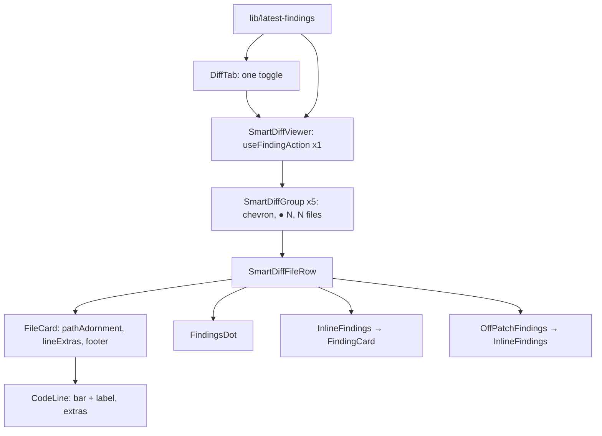

# 0009 — Smart Diff: complete to the binding homework spec

**Status:** ready · **Citations valid as of:** `4c48764` (clean tree when read)

## Goal

Bring Smart Diff in line with the binding homework spec (P1 blocks submission, P2 mentor-commented,
P3 wishes):
- a pure, path-only `classifyFile(path)` sorts files into **five roles**;
- finding cards appear **inline under the flagged line**, and off-patch findings in an
  end-of-file block;
- each group header counts **files with findings**, and each file card shows a **plain dot**;
- **one toggle** hides both human comments and findings.

**Acceptance:** every row of *Spec coverage* is checkable by its step or verification item;
server and client typecheck pass; `arch:check` 0 errors; the browser pass on PR #4 succeeds.

## Out of scope

- Rewriting `docs/specs/smart-diff.md` (a `doc-writer` follow-up).
- The demo PR `demo/rate-limiting` (the user prepares it).
- Any `e2e/specs/*.flow.json` edit; migrations; `seed.ts`; lock files.
- A `✦ summary` chip / "What this does" row — `pseudocode_summary` stays `null`.
- The implementer writes no tests; Steps 1 and 11 are `test-writer`'s.
- No review, no commit, no push (`/pr-self-review` is the user's).

## Decisions (binding — do not re-open)

1. **Inline findings: optional slots on `FileCard`/`CodeLine` + the existing `FindingCard`.**
   - `FileCard` gets `lineExtras?: ReadonlyMap<string, ReactNode>`, keyed by `lineKey(side, line)` and
     looked up with `keysForLine(ln)`, exactly as `threadsForLine` does (`FileCard.tsx:24-32`); and
     `footer?: ReactNode`.
   - `CodeLine` gets `extras?: ReactNode`, rendered after the `CommentThreadView` map
     (`CodeLine.tsx:103-107`) and before the composer.
   - A map, not a render callback: the `react-best-practices` "Render Factories" rule, and it keeps
     line matching inside `FileCard` via `keysForLine`.
   - A finding keys as `lineKey("RIGHT", start_line)`.
   - `src/components/diff-viewer` imports nothing from the route's `_components`.
   - ONE `useFindingAction()` (`client/src/lib/hooks/reviews.ts:148`) for the whole viewer.
2. **Classifier: spec list first, then the current extra PATH patterns; path-only; size thresholds
   dropped; `classifyFile(path)`.**
   - Two ordered passes: all SPEC rules (priority boilerplate → tests → wiring → docs), then all
     EXTRA rules (same priority). First match wins; otherwise `core`. So an extra only fires on a
     path the spec alone would call `core`.
   - Planner call: the `docs?` segment and `.mdx`/`.txt` move from wiring-extras to docs-extras
     (they sat in wiring only because no docs role existed, `constants.ts:42-46`); left in wiring
     they would pre-empt the spec's `docs/**`.
   - Dead/superseded extras deleted: `.md`, `README.md`, `.github`.
3. **Line-badge click → expand and scroll to the inline card under that line.**
   - Deleted: the diff → Findings-tab navigation from plan 0007.
   - Kept: `FileCard.onLineSeverityClick` / `CodeLine.onSeverityClick` (they are the mechanism),
     and the whole Findings-tab side of 0007 (`page.tsx:77,86-90,170`; `FindingsTab` /
     `ReviewRunAccordion` / `FindingsPanel` highlight; `useFindingKeyboardNav`).
4. **One hide toggle**, shown when there are human comments OR in-scope findings, starting **ON**
   when findings exist, controlling both.
5. **Findings scope = newest review PER AGENT** (`selectDistinctOn([prId, agentId])`,
   `review.repo.ts:99-114`; client `latestFindingsPerAgent`). A documented deviation from the spec's
   literal "latest review": a multi-agent run writes one `reviews` row per agent, so the literal
   reading would hide all agents' findings but one.
6. **Dismissed findings** (`findings.dismissed_at` set):
   - excluded from server `finding_lines` (precedent `server/src/modules/pulls/repository.ts:110`),
     so no line bar/label, and they don't count toward the file dot or the group counter;
   - still rendered as muted inline/off-patch cards, so Accept can restore them (accept clears
     `dismissedAt`, `review.repo.ts:161`);
   - the client never counts on its own: dot = `finding_lines.length > 0`; group counter = files in
     the group with `finding_lines.length > 0`. Server and client agree by construction.
7. **`finding_lines` = sorted, unique `start_line`** of non-dismissed in-scope findings, no range
   expansion. `split_suggestion = { too_big: false, total_lines: Σ(additions+deletions),
   proposed_splits: [] }`.
8. **i18n → `client/messages/en/prReview.json` → `smartDiff`**; delete `smartDiff.json`.
   `client/src/i18n/request.ts:17-26` auto-loads every `*.json`, so no loader change.
9. **Group header:** a chevron `<button aria-expanded>` wrapping the label, collapsing the whole
   group; the muted blurb; on the right `● N` (files with findings) BEFORE "N files". Not sticky.
   With no `kind==="review"` review, "review not run yet" replaces `● N`. The coloured role dot and
   `GROUP_META.dotColor` are removed (planner call: two dots in one header read as two counters).
10. **All five groups always render** in order core → tests → wiring → docs → boilerplate, empty
    ones too ("0 files", no body). This replaces the hide-empty rule at `SmartDiffViewer.tsx:204`.
    Groups start expanded. File cards in `docs`/`boilerplate` start collapsed; others open iff
    `additions+deletions ≤ AUTO_EXPAND_MAX_LINES` (`client/src/components/diff-viewer/constants.ts:4`).
11. **File-header indicator:** one plain dot (`role="img"`, `aria-label` "Has findings", not `Badge`)
    replaces `FindingSeverityDots`, in `pathAdornment`, beside the untouched comment counter
    (`FileCard.tsx:116-123`).
12. **Line labels:** CRITICAL → `blocker`, WARNING → `warning`, SUGGESTION → `suggestion`, from a
    `LINE_BADGE_LABEL: Record<Severity, string>` in `client/src/components/diff-viewer/constants.ts`.
    The coloured left bar is the existing `severityBorderFor`.
13. **Summary stays out. Original order stays the plain `DiffViewer`** (`SmartDiffViewer.tsx:193-194`).

## Spec coverage

| Item | Satisfied by |
|---|---|
| P1.1 five groups in order, label + count | 2, 4, 7, 9 |
| P1.2 lock → boilerplate; docs/boilerplate collapsed; rest `AUTO_EXPAND_MAX_LINES` | 1, 3, 9 |
| P1.3 group `● N` files-with-findings before "N files" | 4, 9 |
| P1.4 plain file dot beside path, separate from comment counter | 9 |
| P1.5 inline finding card (severity, title, rationale) under the line | 5, 8, 9 |
| P1.6 Original order toggle | 9 (kept) |
| P2 patterns + order in one constants file; table test incl. 3 edge cases | 1, 3 |
| P2 response passes `SmartDiff` validation; 5-value enum in both `brief.ts` | 2, 4 |
| P2 no model call; works before first review | 4, 9 |
| P2 left bar + `blocker`/`warning`/`suggestion` label | 5 |
| P2 Accept/Dismiss change state | 9 (`useFindingAction`) |
| P2 off-patch finding → end-of-file block | 5, 9 |
| P2 same toggle hides finding comments | 10 |
| P3 card collapsible to one line | 8 |
| P3 "review not run yet" empty state | 9 |
| P3 counters update after Run review without reload | 10 |
| P3 labels from `prReview.json` → `smartDiff` | 7 |

## Context

- **INSIGHTS applied:**
  - server: 2026-09-21 `pseudocode_summary` stays null; the test-classification entry is superseded
    here (tests become their own role, `e2e/*.md` → tests); "grep `server/test/` before narrowing a
    contract"; the `.it.test` skipped-count trap.
  - client: runtime `@devdigest/shared` import 500s; `Badge` drops `aria-label`; `MonoLink` without
    `href` is a `<button>`; no `useEffectEvent` (adjust state during render / refs); UI-vs-contract
    `Severity` clash.
  - root: dev-DB review rows get replaced by other sessions (don't hard-code ids); the shared
    worktree is a moving target.
- **History:** plans 0004–0007, commit `8cd62e4`. `323b49f` and `4c48764` (unpushed) don't touch
  Smart Diff files.
- **Assumptions:** spec globs use gitignore semantics — a pattern with no `/` matches the basename
  at any depth (`pnpm-lock.yaml`, `*.lock`, `index.ts`, `*.config.*`, `README*`, …); a pattern with
  `/` is anchored at the repo root (`dist/**`, `build/**`, `e2e/**`, `docs/**`, `.github/**`,
  `.claude/**`); `**/` matches zero or more segments. Implemented with regexes — no glob dependency
  (lock files are do-not-touch; no picomatch/minimatch in either `package.json`).

## Component map

| Module | Component | Status | Path | Step |
|---|---|---|---|---|
| shared | `SmartDiffRole` | changed | `server/src/vendor/shared/contracts/brief.ts` (+ client mirror) | 2 |
| server | classifier rules | changed | `server/src/modules/reviews/smart-diff/constants.ts` | 3 |
| server | `classifyFile` | changed | `.../smart-diff/classify.ts` | 3 |
| server | `startLinesByFile` / `sortFiles` | changed | `.../smart-diff/helpers.ts` | 4 |
| server | `buildSmartDiff` | changed | `.../smart-diff/build.ts` | 4 |
| server | `latestFindingRangesForPull` | changed | `.../repository/review.repo.ts` | 4 |
| server | `getSmartDiff` | changed | `.../reviews/service.ts` | 4 |
| server | `GET /pulls/:id/smart-diff` | changed | `.../reviews/routes.ts` | 4 |
| client | `lineKeysForPatch` | new | `client/src/components/diff-viewer/comments.ts` | 5 |
| client | `FileCard` | changed | `client/src/components/diff-viewer/FileCard/FileCard.tsx` | 5 |
| client | `CodeLine` | changed | `client/src/components/diff-viewer/CodeLine/CodeLine.tsx` | 5 |
| client | `latestFindingsPerAgent` | new (moved) | `client/src/lib/latest-findings.ts` | 6 |
| client | i18n `prReview.smartDiff` | changed | `client/messages/en/prReview.json` | 7 |
| client | `smartDiff.json` | deleted | `client/messages/en/smartDiff.json` | 7 |
| client | `FindingCard` | changed | `.../_components/FindingCard/FindingCard.tsx` | 8 |
| client | `SmartDiffViewer` + constants/helpers | changed | `.../SmartDiffViewer/{SmartDiffViewer.tsx,constants.ts,helpers.ts,styles.ts}` | 9 |
| client | `SmartDiffGroup` | new | `.../SmartDiffViewer/_components/SmartDiffGroup/` | 9 |
| client | `SmartDiffFileRow` | new (extracted) | `.../SmartDiffViewer/_components/SmartDiffFileRow/` | 9 |
| client | `InlineFindings` | new | `.../SmartDiffViewer/_components/InlineFindings/` | 9 |
| client | `OffPatchFindings` | new | `.../SmartDiffViewer/_components/OffPatchFindings/` | 9 |
| client | `FindingsDot` | new | `.../SmartDiffViewer/_components/FindingsDot/` | 9 |
| client | `FindingSeverityDots` | deleted | `.../SmartDiffViewer/_components/FindingSeverityDots/` | 9 |
| client | `DiffTab` | changed | `.../_components/DiffTab/DiffTab.tsx` | 10 |
| client | PR page | changed | `.../pulls/[number]/page.tsx` | 10 |
| client | `useFindingAction` | reused | `client/src/lib/hooks/reviews.ts:148` | 9 |

## Steps

### 1. Classifier table test, written FIRST — executor `test-writer` (server; small)

Rewrite `server/test/smart-diff-classify.test.ts` as an `it.each` path→role table calling
`classifyFile(path)`. Must include:

| path | role | why |
|---|---|---|
| `src/__tests__/__snapshots__/x.snap` | boilerplate | edge 1 (snapshot > tests) |
| `.claude/skills/security/SKILL.md` | wiring | edge 2 (`.claude/**` > docs) |
| `e2e/README.md` | tests | edge 3 (`e2e/**` > docs) |
| `server/pnpm-lock.yaml`, `reviewer-core/package-lock.json`, `Cargo.lock` | boilerplate | spec lock rules, nested |
| `dist/main.js`, `public/app.min.js`, `src/api.generated.ts` | boilerplate | spec |
| `server/src/vendor/shared/contracts/brief.ts`, `assets/logo.png`, `server/docs/diagram.png` | boilerplate | extras (`vendor`, image — the image extra fires before the `docs?` extra, even under a `docs/` folder) |
| `server/test/smart-diff-build.test.ts`, `client/src/components/diff-viewer/FileCard.test.tsx`, `server/test/smart-diff.it.test.ts`, `e2e/specs/05-pr-diff.flow.json`, `server/test/helpers/pg.ts` | tests | spec |
| `src/foo.spec.tsx`, `src/__mocks__/api.ts` | tests | extras |
| `client/src/components/diff-viewer/index.ts`, `client/next.config.mjs`, `server/tsconfig.json`, `server/.env.example`, `docker-compose.yml`, `.github/workflows/client.yml` | wiring | spec |
| `server/src/modules/reviews/routes.ts`, `server/src/db/migrations/0011_petite_molecule_man.sql`, `client/messages/en/prReview.json`, `client/package.json` | wiring | extras |
| `docs/specs/smart-diff.md`, `README.md`, `server/INSIGHTS.md`, `CHANGELOG.md`, `LICENSE` | docs | spec |
| `notes.txt` | docs | extras moved to docs |
| `server/src/modules/reviews/service.ts`, `reviewer-core/src/prompt.ts`, `.../SmartDiffViewer/SmartDiffViewer.tsx`, `contest.ts`, `latest/x.ts` | core | fall-through / segment anchoring |

Also assert `classifyFile.length === 1` and `ROLE_ORDER` equals
`['core','tests','wiring','docs','boilerplate']`.
*Verify:* `./node_modules/.bin/vitest run test/smart-diff-classify.test.ts` in `server/` — expected
RED until Step 3.

### 2. Five-value contract (contracts; small)

Edit `SmartDiffRole` to `z.enum(['core','tests','wiring','docs','boilerplate'])` in the server copy
first, then the client mirror. No other contract edits.
*Verify:* `diff server/src/vendor/shared/contracts/brief.ts client/src/vendor/shared/contracts/brief.ts`
prints nothing; `./node_modules/.bin/vitest run test/contracts.test.ts` passes in `server/`.

### 3. Path-only classifier (server; medium; depends on 1, 2)

In `constants.ts` declare `ROLE_ORDER` (display) and `CLASSIFY_PRIORITY` (`boilerplate, tests,
wiring, docs`), both exhaustive at the type level. Declare `SPEC_RULES` in priority order, one regex
per spec glob (see *Assumptions*):
- boilerplate: `*.lock`, `pnpm-lock.yaml`, `package-lock.json`, `yarn.lock`, `dist/**`, `build/**`,
  `**/__snapshots__/**`, `*.snap`, `*.generated.*`, `*.min.js`
- tests: `*.test.ts(x)`, `*.it.test.ts`, `*.spec.ts`, `**/test/**`, `**/tests/**`, `**/__tests__/**`,
  `e2e/**`
- wiring: `index.ts`, `index.js`, `*.config.*`, `tsconfig*.json`, `.eslintrc*`, `.env*`,
  `docker-compose*.yml`, `.github/**`, `.claude/**`
- docs: `**/*.md`, `docs/**`, `README*`, `CHANGELOG*`, `LICENSE`

Then `EXTRA_RULES`:
- boilerplate: remaining lock basenames (`npm-shrinkwrap.json`, `bun.lockb`, `go.sum`),
  `GENERATED_PATH_RE` segments at any depth, `GENERATED_FILE_RE` extensions
- tests: `TEST_FILE_RE`, `__mocks__` / `e2e` segments at any depth
- wiring: basenames `index.tsx`, `package.json`, `Dockerfile`; `WIRING_PATH_RE` minus `docs?` and
  `\.github`
- docs: `docs?` segment, `\.(mdx|txt)$`

`classify.ts` loops `SPEC_RULES` then `EXTRA_RULES`, else `core`. Keep whole-segment anchoring
(`constants.ts:4-8`). No new dependency. Delete `LOCK_BASENAMES`, `WIRING_BASENAMES`,
`WIRING_FILE_RE`, `BOILERPLATE_MIN_CHANGED_LINES`, `WIRING_MAX_CHANGED_LINES`, `SPLIT_LINES`,
`MAX_FINDING_RANGE_LINES` (their regex content moves into the rule lists).
*Verify:* Step 1's test is green; `pnpm typecheck` in `server/`.

### 4. Build, repository, service, route (server; medium; depends on 3)

- `build.ts`: `ROLE_ORDER` (all five groups always emitted), `classifyFile(file.path)`,
  `too_big: false`.
- `helpers.ts`: `FindingRangeRow` becomes `{ file, startLine }`; `expandFindingLines` →
  `startLinesByFile` (start lines only, deduped, ascending).
- `review.repo.ts:81-114`: add `isNull(t.findings.dismissedAt)`, drop `endLine`; keep the method name.
- `repository.ts:68-73`: doc comment only.
- `service.ts:311-347`: docblock + log line carry all five role counts, derived from `ROLE_ORDER`.
- `routes.ts:20,190-197`: docblock names five roles; add `response: { 200: SmartDiffResponse }`
  (the serializer compiler is set at `app.ts:64-65`).
- No model call, no new I/O.

*Verify:* `pnpm typecheck`, `pnpm arch:check` (0 errors, warnings ≤ baseline),
`./node_modules/.bin/vitest run test/smart-diff-classify.test.ts test/contracts.test.ts` in `server/`.

### 5. Shared diff-viewer slots (client; medium; depends on 2)

- `comments.ts`: new exported `lineKeysForPatch(patch)` (built on `parsePatch` + `keysForLine`) and
  its lines-based core; `FileCard` reuses that core at `:92-93`.
- `FileCard`: add `lineExtras` (looked up with `keysForLine(ln)`, passed to `CodeLine` as `extras`)
  and `footer` (rendered after `OutdatedComments` inside the open body, including when
  `lines.length === 0`). Delete `scrollToLine` + its effect (`:56-57, 81-84`) and `lineIdPrefix`
  (`:54-55, 138`).
- `CodeLine`: `extras` renders after threads, before `InlineComposer`. Delete `domId`. Badge text =
  `LINE_BADGE_LABEL[severity]` (`:89, 98`).
- `constants.ts`: add `LINE_BADGE_LABEL`.
- `index.ts`: also export `lineKey`, `lineKeysForPatch`, `AUTO_EXPAND_MAX_LINES`.
- Every new prop is optional; the plain `DiffViewer` path is unchanged.

*Verify:* `pnpm typecheck` in `client/`.

### 6. Move `latestFindingsPerAgent` to lib (client; small)

New `client/src/lib/latest-findings.ts` with the same logic as `SmartDiffViewer/helpers.ts:25-35`,
exported; `SmartDiffViewer/helpers.ts` imports it.
*Verify:* `pnpm typecheck` in `client/`.

### 7. i18n move (client; small)

Under `prReview.smartDiff`:
- keep `coreLabel`, `wiringLabel`, `boilerplateLabel`; add `testsLabel` "Tests", `docsLabel` "Docs";
- add five `<role>Blurb` keys (reuse the three current blurbs; tests "Tests covering the change";
  docs "Documentation and prose");
- move `header`, `stats` (verbatim, `<add>`/`<del>` tags), `orderSmart`, `orderOriginal`;
- change `filesCount` to the ICU plural from `smartDiff.json:19`;
- add `filesWithFindings` (ICU plural aria text), `hasFindings` "Has findings", `reviewNotRun`
  "review not run yet", `offPatchTitle` "Findings outside the diff", `toggleShow` / `toggleHide`
  "Show/Hide comments & findings ({count})";
- leave `largeTitle`, `largeBody`, `findingLines`, `groupedByRole` untouched;
- delete `client/messages/en/smartDiff.json`.

*Verify:* `jq .smartDiff client/messages/en/prReview.json` parses; after Step 9,
`grep -rn '"smartDiff"' client/src` returns nothing.

### 8. One-line collapsed `FindingCard` (client; small)

Optional `hideLocation?: boolean`: when true, `metaRow` (`FindingCard.tsx:67-72`) is not rendered, so
the collapsed card is one row (and no no-href `MonoLink` button). The default leaves the Findings
tab unchanged. The card must bind no keys.
*Verify:* `./node_modules/.bin/vitest run 'src/app/repos/[repoId]/pulls/[number]/_components/FindingCard'`
in `client/` stays green.

### 9. SmartDiffViewer rebuild (client; large; depends on 5–8)

- **`constants.ts`:** `GROUP_ORDER` = five-role literal `as const satisfies readonly SmartDiffRole[]`
  **plus** a type-level exhaustiveness check (`Exclude<SmartDiffRole, (typeof GROUP_ORDER)[number]>`
  must be `never`, else `tsc` fails). `GROUP_META: Record<SmartDiffRole, { labelKey, blurbKey,
  filesCollapsed: boolean }>` (docs/boilerplate `true`); `dotColor` removed.
  `FINDINGS_DOT_COLOR = "var(--crit)"`. `SmartDiffRole` stays `import type`.
- **`helpers.ts`:**
  - `buildSeverityByFile` uses `start_line` only and skips dismissed findings;
  - keep `severityForFlaggedLines`;
  - `findingsByFile(reviews)` (via lib, including dismissed);
  - `partitionFileFindings(findings, renderedKeys, findingLines)` → `{ inlineByKey, offPatch }`:
    inline under `lineKey("RIGHT", start_line)` iff that key is rendered AND (`start_line ∈
    finding_lines` OR dismissed); `offPatch` iff the key is not rendered (patch `null` → all
    off-patch); a non-dismissed finding with a rendered key but not in `finding_lines` is transient
    query skew and is not shown;
  - `filesWithFindings(group)` = files with `finding_lines.length > 0`; `hasReviewRun(reviews)`;
  - delete `countFindingsBySeverityByFile`, `firstLineOfSeverity`, `buildFindingIdByLine`.
- **`SmartDiffViewer`** (≤200 lines): `useTranslations("prReview")` with `smartDiff.*` keys; one
  `useFindingAction()` → `onAction(f.id, act)` → `mutate({ findingId, action, prId })`,
  `pending={isPending}`; `showFindings = commenting?.showComments ?? true`; renders five
  `SmartDiffGroup`s; plain-`DiffViewer` fallback + Original order unchanged; `onOpenFinding` removed.
- **`SmartDiffGroup`:** chevron `<button aria-expanded>` wrapping the label; the blurb; right slot
  `FindingsDot count` or `reviewNotRun` (hidden while reviews load), then `filesCount`. The body
  unmounts when collapsed.
- **`SmartDiffFileRow`:** controlled `open` initialised from `filesCollapsed ? false :
  additions+deletions ≤ AUTO_EXPAND_MAX_LINES`; `pathAdornment = <FindingsDot/>` iff
  `finding_lines.length > 0`; `severityByLine = severityForFlaggedLines(...)`; when `showFindings`:
  `lineExtras` = one `InlineFindings` per key, `footer` = `OffPatchFindings` if non-empty,
  `onLineSeverityClick` sets `reveal = { key, nonce+1 }`; when not: none of these (the badge stays a
  plain span).
- **`InlineFindings`:** cards sorted via `sortBySeverity`, each `<FindingCard defaultExpanded
  hideLocation onAction pending>` keyed `${f.id}:${revealNonce}` (remount = re-expand); a
  `useEffect` on `revealNonce > 0` calls `scrollIntoView({ block: "nearest" })` on its own ref. No
  global key listeners. Indented like `cs.thread`.
- **`OffPatchFindings`:** title + `InlineFindings`, styled after `OutdatedComments`.
- **`FindingsDot`:** `` with a decorative dot and an optional visible
  count.
- Delete the `FindingSeverityDots/` folder.

*Verify:* `pnpm typecheck` in `client/`;
`grep -rn "FindingSeverityDots\|countFindingsBySeverityByFile\|firstLineOfSeverity\|buildFindingIdByLine\|onOpenFinding" client/src`
returns nothing.

### 10. Toggle, page cleanup, refresh on run completion (client; small; depends on 6, 7, 9)

- **`DiffTab`:** `findingCount = latestFindingsPerAgent(reviews).length` via `usePrReviews(prId)`;
  state `showOverride: boolean | null`; `showComments = showOverride ?? findingCount > 0` (derived,
  not synced); toggle rendered iff `commentCount > 0 || findingCount > 0`, labelled
  `smartDiff.toggleShow/Hide` with `count = commentCount + findingCount`; posting a comment sets the
  override to `true`; remove `onOpenFinding`.
- **`page.tsx`:** remove the `:192` prop. Add a falling-edge effect on `reviewRunning` (`:50`,
  previous value held in a `useRef`) that invalidates `["reviews", prId]` and
  `["pr-smart-diff", prId]` — today only the Findings tab's `onRunDone` (`:178-182`) refetches, and
  only reviews, so the diff tab's counters go stale after a run.

*Verify:* `pnpm typecheck && pnpm test` in `client/`; remaining failures are the invalidated tests
below.

### 11. Tests — executor `test-writer` (server + client; large; depends on 1–10)

See *Handed to test-writer*.

## Skills for implementer

| Step | Skill | Rule |
|---|---|---|
| 2 | `zod` | schema and inferred type share one name; edit the enum only |
| 3, 4 | `onion-architecture` | `constants.ts`/`helpers.ts`/`classify.ts` stay I/O-free; Drizzle only in the repository |
| 4 | `drizzle-orm-patterns` | filter in SQL (`isNull`), not in JS |
| 4 | `fastify-best-practices` | schema-first: declare the response schema for serialization |
| 5, 9 | `react-best-practices` | no render factories (hence the `lineExtras` map); derive, don't store; stable keys; `count > 0 &&` never `count &&`; components ≤ 200 lines |
| 5, 6, 9 | `frontend-ui-architecture` | shared `components/` never imports route `_components`; colocated `_components/<Name>/` + `index.ts`; pure `helpers.ts` |
| 9, 10 | `next-best-practices` | `"use client"` stays at the leaves; `page.tsx` stays thin |
| 3, 9 | `typescript-expert` | exhaustiveness via `Exclude<…>` = `never`, not `satisfies` alone |

## Architecture constraints

- Client `@devdigest/shared` imports are `import type` only; no runtime copy of role values
  besides `GROUP_ORDER` (checked: no `feature-models.ts`-style copy exists for roles).
- `React.useEffectEvent` banned. UI via the `@devdigest/ui` barrel. `Badge` not used for labelled
  indicators.
- `src/components/diff-viewer` gets no route import; new props optional; plain `DiffViewer`
  rendering unchanged.
- Markers and counters come only from server `finding_lines`. The only inline cards not gated by
  it are dismissed ones and the off-patch block (Step 9).
- No model call; `arch:check` 0 errors. Server tests in `server/test/`; client tests colocated.

## Do-not-touch that this task hits

- `server/src/vendor/shared/contracts/brief.ts` + client mirror — sanctioned: server first, then
  client, then `diff` (Step 2).
- Not touched: migrations, `server/src/db/seed.ts`, `e2e/specs/*.flow.json` (no Smart Diff strings
  in them), lock files, `devdigest_pgdata`.

## Verification (whole task)

- **server:** `pnpm typecheck`; `pnpm arch:check` (0 errors); `pnpm test` — check the skipped count;
  `smart-diff.it.test.ts` needs Docker.
- **client:** `pnpm typecheck`; `pnpm test`.
- **contracts:** `diff` of the two `brief.ts` copies is empty.
- **Browser, current data** — dev servers already on :3000/:3001, never restart them —
  `http://localhost:3000/repos/50544f37-5b3d-40e7-b323-b3292b6333c9/pulls/4?tab=diff`:
  five group headers in order; docs/boilerplate files collapsed; `● N` before "N files" (or "review
  not run yet"); a plain dot beside flagged paths; bar + `blocker`/`warning`/`suggestion` label;
  badge click expands and scrolls to the card; Accept/Dismiss changes the card state, and after
  Dismiss the counter and dot drop without a reload; the toggle hides comments and cards and starts
  ON; Original order works; the `/pulls/<prId>/smart-diff` response has 5 groups and `too_big:false`.
- **Needs `demo/rate-limiting`** (user-prepared): lock file under boilerplate; an off-patch finding
  block; all five roles non-empty.
- **e2e:** not run by the implementer; `05-pr-diff.flow.json` should still pass (groups start
  expanded).

## Handed to test-writer

**Invalidated:** `server/test/smart-diff-classify.test.ts` (replaced by Step 1);
`smart-diff-build.test.ts` (three groups, `SPLIT_LINES`, range dedupe); `smart-diff-helpers.test.ts`
(`expandFindingLines`, `MAX_FINDING_RANGE_LINES`); `smart-diff.it.test.ts` (`endLine` in expected
rows); `.../SmartDiffViewer/SmartDiffViewer.test.tsx` (imports `smartDiff.json`, hide-empty-group,
severity dots, scroll); `.../SmartDiffViewer/helpers.test.ts` (`countFindingsBySeverityByFile`, range
colouring); `client/src/components/diff-viewer/CodeLine.test.tsx` (label text, `domId`);
`FileCard.test.tsx` (if it uses `scrollToLine`/`lineIdPrefix`).

**New:** build emits five groups + `too_big:false`; repo excludes dismissed findings (`.it`); route
response parses `SmartDiff`; `partitionFileFindings` (inline / off-patch / dismissed / skew);
`FileCard` `lineExtras`/`footer`; `CodeLine` `extras` order; group counter + "review not run yet";
dot accessible name; badge click re-expands the card; `DiffTab` toggle visibility/default/override;
`hideLocation`.

## Risks

- **Classification shifts on real PRs:** tests get their own group; markdown → docs; `e2e/*.md` →
  tests; the `vendor` extra puts `brief.ts` in boilerplate. The Step 1 table is the oracle.
- **The new response schema turns any contract drift into a 500.** Check the route in the browser
  after Step 4.
- The hover "+" on a `CodeLine` also shows while the pointer is over an inline card (same wrapper,
  `CodeLine.tsx:55-60`) — cosmetic.
- Collapsing a group unmounts its file rows, so their open state resets.
- Other sessions may edit these files or replace dev-DB reviews — re-read before editing; don't
  hard-code finding ids.

## Open questions (non-blocking, with defaults)

- Should Original order also show inline findings? Default: keep as is (spec: "keep it").
- Should empty groups render? Default: yes, all five with "0 files" (P1 says five groups).
- Is "review not run yet" in every header too noisy? Default: once per header, as the spec says.

## Could not establish

- What PR #4's current files classify into, and whether it has any off-patch finding (the dev DB is
  shared and changes; no DB read was made).
- Whether fastify-type-provider-zod's serializer rejects or strips unknown extra keys — only matters
  if `buildSmartDiff` ever adds a field.
