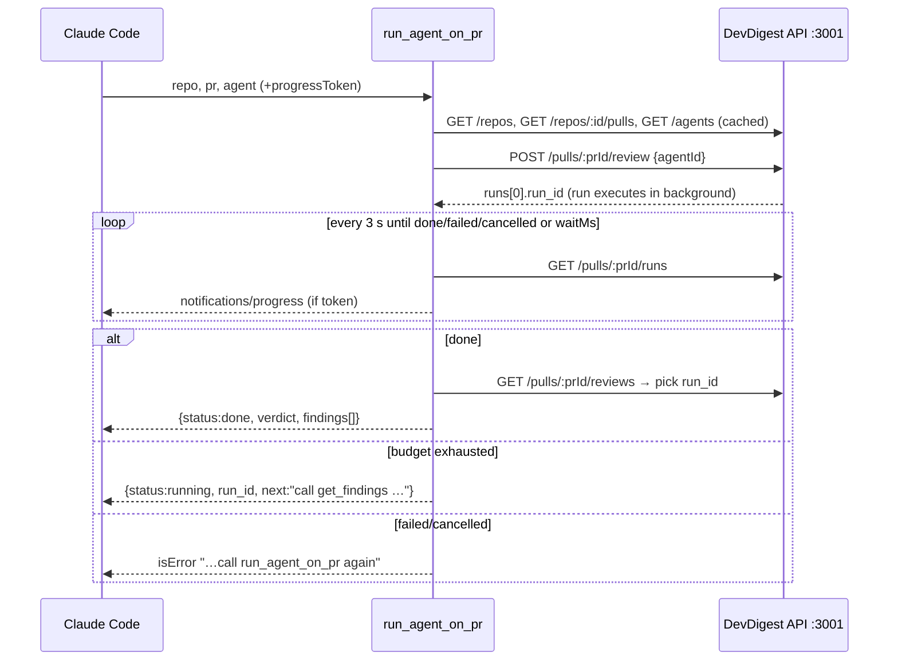

# 0010 — DevDigest MCP server (local, stdio, 5 tools)

Status: **ready — decisions taken 2026-09-23 (SDK v2, conventions all statuses, wait 100 s); onion layering + pr-self-review support added 2026-09-26; step 0 (verify v2 API) before implementation**
Citations valid as of `4c48764` (dirty tree). Supersedes the earlier draft of this file:
`run_review` → `run_agent_on_pr` (create → wait → findings), SDK kept at v2 by user decision, pnpm → npm, lean output schemas added, `offset` dropped, race-free wait design added.

## Goal

Standalone stdio MCP server `mcp/` (`@devdigest/mcp`), launched by Claude Code from a
project `.mcp.json`, a thin HTTP client over the running API on `localhost:3001`,
exposing exactly five tools: `list_agents`, `run_agent_on_pr`, `get_findings`,
`get_conventions`, `get_blast_radius` (stub).

**Acceptance:**
- (a) `tools/list` over `InMemoryTransport` returns the 5 names; serialized size ≤ 6,000 chars (≈1.5k tokens); server `instructions` ≤ 160 chars.
- (b) `run_agent_on_pr` returns `{status:"done", verdict, findings[]}` for a finished run and `{status:"running", run_id, next}` when the wait budget runs out.
- (c) Every `isError` message names the next tool or step.
- (d) No `server/`, `client/`, `reviewer-core/`, `e2e/` code touched; outside `mcp/` only `.mcp.json`, root `AGENTS.md` and the two `pr-self-review` scripts change.
- (f) `mcp/test/architecture.test.ts` passes (onion import rules, below).
- (e) `npm test` and `npm run typecheck` pass in `mcp/`.

## Design principles (course rubric — every tool satisfies all 4)

1. **Outcome, not operation** — `run_agent_on_pr(repo, pr, agent)` creates the run, waits, fetches findings.
2. **Flat arguments** — `repo`, `pr`, `agent` as separate primitives; no nested objects.
3. **Concise structured response** — `{verdict, findings[]}` with only needed fields, never a raw dump.
4. **Errors lead forward** — e.g. "agent not found, call list_agents" instead of a bare 404.

Plus token economy: tiny `instructions`, self-explanatory names, minimal zod schemas
with one short `.describe()` per field, defaults for optional params, `detail`/`limit`/
`severity` controls, stderr-only logging, no heavy init before the handshake.

## Out of scope

- Any change to `server/`, `client/`, `reviewer-core/`, `e2e/`, `vendor/shared` — incl. a blast-radius HTTP route or a PR-by-number route (follow-ups).
- Implementing blast radius (homework).
- `POST /repos/:id/conventions/extract`, repo import, accept/dismiss findings.
- HTTP transport, auth, `resources`/`prompts` capabilities.
- Review, commit, push.

## Context

**INSIGHTS applied**
- `server/INSIGHTS.md` 2026-09-19 "Flaky `/runs/:id/trace` read": `completeAgentRun` runs before `saveRunTrace` → `run_agent_on_pr` never reads the trace; it reads `GET /pulls/:id/reviews` by `run_id`. Race-free: `insertReview`/`insertFindings` (`server/src/modules/reviews/run-executor.ts:264,275`) precede `completeAgentRun(done)` (`:289`); trace written at `:339`.
- Root 2026-09-21: shared dev DB rows get replaced by other sessions → tests use a fake API client.
- Root 2026-09-16 `ERR_PNPM_IGNORED_BUILDS` and 2026-09-20 stray `pnpm-workspace.yaml` → new package uses **npm**.
- Root 2026-09-19 "AGENTS.md does not name skills" → `mcp/AGENTS.md` states rules, not skill names.
- `server/INSIGHTS.md` 2026-09-19 stable ORDER BY: `GET /agents` already ordered (`createdAt, id`).

**History:** no prior MCP work (`git log --all -S'modelcontextprotocol'`, `--grep=mcp`).

**Assumptions**
1. Claude Code launches project `.mcp.json` stdio servers with cwd = project root (unverified).
2. Wait budget 100 s: dev DB `done` runs median 9.4 s, max 105 s (17 runs); Claude Code auto-backgrounds after ~2 min.
3. Dismissed findings excluded, same as the PR list (`PrMeta.findings`, `platform.ts:181-186`).

## Architecture decisions

- **Thin HTTP client, not direct DB.** `container.runBus` is an in-process singleton (`server/src/platform/sse.ts:103`); runs execute fire-and-forget inside the API (`reviews/service.ts:187-193`). A second process would start runs the UI can't stream or cancel. No auth: `getContext` resolves the default workspace (`_shared/context.ts:14-23`).
- **Wait by polling DB status, not SSE.** SSE `/runs/:id/events` hangs forever for a run the bus never completed (e.g. after API restart; `sse.ts:90-99`). Poll `GET /pulls/:id/runs` (`reviews/routes.ts:105-108`, `RunSummary.status`, `vendor/shared/contracts/trace.ts:109-131`) every 3 s (~20 req/min, under the global 120/min, `app.ts:96`). On `done`, fetch `GET /pulls/:id/reviews` (`reviews/routes.ts:133-136`) and pick the matching `run_id`.
- **Package placement:** new standalone `mcp/`, npm, own `package-lock.json` (no-workspace convention). Keeps the MCP SDK out of `server/` deps and `arch:check`.
- **Contracts:** `import type` only from `@devdigest/shared` via tsconfig path alias to `../server/src/vendor/shared` (same trick as `reviewer-core/tsconfig.json`), zod aliased to `mcp/node_modules/zod`. Tool I/O schemas are separate lean zod schemas owned by `mcp/`. **Superseded by Step 0** (below): the zod-4 alias fails `tsc` inside vendor's `platform.ts:95`, so `mcp/` imports no `@devdigest/shared` at all — every module hand-types the fields it reads in its own `ports.ts` instead.
- **SDK: `@modelcontextprotocol/server@^2.0.0` (v2) — user decision.** Current stable, spec 2026-07-28, peer zod ^4.2. Its API surface (`registerTool` signature, handler `extra` fields for `signal`/progress, `InMemoryTransport` location, stdio import path, error→`isError` mapping) is **not yet verified** — step 0 confirms it before any code. Reference behaviour to expect, from v1 1.30: `registerTool(name,{title,description,inputSchema,outputSchema,annotations},cb)`; linked in-memory transport pair; `extra.signal`, `extra._meta.progressToken`, `sendNotification`; thrown/input-validation errors → `isError`; output validation skipped on `isError`. Fallback if v2 blocks: v1 `@modelcontextprotocol/sdk@^1.30.0` (zod ^3.25 || ^4), a contained swap.
- **zod major:** `mcp/` uses zod ^4.2 while `server/` vendor contracts are authored against zod 3.25. The `zod` path alias points vendor type imports at `mcp`'s zod 4; step 0 confirms `tsc` accepts the `z.infer` types this package imports. If not, import plain TS types only or type the few needed fields locally.

## Onion layering inside `mcp/`

**Superseded by §"Restructure to server layout (2026-09-26)" and
§"Server-parity pass (2026-09-26)"** below — the flat `domain/`/`ports.ts`/
`usecases/`/`tools/` layout this section and *Modules & files* describe was
replaced by `server/`-mirroring per-module folders; read those two sections
(and `.claude/skills/onion-architecture/references/mcp-package.md`, the
authoritative current ring map) for the actual current layout. Kept here
verbatim as the historical record of what was first built.

`onion-architecture` scopes `server/` and `reviewer-core/`; its principles are applied here by analogy.
System-wide, the whole `mcp/` package is an **outer-ring driving adapter** of DevDigest (like `client/`):
it reaches the core only through the HTTP API, never by importing services (`no-cross-module-internals`).

Inside the package:

| Ring | Folder | Holds | May import |
|---|---|---|---|
| Domain | `src/domain/` | `format.ts` (pure select/verdict/render), `errors.ts` (typed domain errors) | `import type` from `@devdigest/shared` only |
| Port | `src/ports.ts` | `DevDigestApi` interface — declared by the ring that uses it | `domain`, shared types |
| Application | `src/usecases/` | `resolve`, `listAgents`, `runAgentOnPr`, `getFindings`, `getConventions` — orchestration, polling/wait | `ports`, `domain` — **not** `adapters`, **not** the MCP SDK, **not** `process.env` |
| Adapter (infra) | `src/adapters/http-api.ts` | `HttpDevDigestApi implements DevDigestApi` — the only `fetch` | `ports`, `domain`, `config` |
| Presentation | `src/tools/` | MCP registration: zod I/O schemas, descriptions, annotations, `content`/`structuredContent`, `messages.ts` mapping domain errors → forward-leading text | `usecases`, `domain`, MCP SDK — **not** `adapters` |
| Composition root | `src/server.ts`, `src/index.ts` | builds `HttpDevDigestApi` from config, wires use cases into tools, stdio transport | everything |
| Infra helpers | `src/config.ts`, `src/log.ts` | env read once; stderr logger | — |

Rules this gives:
- **Dependencies point inward.** Use cases depend on the `DevDigestApi` port, never on `HttpDevDigestApi` (dependency inversion) — unit tests pass a fake port, no network.
- **Presentation knows MCP, the core does not.** A use case returns a domain result (`RunOutcome = done | running | …`) and throws domain errors; only `tools/*` turns them into `isError` + "call list_agents…" text. Mirrors `AppError` → HTTP status in `server/src/app.ts`.
- **Progress bridging:** `runAgentOnPr` takes an `onProgress(elapsedS, totalS)` callback and an `AbortSignal`; the tool maps them to `notifications/progress` / `extra.signal`. The use case never sees `extra`.
- **Config inward as values:** `waitMs`, `pollMs`, `apiUrl` passed as parameters; only `config.ts` reads `process.env`.
- **Enforced** by `mcp/test/architecture.test.ts` (regex scan of `src/**` imports against the table; no new dependency).

## Modules & files

### mcp (new package, npm)
- `mcp/package.json` — `@devdigest/mcp`, private, `"type":"module"`, `engines.node >=22`. Scripts: `start` = `tsx src/index.ts`, `typecheck` = `tsc --noEmit -p tsconfig.json`, `test` = `vitest run`. Deps: `@modelcontextprotocol/server ^2.0.0` (+ client/in-memory test package as step 0 finds), `zod ^4.2.0`, `tsx ^4.19.2`. DevDeps: `typescript ^5.7.2`, `vitest ^2.1.8`, `@types/node ^22.10.0`.
- `mcp/tsconfig.json` — copy of `reviewer-core/tsconfig.json`; `include: ["src/**/*.ts","test/**/*.ts"]`; same `paths`.
- `mcp/src/config.ts` — `DEVDIGEST_API_URL` (default `http://localhost:3001`), `DEVDIGEST_MCP_WAIT_MS` (default 100000, clamped 10000–110000). Only `process.env` access.
- `mcp/src/log.ts` — stderr-only logger.
- `mcp/src/domain/errors.ts` — typed domain errors, no user-facing prose: `ApiUnreachable{url}`, `ApiFailure{status,message}`, `RateLimited`, `RepoNotFound{repo,known[]}`, `PrNotFound{repo,pr,recent[]}`, `AgentNotFound{agent}`, `AgentAmbiguous{agent,names[]}`, `RunNotFound{runId}`, `RunFailed{runId,status,error}`.
- `mcp/src/domain/format.ts` — pure: `latestPerAgent`, `selectFindings` (drop dismissed, min severity, sort CRITICAL>WARNING>SUGGESTION then file/line, slice), `worstVerdict`, `counts`, `toSummaryItem`/`toFullItem` (rationale ≤800, suggestion ≤600 chars), one-line-per-item `render*`.
- `mcp/src/ports.ts` — `interface DevDigestApi { listAgents; listRepos; listPulls(repoId); startReview(prId, agentId); listRuns(prId); listActiveRuns(prId); listReviews(prId); listConventions(repoId) }`, typed with `import type` shared contracts.
- `mcp/src/adapters/http-api.ts` — `HttpDevDigestApi implements DevDigestApi`, the only `fetch` caller. 15 s `AbortSignal.timeout`; path segments are API-issued uuids or `encodeURIComponent`'d; zod `safeParse` of used fields; maps ECONNREFUSED/404/429/5xx to domain errors via `ApiErrorBody` (`platform.ts:287`).
- `mcp/src/usecases/resolve.ts` — `resolveRepo` (case-insensitive `full_name`), `resolvePr` (`PrMeta.number`, non-null `id`), `resolveAgent` (exact id → exact name ci → unique ci substring; `AgentNotFound` / `AgentAmbiguous`). Process-lifetime `Map` cache `owner/name#n → prId` (owned by a `Resolver` instance created in the composition root).
- `mcp/src/usecases/{list-agents,run-agent-on-pr,get-findings,get-conventions}.ts` — one function each, `(deps: {api: DevDigestApi, resolver, …}, input) → domain result`. `runAgentOnPr` also takes `{waitMs, pollMs, onProgress?, signal?}`.
- `mcp/src/tools/{list-agents,run-agent-on-pr,get-findings,get-conventions,get-blast-radius}.ts` — one `register(server, usecases)` each: schema → call use case → `render*` + `structuredContent`; catch → `toToolResult`.
- `mcp/src/tools/messages.ts` — the forward-leading message catalogue (see *Tool specs*) and `toToolResult(err, {tool, repo, pr})`; unknown errors → the "Other" message.
- `mcp/src/server.ts` — `createServer({api, waitMs, pollMs})` → `McpServer({name:'devdigest', version}, {instructions})`, tools only; builds the `Resolver` and use cases.
- `mcp/src/index.ts` — `loadConfig()` → `new HttpDevDigestApi(url)` → `createServer` + `StdioServerTransport`; no network before `connect()`; "ready" to stderr.
- `mcp/test/format.test.ts`, `resolve.test.ts`, `run-agent-on-pr.test.ts` — use-case/domain tests with a fake `DevDigestApi` (no SDK, no network); `http-api.test.ts` — adapter error mapping with a stubbed `fetch`; `tools.test.ts` — `InMemoryTransport` contract + budget; `architecture.test.ts` — import rules.
- `mcp/AGENTS.md`, `mcp/CLAUDE.md` (relative symlink → `AGENTS.md`), `mcp/INSIGHTS.md` (skeleton).

### root
- `.mcp.json` — `{"mcpServers":{"devdigest":{"type":"stdio","command":"node","args":["mcp/node_modules/tsx/dist/cli.mjs","mcp/src/index.ts"],"env":{"DEVDIGEST_API_URL":"${DEVDIGEST_API_URL:-http://localhost:3001}"}}}}`
- `AGENTS.md` — "4 standalone packages" → 5, repo-map row for `mcp/`, `mcp/package-lock.json` (npm) in the lock-file bullet, `mcp` in the Insights-loop module list.

### .claude (PR gate must see the new package)
- `.claude/skills/pr-self-review/scripts/diff.mjs:12` — add `'mcp'` to `['client','server','reviewer-core','e2e']`, so `mcp/` changes are included in the self-review diff.
- `.claude/skills/pr-self-review/scripts/checks.mjs:83` — `/^(reviewer-core|e2e)$/` → `/^(reviewer-core|e2e|mcp)$/` (stray `pnpm-lock.yaml` in an npm package), and the explanation text at `:94` ("reviewer-core/e2e/mcp are npm").
- Leave `checks.mjs:227-238` (server `arch:check`) as is — `mcp/` has its own `architecture.test.ts`.

### server (reused, untouched)
`reviews/routes.ts:31-48,99-108,133-136`; `reviews/service.ts:102-113,159-194`; `agents/routes.ts:88-91`; `repos/routes.ts:33-36`; `pulls/routes.ts:32-35` → `pulls/service.ts:31-76`; `conventions/routes.ts:62-65`; `repo-intel/service.ts:220` (`getBlastRadius`, no route).

## Component map

| Module | Component | Status | Layer | Path | Depends on | Step |
|---|---|---|---|---|---|---|
| mcp | manifest + tsconfig | new | config | `mcp/package.json`, `mcp/tsconfig.json` | server vendor (types) | 1 |
| mcp | `config` / `log` | new | infra | `mcp/src/config.ts`, `mcp/src/log.ts` | — | 2 |
| mcp | domain errors | new | domain | `mcp/src/domain/errors.ts` | — | 2 |
| mcp | `DevDigestApi` port | new | port | `mcp/src/ports.ts` | domain, shared types | 2 |
| mcp | `HttpDevDigestApi` | new | adapter | `mcp/src/adapters/http-api.ts` | port, domain, config, API | 2 |
| mcp | `resolve` | new | application | `mcp/src/usecases/resolve.ts` | port, domain | 3 |
| mcp | `format` | new | domain (pure) | `mcp/src/domain/format.ts` | shared types | 4 |
| mcp | read use cases ×3 | new | application | `mcp/src/usecases/{list-agents,get-findings,get-conventions}.ts` | port, resolve, format | 5 |
| mcp | `runAgentOnPr` use case | new | application | `mcp/src/usecases/run-agent-on-pr.ts` | port, resolve, format | 6 |
| mcp | tools ×5 + messages | new | presentation | `mcp/src/tools/*.ts` | use cases, domain, MCP SDK | 5, 6 |
| mcp | `createServer` / entry | new | composition | `mcp/src/server.ts`, `mcp/src/index.ts` | tools | 5 |
| mcp | tests | new | test | `mcp/test/*.test.ts` | fake `DevDigestApi`, createServer | 2–7 |
| root | `.mcp.json` | new | config | `.mcp.json` | `mcp/src/index.ts` | 8 |
| root/mcp | AGENTS/INSIGHTS/CLAUDE symlink | new/changed | docs | `AGENTS.md`, `mcp/*.md` | — | 8 |
| .claude | pr-self-review diff/checks | changed | tooling | `.claude/skills/pr-self-review/scripts/{diff,checks}.mjs` | — | 8 |

## `run_agent_on_pr` flow

## Tool specs

Server `instructions`: `DevDigest: AI PR review. Identify PRs by repo "owner/name" + pr number.`

Shared inputs: `repo` — `z.string().regex(/^[\w.-]+\/[\w.-]+$/, 'Use owner/name, e.g. acme/payments-api')`, "GitHub repo as owner/name"; `pr` — `z.number().int().positive()`, "PR number"; `agent` — `z.string().min(1)`, "Agent name or id from list_agents".

| Tool | Description (exact) | Input | Annotations |
|---|---|---|---|
| `list_agents` | "List DevDigest reviewer agents (name, id, model, enabled). Pass a name or id as `agent` to run_agent_on_pr." | none | readOnly, idempotent, openWorld:false |
| `run_agent_on_pr` | "Run one DevDigest reviewer agent on an imported PR, wait for it to finish (up to ~100 s) and return the verdict and findings. Spends LLM credits; each call starts a new run. If it returns status 'running', call get_findings with run_id — do not rerun." | `repo`, `pr`, `agent` | readOnly:false, destructive:false, idempotent:false, openWorld:true |
| `get_findings` | "Verdict and findings of completed DevDigest reviews of a PR: one run (run_id) or the latest run of each agent. Use after run_agent_on_pr returns status 'running'. No LLM cost." | `repo`, `pr`, `run_id?` uuid, `severity?` critical/warning/suggestion (minimum), `detail?` summary\|full = summary, `limit?` 1–50 = 20 | readOnly, idempotent |
| `get_conventions` | "Coding conventions extracted for a repo, all statuses (rule, category, status, evidence file:line). Never runs extraction." | `repo` | readOnly, idempotent |
| `get_blast_radius` | "Not implemented yet — placeholder for PR blast-radius analysis (code affected by the changed files)." | `repo`, `pr` | readOnly, idempotent |

**Output shapes** (lean zod `outputSchema`, no `.describe()`; `structuredContent` + compact line-format text; lowercase severity):
- `list_agents`: `{agents:[{id,name,model,enabled,description≤80}]}` — never the system prompt.
- `run_agent_on_pr`: `{status:'done'|'running', pr:'owner/name#N', agent, run_id, verdict:'request_changes'|'approve'|'comment'|null, score|null, counts:{critical,warning,suggestion}, findings:[{severity,file,line,title}] (≤20), more, next?}`; `next` → "full text: get_findings with run_id=…, detail=full".
- `get_findings`: `{status:'done'|'running'|'none', pr, verdict (worst), reviews:[{agent,run_id,verdict,score}], counts, findings:[{severity,file,line,title,agent, +full: end_line,category,rationale,suggestion}], more, running_agents?, next?}` — no finding ids.
- `get_conventions`: `{repo, last_scan_at, conventions:[{rule,category,status,evidence:'path:line'}] (≤50, accepted first), more}`.
- `get_blast_radius`: text only — `get_blast_radius is not implemented yet. Use get_findings for review results.` (`isError:false`).

**Messages** (`isError:true` unless marked ok):
- API down: `DevDigest API is not reachable at {url}. Start it with ./scripts/dev.sh, then retry {tool}.`
- Repo unknown: `Repo '{repo}' is not imported in DevDigest. Known repos: {≤10}. Add it in the DevDigest UI, then retry.`
- PR unknown: `PR #{pr} not found in {repo}. Recent PRs: #{≤10}. Retry with one of these.`
- Agent none: `Agent '{agent}' not found. Call list_agents for valid names.`
- Agent ambiguous: `Agent '{agent}' is ambiguous ({names}). Retry with an id from list_agents.`
- 429: `DevDigest rate limit hit (reviews: 10/min). Wait a minute, then retry {tool}.`
- Run failed/cancelled: `Run {id} {failed|was cancelled}: {error≤200}. Check the agent's provider key in DevDigest Settings, then call run_agent_on_pr again.`
- (ok) Wait exhausted: `Still running after {s}s — do NOT start another run. Call get_findings with repo={repo}, pr={pr}, run_id={id} in about a minute.`
- (ok) `get_findings` still running: `Call get_findings again in ~30 s.`
- Bad `run_id`: `Run {id} not found on {repo}#{pr}. Omit run_id for the latest findings, or check repo/pr.`
- (ok) No reviews: `No completed reviews for {repo}#{pr}. Call run_agent_on_pr to review it.`
- (ok) No conventions: `No conventions for {repo}. Extract them from the DevDigest UI (it spends LLM credits), then retry get_conventions.`
- Other: `DevDigest API error {status} on {tool}: {message≤200}. Retry once; if it persists check the API terminal.`

## 4-principle compliance matrix

| Tool | 1 Outcome | 2 Flat args | 3 Concise | 4 Errors lead forward |
|---|---|---|---|---|
| `list_agents` | answers "which agents can I use" | none | 5 fields, no system_prompt | API down → start it |
| `run_agent_on_pr` | resolve → create → wait → findings | `repo` str, `pr` int, `agent` str | verdict + counts + ≤20 summary findings | agent → list_agents; timeout → get_findings(run_id); failed → Settings + rerun; 429 → wait |
| `get_findings` | resolves repo/pr, latest-per-agent reduction | primitives, optional with defaults | summary default, limit/severity, `more` | none → run_agent_on_pr; bad run_id → omit; running → retry later |
| `get_conventions` | resolves repo, all statuses, accepted first | `repo` | rule/category/status/evidence only | none → extract in UI; repo unknown → UI |
| `get_blast_radius` | stub, outcome-shaped signature | `repo`, `pr` | one line | text points to get_findings |

## Token budget

| Surface | Budget | Enforced by |
|---|---|---|
| `instructions` | ≤ 160 chars | `tools.test.ts` |
| `tools/list` (incl. output schemas) | ≤ 6,000 chars (≈1.5k tokens) | `tools.test.ts` — print real number, never raise silently |
| summary result, 20 items | ≈ 0.6–1.2k tokens | `format.test.ts` ≤ 8,000 chars |
| `get_findings` full, limit 50, max fields | ≤ 40,000 chars (≈10k tokens) | `format.test.ts` worst-case fixture |

## Step 0 results (verified 2026-09-26 against published 2.0.0 typings + real `tsc`)

- Imports: `McpServer` from `@modelcontextprotocol/server`; `StdioServerTransport` from `@modelcontextprotocol/server/stdio`; tests: `Client`, `InMemoryTransport` from `@modelcontextprotocol/client` (`InMemoryTransport.createLinkedPair()`, `client.listTools()`, `client.callTool({name, arguments})`, `client.getInstructions()`).
- Deps pinned **exactly**: `@modelcontextprotocol/server: 2.0.0` (dep), `@modelcontextprotocol/client: 2.0.0` (devDep). `^2.0.0` resolves to 2.1.0 and duplicates `@modelcontextprotocol/core` (2.0.0 pins core exactly). `zod ^4.2.0`; no peer deps; keep `"types": ["node"]`.
- `new McpServer({name, version}, {instructions, capabilities?})` — whether `capabilities: {tools: {}}` is auto-derived is unverified → step 7 asserts `tools/list` works; pass it explicitly if not.
- `registerTool(name, {title?, description, inputSchema, outputSchema, annotations}, cb)`: schemas must be `z.object({...})` (raw shapes are `@deprecated`). A tool with no `inputSchema` gets `cb(ctx)` (no args param). Annotations use full names: `readOnlyHint`, `destructiveHint`, `idempotentHint`, `openWorldHint`.
- Handler 2nd arg is `ctx: ServerContext` (not `extra`): `ctx.mcpReq.signal`, `ctx.mcpReq._meta?.progressToken`, `await ctx.mcpReq.notify({method: 'notifications/progress', params: {progressToken, progress, total, message}})` (progress must increase).
- Thrown error → `{isError: true, content: [{type:'text', text: err.message}]}`; input validation failure → `isError`, handler never runs; outputSchema validation skipped on `isError`.
- **zod 4 vs vendor:** importing `@devdigest/shared` under the zod-4 alias fails at `server/src/vendor/shared/contracts/platform.ts:95` (`z.record(FeatureModelId, …).default({})` — zod 4 infers an exhaustive record for enum keys). Vendor is do-not-touch → `mcp/` does **not** import `@devdigest/shared`; it defines minimal local types for the fields it uses (validated by the boundary `safeParse`). Supersedes the "`import type` from `@devdigest/shared`" lines above.

## Steps

0. **Verify SDK v2** (researcher, before code) — from the `@modelcontextprotocol/server@2.0.0` package source/typings and its GitHub repo: `McpServer`/`registerTool` signature, input/output schema form (zod 4 objects vs raw shapes), `extra` fields (abort signal, progress token, send notification), stdio transport import path, in-memory linked transport for tests (and which package ships the `Client`), how thrown errors map to results. Also check the zod 4 alias typechecks vendor `z.infer` imports. Update this plan's Modules & files / steps 5–7 with the confirmed names; if v2 is unusable, stop and ask the user before falling back to v1.
1. **Scaffold `mcp/`** — `package.json`, `tsconfig.json`; `npm install` in `mcp/` (only way to create `mcp/package-lock.json`; never pnpm). Skills: `typescript-expert`. Verify: `npm run typecheck`; `git status --short mcp/` (no `pnpm-lock.yaml`/`pnpm-workspace.yaml`).
2. **Config, logger, domain errors, port, HTTP adapter** — `DevDigestApi` in `ports.ts`; `HttpDevDigestApi` implements it with zod `safeParse` at the boundary on the fields used and `import type` shared types; ECONNREFUSED → `ApiUnreachable`, 404/429/5xx → domain errors (no user-facing prose here). Skills: `onion-architecture`, `typescript-expert`, `zod`, `security`. Verify: `npm run typecheck`; `npx vitest run test/http-api.test.ts` (stubbed `fetch`).
3. **Resolver + cache** (use case; `GET /repos/:id/pulls` syncs GitHub every call, `pulls/service.ts:36-53`). Test with a fake `DevDigestApi`: case-insensitive repo; PR hit/miss; agent by id / exact name / unique substring / ambiguous / missing (typed errors). Verify: `npx vitest run test/resolve.test.ts`.
4. **Pure formatting** (`domain/format.ts`) + size assertions. Verify: `npx vitest run test/format.test.ts`.
5. **Read use cases + tools + messages + `createServer` + entry** — use cases return domain results; tools hold exact descriptions/schemas/annotations, call the use case, render, and map errors via `tools/messages.ts`. Skills: `onion-architecture`, `typescript-expert`, `zod`. Verify: `npm run typecheck`.
6. **`run_agent_on_pr`** — use case `runAgentOnPr(deps, {repo, pr, agent}, {waitMs, pollMs, onProgress, signal})`: resolve; `startReview` → `runs[0].run_id` (`review-api.ts:52-56`); poll `listRuns` every 3 s up to `waitMs`; call `onProgress` per poll; stop quietly on `signal` abort (never cancel the server run); on `done` → `listReviews` by `run_id` (re-poll once if briefly absent) → `{status:'done', …}`; budget exhausted → `{status:'running', runId}`; `failed`/`cancelled` → `RunFailed`; `RateLimited` while polling → double interval once; never read `/runs/:id/trace`. The tool bridges `onProgress` → `notifications/progress` only when `progressToken` is present, `signal` ← `extra.signal`, and renders `next` text. Test the use case with a fake port: done, failed, timeout, progress callback calls, 429; test the tool mapping in step 7. Verify: `npx vitest run test/run-agent-on-pr.test.ts`.
7. **Contract + budget + architecture tests** — `Client` ↔ `createServer` (fake port) over the SDK's in-memory linked transport: 5 names, annotations, stub description/non-error result, timeout result carries `get_findings` + run_id, every `messages.ts` entry matches `/list_agents|run_agent_on_pr|get_findings|retry|\.\/scripts\/dev\.sh|DevDigest UI|Settings/`, size budgets. `architecture.test.ts`: scan `src/**/*.ts` imports and assert the *Onion layering* table (e.g. `usecases/**` imports no `adapters/`, no `@modelcontextprotocol/*`, no `process.env`; `domain/**` has only `import type` from `@devdigest/shared`; `tools/**` imports no `adapters/`; only `adapters/http-api.ts` contains `fetch(`). Verify: `npm test`.
8. **Registration + docs** — `.mcp.json`; `mcp/AGENTS.md` (purpose, run, commands, rules: stdout protocol-only, type-only vendor imports, API must run, tool names fixed by rubric, never read trace in `run_agent_on_pr`); `ln -s AGENTS.md CLAUDE.md` in `mcp/`; `mcp/INSIGHTS.md`; root `AGENTS.md`; the two `pr-self-review` script edits (see *Modules & files → .claude*). Verify: `jq . .mcp.json`; `node --check .claude/skills/pr-self-review/scripts/diff.mjs .claude/skills/pr-self-review/scripts/checks.mjs`; `grep -n "'mcp'" .claude/skills/pr-self-review/scripts/diff.mjs`; `readlink mcp/CLAUDE.md`; `rg -n "^import \{[^}]*\} from '@devdigest/shared'" mcp/src` empty.
9. **Manual check (user)** — API running; `claude mcp list`; `/context` in a fresh chat; call each tool on a seeded PR (`run_agent_on_pr` spends credits).

## Architecture constraints

- Onion rings as in *Onion layering inside `mcp/`*: `tools` → `usecases` → `ports` ← `adapters`; `domain` imports nothing with I/O. Only `adapters/http-api.ts` calls `fetch`; only `config.ts` reads `process.env`; only `tools/*` and the composition root import the MCP SDK.
- `@devdigest/shared` via `import type` only; no vendor edits; no runtime dependency on `server/`.
- No `console.log` in `mcp/src` (stdout = JSON-RPC).
- npm only in `mcp/`, one lockfile, no workspace file.
- No change in `server/`, `client/`, `reviewer-core/`, `e2e/`.

## Skills for implementer

| Step | Skill | Rule that governs it |
|---|---|---|
| 2, 5, 6, 7 | `onion-architecture` (by analogy — its scope is `server/`) | dependencies point inward; the port is declared by the ring that uses it; one composition root; core testable without infrastructure; errors are domain types mapped at the edge |
| 1–7 | `typescript-expert` | ESM, `moduleResolution: bundler`, strict + `noUncheckedIndexedAccess` |
| 2, 5, 6 | `zod` | `safeParse` at the API boundary; custom message on the `repo` regex; defaults for optional params |
| 2 | `security` | model-supplied values never form a URL raw; truncate server error text (≤200) |

## Verification (whole task)

- `mcp`: `npm run typecheck` clean (SDK v2 + zod 4); `npm test` green with measured `tools/list` size printed.
- root: `git status --short` — only `mcp/**`, `.mcp.json`, `AGENTS.md`, `.claude/skills/pr-self-review/scripts/{diff,checks}.mjs` changed by this task.

## Risks

- `.mcp.json` relative paths assume cwd = repo root → check with `claude mcp list`; fallback: absolute path via user-scope `claude mcp add`.
- `GET /repos/:id/pulls` syncs from GitHub on first resolution (slow) — cached per process.
- Finding `rationale` is untrusted PR-derived LLM text (prompt-injection surface) — only in `detail:"full"`, truncated.
- Polling shares the 120/min per-IP bucket with an open UI tab.
- Duplicate spend if the model retries after timeout — timeout text says "do NOT start another run".
- Unverified whether Claude Code shows the model `content`, `structuredContent` or both — measure in step 9.

## Decisions (user, 2026-09-23)

1. SDK: v2 `@modelcontextprotocol/server@2.0.0` (fallback v1 only with user approval).
2. `get_conventions`: all statuses by default, `status` field per row, accepted listed first; no `include_pending` param.
3. `run_agent_on_pr` wait budget: 100 s (`DEVDIGEST_MCP_WAIT_MS`).

## Review fixes (2026-09-26)

Fixes from reviewing the initial `mcp/` package (phase A+B), applied outside
`mcp/src/**`/`mcp/test/**` (that half is a parallel session's work):

- **Acceptance (d) widens**: outside `mcp/`, the allowed changes now also
  include root `INSIGHTS.md`, `.github/workflows/mcp.yml`,
  `.claude/skills/pr-self-review/references/routing.json`, and (server-parity
  pass, below) `.claude/skills/onion-architecture/SKILL.md` and
  `.claude/skills/onion-architecture/references/mcp-package.md`, alongside
  the `.mcp.json`, root `AGENTS.md` and two `pr-self-review` scripts already
  listed.
- **`diff.mjs` correction**: the *Modules & files → .claude* line above
  ("add `'mcp'` to `['client','server','reviewer-core','e2e']`, so `mcp/`
  changes are included in the self-review diff") overstates what that edit
  does. `collectFiles` walks every changed path regardless of package —
  `mcp/` files were already in the diff, just labelled `package: 'root'`.
  Adding `'mcp'` to `packageOf`'s list only fixes that label; it was never
  needed for inclusion.
- **Decisions** (implemented in `mcp/src`/`mcp/test`, outside this task's
  scope):
  - `get_findings`'s `running_agents` field is renamed `running_run_ids` —
    it holds active run ids (`GET /pulls/:id/runs/active` returns only
    `{run_id,status,error}`), never agent names; resolves the Open Question
    in `mcp/INSIGHTS.md`.
  - `get_findings` `detail:"full"`'s limit is capped below the plan's 50 so
    an all-maximum-length fixture (every returned item at the 800/600-char
    rationale/suggestion truncation ceiling, not just a fifth of them) still
    fits the ≤40,000-char budget; the exact cap value is the implementing
    agent's call.
  - Token-budget schema trims (`tools/shared-schemas.ts`): `pr` drops
    `.int()`, `run_id` drops `.uuid()`, server-composed output fields
    (`verdict`, `status`, …) are plain `z.string()` rather than a zod
    literal/enum, and `detail:"full"`'s extra fields ride `.passthrough()`
    instead of being declared in the output schema — all to stay inside the
    `tools/list` ≤6,000-char budget (acceptance (a)).
  - The errors-lead-forward regex in `test/tools.test.ts` (step 7) is
    broadened with `|findings`, since the "Bad run_id" message text names
    the next step via "...for the latest findings..." without spelling out
    the tool name `get_findings`.
- **Onion follow-ups** from the phase-A review, status as of this pass:
  - Domain error types `MalformedResponse` and `NoRunStarted` — not yet
    added to `mcp/src/domain/errors.ts`; still open.
  - Use cases wired into tools from `mcp/src/server.ts`'s `createServer`
    (tools receive the use cases, not the port directly) — done.
  - Rendering (`render*`/`structuredContent` shaping) lives in
    `mcp/src/tools/*`, not the use cases — done
    (e.g. `mcp/src/tools/get-findings.ts`).
  - An allowlist-style architecture test scanning `src/**` imports against
    the onion table — done (`mcp/test/architecture.test.ts`).
  - CI (`.github/workflows/mcp.yml`) and a pr-self-review gate check
    (`checks.mjs`'s `mcpCheck`, gated on `mcp/src/**`/`mcp/test/**` changes)
    — done, this pass.

## Could not establish

- v2 SDK API surface (→ step 0).
- Claude Code runtime: cwd for project stdio servers, `${CLAUDE_PROJECT_DIR}` expansion, exact auto-background threshold, whether progress notifications are rendered.
- Which content block (`content` vs `structuredContent`) the model sees.

## Restructure to server layout (2026-09-26)

Restructured `mcp/src` to the same module layout and ring rules as
`server/src` (`.claude/skills/onion-architecture/references/mcp-package.md`,
added the same day). Contracts that lived centrally in `domain/{errors,
format,types}.ts`, one central `ports.ts`, `usecases/*` and `tools/*` now sit
next to the module that owns them:

- `src/modules/agents/`, `src/modules/reviews/` (`run_agent_on_pr` +
  `get_findings`), `src/modules/conventions/`, `src/modules/repo-intel/`
  (`get_blast_radius` stub) — each with its own `ports.ts` (record shapes +
  `<Feature>Store`), `repository.ts` (response zod schemas + `safeParse` over
  the shared client), `service.ts`, `helpers.ts`/`constants.ts`, `tools.ts`,
  `render.ts` as needed.
- `src/modules/_shared/` — `ports.ts`/`repository.ts`/`resolver.ts`
  (PR/repo/agent resolution, used directly by every module's service, not
  gated behind the container), `schemas.ts` (shared input fields),
  `messages.ts` (the one prose catalogue, moved from `tools/messages.ts`).
- `src/adapters/devdigest-api/client.ts` — the old `adapters/http-api.ts`,
  narrowed to transport-only (`fetch`, timeout, error-envelope mapping);
  response-shape `safeParse` moved into each module's `repository.ts`.
- `src/platform/{config,container,errors,log}.ts` — `config.ts`/`log.ts`
  moved unchanged; `errors.ts` is the old `domain/errors.ts`; `container.ts`
  is new (composition root: constructs the client, every repository, the
  shared `Resolver`, and every service).
- `src/app.ts` (new, was `server.ts`'s `createServer`) — `createApp(container)`.
- `src/server.ts` (rewritten entry point, replaces `index.ts`) —
  `loadConfig()` → `new Container(config)` → `createApp(container)` →
  `StdioServerTransport`. `.mcp.json` and `package.json`'s `start` script now
  point at `mcp/src/server.ts`.

Carried over unchanged in the move: the 5 tool names/descriptions/
annotations/input fields, the `running_run_ids` rename, `MalformedResponse`/
`NoRunStarted`, the `FULL_LIMIT_MAX` token-budget cap (now in
`modules/reviews/constants.ts`), the resolver's PR-cache eviction on a 404,
and every acceptance criterion in this plan. `test/architecture.test.ts` was
rewritten as a kind-resolved allowlist (module, file-kind) plus a
`no-cross-module-internals` check, in place of the old flat per-ring
allowlist; tests were split/renamed to match the new files (e.g.
`reviews-service.test.ts`, `reviews-helpers.test.ts`, `resolver.test.ts`,
`client.test.ts`, `repositories.test.ts`).

## Server-parity pass (2026-09-26)

Second compliance pass: the 2026-09-26 restructure above still had
`platform/container.ts` building every module's repository AND service —
closer to `server/`'s shape than the original flat layout, but not yet
matching it (server's `routes.ts` builds its own service from
`container.db`; `container.ts` itself only holds cross-cutting infra).
Brought the rest of the way to parity:

- `platform/container.ts` now holds cross-cutting infra only (the HTTP
  client, the shared `Resolver` + its `_shared` `LookupApiRepository`) with
  a `ContainerOverrides` mechanism (mirrors server's), instead of
  constructing every module's service.
- Each `modules/<f>/tools.ts` gained a `register<F>Tools(server, container)`
  that builds its own repository + service from `container.client`/
  `container.resolver` — mirrors `server/src/modules/pulls/routes.ts:26-30`.
  New `modules/index.ts` (`registerModules`) registers all of them, mirroring
  `server/src/modules/index.ts`; `app.ts` now only builds the `McpServer` and
  calls `registerModules` — it constructs nothing else.
- `platform/errors.ts` gained an `McpError` base class (a `code` discriminant
  + `Error`, mirrors `AppError`); all 11 errors extend it. `messages.ts`'s
  `toToolResult` is now an exhaustive `switch` on `.code` (a base fallback
  still covers a genuinely non-domain thrown error).
- Prose moved into `_shared/messages.ts`: `list_agents`' "No agents
  configured." (`noAgentsMessage()`) and `get_blast_radius`'s stub text
  (`blastRadiusStubMessage()`); the inline `DONE …` header lines moved into
  `modules/reviews/render.ts` (`renderFindingsDoneHeader`,
  `renderRunAgentOnPrDoneHeader`).
- `test/architecture.test.ts` now also collects `ts.ImportTypeNode`
  (type-position `import('…').X`) and template-literal dynamic imports
  (`` import(`...`) ``), adds a `modules-index` kind with its own narrow
  allowlist (exempted from `no-cross-module-internals` — it is the
  sanctioned place to reach every module's `tools.ts`), and adds a "no
  `new <ConcreteRepo|Service|Client|Resolver>` outside
  `platform/container.ts`/a module's `tools.ts`" check. Proved with 4
  temporary mutants (a service importing an adapter via `ImportTypeNode`; a
  template-literal dynamic import from a pure `helpers.ts`; `app.ts`
  constructing a repository; a cross-module service import) — each failed
  the relevant new/updated check, then was reverted.
- Contracts hygiene: dropped fields no module reads (`AgentRecord.provider`,
  `ConventionListRecord.sampled_files`, `FindingRecord.id`) from both the
  `ports.ts` interfaces and the corresponding `repository.ts` zod schemas
  (the API still returns them; `.passthrough()` still lets them through,
  just unvalidated/untyped). `truncate` stays duplicated in 4 files
  (`agents/helpers.ts`, `reviews/helpers.ts`,
  `adapters/devdigest-api/client.ts`, `_shared/messages.ts`) — each sits in a
  ring the import allowlist keeps deliberately separate from the others, so
  there is no common ring all four could import a shared copy from without
  widening the allowlist; each site now says so in a one-line comment.
- Docs: this section; `.claude/skills/onion-architecture/references/
  mcp-package.md` rewritten for the container/tools split, the `McpError`
  base class and a new "Deliberate deviations from `server/`" list;
  `.claude/skills/onion-architecture/SKILL.md`'s `mcp/` PR-checklist line
  updated; `mcp/AGENTS.md`'s *Map* and *Non-default conventions* updated to
  match, and its stale "no SDK client" claim in the `npm test` comment fixed
  (`tools.test.ts` has always driven a real SDK `Client` over
  `InMemoryTransport`).

Verified: `npm run typecheck` clean, `npm test` green (104 tests, was 103 —
+1 for the new architecture check), `tools/list` still 5,950/6,000 chars
(untouched — no tool name/description/schema changed).

**Superseded by §"Test-writer + polish pass (2026-09-26)" below**: the test
count here is stale — it grew to 139 (test-writer gap-filling pass), then 141
(polish pass: one new architecture check, one new `Container` override test);
`tools/list` stayed unchanged at 5,950/6,000 chars throughout.

## Test-writer + polish pass (2026-09-26)

Two more passes after the server-parity pass above, neither touching a tool
name/description/schema (`tools/list` stays 5,950/6,000 chars throughout).

**Test-writer pass** (gap-filling, no `src/` changes): added
`test/{config,container,agents-service,conventions-service,tools-end-to-end,
server-stdio}.test.ts` and extended `client.test.ts`/`reviews-helpers.test.ts`/
`reviews-service.test.ts` — `platform/config.ts`/`container.ts` had zero direct
tests before this pass despite being on every request path. 139 tests (was
104). One test was written to fail on purpose: `client.test.ts`'s "non-JSON
success body" describe block proved `fetchJson`'s success-path `res.json()`
ran unguarded, rejecting with a raw `SyntaxError` instead of a typed
`platform/errors` instance on a malformed 200 body.

**Polish pass** (architecture-review follow-up, 5 non-blocking gaps + 3 stale
verifier notes): fixed the `client.test.ts` bug above — `fetchJson`'s
success-path `res.json()` is now wrapped in its own try/catch and throws
`MalformedResponse(\`${method} ${path}\`)` (not `ApiFailure`: a 2xx status with
an invalid body is a shape problem, not a transport failure) — the repro test
now asserts `instanceof MalformedResponse`. Plus:
1. Named service deps types in all three services (`AgentsServiceDeps`,
   `ReviewsServiceDeps`, `ConventionsServiceDeps`), `AgentsService` converted
   from a positional constructor to match, per `server/src/modules/pulls/
   service.ts:13`'s precedent.
2. `test/architecture.test.ts` now records `isTypeOnly` per parsed import
   specifier (whole `import type`/`export type` declarations and inline
   `type` named specifiers) and asserts every `platform/container.ts` import
   from a `tools`/`app`/`modules-index` file is type-only; `new Container(...)`
   is now restricted to `server.ts` alone (previously unchecked). Both proved
   with a temporary mutant (`agents/tools.ts` importing the concrete
   `Container` value and calling `new Container(...)`), then reverted.
3. `ContainerOverrides.pollMs` is now actually assigned in the `Container`
   constructor (the field existed but was always `undefined`); `test/
   tools.test.ts` and `test/tools-end-to-end.test.ts` now build their
   container with `new Container({ apiUrl: 'http://fake', waitMs: 30 },
   { client: fake, pollMs: 10 })` instead of a hand-assembled `AppContainer`
   object literal, so the real `Container`/`Resolver` wiring is exercised too.
4. New `mcp/src/lib/text.ts` holds one `truncate`, replacing 4 near-identical
   copies (`agents/helpers.ts`, `reviews/helpers.ts`, `adapters/devdigest-api/
   client.ts`, `_shared/messages.ts`) that used to justify themselves by "no
   ring all four could jointly import from" — a new `lib` kind in
   `architecture.test.ts` (imports nothing internal, only `zod`; importable by
   `helpers`/`render`/`adapter`/`repository`/every `_shared/*` file) is that
   ring. `parseArray`/`parseObject` stayed in `client.ts`: moving them would
   need `platform/errors` (for `MalformedResponse`), which the `lib` kind's
   "nothing internal" rule forbids.
5. `server.ts`'s entry-point comment corrected: the container builds only the
   HTTP client and the shared `Resolver`, not "repositories + services".

Docs: this section; `mcp/AGENTS.md` (`render.ts`/`messages.ts` wording, item
1's deps types already matched); `.claude/skills/onion-architecture/
references/mcp-package.md` (named deps, `lib/`, the type-only container rule,
the `pollMs` override); root `INSIGHTS.md` (fixed a stale citation to the
deleted `mcp/src/domain/types.ts:1`).

Verified: `npm run typecheck` clean, `npm test` green (141 tests, was 139 —
+1 architecture check, +1 `Container.pollMs` override test), `tools/list`
still 5,950/6,000 chars.
