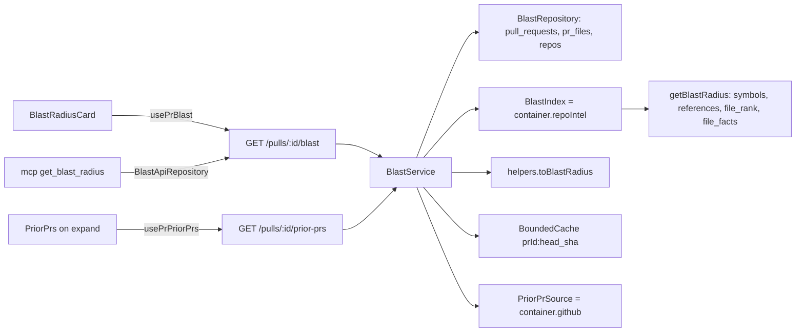

# 0011 — Blast Radius

Status: **blocked on Open questions** — Steps 1–14 are unblocked and can be implemented now; Step 15 (P2 LLM summary) is blocked until the user picks a trigger design.
Citations valid as of `e08a6db` (clean tree).

## Goal

Build a Blast Radius map for a PR. It shows the symbols declared in the changed
files, their callers as `file:line`, and the endpoints and crons that depend on
them. It is served by a new `GET /pulls/:id/blast` route that only reads the
precomputed repo-intel index (no LLM call). The map is rendered as a Blast
radius card on the PR Overview tab. The MCP `get_blast_radius` tool becomes a
real tool that returns the same map. All P1 items, plus P2/P3 except the LLM
summary trigger.

**Acceptance:** all 7 P1 criteria can be demonstrated on the Overview tab and
through MCP for the same PR. The P2/P3 items in *Steps* are built and tested.
`arch:check` stays at 0 errors and at or below the 27-warning baseline.

## Out of scope

- Real 2-hop BFS caller traversal. `BFS_DEPTH` is not used by blast (see
  Context). This is a documented limitation, and it is built only if the user
  asks after plan review.
- Removing the ripgrep fallback inside `getBlastRadius` (see Risks).
- The LLM summary (Step 15) until the user answers the Open question.
- Review, commit, push, PR creation, and writing the PR description. The P2
  item "PR description states which subagent did what" is the caller's job
  when opening the PR.
- New or edited `e2e/specs/*.flow.json` (a follow-up for the user).

## Context

- **INSIGHTS applied:**
  - server 2026-09-20: grep the whole `vendor/shared` barrel before adding an
    export (`PrIntentRecord` collision). `DegradedReason`, `BlastDegradedReason`
    and `BlastSummary` currently have 0 hits in either barrel.
  - server 2026-09-19: `arch:check` baseline is 0 errors / 27 warnings.
  - server 2026-09-22: a route test seeds `pr_files` directly (smart-diff
    precedent).
  - server 2026-09-20: grep `server/test/` too before narrowing a contract
    (`contracts.test.ts:68-104` parses `BlastRadius`).
  - client 2026-09-19 / client AGENTS: import shared contracts as types only,
    and derive runtime lists from a local `Record<Union,…>`.
  - client 2026-09-20: `MonoLink` without `href` renders a `<button>`. A
    missing repo means plain text, not `MonoLink`.
  - client 2026-09-22: mock the exact hook module specifier.
  - mcp 2026-09-26: no `@devdigest/shared` import; hand-type the shapes and
    `safeParse` in the repository.
  - mcp 2026-09-26: the `tools/list` budget is 5,950/6,000 chars, so there are
    about 50 chars of headroom.
  - mcp 2026-09-26: prose lives only in `messages.ts`/`render.ts`; a module's
    `tools.ts` builds its own repository and service.
  - root 2026-09-20: `FEATURE_MODELS` has three copies (only matters for P2
    option 1).
  - repo-intel 2026-09-19: only the persistent blast path is a pure DB read.
- **History:** no prior blast module or reverted blast work
  (`git log --all -i --grep=blast` finds only the MCP stub commits
  `6b0480b`/`f1ea85d`). `getBlastRadius` has zero production callers.
  `run-executor.ts:391,450,473` calls `getCallerSignatures`/`getRepoMap`/
  `getFileRank`, not `getBlastRadius`, so the facade fix cannot affect reviews.
- **Facts verified that correct the course brief:**
  - (a) `MAX_CALLERS_PER_SYMBOL` is at `constants.ts:30`. It is applied as a
    **global** cap: `service.ts:386` runs `callers.slice(0, 20)` after the
    cross-symbol rank sort at `:372`. The ripgrep path (`:260-303`) has no cap.
    Re-capping only in our mapping cannot recover callers the facade already
    dropped, so the fix goes in the facade (Step 4), with a defensive
    per-symbol cap in the mapping as well (Step 5).
  - (b) `BFS_DEPTH` (`constants.ts:49`) *is* used, but only by
    `getCriticalPaths` (`service.ts:686`). Blast is one hop: a single
    `getResolvedCallers` query (`repository.ts:503-531`), or
    `codeIndex.references`. Do not claim "BFS depth 2" for blast.
  - (c) The persistent path does not exclude callers located in the symbol's
    own declaring file. Only the ripgrep path does (`service.ts:273`), and
    `getResolvedCallers` does not select `decl_file`.
  - (d) `getResolvedCallers` inner-joins `file_rank`, so a caller file with no
    rank row is dropped.
  - (e) `BlastCallerRow.viaSymbol` is a bare name, so two changed files
    declaring the same name cannot be told apart.
- **Contract rationale:** `repo-intel/types.ts:15-21` ("DEGRADED CONTRACT
  (lead decision)") says object-returning facade methods carry an inline
  `degraded?`/`reason?`, and that this is a per-call signal separate from the
  repo-level `IndexState.degraded/degradedReason` (`:42-49`). Adding
  `degraded`/`reason` to the wire `BlastRadius` extends that existing
  convention to the API. It is not a new pattern.
- **Assumptions:**
  - The card sits between `IntentCard` and `OverviewTab` (`page.tsx:167-168`).
  - The first 3 symbol rows start expanded and the rest collapsed.
  - The Prior PRs route is named `GET /pulls/:id/prior-prs`, to avoid
    confusion with run history.
  - Caller links use the index's `lastIndexedSha`, falling back to the PR
    `head_sha`.
  - `PrHistoryItem.notes` is `''` (there is no data source for it).
  - Visual layout confirmed directly against the 4 reference screenshots,
    saved to this repo for reuse during implementation and review (the
    planner did not see them; the coordinating session does and re-checked
    Step 10 against them after this plan was drafted):
    - [`docs/images/blast-radius/01-full-page-two-column-overview.png`](../images/blast-radius/01-full-page-two-column-overview.png) — full PR page, shows the two-column Overview layout (Intent+Risk Areas left, Blast Radius right).
    - [`docs/images/blast-radius/02-card-tree-view-detail.png`](../images/blast-radius/02-card-tree-view-detail.png) — close-up, Tree view: stats row, expand/collapse rows, caller list, endpoint/cron chips, Prior PRs footer.
    - [`docs/images/blast-radius/03-card-graph-view-detail.png`](../images/blast-radius/03-card-graph-view-detail.png) — close-up, Graph view: node-link diagram + the 3-item legend.
    - [`docs/images/blast-radius/04-plain-list-fallback-example.png`](../images/blast-radius/04-plain-list-fallback-example.png) — the brief's explicitly-acceptable simpler fallback (plain list, no tree/toggle).
    - **The card is a right-column sibling of Intent/Risk Areas, not a
      single-column insertion.** Image 1 (full page) shows a two-column
      Overview: left column = Intent + Risk Areas stacked, right column =
      Blast Radius, side by side. Today's starter is single-column
      (`IntentCard` then `OverviewTab`, stacked). Step 10 below reflects the
      corrected layout: wrap the existing left-column content and the new
      card in a responsive 2-col grid, collapsing to 1 column on narrow
      viewports.
    - Header: small uppercase "BLAST RADIUS" label with an icon.
    - Stats row: 4 icon+count+label pairs (`</>` symbols, `↳` callers, a
      globe-style icon for endpoints, a clock icon for crons), then
      Tree/Graph toggle buttons top-right.
    - Each symbol row: chevron + `symbolName()` monospace + right-aligned
      "N callers" badge, expand/collapse per row.
    - Caller list: tree-branch connectors (`└`), monospace `file:line`.
    - Two visually DISTINCT chip styles below the caller list per symbol:
      endpoint chips (globe icon, "METHOD /path") in one style, cron chips
      (clock icon) in a different color — not a single mixed chip row.
    - Graph view: left-to-right flow (changed symbol → callers → endpoints),
      with a 3-item color legend at the bottom ("changed symbol" / "callers"
      / "endpoints affected") — Step 10 must render this legend, not just the
      node graph.
    - Footer: "Prior PRs touching these files" + count badge + chevron,
      visually de-emphasized vs. the main card content.
    - Image 4 (a plain, ungrouped list with no tree/toggle) confirms the
      brief's own fallback note — it's permission to ship a simpler layout,
      not a second required design.

## Modules & files

### server
- `server/src/vendor/shared/contracts/brief.ts:52-80`: add
  `BlastDegradedReason`, the `DownstreamImpact.file?/rank?` fields, and
  `BlastRadius.degraded?/reason?/indexed_sha?`. Change `summary` to
  `z.string().nullable()`.
- `server/src/vendor/shared/adapters.ts:143-167`: add 2 read methods to
  `GitHubClient` (server copy only; see Do-not-touch).
- `server/src/adapters/github/octokit.ts`: implement them with
  `withRetry(withTimeout(…))` (pattern at `:36-67`).
- `server/src/adapters/mocks.ts:121-136`: implement them on
  `MockGitHubClient` using configurable options plus call counters.
- `server/src/modules/repo-intel/service.ts:220-391`: return `flag_off` early,
  return `index_partial`/`index_failed` reasons, cap callers per symbol,
  exclude self-file callers.
- `server/src/modules/blast/{ports,constants,helpers,cache,repository,service,routes}.ts`:
  new module.
- `server/src/modules/index.ts:9-37`: register `blast`.
- `server/test/{blast-helpers,blast-service}.test.ts`,
  `server/test/blast-route.it.test.ts`: new tests.
  `server/test/repo-intel-facade-degraded.test.ts` and
  `server/test/contracts.test.ts`: extend.

### client
- `client/src/vendor/shared/contracts/brief.ts`: byte-identical mirror of the
  server edit.
- `client/messages/en/blast.json`: new keys (Step 8).
- `client/src/lib/hooks/blast.ts` (new) and `client/src/lib/hooks/index.ts:13`
  (add to the barrel).
- `client/src/app/repos/[repoId]/pulls/[number]/_components/BlastRadiusCard/**`
  (new), plus `page.tsx:165-170` (mount it).

### mcp
- `mcp/src/modules/blast/{ports,repository,service,helpers,render,tools}.ts`
  (new). `mcp/src/modules/repo-intel/tools.ts`: delete.
- `mcp/src/modules/index.ts:6,20`, `mcp/src/modules/_shared/messages.ts:141-143`,
  `mcp/test/architecture.test.ts:125`, `mcp/test/tools.test.ts:150-158`, and
  new `mcp/test/blast-*.test.ts`.

### docs
- `mcp/AGENTS.md:71,150-151` and
  `.claude/skills/onion-architecture/references/mcp-package.md` ("Modules:"
  line): the stub becomes the `blast/` module.

## Component map

| Module | Component | Status | Layer | Path | Depends on | Step |
|---|---|---|---|---|---|---|
| server | `BlastRadius`, `DownstreamImpact`, `BlastDegradedReason` | changed/new | contract | `server/src/vendor/shared/contracts/brief.ts` | zod | 1 |
| server | `PrHistory` | reused | contract | same file `:128-142` | — | 5 |
| server | `GitHubClient` port | changed | port | `server/src/vendor/shared/adapters.ts` | — | 3 |
| server | `OctokitGitHubClient` | changed | adapter | `server/src/adapters/github/octokit.ts` | octokit, `resilience.ts` | 3 |
| server | `MockGitHubClient` | changed | adapter (test double) | `server/src/adapters/mocks.ts` | port | 3 |
| server | `RepoIntelService.getBlastRadius` | changed | service (facade) | `server/src/modules/repo-intel/service.ts` | `RepoIntelRepository` | 4 |
| server | `BlastResult` / `DegradedReason` | reused | domain | `server/src/modules/repo-intel/types.ts:27-87` | — | 5 |
| server | `BlastStore`, `BlastIndex`, `PriorPrSource`, `PriorPrCache` | new | port | `server/src/modules/blast/ports.ts` | repo-intel `types.ts` | 5 |
| server | prior-PR caps | new | domain | `server/src/modules/blast/constants.ts` | — | 5 |
| server | `toBlastRadius`, `mergePriorPrs`, `pickHistoryFiles` | new | domain | `server/src/modules/blast/helpers.ts` | repo-intel `constants.ts` | 5 |
| server | `BoundedCache` | new | service-support | `server/src/modules/blast/cache.ts` | — | 5 |
| server | `BlastRepository` | new | repository | `server/src/modules/blast/repository.ts` | drizzle, `db/schema` | 5 |
| server | `BlastService` | new | service | `server/src/modules/blast/service.ts` | ports, helpers | 5 |
| server | blast routes | new | route | `server/src/modules/blast/routes.ts` | service, `container.repoIntel`, `container.github()` | 5 |
| server | blast tests | new | test | `server/test/blast-*.ts` | — | 6 |
| client | `BlastRadius`/`PrHistory` mirror | changed | contract | `client/src/vendor/shared/contracts/brief.ts` | — | 2 |
| client | `usePrBlast`, `usePrPriorPrs` | new | hook | `client/src/lib/hooks/blast.ts` | `lib/api` | 9 |
| client | `useRepoIntelStatus`, `useResyncRepoIntel` | reused (first consumer) | hook | `client/src/lib/hooks/repo-intel.ts:31-49` | — | 10 |
| client | `BlastRadiusCard` | new | `_components` | `…/_components/BlastRadiusCard/BlastRadiusCard.tsx` | hooks, children | 10 |
| client | `BlastSummary`, `DegradedNotice`, `SymbolTree`/`SymbolRow`, `BlastGraph`, `PriorPrs` | new | `_components` | `…/BlastRadiusCard/_components/<Name>/` | `MermaidDiagram`, `githubBlobUrl` | 10 |
| client | `MermaidDiagram` | reused | cross-route component | `client/src/components/mermaid-diagram/MermaidDiagram.tsx` | mermaid | 10 |
| client | PR detail page | changed | page | `client/src/app/repos/[repoId]/pulls/[number]/page.tsx` | `BlastRadiusCard` | 10 |
| client | card tests | new | test | `…/BlastRadiusCard/**.test.tsx`, `helpers.test.ts` | — | 11 |
| mcp | `BlastRadiusRecord`, `BlastStore` | new | port | `mcp/src/modules/blast/ports.ts` | — | 12 |
| mcp | `BlastApiRepository` | new | repository | `mcp/src/modules/blast/repository.ts` | `DevDigestApiClient` | 12 |
| mcp | `BlastService` | new | service | `mcp/src/modules/blast/service.ts` | `Resolver` | 12 |
| mcp | `get_blast_radius` tool | changed (stub → real) | presentation | `mcp/src/modules/blast/tools.ts` | service, render, messages | 12 |
| mcp | mcp tests | new/changed | test | `mcp/test/blast-*.test.ts`, `tools.test.ts`, `architecture.test.ts` | — | 13 |

## Diagrams

Target request path. Both clients share one route and one mapping.



## Steps

1. **Contract: server `brief.ts`** (module: server; depends on: —)
   - Change: grep both barrels for every new name first (`BlastDegradedReason`
     confirmed 0 hits). Replace the current `// ---- Blast radius ----`
     section (lines 52-80) with the block below **verbatim** — this exact
     text is also what Step 2 applies to the client copy, so the two files
     match by construction, not by re-derivation:
     ```ts
     // ---- Blast radius ----
     export const ChangedSymbol = z.object({
       name: z.string(),
       file: z.string(),
       kind: z.string(),
     });
     export type ChangedSymbol = z.infer<typeof ChangedSymbol>;

     export const BlastCaller = z.object({
       name: z.string(),
       file: z.string(),
       line: z.number().int(),
     });
     export type BlastCaller = z.infer<typeof BlastCaller>;

     /** Mirrors repo-intel's `DegradedReason` (repo-intel/types.ts:27-32) —
      *  extends the wire contract to carry the per-call degraded signal the
      *  facade already produces internally (repo-intel/types.ts:15-21,
      *  "DEGRADED CONTRACT"). */
     export const BlastDegradedReason = z.enum([
       'flag_off',
       'index_failed',
       'index_partial',
       'repo_too_large',
       'no_data',
     ]);
     export type BlastDegradedReason = z.infer<typeof BlastDegradedReason>;

     export const DownstreamImpact = z.object({
       symbol: z.string(),
       /** The symbol's own declaring file, so a caller in the same file can
        *  be told apart from a real external caller. */
       file: z.string().optional(),
       callers: z.array(BlastCaller),
       endpoints_affected: z.array(z.string()),
       crons_affected: z.array(z.string()),
       /** Highest caller rank for this symbol, for sort/emphasis. */
       rank: z.number().optional(),
     });
     export type DownstreamImpact = z.infer<typeof DownstreamImpact>;

     export const BlastRadius = z.object({
       changed_symbols: z.array(ChangedSymbol),
       downstream: z.array(DownstreamImpact),
       /** Deterministic count string on the read path; only ever
        *  LLM-authored text if/when the P2 summary trigger (Step 15) is
        *  built. Nullable so the deterministic path can omit it. */
       summary: z.string().nullable(),
       /** True when this specific call fell back to a non-persistent path. */
       degraded: z.boolean().optional(),
       reason: BlastDegradedReason.optional(),
       /** The repo-intel index's `lastIndexedSha` at the time of this read,
        *  for an accurate GitHub blob link (falls back to the PR's
        *  head_sha client-side when absent). */
       indexed_sha: z.string().nullable().optional(),
     });
     export type BlastRadius = z.infer<typeof BlastRadius>;
     ```
     - Add a `contracts.test.ts` case: a degraded payload with `summary: null`
       parses, and an unknown `reason` fails. The existing fixture at
       `:73-86` must still parse unchanged.
   - Files: `server/src/vendor/shared/contracts/brief.ts`,
     `server/test/contracts.test.ts`
   - Skills: `zod`, `onion-architecture`
   - Verify: `pnpm vitest run test/contracts.test.ts && pnpm typecheck` in
     `server/`

2. **Contract mirror: client `brief.ts`** (module: client; depends on: 1)
   - Change: apply the **exact same block** from Step 1, verbatim, to the
     client copy — don't re-derive it from the field list, copy the literal
     text so the two files can only ever match. Then confirm
     `diff server/src/vendor/shared/contracts/brief.ts client/src/vendor/shared/contracts/brief.ts`
     prints nothing.
   - Files: `client/src/vendor/shared/contracts/brief.ts`
   - Skills: `zod`
   - Verify: `pnpm typecheck` in `client/`

3. **GitHub port and adapter for prior PRs** (module: server; depends on: —)
   - Change:
     - Add two methods to `GitHubClient`:
       - `listCommitShasForPath(repo, path, limit): Promise<string[]>` maps
         to `octokit.rest.repos.listCommits({path, per_page: limit})`. With no
         `sha`, it runs against the default branch.
       - `listPullsForCommit(repo, sha): Promise<{number,title,author,merged_at: string|null}[]>`
         maps to `octokit.rest.repos.listPullRequestsAssociatedWithCommit`.
         Both method names are verified in
         `@octokit/plugin-rest-endpoint-methods`.
     - Wrap both in `withRetry(withTimeout(…, TIMEOUT))`.
     - `MockGitHubClient` gets `commitsByPath`/`pullsBySha` options and public
       call counters.
     - The token only reaches Octokit. Never log paths with a token, and
       never log response bodies.
   - Files: `server/src/vendor/shared/adapters.ts`,
     `server/src/adapters/github/octokit.ts`, `server/src/adapters/mocks.ts`
   - Skills: `onion-architecture`, `security`
   - Verify: `pnpm typecheck && pnpm arch:check` in `server/`

4. **Repo-intel facade fix** (module: server; depends on: —)
   - Change in `getBlastRadius`/`tryPersistentBlast`:
     - (a) Return `{…empty, degraded:true, reason:'flag_off'}` first when
       `!config.repoIntelEnabled`, mirroring `getRepoMap` `:406-407`. This
       path does not run the ripgrep fallback.
     - (b) When `state.status==='partial'`, every persistent return
       (`:338`, `:384-390`) carries `degraded:true, reason:'index_partial'`,
       and the data is still returned.
     - (c) Additive, same step: when the state is `'failed'`, the fallback
       result carries `reason:'index_failed'` instead of `no_data`.
     - (d) Drop resolved callers whose `fromPath` is a file that declares a
       symbol of that name (built from `declRows`), before capping.
     - (e) Replace the global `slice` at `:386` with the top
       `MAX_CALLERS_PER_SYMBOL` per `viaSymbol` after the rank sort.
     - Do not change `BlastResult` in `types.ts`.
   - Tests to add to `repo-intel-facade-degraded.test.ts`: flag off gives
     exactly `flag_off`; a partial state gives `degraded:true,
     reason:'index_partial'` with callers present; a failed state gives
     `index_failed`; 25 callers on each of 2 symbols gives 20 each; a
     same-file reference is excluded. The partial-state stubs need
     `getSymbolRows`, `getResolvedCallers` and `getFileFacts` added to the
     patched `repo` at `:33-39`.
   - Files: `server/src/modules/repo-intel/service.ts`,
     `server/test/repo-intel-facade-degraded.test.ts`
   - Skills: `onion-architecture`
   - Verify:
     `pnpm vitest run test/repo-intel-facade-degraded.test.ts test/repo-intel-rank-map.test.ts`
     in `server/`

5. **Server `blast` module** (module: server; depends on: 1, 3, 4)
   - Change: model it on `conventions/` (`routes.ts:28-60`, which wires ports
     from the container; `ports.ts`; a service with a `…ServiceDeps` type).
     - `ports.ts`:
       - `BlastStore` with `findPull(ws, prId)→{id,repoId,number,headSha}`,
         `listChangedFiles(prId)→{path,additions,deletions}[]` and
         `findRepo(ws, repoId)→{owner,name}`.
       - `BlastIndex` with `getBlastRadius(repoId, files)→BlastResult`
         (`import type` from `../repo-intel/types.js`) and
         `getIndexedSha(repoId)→string|null`.
       - `PriorPrSource` with the two Step-3 methods, and `PriorPrCache` with
         get/set.
     - `constants.ts`: `PRIOR_PR_MAX_FILES=10`,
       `PRIOR_PR_COMMITS_PER_FILE=3`, `PRIOR_PR_MAX_RESULTS=5`,
       `PRIOR_PR_CONCURRENCY=4`, `PRIOR_PR_CACHE_MAX_ENTRIES=200`.
     - `helpers.ts` (pure):
       - `toBlastRadius(result, indexedSha, maxPerSymbol = MAX_CALLERS_PER_SYMBOL)`
         imports the constant from `../repo-intel/constants.js`. It emits one
         `DownstreamImpact` per changed symbol, including symbols with 0
         callers, and does the following:
         - attribute callers by `viaSymbol`;
         - drop callers in the symbol's own `file`;
         - sort callers by rank desc, then file and line;
         - cap per symbol;
         - build `endpoints_affected`/`crons_affected` as the sorted, deduped
           union of `factsByFile[callerFile]`;
         - set `rank` to the max caller rank;
         - sort downstream by rank desc, then caller count desc, then name;
         - pass `degraded`/`reason` through;
         - set `summary: null` and `indexed_sha`.
       - `pickHistoryFiles(files)`: top N by additions+deletions.
       - `mergePriorPrs(perSha, currentNumber)`: keep only merged PRs, drop
         the current PR, build `files_overlap`, sort by overlap desc then
         `merged_at` desc, cap at 5, and set `notes:''`.
     - `cache.ts`: an insertion-order-evicting `Map` wrapper.
     - `repository.ts`: Drizzle queries scoped by workspace. For `pr_files`,
       select only `path/additions/deletions`.
     - `service.ts`:
       - `getBlastRadius(ws, prId, logger)` throws `NotFoundError` for an
         unknown PR. It logs counts, `degraded`, `reason` and `source`:
         `precomputed_index` when not degraded or when the reason is
         `index_partial`, `none` for `flag_off`, otherwise `fallback`. The
         message says "read precomputed repo-intel index". Never log code or
         paths beyond counts.
       - `getPriorPrs(ws, prId, logger)` uses the cache key
         `${prId}:${headSha}`. It fetches commits per file, dedupes SHAs, and
         fetches pulls per SHA with a concurrency limit of 4. A per-call
         failure is skipped and counted; if every call fails, it throws
         `ExternalServiceError`. A missing token surfaces as the container's
         `ConfigError` (`container.ts:156-157`).
     - `routes.ts`:
       - `GET /pulls/:id/blast` with
         `schema:{params: IdParams, response:{200: BlastRadius}}` (the
         smart-diff precedent, `reviews/routes.ts:190-197`) and no route rate
         limit.
       - `GET /pulls/:id/prior-prs` with `response:{200: PrHistory}` and
         `config.rateLimit {max:10,timeWindow:'1 minute'}` (the `:166-168`
         precedent).
       - Build the `BlastIndex` from `container.repoIntel.getBlastRadius` and
         `getIndexState(...).lastIndexedSha || null`.
       - Build the `PriorPrSource` lazily from `await container.github()`.
       - Construct one `BoundedCache` per plugin.
     - Register the module in `modules/index.ts`.
   - Files: `server/src/modules/blast/*.ts`, `server/src/modules/index.ts`
   - Skills: `onion-architecture`, `fastify-best-practices`,
     `drizzle-orm-patterns`, `zod`, `security`
   - Verify: `pnpm typecheck && pnpm arch:check` in `server/` (0 errors, 27
     warnings or fewer)

6. **Server tests** (module: server; depends on: 5; may go to `test-writer`)
   - Change:
     - `blast-helpers.test.ts` is the P2 flat-to-grouped mapping test. It
       covers grouping, self-file exclusion, per-symbol cap via the imported
       constant, endpoint/cron attribution, rank ordering, zero-caller
       symbols, and degraded passthrough.
     - `blast-service.test.ts` uses fake ports. It covers 404; file and
       commit caps respected (count calls); SHA dedupe; cache hit on the same
       `head_sha` and miss on a new one; current PR excluded; partial GitHub
       failure tolerated; all-fail gives `ExternalServiceError`.
     - `blast-route.it.test.ts` follows `smart-diff-route.it.test.ts:1-102`.
       Seed `pr_files`; use
       `buildApp({overrides:{repoIntel: fake, github: new MockGitHubClient(…)}})`.
       Assert:
       - `BlastRadius.parse` passes;
       - the changed paths reached the fake;
       - `degraded:'index_partial'` survives to the response;
       - an unknown PR gives 404 on both routes;
       - `PrHistory.parse` passes;
       - a second prior-prs call makes 0 new mock calls.
   - Files: `server/test/blast-helpers.test.ts`,
     `server/test/blast-service.test.ts`, `server/test/blast-route.it.test.ts`
   - Skills: `onion-architecture`
   - Verify:
     `pnpm vitest run test/blast-helpers.test.ts test/blast-service.test.ts test/blast-route.it.test.ts`
     in `server/`. Check that the skipped count is 0, since Docker is
     required.

7. **Docs for the stub-to-real change** (module: docs; depends on: 12)
   - Change: update the lines that describe `get_blast_radius` as a stub and
     the `repo-intel` MCP module.
   - Files: `mcp/AGENTS.md`,
     `.claude/skills/onion-architecture/references/mcp-package.md`
   - Skills: `onion-architecture`
   - Verify: `grep -n "stub" mcp/AGENTS.md` finds no blast-related hit

8. **i18n** (module: client; depends on: —)
   - Change: keep the existing 10 keys. Add:
     - `title` (use a fresh key in the `blast` namespace; do not borrow
       `brief.block.blast`, which belongs to the future PrBrief namespace),
       `loading`, `error`;
     - `noSymbols`, and `noCallers` ("No callers found in the indexed code;
       nothing else references this symbol.");
     - `endpoints`, `crons`, `expand`, `collapse`;
     - `degraded.title`,
       `degraded.reason.{flag_off,index_failed,index_partial,repo_too_large,no_data}`,
       `degraded.resync`, `degraded.resyncing`, `degraded.resyncStarted`;
     - `graph.truncated`;
     - `priorPrs.{title,expand,collapse,loading,error,none,overlap}`.
   - Files: `client/messages/en/blast.json`
   - Skills: `frontend-ui-architecture`
   - Verify: `pnpm typecheck` in `client/`

9. **Hooks** (module: client; depends on: 2)
   - Change:
     - `usePrBlast(prId)`: key `["pr-blast", prId]`, following the
       `smart-diff.ts:11-17` pattern.
     - `usePrPriorPrs(prId, open)`: `enabled: !!prId && open`,
       `staleTime: Infinity`, `refetchOnWindowFocus: false`. This means zero
       requests until the section is expanded, and no silent refetch.
     - Add the file to the barrel.
   - Files: `client/src/lib/hooks/blast.ts`, `client/src/lib/hooks/index.ts`
   - Skills: `react-best-practices`, `frontend-ui-architecture`
   - Verify: `pnpm typecheck` in `client/`

10. **`BlastRadiusCard` and its children, then mount it** (module: client;
    depends on: 8, 9)
    - Change: follow the `IntentCard`/`RiskAreas` precedent (`Card` +
      `SectionLabel`; per-row open state as a `Set<string>` of keys,
      `RiskAreas.tsx:27-81`). Styles go in `styles.ts` as inline tokens,
      matching the project, not Tailwind.
      - **Layout (corrected against the reference screenshots — see
        Assumptions):** the design shows a two-column Overview, not a
        single stacked column. Wrap the tab's content in a responsive grid:
        left column = the existing `IntentCard` (Intent + Risk Areas)
        unchanged; right column = the new `BlastRadiusCard`. Collapse to one
        column (Blast Radius below Intent) on narrow viewports. This is a
        `page.tsx` layout change, not just inserting a new child — check the
        project's existing grid/breakpoint convention (e.g. an existing
        2-column layout elsewhere in `client/src`) before inventing new CSS.
      - **Card:** handles loading, error and empty states with early
        returns. It holds the Tree/Graph toggle state; the toggle goes in
        the header at top right with keys `view.tree`/`view.graph`.
      - **`BlastSummary`:** icon plus count chips for symbols, callers,
        endpoints and crons. Crons are a separate chip group. Counts come
        from `helpers.blastTotals`, derived during render and not stored.
      - **`DegradedNotice`:** shown when `degraded`. It uses `role="status"`
        and the reason text from a local `Record<BlastDegradedReason, key>`.
        The resync button uses `useResyncRepoIntel(repoId)` and appears only
        for `index_failed`, `index_partial` and `no_data` (a
        `RESYNC_HELPS` record). After a click it polls
        `useRepoIntelStatus(repoId, true)` until `updatedAt` advances, then
        invalidates `["pr-blast", prId]`.
      - **`SymbolTree`/`SymbolRow`:** a chevron `IconBtn` with an aria-label.
        Each row shows its callers as
        `githubBlobUrl(repo, indexed_sha ?? headSha, file, line)` in a
        `MonoLink`, or a plain mono span when `repoFullName` is null. Below
        the callers are endpoint and cron chips (styled differently). A
        symbol with no callers shows `noCallers`. Server order is kept
        (sorted by rank).
      - **`BlastGraph`:** `helpers.buildBlastMermaid` produces `flowchart LR`
        with synthetic node ids `n0…`, left-to-right (changed symbol →
        callers → endpoints), matching the reference screenshot's flow
        direction. Labels are escaped: `"` becomes `#quot;`, and
        `` <>[]{}()| `` are stripped. The number of nodes is capped by
        `GRAPH_MAX_NODES` in `constants.ts`, with a `graph.truncated` note.
        The graph is wrapped in `role="img" aria-label={t("graph.ariaLabel")}`.
        Below the diagram, render a small 3-item legend ("changed symbol" /
        "callers" / "endpoints affected") with a colored marker per item,
        matching the reference — add its 3 labels to `blast.json`
        (`graph.legend.{changedSymbol,callers,endpoints}`).
      - **`PriorPrs`:** a collapsed footer that fetches only when opened.
      - **Page:**
        `<BlastRadiusCard prId repoId headSha={pr.head_sha} repoFullName />`
        goes after `IntentCard`.
    - Files:
      `…/_components/BlastRadiusCard/{BlastRadiusCard.tsx,helpers.ts,constants.ts,styles.ts,index.ts,_components/*}`,
      `page.tsx`
    - Skills: `frontend-ui-architecture`, `react-best-practices`,
      `next-best-practices`, `security`
    - Verify: `pnpm typecheck` in `client/`. Load `/repos/<id>/pulls/<n>` in
      `pnpm dev`; if you cannot, record it under Not verified.

11. **Client tests** (module: client; depends on: 10; may go to
    `test-writer`)
    - Change:
      - `BlastRadiusCard.test.tsx` mocks `@/lib/hooks`. It covers: summary
        counts; callers under their symbol with the exact GitHub `#L` href;
        the `noCallers` text; the degraded notice with its reason, and
        resync shown or hidden by reason; the Tree/Graph toggle; a null repo
        giving no link role.
      - `PriorPrs.test.tsx`: no fetch before expanding, fetch after.
      - `helpers.test.ts`: totals, and mermaid escaping with a hostile symbol
        name.
    - Files: the files above
    - Skills: `react-testing-library`
    - Verify:
      `pnpm vitest run "src/app/repos/[repoId]/pulls/[number]/_components/BlastRadiusCard"`
      in `client/`

12. **MCP `blast` module** (module: mcp; depends on: 5)
    - Change:
      - Delete `modules/repo-intel/tools.ts`.
      - `ports.ts`: hand-typed `BlastRadiusRecord` covering every Step-1
        field, including `degraded?` and `reason?` as a 5-literal union.
      - `repository.ts`: `GET /pulls/${prId}/blast` with a zod schema and
        `parseObject`.
      - `service.ts`: `BlastService({store, resolver})` calls `resolveRepo`
        then `resolvePr`. On an `ApiFailure` 404 it calls `invalidatePr` and
        rethrows (`reviews/service.ts:102-110`).
      - `helpers.ts`: totals.
      - `render.ts`: a totals line, then per symbol `name (file)` followed by
        `← caller file:line` lines and `endpoints:`/`crons:` lines.
      - `messages.ts`: remove `blastRadiusStubMessage`; add degraded-reason
        texts and a "no callers" text.
      - `tools.ts` (`registerBlastTools(server, container)`):
        - text-only content, with **no `outputSchema`** because of the
          budget;
        - a description of about 140 chars or fewer that includes when to
          call it;
        - args `{repo, pr}` from `_shared/schemas`;
        - `annotations {readOnlyHint:true, idempotentHint:true}`;
        - errors go through `toToolResult(err,{tool:'get_blast_radius',repo,pr})`,
          so an unknown PR gives the `PrNotFound` text.
      - `index.ts`: register the module with the container.
    - Files: `mcp/src/modules/blast/*`, `mcp/src/modules/index.ts`,
      `mcp/src/modules/_shared/messages.ts`
    - Skills: `onion-architecture`, `zod`
    - Verify: `npm run typecheck` in `mcp/`

13. **MCP tests** (module: mcp; depends on: 12)
    - Change:
      - `architecture.test.ts:125`: replace `'repo-intel'` with `'blast'`.
      - `tools.test.ts`: replace the stub test (`:150-158`) with a real call.
        The `FakeApiClient` routes `/pulls/${PR.id}/blast`; assert the
        rendered caller `file:line`, the degraded text, and an unknown PR
        giving `isError`. Keep the annotations assertion at `:133`.
      - New `blast-service.test.ts`, `blast-render.test.ts`, and a repository
        case in `repositories.test.ts`.
      - Read the printed `tools/list serialized size`; it must be 6,000 or
        less.
    - Files: the files above
    - Skills: `onion-architecture`
    - Verify: `npm test && npm run typecheck` in `mcp/`

14. **Whole-task regression** (all modules; depends on: 1–13)
    - Verify: the *Verification* section below.

15. **P2 LLM summary: BLOCKED until the Open question is answered** (module:
    server + client, possibly the 3 `FEATURE_MODELS` copies; depends on: 5,
    10)
    - Change: implement only the option the user picks. Until then `summary`
      stays `null` and there is no summary UI.
    - Skills: to be decided by the option (`onion-architecture`,
      `fastify-best-practices`, `zod`, `drizzle-orm-patterns` if option 4)

## Skills for implementer

| Step | Skill | Rule from the skill that governs this step |
|---|---|---|
| 1, 2, 5, 12 | `zod` | `type-export-schemas-and-types`: schema and inferred type share one name. `object-optional-vs-nullable`: `summary` is required-nullable, and the new fields are optional because they are additive. |
| 3, 4, 5, 6, 7, 12, 13 | `onion-architecture` | Cross-module access only through the container or through B's `types.ts`/`constants.ts`/`ports.ts` (`layers-and-dependency-rule.md:44-47`). A route builds its service from the container. mcp `tools.ts` imports the container as a type only, and only `messages.ts`/`render.ts` hold prose. A new external capability means a port, an adapter and a mock. |
| 5 | `fastify-best-practices` | Schema-first: a params schema plus a `response` 200 schema so serialization validates the contract. |
| 5 | `drizzle-orm-patterns` | Queries only in `repository.ts`, scoped by `workspaceId`, and select only the columns needed. |
| 3, 5, 10 | `security` | Deny by default: prior-prs is rate-limited and GitHub calls are capped. The token never reaches logs or the client. No `dangerouslySetInnerHTML`; mermaid output stays at `securityLevel:'strict'` and labels are escaped. |
| 8, 9, 10 | `frontend-ui-architecture` | Colocate: children in `BlastRadiusCard/_components/<Name>/`, user text in i18n files and never in `constants.ts`, one hook per resource file. |
| 9, 10 | `react-best-practices` | Derive, don't store (counts and mermaid string computed in render). Data fetching only in hooks. Stable keys (`file:symbol`), never an index. Icon-only buttons get an `aria-label`. |
| 10 | `next-best-practices` | Client component under `app/**` (`"use client"`), with type-only imports of shared contracts. |
| 11 | `react-testing-library` | Mock at the boundary (hooks module), assert on roles and accessible names, and prefer fewer, longer user-flow tests. |

## Architecture constraints

- `blast/` must not import repo-intel's `service`/`repository`/`routes`, nor
  reviews' `repository` (that is why it has its own `BlastRepository`).
  `arch:check` enforces `no-cross-module-internals` as an error.
- `blast/helpers.ts` and `constants.ts` stay pure, with no Drizzle, adapters
  or container (`pure-module-files-no-io`).
- The client imports `BlastRadius`/`PrHistory`/`BlastDegradedReason` with
  `import type` only.
- `mcp/` has no `@devdigest/shared` import and no `adapters/` import from
  `tools.ts`. `new BlastService`/`new BlastApiRepository` appear only in
  `blast/tools.ts`.
- Server tests go in `server/test/`, and DB-backed ones are named
  `*.it.test.ts`. Client tests are colocated.
- No migration. `pr_brief` (`schema/reviews.ts:66-71`) has no sha column and
  stores a composed `PrBrief` for a future lesson, so it does not fit a
  head_sha-keyed history cache. An in-memory cache is used instead.

## Do-not-touch that this task hits

- `server/src/vendor/shared/contracts/brief.ts` and the client mirror: edit
  both deliberately (Steps 1–2), then diff.
- `server/src/vendor/shared/adapters.ts`: edit the server copy only. The
  client copy already deliberately lacks server-only `GitHubClient` members
  (`commitFiles`, `findOpenPr`), and the client never implements
  `GitHubClient`. Record this in the report.
- Lock files: no new dependency (mermaid, octokit and p-queue are already
  installed). Use the package manager of each package: pnpm for
  server/client, npm for mcp.

## Verification (whole task)

- `server`: `pnpm test` passes with 0 skipped `.it` files. `pnpm typecheck`
  is clean. `pnpm arch:check` shows 0 errors and 27 warnings or fewer.
- `client`: `pnpm test` passes and `pnpm typecheck` is clean. Manually load a
  PR's Overview tab for an indexed repo and for an unindexed repo (degraded
  notice), click a caller link, and expand Prior PRs.
- `mcp`: `npm test` passes, including `architecture.test.ts`, with
  `tools/list` at 6,000 chars or less. `npm run typecheck` is clean.
- Cross-check: for one PR, compare `get_blast_radius` output with the card
  (the same symbols, callers, endpoints and crons).

## Risks

- **MCP budget.** Only about 50 chars of headroom. The default is text-only
  with a short description. If it still exceeds 6,000, stop and ask; never
  raise the cap in `tools.test.ts` without the user.
- **Ripgrep fallback.** It still runs for a flag-on repo with no or failed
  index, and it reads the clone. That breaks "never re-parses" for unindexed
  repos, but it is labelled `degraded`/`fallback` in logs and UI. Removing it
  is a small follow-up if the user wants strict purity.
- **Same-name changed symbols** in two files share callers (`viaSymbol` is a
  name). The mapping attributes those callers to both symbols minus each
  symbol's own file. This is a documented limitation.
- **Endpoints and crons** come from caller files only. Routes declared *in* a
  changed file are not counted, and on the fallback path per-symbol endpoints
  are empty.
- **Link accuracy.** `indexed_sha` is the default-branch index commit. It may
  not be pushed, or it may lag the PR; the link falls back to `head_sha`.
- **GitHub budget.** The worst case per uncached expand is 10 list-commits +
  30 PR lookups = 40 requests. Only 429/5xx are retried, 3 times
  (`resilience.ts:35-47`), so the absolute worst is 160 requests, about 3% of
  5,000/hr. The server cache per `head_sha` makes repeats free, and the
  route limit is 10/min.
- **Shared DB/worktree.** Re-read files and the index state right before
  verification.

## Open questions

- **P2 LLM summary trigger (needs the user's explicit choice; Step 15 is
  blocked until then. The planner is not picking).** Options:
  1. **Separate opt-in POST**, mirroring `/pulls/:id/intent/derive`
     (`reviews/routes.ts:166-173`). The deterministic `GET /pulls/:id/blast`
     stays as is, and the client calls `POST /pulls/:id/blast/summary` on a
     button click, returning `{summary, cost_usd, model, provider}`. It needs
     a new `FEATURE_MODELS` entry in all 3 hand-synced copies: server vendor
     `platform.ts`, the full duplicate in the client vendored `platform.ts`,
     and the `client/src/lib/feature-models.ts` runtime copy. About 4–5h.
  2. **Defer P2 entirely.** `summary` becomes a deterministic count string
     ("14 callers, 3 endpoints…") with no LLM call anywhere. About 30 min,
     and legitimate because P2 does not block acceptance. Caveat: a
     server-built string is English prose that bypasses client i18n, whereas
     the card already renders its counts line from `blast.json`.
  3. **Query param on the GET** (`?summarize=true`). One route, but a client
     data-fetching cache could silently retry or refetch and spend money
     again on a GET.
  4. **Always on, cached by head_sha, tracked in `agent_runs`.** Every first
     view of every PR spends money automatically. Biggest lift, about 6–8h.
     `agent_runs` (`schema/runs.ts:8-45`) has no run-kind column. `agentId`
     is nullable, but a row with `prId` would appear in the PR run timeline
     (`listRunsForPull`), so a migration or a filter is probably needed.
  - Default if unanswered: nothing is built for Step 15. `summary` stays
    `null`, and every P1 criterion and the other P2/P3 items still pass.

## Could not establish

- **`structuredContent` without `outputSchema` in MCP SDK 2.0.** Not
  verified whether it is allowed. The plan avoids it and uses text only.
- **Whether `lastIndexedSha` commits are always on GitHub** (the repo is
  resynced from origin, but a local-only commit was not ruled out).

## Insight candidates

- repo-intel: `tryPersistentBlast` applied `MAX_CALLERS_PER_SYMBOL` globally
  (`service.ts:386`) and did not exclude same-file callers. `BFS_DEPTH` is
  used only by `getCriticalPaths`, so blast is one hop. (Append after Step 4
  lands.)
- mcp: adding a real tool with an `outputSchema` does not fit the 6,000-char
  `tools/list` budget at 5,950. New tools need to be text-only or to trim
  other tools.
