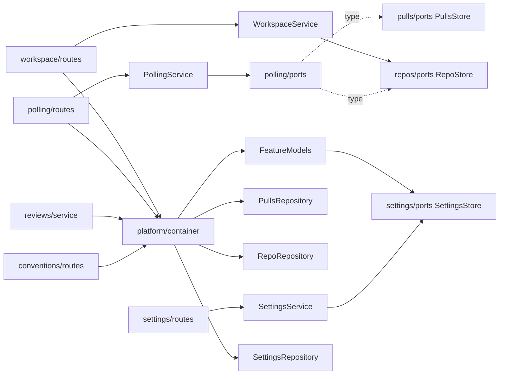

# 0013 — Backend layering and transactions (refactor phases 1 + 2)

**Status:** ready (awaiting user approval) · **Citations valid as of:** `860d701`
**Origin:** whole-backend architecture audit + dead-code investigation, 2026-09-28. User-approved
scope: Phase 1 (layering) + Phase 2 (atomic multi-writes) + delete `GET /agents/:id/models`.

## Goal
Pay down the server's layering debt (polling, workspace, settings, feature-models, repos row types,
`parseUnifiedDiff` placement) and make four multi-write paths atomic (review persistence,
`replaceDetail`, repo-intel full + incremental symbol replace), with **no route changing its path,
request or response shape** — except the deletion of `GET /agents/:id/models`.

**Done when:**
- `POST /repos/:id/poll` persists `opened_at` (and backfills it on NULL rows).
- A mid-way findings insert failure leaves no `reviews` row, no findings, `last_reviewed_sha`
  unchanged and the run still `running`.
- A mid-way `replaceDetail` failure leaves the old files/commits/body.
- A mid-way repo-intel replace failure leaves the old symbols.
- `routes.ts` in `polling`/`workspace`/`settings` has no Drizzle import.
- `cd server && pnpm arch:check` → **0 errors / 15 warnings**, with `routes-no-persistence` and
  `pure-module-files-no-io` promoted to `error`.
- Full `server` suite green with **0 skipped** files; `tsc` clean.

## Out of scope
- Phase 3 repo-intel restructure: `service ↔ container` cycles, `pipeline/*` → `adapters/*`
  imports, file split, the duplicated post-parse tail (`full.ts:215-247` vs
  `incremental.ts:217-235` — not needed for the transaction, deferred), the T3
  `replaceEdges`/`replaceFileRank`/`replaceFileFacts` non-atomicity and the `filesIndexed`
  double-count (repo-intel INSIGHTS Open Questions).
- Phase 4 reviews ports: `ReviewService`/`ReviewRunExecutor` taking `Container`, the
  `run-executor.ts`/`diff-loader.ts` → `db/schema` warnings.
- The `reviews`/`findings` index gap and any DB migration.
- Anything under `server/src/vendor/shared/**`, `client/**`, `mcp/**`, `e2e/specs/*.flow.json`,
  any lock file.
- Moving `saveRunTrace` into the review transaction (trace ordering unchanged, see Step 13).
- Editing `.claude/skills/**` docs (see Risks — follow-up for `doc-writer`).
- Review, commit, push, `/pr-self-review`.

## Context
- **INSIGHTS applied**
  - `server/INSIGHTS.md` 2026-09-28: poll route is a drifted copy of `upsertFromGitHub`;
    `opened_at` stays NULL forever — item 1.
  - 2026-09-28: 3 `not-to-unresolvable` errors = `reviewer-core/node_modules` absent; real
    baseline 0 errors / 26 warnings.
  - 2026-09-19 Transactions: a repository method may own its `db.transaction`; `replaceDetail`
    named as the first unwrapped case.
  - 2026-09-19 Layering: rising warning count = new debt.
  - 2026-09-20 `src/lib/` is the neutral home for a pure helper — where `parseUnifiedDiff` goes.
  - 2026-09-21 `walkDiff` multi-file regression: a "no behaviour change" diff refactor must be
    diffed on real multi-file output; the move must be byte-identical except imports.
  - 2026-09-27 lazy-port trap: resolve the feature model / provider once, never inside a per-call
    catch.
  - 2026-09-19 trace flake: `completeAgentRun` before `saveRunTrace`, `waitForRunTrace` helper —
    order kept.
  - 2026-09-20: override `openrouter` in review `.it` tests; deterministic `ConfigError` via
    `secrets` override `get: async () => undefined` (`settings-models.it.test.ts:63`).
  - 2026-09-19 skipped-count ≠ green; 2026-09-21 bisect before "pre-existing", full suite at the
    end (concurrent edits).
  - Root INSIGHTS 2026-09-16: `ERR_PNPM_IGNORED_BUILDS` → run binaries directly; no stray
    `pnpm-workspace.yaml` in a commit.
- **History:** `56e3eb7` ("architecture-refactor", reverted wholesale by `c6af1e4` "restore main
  to the starter state") already had this refactor's shape: `container.reposRepo` /
  `container.pullsRepo` getters, `RepoRepository.touchPolledAt`, `SettingsRepository` +
  `SettingsService`, `workspace/helpers.ts` `toWorkspaceRepoSummary`. It kept polling/workspace
  route-only; this plan goes one ring further (service + ports). Existing `db.transaction`
  precedent: `skills/repository.ts:48,61`, `agents/repository.ts:236,262`,
  `conventions/repository.ts:53,101`.
- **Assumptions**
  1. The `opened_at` fix also backfills existing NULL rows: the upsert's conflict `set` writes
     `openedAt` as `COALESCE(excluded.opened_at, pull_requests.opened_at)` (never overwrites a
     known date with NULL). Changes a value in `GET /repos/:id/pulls`, not its shape.
  2. `POST /repos/:id/poll` keeps NOT degrading: a missing token still surfaces `ConfigError`
     (500 `config_error`), unlike `GET /repos/:id/pulls`.
  3. `POST /settings/test-connection` still does not call `getContext` (`routes-smoke.test.ts`
     runs it DB-less).
  4. No client/mcp/e2e caller of `/workspace`, `/repos/:id/poll`, `/agents/:id/models`
     (grep over `client/src`, `mcp/src`, `e2e/specs`); `/providers/:id/models` is the live one
     (`client/src/lib/hooks/agents.ts:87`).

## Modules & files
### server — Phase 1
- `server/src/db/client.ts:5` — add exported `DbExecutor` type (root `Db` or a transaction handle).
- `server/src/modules/repos/ports.ts` — **new**: `RepoRecord` (structural subset of the row) +
  `RepoStore` (incl. `touchPolledAt`).
- `server/src/modules/repos/repository.ts:10,20` — `implements RepoStore`, returns `RepoRecord`,
  add `touchPolledAt(repoId)`; drop exported `RepoRow` (no outside consumer).
- `server/src/modules/repos/helpers.ts:2,44` — `toRepoDto(r: RepoRecord)`; drop the `db/schema`
  import.
- `server/src/modules/repos/service.ts:34-38` — type the field as `RepoStore` (construction
  unchanged).
- `server/src/platform/container.ts` — `:27,74,99-101` delete `reviewRepo` getter/field/import;
  add `reposRepo`, `pullsRepo`, `featureModels` getters.
- `server/src/modules/pulls/repository.ts:59-66` — conflict `set` gains `openedAt` (COALESCE).
- `server/src/modules/polling/ports.ts` — **new**: `PollingDeps` =
  `Pick<PullsStore,'findRepo'|'upsertFromGitHub'>` (from `../pulls/ports.js`) +
  `Pick<RepoStore,'touchPolledAt'>` + `github` factory.
- `server/src/modules/polling/service.ts` — **new**: `PollingService.poll(workspaceId, repoId)`.
- `server/src/modules/polling/routes.ts:20-67` — validate → `service.poll` → return.
- `server/src/modules/workspace/{ports,helpers,service}.ts` — **new**;
  `server/src/modules/workspace/routes.ts:16-33` slimmed.
- `server/src/modules/settings/ports.ts` — **new** `SettingsStore { list, upsertMany }`.
- `server/src/modules/settings/repository.ts` — **new**; `upsertMany` in `this.db.transaction`.
- `server/src/modules/settings/service.ts` — **new**:
  `get`/`update`/`secretsStatus`/`testConnection` over deps.
- `server/src/modules/settings/routes.ts:28-97` — slimmed.
- `server/src/modules/settings/feature-models.ts:36-57` — becomes a `FeatureModels` class
  (deps `{ store, llm }`): `override`, `resolve`, `completeStructured`; keeps
  `defaultFeatureModel`.
- `server/src/modules/conventions/routes.ts:12,45-58` — use
  `container.featureModels.completeStructured`.
- `server/src/modules/reviews/service.ts:21,78-91` — same for `review_intent`.
- `server/src/modules/reviews/routes.ts:31-36` — route-local body schema replaces
  `RunRequest.parse(req.body ?? {})`.
- `server/src/lib/diff-parser.ts` — **new**: verbatim move of
  `server/src/adapters/git/diff-parser.ts` (**deleted**). Importers: `adapters/mocks.ts:35`,
  `adapters/index.ts:9`, `adapters/git/simple-git.ts:13`, `modules/reviews/diff-loader.ts:3`;
  comments at `lib/diff-lines.ts:2`, `reviews/risks/helpers.ts:13`.
- `server/src/modules/agents/routes.ts:29,183-188` — delete `GET /agents/:id/models` + doc line
  (`service.listModels`, `IdParams`, `NotFoundError` stay — used by other routes).
- `server/.dependency-cruiser.cjs:92,107` — promote both rules to `error`.

### server — Phase 2
- `server/src/modules/pulls/repository.ts:114-150` — `replaceDetail` in `this.db.transaction`.
- `server/src/modules/reviews/repository/{review.repo.ts:11,29, pull.repo.ts:40, run.repo.ts:164}`
  — first param `Db` → `DbExecutor`.
- `server/src/modules/reviews/repository.ts:45-61,160-167` — add `persistReviewOutcome(...)`.
- `server/src/modules/reviews/run-executor.ts:263-301` — one `persistReviewOutcome` call.
- `server/src/modules/repo-intel/repository.ts:246-291,596` — add `replaceRepoSymbols`,
  `replaceFileSymbols` (+ private executor-taking helpers).
- `server/src/modules/repo-intel/pipeline/full.ts:204-206`, `incremental.ts:205-208` — call the
  atomic methods.

### server — tests
- **new:** `test/polling.it.test.ts`, `test/polling-service.test.ts`, `test/workspace.it.test.ts`,
  `test/reviews-run-request.it.test.ts`, `test/settings-routes.it.test.ts`,
  `test/settings-service.test.ts`, `test/settings-repository.it.test.ts`,
  `test/feature-models.test.ts`, `test/pulls-replace-detail.it.test.ts`,
  `test/reviews-persist-outcome.it.test.ts`, `test/repo-intel-replace-atomic.it.test.ts`.
- **changed:** `test/settings-models.it.test.ts:8-11,35-56` (→ `app.container.featureModels`),
  `test/indexer-pipeline.test.ts:40-110` (stub gains the 2 new methods), import path of
  `parseUnifiedDiff` in `test/{risks-detectors.test.ts:12, risks.it.test.ts:13,
  grounding.test.ts:4, diff-lines.test.ts:13}`.

## Component map
| Module | Component | Status | Layer | Path | Depends on | Step |
|---|---|---|---|---|---|---|
| server | `DbExecutor` | new | repository (infra type) | `server/src/db/client.ts` | `Db` | 2 |
| server | `RepoRecord`/`RepoStore` | new | port | `server/src/modules/repos/ports.ts` | — | 4 |
| server | `RepoRepository` | changed | repository | `server/src/modules/repos/repository.ts` | `RepoStore` | 4 |
| server | `toRepoDto` | changed | domain | `server/src/modules/repos/helpers.ts` | `RepoRecord` | 4 |
| server | `RepoService` | changed | service | `server/src/modules/repos/service.ts` | `RepoStore` | 4 |
| server | `Container` getters | changed | composition | `server/src/platform/container.ts` | Repo/Pulls/Settings repos, `FeatureModels` | 4, 8, 10 |
| server | `PullsRepository.upsertFromGitHub` | changed | repository | `server/src/modules/pulls/repository.ts` | `PullsStore` | 5 |
| server | `PullsStore` | reused | port | `server/src/modules/pulls/ports.ts` | — | 5 |
| server | `PollingDeps` | new | port | `server/src/modules/polling/ports.ts` | `PullsStore`, `RepoStore` | 5 |
| server | `PollingService` | new | service | `server/src/modules/polling/service.ts` | `PollingDeps` | 5 |
| server | polling route | changed | route | `server/src/modules/polling/routes.ts` | `PollingService`, `container.pullsRepo/reposRepo` | 5 |
| server | `WorkspaceRepoSource` | new | port | `server/src/modules/workspace/ports.ts` | `RepoRecord` | 6 |
| server | `toWorkspaceRepoSummary` | new | domain | `server/src/modules/workspace/helpers.ts` | `RepoRecord` | 6 |
| server | `WorkspaceService` | new | service | `server/src/modules/workspace/service.ts` | `WorkspaceRepoSource` | 6 |
| server | workspace route | changed | route | `server/src/modules/workspace/routes.ts` | `WorkspaceService`, `container.reposRepo` | 6 |
| server | `SettingsStore` | new | port | `server/src/modules/settings/ports.ts` | `SettingsRow` | 7 |
| server | `SettingsRepository` | new | repository | `server/src/modules/settings/repository.ts` | `SettingsStore` | 7 |
| server | `SettingsService` | new | service | `server/src/modules/settings/service.ts` | `SettingsStore`, `SecretsProvider`, LLM/GitHub factories | 7 |
| server | settings routes | changed | route | `server/src/modules/settings/routes.ts` | `SettingsService` | 7 |
| server | `FeatureModels` | changed | service | `server/src/modules/settings/feature-models.ts` | `SettingsStore`, `LLMProvider` | 8 |
| server | conventions `ExtractorModel` wiring | changed | route (wiring) | `server/src/modules/conventions/routes.ts` | `container.featureModels` | 8 |
| server | `ReviewService.buildIntentDeps` | changed | service | `server/src/modules/reviews/service.ts` | `container.featureModels` | 8 |
| server | review run route | changed | route | `server/src/modules/reviews/routes.ts` | `RunRequest` (reused contract) | 10 |
| server | `parseUnifiedDiff` | changed (moved) | domain | `server/src/lib/diff-parser.ts` | `walkDiff` | 10 |
| server | agents routes | changed (route deleted) | route | `server/src/modules/agents/routes.ts` | `AgentsService` | 11 |
| server | `PullsRepository.replaceDetail` | changed | repository | `server/src/modules/pulls/repository.ts` | `DbExecutor` | 12 |
| server | `ReviewRepository.persistReviewOutcome` | new | repository | `server/src/modules/reviews/repository.ts` | `*.repo.ts` fns | 13 |
| server | review/pull/run repo fns | changed | repository | `server/src/modules/reviews/repository/*.repo.ts` | `DbExecutor` | 13 |
| server | `ReviewRunExecutor.runOne` persist block | changed | service | `server/src/modules/reviews/run-executor.ts` | `persistReviewOutcome` | 13 |
| server | `RepoIntelRepository` atomic replace | new | repository | `server/src/modules/repo-intel/repository.ts` | `DbExecutor` | 14 |
| server | `runFullIndex` / `runIncremental` | changed | service (pipeline) | `server/src/modules/repo-intel/pipeline/{full,incremental}.ts` | `RepoIntelRepository` | 14 |
| server | dep-cruiser rules | changed | test/enforcement | `server/.dependency-cruiser.cjs` | — | 16 |
| server | test suites (listed above) | new/changed | test | `server/test/*` | — | 3, 5, 8, 9, 10, 13, 14, 15 |

## Diagrams
Target wiring for the Phase 1 modules. Every cross-module edge goes through the container or a
`ports.ts`.

Review persistence after Step 13. The LLM call stays outside the transaction.
```mermaid
sequenceDiagram
  participant X as ReviewRunExecutor
  participant E as reviewer-core
  participant R as ReviewRepository
  participant DB as Postgres
  X->>E: reviewPullRequest (LLM, no tx)
  X->>R: persistReviewOutcome
  R->>DB: BEGIN; insert review; insert findings; mark reviewed; complete run; COMMIT
  X->>R: saveRunTrace (after commit, unchanged order)
```

## Steps
Re-read every file right before editing it; other sessions edit this worktree. Server binaries:
`./node_modules/.bin/{vitest,tsc,depcruise}` if `pnpm <script>` hits `ERR_PNPM_IGNORED_BUILDS`.
Single test: `./node_modules/.bin/vitest run test/<file>`.

1. **Pre-flight baseline** — implementer; `server`; depends on —.
   Change: `cd reviewer-core && npm ci` (npm package, NOT pnpm). An untracked
   `server/pnpm-workspace.yaml` was seen at planning time — do **not** delete it (another session
   may own it); report it and keep it out of any commit. Record baseline test counts + skipped.
   Files: none. Verify: `pnpm arch:check` (in `server/`) → 0 errors / 26 warnings; `pnpm test` →
   note pass/skip counts (skipped must be 0; re-run if not).
2. **`DbExecutor` type** — implementer; `server`; depends on 1.
   Change: export `DbExecutor` from `src/db/client.ts` covering both `Db` and the `tx` handle of
   `Db['transaction']` (`Db | Parameters<Parameters<Db['transaction']>[0]>[0]`, or drizzle's
   `PgDatabase` base if tsc rejects union calls). Only query methods
   (`select/insert/update/delete`) are called on it; never `.transaction`.
   Files: `server/src/db/client.ts`. Skills: `drizzle-orm-patterns`, `onion-architecture`.
   Verify: `pnpm typecheck`; `pnpm arch:check` → 0 / 26.
3. **Test-first batch A — characterise + prove the bugs** — **test-writer**; `server`; depends on 1.
   - `polling.it.test.ts` (`buildApp` + `MockGitHubClient`, PR #482,
     `opened_at 2026-06-01T00:00:00Z`, `src/adapters/mocks.ts:147-165`): after poll the row's
     `openedAt` equals that date (**red today**); a pre-inserted #482 with NULL `opened_at` is
     backfilled (**red**); `repos.last_polled_at` set; unknown/foreign repo → 404; `secrets`
     override + no `github` override + missing token → 500 `config_error`; body
     `{ synced: 1, reviewTriggered: false }`.
   - `workspace.it.test.ts`: `GET /workspace` returns exactly
     `{ workspaceId, cloneDir, repos: [{ id, full_name, clone_path, last_polled_at, cloned }] }`,
     workspace-scoped, `cloned` tracks `clone_path` (green).
   - `reviews-run-request.it.test.ts` (seeded PR): no body → 400 `invalid_run_request`; JSON
     `null` → 400 `invalid_run_request`; `{}` → 400 `invalid_run_request`; `{ all: "yes" }` →
     422 `validation_error` (green). Assert code + status only.
   - `settings-routes.it.test.ts`: multi-key PUT then GET round-trips; `test-connection` with a
     read-only secrets override → `ok:false, 'Secrets backend is read-only'`; with a writable fake
     the key is persisted and the injected LLM `listModels` result is reported (green).
   - `pulls-replace-detail.it.test.ts`: seed `pr_files [a.ts]`, 1 commit, body `old`; call
     `PullsRepository.replaceDetail` with new files + a commit whose `sha` is null-cast
     (`pr_commits.sha` NOT NULL, `db/schema/pulls.ts:52`); expect reject + old
     files/commit/body intact (**red today**); plus a happy-path case.
   Skills: `onion-architecture`. Verify:
   `./node_modules/.bin/vitest run test/polling.it.test.ts test/workspace.it.test.ts test/reviews-run-request.it.test.ts test/settings-routes.it.test.ts test/pulls-replace-detail.it.test.ts`
   → only the three marked cases red, none skipped.
4. **repos ports + shared container getters** — implementer; `server`; depends on 2.
   Change: `repos/ports.ts` with `RepoRecord` (id, workspaceId, owner, name, fullName,
   defaultBranch, clonePath, lastPolledAt, createdBy) + `RepoStore`; `RepoRepository implements
   RepoStore`, returns `RepoRecord`, adds `touchPolledAt` (model: `56e3eb7`);
   `toRepoDto(RepoRecord)`; `RepoService` field typed `RepoStore`; container `reposRepo` +
   `pullsRepo` getters (model: `56e3eb7`).
   Files: `repos/{ports,repository,helpers,service}.ts`, `platform/container.ts`.
   Skills: `onion-architecture`, `drizzle-orm-patterns`, `typescript-expert`.
   Verify: `pnpm typecheck`; `./node_modules/.bin/vitest run test/integration.it.test.ts`;
   `pnpm arch:check` → **0 / 24**.
5. **PollingService + opened_at fix** — implementer; `server`; depends on 3, 4.
   Change: `PollingService.poll`: `findRepo` (404 `'Repo not found'`) → `await github()` once, no
   catch → `listPullRequests` → `upsertFromGitHub(ws, repo.id, pulls)` → `touchPolledAt` →
   `{ synced: pulls.length, reviewTriggered: false }`. Route wires deps from
   `container.pullsRepo`, `container.reposRepo`, `() => container.github()`.
   `upsertFromGitHub` conflict `set` adds `openedAt` (COALESCE with existing). Unit test
   `polling-service.test.ts` (in-memory fakes): 404; `ConfigError` from `github()` propagates and
   `touchPolledAt` not called; happy path.
   Files: `polling/{ports,service,routes}.ts`, `pulls/repository.ts`, `test/polling-service.test.ts`.
   Skills: `onion-architecture`, `fastify-best-practices`, `drizzle-orm-patterns`.
   Verify: `./node_modules/.bin/vitest run test/polling.it.test.ts test/polling-service.test.ts test/pulls-repository.it.test.ts test/integration.it.test.ts`
   → all green; `pnpm arch:check` → **0 / 22**.
6. **Workspace service** — implementer; `server`; depends on 3, 4.
   Change: `WorkspaceRepoSource { list(workspaceId): Promise<RepoRecord[]> }`;
   `toWorkspaceRepoSummary` (pure, model `56e3eb7`); `WorkspaceService.get(workspaceId)` with deps
   `{ repos, cloneDir }`; route `getContext` → `service.get` (no response schema added).
   Files: `workspace/{ports,helpers,service,routes}.ts`.
   Skills: `onion-architecture`, `fastify-best-practices`.
   Verify: `./node_modules/.bin/vitest run test/workspace.it.test.ts`; `pnpm arch:check` → **0 / 20**.
7. **Settings repository + service** — implementer; `server`; depends on 3.
   Change: `SettingsStore { list(workspaceId), upsertMany(workspaceId, userId, entries) }`;
   `SettingsRepository` (`upsertMany` in one `this.db.transaction`, same conflict target
   `(workspaceId, userId, key)` as `settings/routes.ts:55-58`); `SettingsService` with deps
   `{ store, secrets, invalidateSecretCaches, github, llm }`, bodies moved unchanged from
   `settings/routes.ts:28-97`; call `this.deps.secrets.set(...)` as a method (never destructured —
   keeps `this`). Routes keep the rate-limit config; `test-connection` keeps **no** `getContext`.
   Files: `settings/{ports,repository,service,routes}.ts`.
   Skills: `onion-architecture`, `fastify-best-practices`, `drizzle-orm-patterns`, `security`
   (constraints only).
   Verify: `./node_modules/.bin/vitest run test/settings-routes.it.test.ts test/settings-models.it.test.ts test/routes-smoke.test.ts`;
   `pnpm arch:check` → **0 / 18**.
8. **FeatureModels resolver via container + dedupe** — implementer; `server`; depends on 7.
   Change: `FeatureModels` with deps
   `{ store: Pick<SettingsStore,'list'>, llm: (id) => Promise<LLMProvider> }`, methods
   `override(ws, id)`, `resolve(ws, id)`, `completeStructured(ws, id, req-without-model)` — resolves
   the choice once, `await llm(choice.provider)` once with no catch, returns `{ choice, result }`.
   Container getter `featureModels` (`new SettingsRepository(this.db)`, `(id) => this.llm(id)`).
   Conventions `extract` and intent `classify` use it, keeping their return shapes. Update
   `settings-models.it.test.ts` to call `app.container.featureModels.override/resolve` (same
   expectations).
   Files: `settings/feature-models.ts`, `platform/container.ts`, `conventions/routes.ts`,
   `reviews/service.ts`, `test/settings-models.it.test.ts`.
   Skills: `onion-architecture`, `typescript-expert`.
   Verify: `./node_modules/.bin/vitest run test/settings-models.it.test.ts test/conventions.it.test.ts test/reviews-intent.it.test.ts test/intent.it.test.ts test/intent-service.test.ts`;
   `pnpm arch:check` → **0 / 16**.
9. **Test batch B — settings + feature-models units** — **test-writer**; `server`; depends on 7, 8.
   - `settings-service.test.ts` (fakes): `update` calls `upsertMany` once then `list`;
     `secretsStatus` booleans only; `testConnection` read-only backend / key persisted +
     `invalidateSecretCaches` called / `ConfigError` → `ok:false`.
   - `settings-repository.it.test.ts`: `upsertMany` with a NULL-cast key (`settings.key` NOT NULL,
     `db/schema/core.ts:42`) rejects and leaves earlier keys unwritten.
   - `feature-models.test.ts`: falls back to registry default; invalid override ignored;
     `completeStructured` calls `llm` once with the resolved provider and passes the resolved
     model; rejecting `llm` factory propagates `ConfigError` unchanged.
   Skills: `onion-architecture`. Verify:
   `./node_modules/.bin/vitest run test/settings-service.test.ts test/settings-repository.it.test.ts test/feature-models.test.ts`.
10. **Small items** — implementer; `server`; depends on 3.
    - (a) `reviews/routes.ts`: route-local body schema mapping `undefined`/`null` → `{}` before
      `RunRequest` (e.g. `z.preprocess`; contract untouched), passed as `schema.body`; read
      `req.body`.
    - (b) Confirm zero consumers (`rg -n 'reviewRepo\b' server/src server/test mcp/src`), delete
      the container `reviewRepo` getter/field/import.
    - (c) Move `parseUnifiedDiff` to `src/lib/diff-parser.ts` (byte-identical body, import
      `./diff-lines.js`), update every importer/comment listed in *Modules & files*, delete the
      old file; keep the `adapters/index.ts` re-export pointing at `lib`.
    Skills: `onion-architecture`, `fastify-best-practices`, `zod`.
    Verify: `./node_modules/.bin/vitest run test/reviews-run-request.it.test.ts test/diff-lines.test.ts test/grounding.test.ts test/risks-detectors.test.ts test/risks.it.test.ts test/reviews.it.test.ts`;
    `git diff --no-index <(git show HEAD:server/src/adapters/git/diff-parser.ts) server/src/lib/diff-parser.ts`
    shows only import/comment lines; `pnpm arch:check` → **0 / 15**.
11. **Delete `GET /agents/:id/models`** — implementer; `server`; depends on 1.
    Change: re-grep `client/src mcp/src e2e server/test docs` for `agents/.*models` → require zero
    callers; delete `agents/routes.ts:183-188` + doc line `:29`. No helper becomes unused
    (`listModels` still serves `/providers/:id/models`).
    Skills: `fastify-best-practices`.
    Verify: `./node_modules/.bin/vitest run test/agents-versions.it.test.ts test/agents-skills.it.test.ts`;
    `pnpm typecheck`.
12. **`replaceDetail` transaction** — implementer; `server`; depends on 3.
    Change: wrap `pulls/repository.ts:114-150` body in `this.db.transaction(async (tx) => …)`,
    every statement on `tx`; no port change.
    Skills: `drizzle-orm-patterns`, `onion-architecture`.
    Verify: `./node_modules/.bin/vitest run test/pulls-replace-detail.it.test.ts test/pulls-service.test.ts test/pulls-comments.it.test.ts`
    (rollback test now green).
13. **Atomic review persistence** — implementer; `server`; depends on 2.
    Change: the 4 `*.repo.ts` functions take `DbExecutor`;
    `ReviewRepository.persistReviewOutcome({ review, findings, prId, headSha, runId, completion })`
    runs `insertReview` → `insertFindings` → `markReviewed` → `completeAgentRun` in one
    `this.db.transaction` (`findingsCount` from inserted rows), returns `{ review, findings }`. All
    four live on `ReviewRepository` (`repository.ts:45-61,160-167`) → one repo-owned tx, no
    UnitOfWork. Executor computes `durationMs`/`blockers` before the call and emits
    `runLog.result(...)` after commit (same text). `saveRunTrace` stays after commit; catch path
    unchanged.
    Files: `reviews/repository.ts`, `reviews/repository/{review,pull,run}.repo.ts`,
    `reviews/run-executor.ts`. Skills: `drizzle-orm-patterns`, `onion-architecture`.
    Verify: `./node_modules/.bin/vitest run test/reviews.it.test.ts test/reviews-intent.it.test.ts test/pulls-cost-total.it.test.ts`.
14. **Atomic repo-intel symbol replace** — implementer; `server`; depends on 2.
    Change: extract module-private chunked helpers taking a `DbExecutor`; existing public
    `insertSymbols`/`insertReferences`/`deleteAllForRepo`/`deleteForFiles`/`patchFileFacts` keep
    behaviour by delegating with `this.db`. Add `replaceRepoSymbols(repoId, symbols, refs)` (full)
    and `replaceFileSymbols(repoId, paths, symbols, refs, facts)` (incremental, incl.
    `patchFileFacts`), each in `this.db.transaction`. Pipelines call them at `full.ts:204-206` /
    `incremental.ts:205-208`. `indexer-pipeline.test.ts` stub gains both methods composed from its
    existing ops.
    Skills: `drizzle-orm-patterns`, `onion-architecture`.
    Verify: `./node_modules/.bin/vitest run test/indexer-pipeline.test.ts test/repo-intel-symbol-clamp.it.test.ts test/repo-intel-resync.test.ts`;
    `pnpm arch:check` → 0 / 15.
15. **Test batch C — rollback proofs** — **test-writer**; `server`; depends on 13, 14.
    - `reviews-persist-outcome.it.test.ts`: seed PR + `createAgentRun`; happy path (all 4 writes,
      correct `findingsCount`); a finding with null-cast `file` (NOT NULL,
      `db/schema/reviews.ts`) → reject, no review/findings for the run, `last_reviewed_sha`
      unchanged, status `running`.
    - `repo-intel-replace-atomic.it.test.ts`: existing symbols survive a failing
      (null-cast NOT NULL column) `replaceRepoSymbols` / `replaceFileSymbols`.
    Skills: `onion-architecture`. Verify:
    `./node_modules/.bin/vitest run test/reviews-persist-outcome.it.test.ts test/repo-intel-replace-atomic.it.test.ts`.
16. **Promote the paid-down rules** — implementer; `server`; depends on 5, 6, 7, 10.
    Change: `.dependency-cruiser.cjs:92,107` — `routes-no-persistence` and
    `pure-module-files-no-io` → `severity: 'error'` (as the header rule `:6-8` asks).
    Skills: `onion-architecture`. Verify: `pnpm arch:check` → **0 errors / 15 warnings**.
17. **Whole-task verification** — implementer; all; depends on 1–16. See below.

## Skills for implementer
| Step | Skill | Governing rule |
|---|---|---|
| 2, 12–14 | `drizzle-orm-patterns` | Multi-step writes in a transaction; throwing inside the callback rolls back — don't catch-and-continue inside it. |
| 4–8, 12–14 | `onion-architecture` | Routes: validate → call → return. Services depend on `ports.ts`, never Drizzle or another module's `service`/`repository`. Cross-module via container or `ports.ts`. No LLM/GitHub call inside a transaction. Warning count must not rise. |
| 4, 8 | `typescript-expert` | Structural record types (`RepoRecord`), not `$inferSelect`, in ports/helpers. |
| 5–7, 10, 11 | `fastify-best-practices` | Schema-first validation via `schema.body`; no hand `.parse` (also `server/AGENTS.md` Stack). |
| 7 | `security` | Secret values never returned or logged; `secrets-status` booleans only; keys only via `SecretsProvider`. |
| 10 | `zod` | Compose a route-local schema around the vendored contract; never edit the contract. |

## Architecture constraints
- `no-cross-module-internals` is an error: `polling`/`workspace` import only
  `pulls/ports.ts`/`repos/ports.ts` types; concrete repositories reach them via
  `container.pullsRepo`/`reposRepo`. `container.ts` is the composition root and may import module
  repositories.
- `polling`/`workspace`/`settings` services take deps objects, not `Container` — no new
  `service ↔ container` cycle.
- Each repository owns its transaction (sanctioned by `server/AGENTS.md`); no `UnitOfWork` —
  every multi-write here stays inside one repository class.
- DB-backed tests are `*.it.test.ts` in `server/test/`; fake-based unit tests are `*.test.ts`.
- No contract edits: `RunRequest` is wrapped, not changed.

Predicted `arch:check` warnings (errors stay 0):

| After step | 1 | 2 | 4 | 5 | 6 | 7 | 8 | 10 | 11–16 |
|---|---|---|---|---|---|---|---|---|---|
| Warnings | 26 | 26 | 24 | 22 | 20 | 18 | 16 | 15 | 15 |

## Do-not-touch that this task hits
- None. `RunRequest` (`vendor/shared/contracts/platform.ts:280`) is reused, not edited. No
  migration — the opened_at fix and all transactions are code-only.

## Verification (whole task)
- `server`: `pnpm typecheck` → clean.
- `server`: `pnpm test` (or `./node_modules/.bin/vitest run`) → all pass, **skipped files = 0**
  (re-run on Docker flake); counts = Step 1 baseline + new files.
- `server`: `pnpm arch:check` → **0 errors / 15 warnings**.
- `git diff --stat` → nothing under `vendor/shared`, `client/`, `mcp/`, `e2e/specs`, migrations,
  lock files; no `pnpm-workspace.yaml`.
- `e2e`: `npm run e2e:hermetic` (read `e2e/AGENTS.md` first) → 7/7. `07-settings` loads
  `/settings/api-keys` + `/settings/models` (exercises `GET /settings` and
  `/settings/secrets-status` through the new `SettingsService`); `02`/`04`/`05` exercise pulls and
  reviews reads; `03-agents` uses `/providers/:id/models`, not the deleted route.

## Risks
- **422 `details` payload for an invalid `/pulls/:id/review` body changes** from raw Zod `issues`
  (`app.ts:143-150`) to the type-provider's `err.validation` (`app.ts:118-125`). Same code,
  message, status; `details: unknown` in the envelope, but different content. Tests assert code +
  status only.
- **Empty body:** Fastify must pass `undefined`/`null` bodies to the zod validator. Step 3's
  no-body and `null` cases prove it; if either turns 422, keep the manual parse and report a
  deviation.
- **`DbExecutor` union typing** may be rejected by tsc → use the `PgDatabase` base (Step 2). Never
  call `.transaction` on it.
- **Long repo-intel transaction:** large repos insert thousands of rows in one tx under the
  JobRunner's 120s cap. MVCC doesn't block readers, but check `indexer-pipeline.test.ts` timings
  and one real `POST /repos/:id/reindex` if a clone exists.
- **Review log event timing:** `runLog.result` fires after commit — identical text, slightly later.
- **COALESCE backfill** relies on `sql` inside the conflict `set`; verified by the NULL-backfill
  test.
- **Stale docs:**
  `.claude/skills/onion-architecture/references/{drizzle-infrastructure,layers-and-dependency-rule,ports-and-adapters,mcp-package}.md`
  mention `container.reviewRepo`, `settings/feature-models.ts`, `diff-parser` and the old debt
  table (27 warnings, "no `db.transaction` anywhere") → follow-up for `doc-writer`, not the
  implementer.
- **Shared worktree:** `.claude/agents/*` and INSIGHTS files are being edited by other sessions;
  re-read before touching; `git diff --stat` before reporting.

## Open questions
- Backfill existing NULL `opened_at` rows (COALESCE in the conflict `set`) vs fix new inserts only?
  A backfill changes a value in `GET /repos/:id/pulls`. Default: **backfill** (Assumption 1).
- Switch `pulls/routes.ts:26-30` to `container.pullsRepo` for a single instance? Stylistic only.
  Default: **leave unchanged**.

## Could not establish
- Whether Fastify 5 + `fastify-type-provider-zod` 4 runs body validation on an absent body (Step 3
  test is the proof).
- Which exact `DbExecutor` form tsc accepts for union method calls on drizzle 0.38.4 (Step 2
  verifies).
- Whether a real repo's full-index transaction stays inside the 120s job budget (no indexed clone
  measured).
