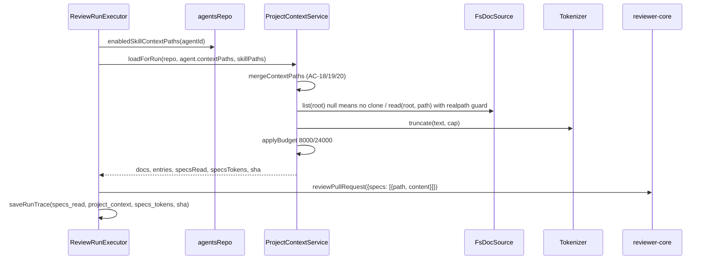

# 0014 — Project Context (SPEC-0001)

**Status:** ready
**Spec:** [specs/spec-0001-project-context.md](../../specs/spec-0001-project-context.md) (approved)
**Execution mode:** multi-agent (confirmed by the user)
**Citations valid as of:** `0a619a2` (dirty tree: `.claude/*` edits by another session, staged stray `server/pnpm-workspace.yaml`, untracked `specs/`)

## Goal
Build SPEC-0001 "Project Context": find the repository's markdown docs, let the user attach them in order to agents and skills, inject them at run time as untrusted `## Project context` blocks within the 8k/24k token caps, and show them in the run trace. Acceptance is every AC-1…AC-26, EC-1…EC-9 and NFR-1…NFR-7 in `specs/spec-0001-project-context.md`, verified as its *Traceability and verification* table says.

## Requirements review
- **Source:** `specs/spec-0001-project-context.md` (Status: approved, no `[NEEDS CLARIFICATION]`, no `Superseded by:`). Design frames: `specs/images/spec-0001/*.png`. Nothing outranks it: no rubric, no reverted commit (`git log --all -S'context_paths'` and `-S'project-context'` are empty).
- Plan-phase user decisions applied: 1a (new module + `DocSource` port + fs adapter), 2a (no cache; `Tokenizer.truncate`; pure `applyBudget`), 3a (jsonb `context_paths` on `agents` and `skills`, idempotent `0018_*`), 4a (shared cross-route picker). Also: "no clone" means `git.clonePathFor(repo)` does not exist; EC-3 returns `AppError(…,400)`; D-9 is a manual check.

| # | Requirement | Status | Evidence | Resolution |
|---|---|---|---|---|
| AC-1, AC-2 | list `.md` per glob, fresh on each call | clear | no cache (2a); `SpecFile` at `server/src/vendor/shared/contracts/platform.ts:263-269` lacks `type`/`tokens` | Steps 1, 4, 6, 8 |
| AC-3 | page header "repository root", docs as a file tree | ambiguous | the frame shows a flat list under one folder; the spec's docs span 3 roots | Q2 decided: repo `full_name` as root, file rows grouped under folder labels |
| AC-4, AC-5 | preview via `/context/file`; refresh = re-GET | clear | `useReindexContext` calls a non-existent `/context/reindex` (`client/src/lib/hooks/core.ts:131-137`) | Steps 8, 11, 15 |
| AC-6…AC-12 | agent Context tab | clear | `SkillsTab` patterns (`AgentEditor/_components/SkillsTab/SkillsTab.tsx`, `helpers.ts`) | Steps 12, 13 |
| AC-9, AC-10, AC-14 | persist `context_paths` via PUT | clear | `UpdateAgentBody` `agents/routes.ts:45-56`; `SkillPatchBody` `skills/routes.ts:22`; skills repo spreads the patch into `.set` (`skills/repository.ts:64`) | Steps 7, 9 |
| AC-13…AC-16 | skill Context tab + SERIALIZES AS | clear | D-10 (display only) | Step 14 |
| AC-17…AC-20, AC-23 | read from clone, merge order, dedupe, disabled skills, same call count | clear | `run-executor.ts:206` `buildSkillBlocks`; `agents/repository.ts:274-287` | Steps 8, 9, 10 |
| AC-21, AC-22, NFR-3 | per-path untrusted blocks, guard, label escaping | clear | `reviewer-core/src/prompt.ts:44-48,119-122,144` | Step 3 |
| AC-24 | trace fields | clear | `run-executor.ts:305-340`, `specs_read: []` at :336 | Steps 1, 10 |
| AC-25 | "Specs read" row with tokens + missing/truncated markers | ambiguous | a `missing` doc is never injected, so it is not in `specs_read` | Q3 decided: injected paths in order, then `missing` entries from `project_context` with the marker; `dropped` not listed |
| AC-26, EC-2 | prompt-block label + tokens; null shows "—" | clear | `TraceBody.tsx:76-86,93-95`; client INSIGHTS 2026-09-17 | Step 16 |
| EC-1 | byte-identical prompt without context | clear | golden `reviewer-core/test/prompt.test.ts:124-149` | Step 3 |
| EC-3 | 400 on a bad path | clear | user decision; `AppError` default 400 (`platform/errors.ts`) | Step 9 |
| EC-4, EC-9 | missing file / no clone → log warning, `status: missing` | clear | `RunLogger` has no `warn` → use `info('warning: …')` | Steps 8, 10 |
| EC-5, EC-7 | missing row; empty state | clear | `messages/en/context.json` `empty.{title,body}` | Step 12 |
| EC-6 | type from nearest root folder | clear | spec Examples | Step 8 |
| EC-8 | "report that state" on GET | ambiguous (response shape) | today's hook expects `SpecFile[]` | Q4 decided: envelope `ProjectContextList { cloned, files }` |
| NFR-1, NFR-2 | realpath containment; 404 without contents or host paths | clear | server INSIGHTS 2026-09-20 (lexical check doesn't stop symlinks; `readFile` errors embed absolute paths) | Steps 6, 8 |
| NFR-4 | server tokenizer; client "≈" | clear | `adapters/tokenizer/index.ts` | Steps 5, 12, 16 |
| NFR-5, NFR-6 | 8k/24k caps, marker | clear. Interpretation: marker N = tokens kept (e.g. `[truncated: 4000 of 6000 tokens]` for the doc that crosses the run cap); marker tokens not counted toward caps; `specs_tokens` = sum of injected content tokens (Examples: 212+105=317) | spec Examples | Step 8 |
| NFR-7 | keyboard move + accessible names | clear | `SkillsTab.tsx:96-110`; client INSIGHTS: `Badge` drops `aria-label` | Step 12 |

## Recommendations
- Cap each `context_paths` array (e.g. ≤100 entries, ≤512 chars each) in the route zod schemas — improves: bounds the request body — cost: returns 422 for huge bodies, which the spec doesn't define — status: not asked, not planned.
- Add a per-file size ceiling when listing, so one huge `.md` can't stall the no-cache token count — improves: resilience under 2a — cost: would bend AC-1 ("every matching file") — status: not asked, not planned; listed under Risks.
- An `e2e/specs/08-project-context.flow.json` — improves: covers the full path — cost: a flow file is do-not-touch territory needing user sign-off — status: not asked; no e2e flow is added.

## Out of scope
- Editing the spec, the plan, `docs/specs/**`, `e2e/specs/*.flow.json`; committing, pushing, reviewing.
- Project Context page Edit mode, new file/folder/upload, COVERAGE ring, "Indexed…" footer, "Used by N agents" (D-1); version bumps on `context_paths` changes (D-13); CI runs (D-17); reading the PR head (D-7); any `mcp/` change (the MCP `run_agent_on_pr` goes through the server run executor).
- `AgentVersionConfig`, `isConfigChange`, `snapshotVersion`, `isSkillConfigChange` stay unchanged. `INJECTION_GUARD` text and the EC-1 golden literal stay unchanged.
- Adding a glob library or any dependency (lockfiles are do-not-touch).

## Context
- **INSIGHTS applied:**
  - `server/INSIGHTS.md`:
    - 2026-09-20: realpath on both sides, not lexical `startsWith`.
    - 2026-09-20: `path.posix.normalize` before the allowlist check.
    - 2026-09-20: a `src/lib/` helper shared by module and adapter trips no arch rule.
    - 2026-09-21: `clone_path` is unreliable; check the clone exists.
    - 2026-09-19: idempotent-migration rule; `</dev/null` for drizzle-kit.
    - 2026-09-20: `.it.test.ts` must override `openrouter`.
    - 2026-09-19: use `waitForRunTrace`; check the skipped-file count.
    - 2026-09-22: never write the 2-char sequence `**/` inside a `/* */` comment (the default glob contains it).
    - 2026-09-29: `arch:check` baseline 0 errors / 15 warnings.
  - `client/INSIGHTS.md`:
    - 2026-09-17: null ≠ 0 for tokens.
    - 2026-09-19: `import type` only from `@devdigest/shared`.
    - 2026-09-19: `.dd-md` is unstyled; scope typography like `.skill-md`.
    - 2026-09-20: `Badge` drops `aria-label`.
    - 2026-09-27: no `user-event`; use `fireEvent`.
    - 2026-09-22: mock a hook at the exact import specifier.
  - `reviewer-core/INSIGHTS.md`:
    - 2026-09-19: the `specs` slot already exists.
    - 2026-09-21: hand-written golden, never an inline snapshot.
    - 2026-09-20: `typecheck` skips `test/**`.
  - Root `INSIGHTS.md`:
    - 2026-09-28: `arch:check` needs `reviewer-core/node_modules`.
    - 2026-09-16: `ERR_PNPM_IGNORED_BUILDS` → run the binary directly.
- **History:** none found. Clean template module: `server/src/modules/blast/` (routes wire ports from the container). `nav.ts` has been edited by feature commits before (641b637).
- **Assumptions (technical):**
  - The DocSource interface is declared in `modules/project-context/ports.ts`; `adapters/docs/fs.ts` implements it structurally without importing the module.
  - `DocSource.list` returns `null` when the root is missing. That means no third method; it signals EC-8/EC-9.
  - Skills get `context_paths` via a route-local `SkillPatchBody.extend(...)`, so `SkillInput` (create/import) is unchanged.
  - The clone sha comes from the existing `GitClient.currentHead` (`adapters.ts` GitClient); failures give `null`.

## Modules & files
### contracts (both copies)
- `server/src/vendor/shared/contracts/platform.ts:263` — `SpecDocType` enum; `SpecFile` + `type`, `tokens` (nullish); new `ProjectContextList {cloned, files}`.
- `server/src/vendor/shared/contracts/trace.ts:39-61,86-103` — `PromptAssembly.specs_tokens`, `ProjectContextEntry {path, tokens: int|null, status}`, `RunTrace.project_context`, `RunTrace.project_context_sha` (all nullish).
- `server/src/vendor/shared/contracts/knowledge.ts:121,284` — `Skill.context_paths`, `Agent.context_paths` (`z.array(z.string()).optional()`).
- `client/src/vendor/shared/contracts/{platform,trace,knowledge}.ts` — mirror of the above.

### reviewer-core
- `reviewer-core/src/prompt.ts:44-48,61,119-122` — label escaping in `wrapUntrusted`; `specs?: ProjectDoc[]`; path labels.
- `reviewer-core/src/review/run.ts:60` — `ReviewInput.specs` type.
- `reviewer-core/src/index.ts` — export `type ProjectDoc`.

### server
- `server/src/lib/doc-glob.ts` (new) — `DEFAULT_CONTEXT_GLOB`, glob matcher (`**`, `*`, `{a,b}`), `isSafeRelPath`, `invalidContextPaths(paths, glob)`.
- `server/src/platform/config.ts:15-39,41-81` — `CONTEXT_GLOB` → `AppConfig.contextGlob`.
- `server/.env.example` — commented `CONTEXT_GLOB=`.
- `server/src/adapters/tokenizer/index.ts:16-40` — `truncate(text, max): {text, total}`.
- `server/src/adapters/docs/fs.ts` (new) — `FsDocSource`.
- `server/src/adapters/mocks.ts` — `MockGitOptions.cloneDir` so `clonePathFor` can point at a fixture dir.
- `server/src/platform/container.ts:43-57,94-149` — `docSource` getter + override; `projectContext` getter.
- `server/src/db/schema/agents.ts:8-36`, `server/src/db/schema/skills.ts:6-30` — `contextPaths` jsonb NOT NULL default `[]`.
- `server/src/db/migrations/0018_*.sql` + `meta/` (generated, then hand-edited).
- `server/src/modules/project-context/{ports,constants,helpers,service,routes}.ts` (new); `server/src/modules/index.ts` — register.
- `server/src/modules/agents/{routes.ts:45,service.ts:39-113,repository.ts:132-166,274,helpers.ts:19-34,ports.ts}` — `context_paths` field, validation, DTO; new `enabledSkillContextPaths`.
- `server/src/modules/skills/{routes.ts:22-27,service.ts:26-63,ports.ts,helpers.ts}` — same for skills.
- `server/src/modules/reviews/run-executor.ts:206-254,305-340` — project context into the prompt and the trace.

### client
- `client/src/lib/hooks/core.ts:122-137` — `useContextFiles` → `ProjectContextList`; new `useContextFile`; remove `useReindexContext` only if it has no consumers.
- `client/src/lib/hooks/agents.ts` (UpdateAgentInput Pick), `client/src/lib/hooks/skills.ts` (UpdateSkillInput Pick) — add `context_paths`.
- `client/messages/en/{context,agents,skills,runs}.json` — new strings.
- `client/src/components/project-context-picker/` (new) — `ProjectContextPicker.tsx`, `helpers.ts`, `constants.ts`, `styles.ts`, `index.ts`, `_components/DocPreviewDrawer/`.
- `client/src/app/agents/_components/AgentEditor/{constants.ts:11-16,AgentEditor.tsx:42}` + `_components/ContextTab/` (new).
- `client/src/app/skills/_components/SkillEditor/{constants.ts:11-16,SkillEditor.tsx:51-56}` + `_components/ContextTab/` (new).
- `client/src/app/repos/[repoId]/context/page.tsx` (new) + `_components/ProjectContextView/` (new).
- `client/src/vendor/ui/nav.ts:21-27` — WORKSPACE entry "Project Context".
- `client/src/app/repos/[repoId]/pulls/[number]/_components/RunTraceDrawer/_components/TraceBody/TraceBody.tsx:39-51,93-95` (+ drawer `helpers.ts`).

## Component map
| Module | Component | Status | Layer | Path | Depends on | Step |
|---|---|---|---|---|---|---|
| shared | `SpecFile`, `ProjectContextList`, `SpecDocType` | changed/new | contract | `vendor/shared/contracts/platform.ts` | zod | 1, 2 |
| shared | `RunTrace`, `PromptAssembly`, `ProjectContextEntry` | changed/new | contract | `vendor/shared/contracts/trace.ts` | zod | 1, 2 |
| shared | `Agent`, `Skill` | changed | contract | `vendor/shared/contracts/knowledge.ts` | zod | 1, 2 |
| reviewer-core | `assemblePrompt` / `wrapUntrusted` | changed | domain | `reviewer-core/src/prompt.ts` | — | 3 |
| reviewer-core | `reviewPullRequest` input | changed | domain | `reviewer-core/src/review/run.ts` | prompt | 3 |
| server | doc-glob helpers | new | domain (lib) | `server/src/lib/doc-glob.ts` | — | 4 |
| server | `AppConfig.contextGlob` | changed | platform | `server/src/platform/config.ts` | doc-glob | 4 |
| server | `Tokenizer.truncate` | changed | adapter | `server/src/adapters/tokenizer/index.ts` | js-tiktoken | 5 |
| server | `DocSource` port | new | port | `modules/project-context/ports.ts` | — | 6 |
| server | `FsDocSource` | new | adapter | `server/src/adapters/docs/fs.ts` | doc-glob | 6 |
| server | container `docSource` / `projectContext` | changed | composition | `server/src/platform/container.ts` | FsDocSource, service | 6, 8 |
| server | `agents` / `skills` tables | changed | schema | `db/schema/agents.ts`, `db/schema/skills.ts`, `0018_*.sql` | — | 7 |
| server | project-context helpers (`docTypeFor`, `mergeContextPaths`, `applyBudget`) | new | domain | `modules/project-context/helpers.ts` | constants | 8 |
| server | `ProjectContextService` | new | service | `modules/project-context/service.ts` | ports | 8 |
| server | project-context routes | new | route | `modules/project-context/routes.ts` | service | 8 |
| server | agents service/repo/helpers | changed | service/repository | `modules/agents/*` | doc-glob | 9 |
| server | skills service/helpers/routes | changed | service/route | `modules/skills/*` | doc-glob | 9 |
| server | `ReviewRunExecutor` | changed | service | `modules/reviews/run-executor.ts` | container.projectContext, agentsRepo | 10 |
| client | `useContextFiles` / `useContextFile` / update hooks | changed/new | hook | `client/src/lib/hooks/*` | api | 11 |
| client | `ProjectContextPicker` (+ `DocPreviewDrawer`) | new | cross-route component | `client/src/components/project-context-picker/` | hooks | 12 |
| client | agent `ContextTab` | new | `_components` | `AgentEditor/_components/ContextTab/` | picker, `useUpdateAgent` | 13 |
| client | skill `ContextTab` | new | `_components` | `SkillEditor/_components/ContextTab/` | picker, `useUpdateSkill` | 14 |
| client | Project Context page + `ProjectContextView` | new | page / `_components` | `app/repos/[repoId]/context/` | hooks | 15 |
| client | NAV entry | changed | shell config | `client/src/vendor/ui/nav.ts` | — | 15 |
| client | `TraceBody` | changed | `_components` | `RunTraceDrawer/_components/TraceBody/TraceBody.tsx` | contracts | 16 |

## Diagrams
Run-time flow (target design):

## Steps
1. **Server contracts** (module: server; depends on: —; requirements: AC-1, AC-24, AC-9, AC-14)
   - Change: add the fields/types listed under *Modules & files → contracts* in the server copy. Every new trace/assembly field is `nullish` so old traces parse. `ProjectContextEntry.status` is `z.enum(['included','truncated','dropped','missing'])`. Confirm the `index.ts` barrel (`export *`) picks up the new exports. Leave `AgentVersionConfig` alone.
   - Files: `server/src/vendor/shared/contracts/{platform,trace,knowledge}.ts`
   - Skills: `zod`, `onion-architecture`
   - Verify: `pnpm typecheck && pnpm vitest run test/contracts.test.ts` in `server/`
2. **Client contract mirror** (module: client; depends on: 1; requirements: AC-6, AC-25, AC-26)
   - Change: apply identical edits to the client copies, then `diff` each against the server file. Pre-existing drift is only in the comments of `trace.ts` and in other sections of `knowledge.ts`; don't "fix" it.
   - Files: `client/src/vendor/shared/contracts/{platform,trace,knowledge}.ts`
   - Skills: `zod`
   - Verify: `pnpm typecheck` in `client/`
3. **reviewer-core: path-labelled project context** (module: reviewer-core; depends on: —; requirements: AC-21, AC-22, EC-1, NFR-3)
   - Change: new exported type `ProjectDoc {path, content}`. `PromptParts.specs?: ProjectDoc[]` and `ReviewInput.specs?: ProjectDoc[]`. `specsBlock` = `wrapUntrusted(doc.path, doc.content)` joined by blank lines. `wrapUntrusted` escapes the label (`&`, `"`, `<`, `>` → entities); existing constant labels are unaffected, so EC-1 holds. Do not edit `INJECTION_GUARD` or the golden test. Search all callers passing `specs` (reviewer-core/test, server/src, server/test) and update them (unverified — implementer checks with `rg -n "specs" reviewer-core server/src server/test`). Add unit tests for the label escape and path labels.
   - Files: `reviewer-core/src/prompt.ts`, `reviewer-core/src/review/run.ts`, `reviewer-core/src/index.ts`, `reviewer-core/test/prompt.test.ts`
   - Skills: `onion-architecture`, `typescript-expert`, `security` (constraints only)
   - Verify: `npm test && npm run typecheck` in `reviewer-core/`; `pnpm typecheck` in `server/`
4. **Glob helper + config** (module: server; depends on: 1; requirements: AC-1, EC-3)
   - Change: `server/src/lib/doc-glob.ts` with `DEFAULT_CONTEXT_GLOB = '**/{specs,docs,insights}/**/*.md'`, a hand-rolled matcher (`**` = zero or more segments, `*` within a segment, `{a,b}`), `isSafeRelPath` (posix-normalize equals input; no leading `/`, `..`, `\`, NUL; ends `.md`) and `invalidContextPaths`. No `**/` inside `/* */` comments. Add `CONTEXT_GLOB` to `EnvSchema`, `contextGlob` to `AppConfig`/`loadConfig`, and a commented line in `.env.example`. Unit test `server/test/doc-glob.test.ts`.
   - Files: `server/src/lib/doc-glob.ts`, `server/src/platform/config.ts`, `server/.env.example`, `server/test/doc-glob.test.ts`
   - Skills: `onion-architecture`, `fastify-best-practices`, `zod`, `security`
   - Verify: `pnpm vitest run test/doc-glob.test.ts && pnpm typecheck` in `server/`
5. **Tokenizer.truncate** (module: server; depends on: —; requirements: NFR-4, NFR-5)
   - Change: add `truncate(text, max): {text, total}` to the interface and `TiktokenTokenizer` (encode → slice → decode; fallback slices `max*4` chars and returns the `approxTokens` total). Update every `Tokenizer` fake/override the typecheck flags.
   - Files: `server/src/adapters/tokenizer/index.ts`, `server/test/tokenizer.test.ts` (new)
   - Skills: `onion-architecture`
   - Verify: `pnpm vitest run test/tokenizer.test.ts && pnpm typecheck` in `server/`
6. **DocSource port + fs adapter + container** (module: server; depends on: 4; requirements: AC-1, AC-2, AC-17, EC-8, EC-9, NFR-1)
   - Change:
     - `modules/project-context/ports.ts`: `DocSource { list(root, glob): Promise<{path, size}[] | null>; read(root, relPath): Promise<string | null> }` plus the other service ports (`TokenCounter`, `CloneLocator {rootFor, head}`, `RepoLookup`).
     - `adapters/docs/fs.ts`:
       - walks from `root`; returns `null` if root is missing; never follows symlinks (precedent `repo-intel/pipeline/walk.ts:89`); skips `.git`, `node_modules`, `dist`, `build`, `coverage`, `.next`, `out`, `vendor` (a local copy — no import from modules); walks dot-dirs such as `.devdigest`; filters by the doc-glob matcher; returns posix relpaths, sorted.
       - `read`: `isSafeRelPath`, then `realpath(root)`/`realpath(file)` containment and `isFile`. Any failure returns `null`, never an error carrying a host path.
     - Container: `docSource` getter plus `ContainerOverrides.docSource`.
     - `MockGitOptions.cloneDir` for fixtures.
     - Unit test `server/test/docs-fs.test.ts` on a `mkdtemp` fixture, including a symlink to outside.
   - Files: `server/src/modules/project-context/ports.ts`, `server/src/adapters/docs/fs.ts`, `server/src/platform/container.ts`, `server/src/adapters/mocks.ts`, `server/test/docs-fs.test.ts`
   - Skills: `onion-architecture`, `security`
   - Verify: `pnpm vitest run test/docs-fs.test.ts && pnpm typecheck && pnpm arch:check` in `server/` (0 errors, ≤15 warnings)
7. **Schema + migration** (module: server; depends on: —; requirements: AC-9, AC-14)
   - Change: add `contextPaths: jsonb('context_paths').$type<string[]>().notNull()` with a `'[]'::jsonb` default to `agents` and `skills`. Run `pnpm db:generate </dev/null` (fallback `./node_modules/.bin/drizzle-kit generate`) and hand-edit the generated `0018_*.sql` to `ADD COLUMN IF NOT EXISTS`; keep the `meta/` snapshot and journal. The dev DB has no `context_paths` column today (checked via `information_schema`). Never run `db:migrate` on the shared volume.
   - Files: `server/src/db/schema/agents.ts`, `server/src/db/schema/skills.ts`, `server/src/db/migrations/0018_*.sql`, `server/src/db/migrations/meta/*`
   - Skills: `postgresql-table-design`, `drizzle-orm-patterns`
   - Verify: `pnpm typecheck && pnpm vitest run test/agents-skills.it.test.ts` in `server/` (Docker; check the skipped count)
8. **project-context module** (module: server; depends on: 3, 5, 6, 7; requirements: AC-1, AC-2, AC-4, AC-17, AC-18, AC-19, AC-20, EC-4, EC-6, EC-8, EC-9, NFR-1, NFR-2, NFR-4, NFR-5, NFR-6)
   - Change:
     - `constants.ts`: `MAX_DOC_TOKENS=8000`, `MAX_RUN_TOKENS=24000`.
     - `helpers.ts` (pure):
       - `docTypeFor(path)`: nearest `specs|docs|insights` segment to the file (EC-6).
       - `mergeContextPaths(agent, skills[])`: agent first, then skills in order; first occurrence wins.
       - `applyBudget(docs, 8000, 24000)`: per-doc `included|truncated|dropped|missing`; marker `[truncated: <kept> of <total> tokens]` appended inside the content.
     - `service.ts`:
       - `list(workspaceId, repoId)`: repo lookup → `NotFoundError`; root from `CloneLocator.rootFor`; `docs.list` returning `null` → `{cloned:false, files:[]}`; else each file `{path, size, type, tokens}` with tokens counted per read.
       - `readFile(workspaceId, repoId, path)`: the path must be in the current list, else a generic `NotFoundError('Document not found')` (NFR-2).
       - `loadForRun({repo, agentPaths, skillPaths})`: merge → read each (null = missing) → `truncate` → `applyBudget` → `{docs, entries, specsRead, specsTokens, sha (head() best-effort, null on error), notCloned, missing[]}`. Returns `undefined` when no paths are attached (EC-1).
     - `routes.ts`: `GET /repos/:id/context` (`IdParams`, response `ProjectContextList`); `GET /repos/:id/context/file` (querystring `path: z.string().min(1).max(1024)`, response `SpecFile` with `content`). Wiring follows `blast/routes.ts`; no drizzle or adapter imports in routes.
     - Register in `modules/index.ts`; add the container `projectContext` getter (deps: `docSource`, `tokenizer`, `git`, `reposRepo`, `config.contextGlob`).
     - Tests: `server/test/project-context-helpers.test.ts` and `server/test/project-context-service.test.ts` (fakes).
   - Files: `server/src/modules/project-context/{constants,helpers,service,routes}.ts`, `server/src/modules/index.ts`, `server/src/platform/container.ts`, the two tests
   - Skills: `onion-architecture`, `fastify-best-practices`, `zod`, `security`
   - Verify: `pnpm vitest run test/project-context-helpers.test.ts test/project-context-service.test.ts && pnpm typecheck && pnpm arch:check` in `server/`
9. **Agents + skills `context_paths`** (module: server; depends on: 1, 4, 7; requirements: AC-9, AC-10, AC-14, AC-18, AC-20, EC-3)
   - Change:
     - Agents:
       - `UpdateAgentBody.context_paths?: z.array(z.string())`.
       - `AgentsService.update` checks `invalidContextPaths(paths, container.config.contextGlob)` BEFORE writing and throws `AppError('invalid_context_path', …, 400, {context_paths: invalid})`; otherwise maps to `contextPaths`.
       - `repository.update` sets `contextPaths`; it stays outside `isConfigChange` (no version bump, D-13).
       - `toAgentDto` emits `context_paths`; `AgentRecord` gets `contextPaths`.
       - New `AgentsRepository.enabledSkillContextPaths(agentId): Promise<string[][]>` (link AND skill enabled, `agent_skills.order`).
     - Skills:
       - Route-local `SkillPatchBody = SkillInput.omit({source}).partial().extend({context_paths})`.
       - `SkillsService` receives the glob (a constructor param passed from `routes.ts`), validates the same way, and maps explicitly to `contextPaths` (the Drizzle `.set` spreads the patch).
       - `SkillPatch`/`SkillRecord` get `contextPaths`; `toSkillDto` emits `context_paths`.
   - Files: `server/src/modules/agents/{routes,service,repository,helpers,ports}.ts`, `server/src/modules/skills/{routes,service,ports,helpers}.ts`
   - Skills: `onion-architecture`, `fastify-best-practices`, `drizzle-orm-patterns`, `zod`, `security`
   - Verify: `pnpm vitest run test/agents-skills.it.test.ts test/agents-versions.it.test.ts && pnpm typecheck && pnpm arch:check` in `server/`
10. **Run executor wiring** (module: server; depends on: 8, 9, 3; requirements: AC-17, AC-18, AC-19, AC-20, AC-23, AC-24, EC-4, EC-9)
    - Change:
      - New private `buildProjectContext(repo, agent, runLog)` next to `buildSkillBlocks` (`run-executor.ts:426`), best-effort in a try/catch: reads `agent.contextPaths` and `this.agents.enabledSkillContextPaths(agent.id)`, then calls `this.container.projectContext.loadForRun(...)`.
      - Log lines: `runLog.info('warning: project context: <path> not found in the clone — skipped')` per missing path; `…repository not cloned — running without project context` for EC-9; one count line.
      - Pass `specs: docs` only when non-empty.
      - Trace (`:305-340`): `specs_read`, `project_context`, `project_context_sha`, `prompt_assembly.specs_tokens` (all null/`[]` when no context).
      - Leave `traceFromBuffer` unchanged. No new imports of `db/schema` or adapters.
    - Files: `server/src/modules/reviews/run-executor.ts`
    - Skills: `onion-architecture`
    - Verify: `pnpm vitest run test/reviews.it.test.ts && pnpm typecheck && pnpm arch:check` in `server/`, then `pnpm test`
11. **Client hooks + i18n** (module: client; depends on: 2; requirements: AC-4, AC-5, AC-9, AC-14, EC-8)
    - Change:
      - `useContextFiles` → `ProjectContextList`; add `useContextFile(repoId, path)`.
      - Delete `useReindexContext` only if it has no consumers (unverified — implementer checks).
      - Add `context_paths` to the `UpdateAgentInput`/`UpdateSkillInput` Picks.
      - Strings:
        - `context.json`: picker/page strings — `notCloned` "Repository not cloned", `attachedOf` "{attached} of {total} attached", `missing`, `tokens` "≈ {count} tokens", `tokensUnknown` "—", filter placeholder, preview, refresh, move hint with `{name}`, preview label with `{name}`, the agent footer note.
        - `agents.json`: `editor.tabs.context`.
        - `skills.json`: `editor.tabs.context`, "Project context to use", "{count} attached", "Any agent using this skill inherits these documents.", "SERIALIZES AS".
        - `runs.json`: "Project context — attached specs (untrusted)", its with-tokens variant, "≈ {tokens} tok", missing/truncated markers.
    - Files: `client/src/lib/hooks/{core,agents,skills}.ts`, `client/messages/en/{context,agents,skills,runs}.json`
    - Skills: `frontend-ui-architecture`, `react-best-practices`
    - Verify: `pnpm typecheck` in `client/`
12. **Shared `ProjectContextPicker`** (module: client; depends on: 11; requirements: AC-6, AC-7, AC-8, AC-9, AC-10, AC-11, AC-12, AC-16, EC-2, EC-5, EC-7, EC-8, NFR-4, NFR-7)
    - Change:
      - Props: `{repoId, value: string[], onChange(next), renderHeader({attached,total}), footerNote?}`.
      - Rows:
        - Attached paths first, in stored order; ones absent from the list render ticked with a "missing" badge.
        - Then unattached docs in list order.
        - Each row: drag handle (ArrowUp/Down; `aria-label` includes the file name), `Checkbox`, file name, folder, type badge, Preview button (`aria-label` includes the file name).
      - Filter: case-insensitive path contains.
      - Footer "≈ N tokens" sums known tokens only; null shows "—" (EC-2).
      - States: skeleton, "Repository not cloned" (EC-8), `context.empty` (EC-7).
      - Preview in `_components/DocPreviewDrawer/` via `useContextFile` + `Markdown` (typography scoped like `.skill-md`).
      - Pure helpers (`buildRows`, `moveTo`, `toggle`, `filterRows`, `sumTokens`, `splitPath`) in `helpers.ts` with `helpers.test.ts`.
      - `import type` only from `@devdigest/shared`.
    - Files: `client/src/components/project-context-picker/**`
    - Skills: `frontend-ui-architecture`, `react-best-practices`
    - Verify: `pnpm vitest run src/components/project-context-picker && pnpm typecheck` in `client/`
13. **Agent Context tab** (module: client; depends on: 12; requirements: AC-6, AC-7, AC-9, AC-10, AC-12, EC-5)
    - Change: `ContextTab` wraps the picker with `repoId` from `useActiveRepo()`, value `agent.context_paths ?? []`, onChange → `useUpdateAgent` `{context_paths}` (optimistic, roll back on error as SkillsTab does). Header "Project context" + badge; footer note. Add the `context` tab after `skills` in `constants.ts` and render it in `AgentEditor.tsx`.
    - Files: `client/src/app/agents/_components/AgentEditor/{constants.ts,AgentEditor.tsx}`, `…/_components/ContextTab/{ContextTab.tsx,index.ts}`
    - Skills: `frontend-ui-architecture`, `react-best-practices`
    - Verify: `pnpm vitest run src/app/agents && pnpm typecheck` in `client/`
14. **Skill Context tab** (module: client; depends on: 12; requirements: AC-13, AC-14, AC-15, AC-16)
    - Change: `ContextTab` wraps the picker with "Project context to use", the "{n} attached" badge and the inherit line. Below it goes a display-only SERIALIZES AS box (`serializeAs(paths)` in `helpers.ts`: `## Project specifications` + `- <path>` lines). Tokens footer, no note. Tab after `config`.
    - Files: `client/src/app/skills/_components/SkillEditor/{constants.ts,SkillEditor.tsx}`, `…/_components/ContextTab/{ContextTab.tsx,helpers.ts,styles.ts,index.ts}`
    - Skills: `frontend-ui-architecture`, `react-best-practices`
    - Verify: `pnpm vitest run src/app/skills && pnpm typecheck` in `client/`
15. **Project Context page + nav** (module: client; depends on: 11; requirements: AC-3, AC-4, AC-5, EC-7, EC-8)
    - Change:
      - Thin `page.tsx` following the precedent `conventions/page.tsx`.
      - `ProjectContextView`:
        - Left pane: header label + repository root (Q2); refresh icon button (`aria-label`) → `refetch()`; file tree with folder labels and file rows (doc icon + file name) built by `helpers.ts buildTree`.
        - Right pane: selected file name + rendered markdown via `useContextFile`.
        - Empty and not-cloned states.
      - NAV WORKSPACE entry `{key:"context", label:"Project Context", icon:"Folder", href:"/repos/:repoId/context"}`, no `gKey`.
    - Files: `client/src/app/repos/[repoId]/context/page.tsx`, `…/context/_components/ProjectContextView/{ProjectContextView.tsx,helpers.ts,styles.ts,index.ts}`, `client/src/vendor/ui/nav.ts`
    - Skills: `frontend-ui-architecture`, `react-best-practices`, `next-best-practices`
    - Verify: `pnpm vitest run "src/app/repos/[repoId]/context" && pnpm typecheck` in `client/`
16. **Trace UI** (module: client; depends on: 11; requirements: AC-25, AC-26, EC-2, NFR-4)
    - Change: the "Specs read" row renders from `specs_read` joined with `project_context` (Q3), each entry "≈ N tok" ("—" if null) plus missing/truncated markers. The specs `PromptBlock` label becomes "Project context — attached specs (untrusted) · ≈ {specs_tokens} tokens" (no suffix when null); copy/expand already exist. The row mapping is a pure helper in the drawer's `helpers.ts`.
    - Files: `…/RunTraceDrawer/_components/TraceBody/TraceBody.tsx`, `…/RunTraceDrawer/helpers.ts`
    - Skills: `frontend-ui-architecture`, `react-best-practices`
    - Verify: `pnpm vitest run "src/app/repos/[repoId]/pulls" && pnpm typecheck` in `client/`, then `pnpm test`

## Work split
| Wave | Track | Agent | Steps | Files owned | Depends on |
|---|---|---|---|---|---|
| 1 | contracts | implementer | 1, 2 | `server/src/vendor/shared/contracts/*`, `client/src/vendor/shared/contracts/*` | — |
| 1 | reviewer-core | implementer | 3 | `reviewer-core/**` (+ any `server/test` caller of `specs`) | — |
| 2 | server | implementer | 4–10 | `server/src/{lib,platform,adapters,db,modules}/**`, `server/test/**`, `server/.env.example` | wave 1 |
| 2 | client | implementer | 11–16 | `client/src/{lib,components,app}/**`, `client/messages/en/*`, `client/src/vendor/ui/nav.ts` | wave 1 |

After the build, /run-sdd runs `test-writer` (one test per ID, per the traceability table below), `plan-verifier`, and **`security-reviewer` (required: repo text reaches the LLM)**.

## Skills for implementer
| Step | Skill | Rule that governs it |
|---|---|---|
| 1–2 | `zod` | schema and type share a name; `nullish` for fields old documents lack |
| 3 | `onion-architecture` | reviewer-core stays pure: no fs/process.env; the server passes docs in |
| 4, 6 | `security` | normalize, then allowlist, then realpath containment at the sink; no host paths in errors |
| 6, 8, 10 | `onion-architecture` | ports in `modules/<f>/ports.ts`; only the container/route plugin constructs adapters; no `src/adapters/*` import in modules |
| 7 | `postgresql-table-design`, `drizzle-orm-patterns` | NOT NULL + default; new idempotent migration, never edit a merged one |
| 8, 9 | `fastify-best-practices` | zod route schemas; errors via `AppError` + shared handler; routes call one service method |
| 12–16 | `frontend-ui-architecture` | colocate; promote only on the 2nd consumer (picker has 2); i18n for all copy; `page.tsx` thin |
| 12–16 | `react-best-practices` | derive, don't store (counts/totals computed); keys by path; accessible names on icon-only buttons |
| 15 | `next-best-practices` | `"use client"` at leaves; `useParams` in the page |

## Architecture constraints
- Imports point inward (`pnpm arch:check` stays at 0 errors, ≤15 warnings). The executor reaches project context only via `container.projectContext`; it never imports `modules/project-context/service.ts` (`no-cross-module-internals`).
- `src/lib/doc-glob.ts` is shared by the adapter and the services (server INSIGHTS 2026-09-20).
- Contracts: server copy first, client mirror as its own step; client `import type` only.
- Server tests in `server/test/`; DB-backed ones end `.it.test.ts`. Pipeline `.it` tests override `openrouter` and wait with `waitForRunTrace`. Client tests are colocated and use `fireEvent`.

## Do-not-touch that this task hits
- `server/src/vendor/shared/**` + `client/src/vendor/shared/**`: sanctioned both-sides edit (steps 1–2).
- Migrations: add a new `0018_*` only; `db:migrate` never runs on the shared volume.
- The staged stray `server/pnpm-workspace.yaml` is not this plan's; don't add to it; flag it at commit time.
- Lockfiles and e2e flows: untouched.

## Verification (whole task)
- reviewer-core: `npm test && npm run typecheck` — golden and new prompt tests pass.
- server: `pnpm test` (no unexpected skipped `.it` files), `pnpm typecheck`, `pnpm arch:check` (0 errors / ≤15 warnings).
- client: `pnpm test && pnpm typecheck`; page load of `/repos/:id/context` and the two tabs if a dev server is available, else report under *Not verified*.
- Manual (D-9, for the user): attach a doc stating "`api/` must not import `db/`", open a violating PR, run review, and confirm a finding cites the doc and the trace lists it. Also compare the UI against the 4 frames.

## Risks
- No cache (2a): listing reads and tokenizes every matching file per call; a very large `.md` slows GET and each run. Watch timing on real repos.
- Changing the `specs` slot type breaks any existing caller passing `string[]` (unverified — implementer checks).
- `AgentEditor`/`SkillEditor` tab tests or e2e `03-agents.flow.json` may assert the tab list (unverified).
- Map-reduce repeats the project-context block per chunk (`run.ts:166-177`), so token cost rises with chunk count; the call count is unchanged (AC-23 holds).
- Another session edits this worktree: re-read files before editing.

## Decisions on the planner's open questions (user, 2026-09-29)
- Q1 Execution mode: multi-agent, as in *Work split*.
- Q2 AC-3: header shows the repo `full_name`; file rows are grouped under folder labels.
- Q3 AC-25: "Specs read" lists injected docs in order, then `missing` entries with a marker; `dropped` docs appear only in `project_context`.
- Q4 EC-8: `GET /repos/:id/context` returns `ProjectContextList {cloned: boolean, files: SpecFile[]}`.

## Could not establish
- Callers of `specs`, `useReindexContext` consumers, `.skill-md` presence, `Drawer`/`Markdown` barrel exports, a refresh icon name, and tab-list assertions in tests: `rg` fails in this environment ("rtk: search failed: No such file or directory") and `grep` is not on the read allowlist. All are marked "(unverified — implementer checks)".
- Whether any test builds an `AppConfig` literal (a new field could break it): not checked; `pnpm typecheck` will show it.

## Traceability (ID → step → test for test-writer)
| ID | Step(s) | Test |
|---|---|---|
| AC-1, AC-2, EC-6, EC-8(server) | 4, 6, 8 | `server/test/project-context.it.test.ts` (fixture clone via `MockGitOptions.cloneDir`) + helpers unit |
| AC-4(server), NFR-1, NFR-2 | 6, 8 | `project-context.it.test.ts` (symlink + `../` cases) |
| AC-9, AC-10, AC-14, EC-3 | 7, 9 | `server/test/context-paths.it.test.ts` (agents + skills round-trip, order, 400, version unchanged) |
| AC-17, AC-21 (in prompt), AC-23, AC-24, EC-4, EC-9 | 8, 10 | `server/test/project-context-run.it.test.ts` (MockLLM captures messages and counts calls) |
| AC-18, AC-19, AC-20, NFR-5, NFR-6, NFR-4 | 5, 8, 9 | `project-context-helpers.test.ts`, `project-context-service.test.ts`, `tokenizer.test.ts` |
| AC-21, AC-22, EC-1, NFR-3 | 3 | `reviewer-core/test/prompt.test.ts` |
| AC-6–AC-12, EC-2, EC-5, EC-7, EC-8(client), NFR-7 | 12, 13 | `ProjectContextPicker.test.tsx`, agent `ContextTab.test.tsx` |
| AC-13–AC-16 | 14 | skill `ContextTab.test.tsx` |
| AC-3, AC-4(client), AC-5 | 15 | `ProjectContextView.test.tsx` |
| AC-25, AC-26 | 16 | `RunTraceDrawer.test.tsx` |
