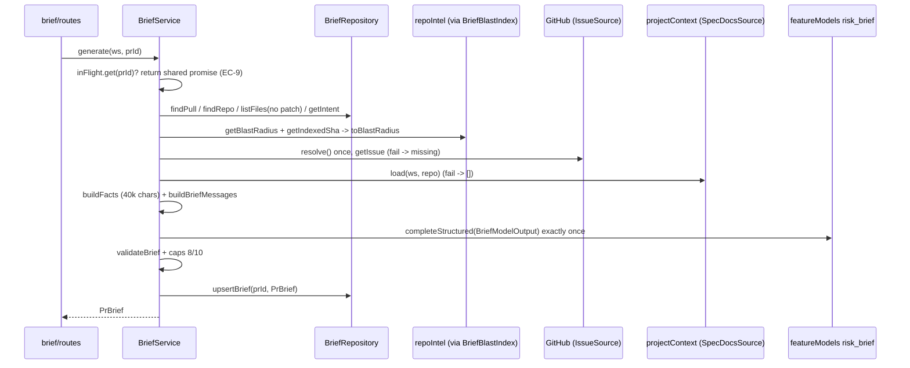

# 0015 — PR Brief (SPEC-0002)

**Status:** ready
**Source:** specs/spec-0002-pr-brief.md
**Execution mode:** multi-agent — chosen by the user
**Citations valid as of:** `64699d4` (dirty tree: untracked `specs/spec-0002-pr-brief.md`, `specs/images/spec-0002/`, stray `client/pnpm-workspace.yaml`, `server/pnpm-workspace.yaml`)

## Goal
Build the PR Brief on the Overview tab, as specified in `specs/spec-0002-pr-brief.md`:
- A summary banner, the Intent and Blast radius blocks, model risks and the review focus.
- Generated on demand with exactly one `risk_brief` structured call, over facts with no diff hunk bodies.
- File-validated and stored in `pr_brief` with the head SHA.
- The deterministic Risk Areas scanner is deleted.

Acceptance means AC-1…AC-28, EC-1…EC-10 and NFR-1…NFR-8, verified as the spec's *Traceability and verification* table says.

Design frames (subagents have no vision, so pass these paths on):
- `specs/images/spec-0002/overview-pr-brief.png`
- `specs/images/spec-0002/overview-summary-banner-annotated.png`
- `specs/images/spec-0002/overview-risks-focus-annotated.png`
- `specs/images/spec-0002/files-changed-target.png`

## Requirements review
- **Source:** `specs/spec-0002-pr-brief.md` (Status: approved). It has no `[NEEDS CLARIFICATION]` and no `Superseded by:`. Nothing outranks it: no rubric, and no reverted brief commit was found. The prior Risk Areas design is `docs/plans/0003-intent-card-risk-areas.md`, which D-2 explicitly replaces.
- User HOW decisions (2026-10-02):
  - Q1: multi-agent.
  - Q2: new `server/src/modules/brief/`, shaped like `blast/`.
  - Q3: export `INJECTION_GUARD` from reviewer-core.
  - Q4: deep link `?tab=diff&file=<path>`.

| # | Requirement | Status | Evidence | Resolution |
|---|---|---|---|---|
| AC-1, AC-19 | block order; Intent + Blast blocks | clear | `page.tsx:166-174` renders `IntentCard`/`BlastRadiusCard` in `.overview-grid`, then `OverviewTab` | Steps 10, 12 |
| AC-2, AC-10, AC-9 | GET returns stored brief or null; POST stores with SHA | clear | `pr_brief(pr_id PK, json jsonb)` exists (`server/src/db/schema/reviews.ts:66-71`, live `\d pr_brief` matches): **no migration** | Steps 6, 8, 10 |
| AC-3, EC-4 | one call via `risk_brief`; missing key named | clear | `FeatureModels.completeStructured` resolves once with no catch (`settings/feature-models.ts:67-76`); `container.llm` throws `ConfigError('OPENAI_API_KEY is not configured')` (`container.ts:224-225`); `risk_brief` defaults to `openai` (`contracts/platform.ts:57-63`) | Step 6 |
| AC-4, NFR-1, NFR-2, NFR-5 | inputs, no patch text, untrusted blocks, 40k chars | clear | precedent `reviews/intent/prompt.ts:73-98`; `INJECTION_GUARD` private at `reviewer-core/src/prompt.ts:16` | Steps 1, 5, 6 |
| AC-5, AC-6, AC-26, EC-8, NFR-6 | file validation, `./` strip, caps 8/10 | clear | pure helper | Step 5 |
| AC-7, AC-8 | `PrBrief` / `Risk` contract, both copies | clear | current `brief.ts:110-154,207-214`; copies identical (`diff` clean) | Steps 2, 3 |
| AC-12 | latest completed review in banner | **conflict** (tag) | tagged `[server]`, but `GET /pulls/:id/reviews` already returns reviews newest-first (`reviews/repository/review.repo.ts`, `reviewsForPull`); no server change needed | Server side covered by a regression assertion in Step 7; client in Step 10. The tag is for the user / `spec-creator` to confirm |
| AC-11, AC-13–AC-16, AC-21–AC-24, EC-2, EC-3, EC-6, EC-7, NFR-3, NFR-7, NFR-8 | banner, lists, states | clear | `VerdictBanner.tsx:12-58`; `formatUsd`; client INSIGHTS null≠0 | Steps 8, 10 |
| AC-17, AC-27 | open file on Files changed | clear | Q4. Docs/boilerplate cards start collapsed (`SmartDiffViewer/constants.ts:33-39`); group state at `SmartDiffGroup.tsx:33`; card state at `SmartDiffFileRow.tsx:51-53` | Step 11 |
| AC-18, AC-28 | GitHub blob link at `indexed_sha` ?? head | clear | `githubBlobUrl` (`client/src/lib/github-urls.ts:24`); `usePrBlast` (`lib/hooks/blast.ts:13`) | Step 10 |
| AC-20, EC-1, EC-10 | missing inputs | clear | `toBlastRadius` keeps `degraded`/`reason` (`blast/helpers.ts:14-60`); `extractIssueRef` (`reviews/intent/helpers.ts`) | Steps 5, 6 |
| AC-25 | delete `/risks` + client list | clear | `reviews/routes.ts:191-201`, `service.ts:268-305`; client `IntentCard.tsx:7,123-125` | Steps 4, 9 |
| EC-5, EC-9 | keep old brief on failure; share a running generation | clear | — | Step 6 |
| NFR-4 | 10/min | clear | precedent `reviews/routes.ts:182-184` | Step 6 |

## Recommendations
- Expose the brief's own `missing_inputs` labels as fixed strings (`intent`, `blast radius (<reason>)`, `issue #N`) — improves: AC-21 copy stays simple — cost: none — status: not asked (technical default, see Assumptions).
- Ask `spec-creator` to drop the `[server]` tag on AC-12 — improves: traceability — cost: a spec edit — status: not asked.

## Out of scope
- Editing any spec, the plan, or `docs/specs/**`. `docs/specs/risk-areas.md` is stale after this work. Run `/run-sdd --docs` so `doc-writer` removes or replaces it.
- Committing, pushing, and review work (architecture, security and plan-verifier run after the build).
- Auto-regeneration (D-4), deriving intent inside the brief (D-15), scrolling to the cited line (D-10), expandable risk explanations (non-goal), `history` in the brief (D-3).
- Any migration. The `pr_brief` table already exists.
- `e2e/specs/*.flow.json`: no flow references risks (caller grep).

## Context
- **INSIGHTS applied:**
  - server:
    - 2026-09-29: `container.featureModels` replaces the free functions.
    - 2026-09-29: `no-cross-module-internals` errors even for `import type`; put shared types in `ports.ts`.
    - 2026-09-27: resolve a lazy port once, outside per-call catches.
    - 2026-09-27: `ports.ts` may `import type` another module's `types.ts`/`helpers`.
    - 2026-09-20: `.it` tests override LLM providers with `MockLLMProvider`.
    - 2026-09-20: a `secrets.get → undefined` override makes the `ConfigError` path deterministic.
    - 2026-09-20: grep `server/test/` before narrowing a contract (`contracts.test.ts:113-117`).
    - 2026-09-20: grep the whole barrel before adding a contract name.
    - 2026-09-19: check the skipped count.
    - 2026-09-29: `arch:check` baseline is 0 errors / 15 warnings.
  - client:
    - 2026-09-17: null≠0 for cost/tokens.
    - 2026-09-19: `import type` only from `@devdigest/shared`.
    - 2026-09-20: `Badge` drops `aria-label`; wrap it in a span.
    - 2026-09-20: `MonoLink` renders a `<button>` without `href`.
    - 2026-09-27: no `user-event`; use `fireEvent`.
    - 2026-09-22: mock hooks at the exact import specifier.
    - 2026-09-27: never put an empty-state early return before a notice.
    - 2026-09-27: `var(--text)` does not exist; use `--text-primary`.
    - 2026-09-17: reuse the `SEV[x]` tokens.
    - 2026-09-20: no `useEffectEvent`; adjust state during render.
  - root:
    - 2026-09-20: `FEATURE_MODELS` has three copies. This plan does not touch them.
    - 2026-09-27: pass design frames by path.
    - 2026-09-28: `arch:check` needs `reviewer-core/node_modules`.
    - 2026-09-16: on `ERR_PNPM_IGNORED_BUILDS`, run the binary directly.
- **History:** Risk Areas came from plan `0003-intent-card-risk-areas.md` and is now superseded by D-2. No earlier brief implementation exists. `pr_brief` has been empty-shaped since `0000_init.sql`.
- **Caller grep (`/risks|PrRisks|usePrRisks`):**
  - Hits: `IntentCard.test.tsx`, `RiskAreas/{RiskAreas,RiskAreas.test,RiskRow}.tsx`, `lib/hooks/{risks,index}.ts`, both `brief.ts` copies, `reviews/{routes,service}.ts`.
  - `lib/hooks/smart-diff.ts` matches only in its header comment (line 3, "Modelled on hooks/risks.ts"). Keep the file and reword the comment.
  - `server/src/lib/diff-lines.ts` matches only in a comment. Keep it: `adapters/git/diff-parser.ts` uses it.
  - No hits in `mcp/src` or `e2e/specs`.
- **Assumptions (technical):**
  - `missing_inputs` entries are the fixed strings `intent`, `blast radius (<reason>)` (EC-1) and `issue #<n>` (EC-10). A missing `GITHUB_TOKEN` counts as an unfetchable issue.
  - "Blast-map files" means the files in `changed_symbols[].file`, `downstream[].file` and `downstream[].callers[].file`.
  - Spec docs come from merging every enabled agent's `contextPaths` and its enabled skills' paths into one `projectContext.loadForRun` call. Its 8k/24k token caps apply. A missing or uncloned doc is silently omitted (it is not one of AC-20's inputs).
  - A non-`AppError` failure from the model call is rethrown as `ExternalServiceError('Brief generation failed: <message>')`. An `AppError` (for example `ConfigError`) propagates as itself.
  - With no brief, the banner slot shows the Generate CTA. The Intent and Blast blocks still render, and Risk areas and Review focus are hidden until a brief exists.

## Modules & files
### reviewer-core
- `reviewer-core/src/prompt.ts:16` — `export const INJECTION_GUARD`.
- `reviewer-core/src/index.ts:15-27` — re-export `INJECTION_GUARD`. Reword the `buildLineIndex` comment (line 24-26) that names Risk Areas.
### contracts (both copies)
- `server/src/vendor/shared/contracts/brief.ts`:
  - Lines 110-154: remove `RiskKind`, `RiskRef`, `Risks`, `PrRisks`. New `RiskFileRef`. `Risk` becomes `{kind: string, title, explanation, severity, file_refs}`.
  - Lines 207-214: new `ReviewFocusItem` and the new `PrBrief`.
- `client/src/vendor/shared/contracts/brief.ts` — identical mirror.
### server
- `server/src/modules/brief/{ports,constants,helpers,prompt,repository,service,routes}.ts` (new); `server/src/modules/index.ts:12-41` — register `brief`.
- `server/src/modules/reviews/routes.ts:5,29,191-201`, `server/src/modules/reviews/service.ts:6,23,268-305` — remove risks.
- `server/src/modules/reviews/risks/{constants,detectors,helpers,index}.ts` — delete.
- `server/test/risks-detectors.test.ts`, `server/test/risks.it.test.ts` — delete. `server/test/contracts.test.ts:7,113-117` — replace the `Risks` fixture.
- `server/test/brief-helpers.test.ts`, `brief-prompt.test.ts`, `brief-service.test.ts`, `brief.it.test.ts` (new).
### client
- `client/src/lib/hooks/brief.ts` (new); `client/src/lib/hooks/risks.ts` (delete); `client/src/lib/hooks/index.ts:12` (swap export); `client/src/lib/hooks/smart-diff.ts:3` (comment only).
- `client/messages/en/brief.json` (new keys); `client/messages/en/intent.json` (drop `risks.*`).
- `.../_components/IntentCard/{IntentCard.tsx:7,123-125,styles.ts,IntentCard.test.tsx:16-35}`; `.../IntentCard/_components/RiskAreas/**` — delete.
- `.../_components/PrBriefBlock/**` (new, see map).
- `.../_components/{DiffTab/DiffTab.tsx,SmartDiffViewer/SmartDiffViewer.tsx,SmartDiffViewer/_components/SmartDiffGroup/SmartDiffGroup.tsx,SmartDiffViewer/_components/SmartDiffFileRow/SmartDiffFileRow.tsx}`.
- `client/src/app/repos/[repoId]/pulls/[number]/page.tsx:75-91,166-174,203-205`.

(`...` = `client/src/app/repos/[repoId]/pulls/[number]`)

## Component map
| Module | Component | Status | Layer | Path | Depends on | Step |
|---|---|---|---|---|---|---|
| reviewer-core | `INJECTION_GUARD` export | changed | domain | `reviewer-core/src/prompt.ts`, `index.ts` | — | 1 |
| shared | `Risk`, `RiskFileRef`, `ReviewFocusItem`, `PrBrief` | changed/new | contract | `vendor/shared/contracts/brief.ts` (×2) | zod | 2, 3 |
| server | risks scanner + `GET /pulls/:id/risks` | deleted | service/route | `reviews/risks/**`, `reviews/{routes,service}.ts` | — | 4 |
| server | brief ports (`BriefStore`, `BriefBlastIndex`, `IssueSource`, `SpecDocsSource`, `BriefModel`) | new | port | `modules/brief/ports.ts` | repo-intel types | 5 |
| server | brief helpers (`normalizePath`, `knownFiles`, `validateBrief`, `buildFacts`, `missingInputs`) | new | domain | `modules/brief/helpers.ts`, `constants.ts` | `classifyFile`, `toBlastRadius` | 5 |
| server | brief prompt (`BriefModelOutput`, `buildBriefMessages`) | new | domain | `modules/brief/prompt.ts` | `wrapUntrusted`, `INJECTION_GUARD` | 5 |
| server | `BriefRepository` | new | repository | `modules/brief/repository.ts` | drizzle | 6 |
| server | `BriefService` (get / generate, in-flight map) | new | service | `modules/brief/service.ts` | ports, helpers | 6 |
| server | brief routes (GET/POST) | new | route | `modules/brief/routes.ts` | service, container | 6 |
| server | `contracts.test.ts`, brief tests | changed/new | test | `server/test/*` | — | 4, 5, 7 |
| client | `usePrBrief`, `useGenerateBrief` | new | hook | `client/src/lib/hooks/brief.ts` | api | 8 |
| client | `usePrRisks`, `RiskAreas`, `RiskRow` | deleted | hook / `_components` | `lib/hooks/risks.ts`, `IntentCard/_components/RiskAreas/` | — | 8, 9 |
| client | `IntentCard` | changed | `_components` | `.../IntentCard/IntentCard.tsx` | `usePrIntent` | 9 |
| client | `PrBriefBlock` (+ `helpers.ts`, `styles.ts`) | new | `_components` | `.../_components/PrBriefBlock/` | `usePrBrief`, `useGenerateBrief`, `usePrBlast` | 10 |
| client | `BriefBanner` | new | `_components` | `PrBriefBlock/_components/BriefBanner/` | `VerdictBanner` (reused), `formatUsd` | 10 |
| client | `BriefRisks`, `ReviewFocus`, `FileRefLink` | new | `_components` | `PrBriefBlock/_components/{BriefRisks,ReviewFocus,FileRefLink}/` | helpers, `githubBlobUrl` | 10 |
| client | `VerdictBanner` | reused | `_components` | `.../VerdictBanner/VerdictBanner.tsx` | — | 10 |
| client | `DiffTab`, `SmartDiffViewer`, `SmartDiffGroup`, `SmartDiffFileRow` | changed | `_components` | `.../DiffTab/`, `.../SmartDiffViewer/**` | — | 11 |
| client | PR page | changed | page | `.../page.tsx` | `PrBriefBlock`, `DiffTab` | 12 |

## Diagrams
`POST /pulls/:id/brief`, target design:

## Steps
1. **Export the injection guard** (module: `reviewer-core`; depends on: —; requirements: none tagged, serves NFR-2 via step 5)
   - Change: make `INJECTION_GUARD` an exported const; text unchanged, so the golden prompt test stays byte-identical. Re-export it from `index.ts`. Reword the `buildLineIndex` comment so it no longer names Risk Areas. npm package: never `pnpm install` here.
   - Files: `reviewer-core/src/prompt.ts`, `reviewer-core/src/index.ts`
   - Skills: `onion-architecture`
   - Verify: `npm test && npm run typecheck` in `reviewer-core/`
2. **Server brief contract** (module: server; depends on: —; requirements: AC-7, AC-8)
   - Change:
     - Delete `RiskKind`, `RiskRef`, `Risks`, `PrRisks` and the old composed `PrBrief`.
     - Add `RiskFileRef {file: string, start_line: int().positive().optional(), end_line: same}`.
     - `Risk {kind: z.string(), title, explanation, severity: RiskSeverity, file_refs: z.array(RiskFileRef)}`.
     - `ReviewFocusItem {file, line: int().positive(), reason}`.
     - `PrBrief {summary, risks: Risk[], review_focus: ReviewFocusItem[], generated_for_sha, generated_at, missing_inputs: string[], cost_usd: number.nullable(), tokens_in: int.nullable(), tokens_out: int.nullable()}`; no `intent`/`blast`/`history`.
     - Keep `RiskSeverity`, `Intent`, `BlastRadius`, `PrHistory`, `SmartDiff*`.
     - Before adding names, check the barrel `contracts/*.ts` for collisions.
   - Files: `server/src/vendor/shared/contracts/brief.ts`
   - Skills: `zod`, `onion-architecture`
   - Verify: `pnpm typecheck` in `server/`. It is expected to fail only in `reviews/{routes,service}.ts`, `reviews/risks/**` and `test/contracts.test.ts`, which step 4 fixes. Record that in the report.
3. **Client contract mirror** (module: client; depends on: 2; requirements: AC-7, AC-8)
   - Change: copy the identical edits, then `diff server/src/vendor/shared/contracts/brief.ts client/src/vendor/shared/contracts/brief.ts`, which must be empty.
   - Files: `client/src/vendor/shared/contracts/brief.ts`
   - Skills: `zod`
   - Verify: the `diff` above, from the repo root. Client `pnpm typecheck` still fails only on the `RiskRow`/`RiskAreas`/`risks.ts` imports that step 8/9 delete.
4. **Delete the deterministic scanner** (module: server; depends on: 2; requirements: AC-25, AC-7, AC-8)
   - Change:
     - Delete `reviews/risks/**`.
     - Remove `getRisks`, its imports and the `/risks` route plus its doc-comment line in `reviews/routes.ts`.
     - Delete `test/risks-detectors.test.ts` and `test/risks.it.test.ts`.
     - In `contracts.test.ts`, replace the `Risks.parse` fixture with `Risk` and `PrBrief` fixtures: free-text `kind`, a ref without lines, and a ref with lines. Assert that `PrBrief` rejects `line: 0`.
     - Keep `src/lib/diff-lines.ts`.
   - Files: `server/src/modules/reviews/{routes,service}.ts`, `server/src/modules/reviews/risks/*`, `server/test/{risks-detectors.test.ts,risks.it.test.ts,contracts.test.ts}`
   - Skills: `onion-architecture`, `fastify-best-practices`, `zod`
   - Verify: `pnpm vitest run test/contracts.test.ts && pnpm typecheck` in `server/`
5. **Brief domain: ports, helpers, prompt** (module: server; depends on: 1, 2; requirements: AC-4, AC-5, AC-6, AC-26, AC-20, EC-1, EC-8, EC-10, NFR-1, NFR-2, NFR-5, NFR-6)
   - Change:
     - `ports.ts`:
       - `BriefPull {id, repoId, number, title, body, headSha}`, `BriefRepoRef {id, owner, name}`, `BriefFile {path, additions, deletions}` (no `patch`).
       - `BriefStore {findPull, findRepo, listFiles, getIntent, getBrief, upsertBrief}`.
       - `BriefBlastIndex` (shape like `blast/ports.ts:37-41`).
       - `IssueSource {resolve(): Promise<{getIssue(repo, n)}>}`.
       - `SpecDocsSource {load(workspaceId, repo): Promise<{path, content}[]>}`.
       - `BriefModel {generate(workspaceId, messages): Promise<{data, model, provider, costUsd, tokensIn, tokensOut}>}`.
     - `constants.ts`: `MAX_FACT_CHARS = 40_000`, `MAX_RISKS = 8`, `MAX_FOCUS = 10`, `MAX_BODY_CHARS`, `MAX_FILES`.
     - `helpers.ts`, all pure:
       - `normalizePath` strips one leading `./` (EC-8).
       - `blastFiles(blast)`.
       - `knownFiles(prFiles, blast)`.
       - `validateBrief(output, known)`: drop the bad refs of a risk, drop a risk with no valid ref, drop focus items on unknown files, normalize kept paths, then slice to 8/10 in model order.
       - `missingInputs({intent, blast, issue})`: blast counts as missing when it is `degraded` with zero `changed_symbols`, labelled with its `reason`.
       - `buildFacts(...)`: sections in priority order, each file line `path +A -D role` with `classifyFile` (import `classifyFile` from `../reviews/smart-diff/index.js` and `toBlastRadius` from `../blast/helpers.js`; both are allowed). It fits the total into `MAX_FACT_CHARS` by cutting spec docs first, then the file-list tail, with a truncation marker.
     - `prompt.ts`:
       - `BriefModelOutput` zod: `summary`, `risks` (shared `Risk` shape), `review_focus`.
       - `BRIEF_SCHEMA_NAME`.
       - The system prompt states the facts and that no code was read, and appends `INJECTION_GUARD`.
       - `buildBriefMessages` wraps the PR title+body, issue, each spec doc (label `spec:<path>`) and the blast names in `wrapUntrusted` blocks. Intent, stats and missing inputs go in plain sections.
     - Tests:
       - `brief-helpers.test.ts`: the spec's Examples rows AC-5, AC-6/EC-8, AC-26, NFR-6 (12 risks / 15 items), EC-1, NFR-5 length.
       - `brief-prompt.test.ts`: NFR-1 (no `sk_live_`, contains `src/config.ts` and `+4 -0`), NFR-2 (guard present, untrusted tags around each untrusted input).
   - Files: `server/src/modules/brief/{ports,constants,helpers,prompt}.ts`, `server/test/brief-helpers.test.ts`, `server/test/brief-prompt.test.ts`
   - Skills: `onion-architecture`, `zod`, `security`
   - Verify: `pnpm vitest run test/brief-helpers.test.ts test/brief-prompt.test.ts && pnpm typecheck && pnpm arch:check` in `server/` (0 errors, ≤15 warnings)
6. **Brief repository, service, routes** (module: server; depends on: 4, 5; requirements: AC-2, AC-3, AC-4, AC-9, AC-10, AC-20, EC-4, EC-5, EC-9, EC-10, NFR-4)
   - Change:
     - `BriefRepository implements BriefStore`, every query workspace-scoped as in `blast/repository.ts`:
       - `listFiles` selects only `path`, `additions`, `deletions` (NFR-1).
       - `getIntent` reads `pr_intent`.
       - `getBrief` runs `PrBrief.safeParse` on the json and returns null when it doesn't parse.
       - `upsertBrief` uses `onConflictDoUpdate` on `pr_id`.
     - `BriefService`:
       - `get(ws, prId)`: `NotFoundError` if no pull, else the stored brief or `null`. No model call.
       - `generate(ws, prId, log)`: shares the running promise through `inFlight: Map<prId, Promise<PrBrief>>`, deleted in `finally` (EC-9). Gathering steps:
         - pull and repo;
         - files;
         - intent;
         - blast, best-effort, caught as missing;
         - issue: `extractIssueRef`, then `IssueSource.resolve()` once, with any throw counting as missing (EC-10);
         - specs, best-effort.
       - It then builds the messages and makes **one** `model.generate` call. An `AppError` propagates; any other error becomes `ExternalServiceError` and nothing is stored (EC-5). After that it validates, builds the `PrBrief` (`generated_for_sha = pull.headSha`, cost and tokens from the result) and upserts it.
       - Logs carry counts only.
     - `routes.ts`:
       - `GET /pulls/:id/brief` with response `PrBrief.nullable()`.
       - `POST /pulls/:id/brief` with `config: { rateLimit: { max: 10, timeWindow: '1 minute' } }` and response `PrBrief`.
       - Wire the ports from the container in the plugin, as `blast/routes.ts:23-42` does:
         - blast index: `container.repoIntel`.
         - issue source: `resolve: () => container.github()`.
         - spec docs: `container.agentsRepo.listEnabled`, plus `enabledSkillContextPaths` per agent, then one `container.projectContext.loadForRun({repo, agentPaths: [], skillPaths: [...]})` returning `run?.docs ?? []`.
         - model: `container.featureModels.completeStructured(ws, 'risk_brief', {schema, schemaName, messages, temperature: 0.1})`.
       - One service instance per plugin, so the in-flight map lives for the whole process.
     - Register the plugin in `modules/index.ts`.
     - `brief-service.test.ts` uses fakes: one call, failure leaves the store unchanged, two concurrent calls make one model call, the issue throw path, the degraded blast path.
   - Files: `server/src/modules/brief/{repository,service,routes}.ts`, `server/src/modules/index.ts`, `server/test/brief-service.test.ts`
   - Skills: `onion-architecture`, `fastify-best-practices`, `drizzle-orm-patterns`, `zod`, `security`
   - Verify: `pnpm vitest run test/brief-service.test.ts && pnpm typecheck && pnpm arch:check` in `server/`
7. **Brief integration tests** (module: server; depends on: 6; requirements: AC-2, AC-3, AC-9, AC-10, AC-12, AC-20, AC-25, EC-4, EC-5, EC-9, EC-10, NFR-4)
   - Change: add `server/test/brief.it.test.ts`, set up like `intent.it.test.ts:1-70`.
     - `buildApp` overrides `llm.openai` and `llm.openrouter` with a counting `MockLLMProvider` (`structuredBySchema[BRIEF_SCHEMA_NAME]`), plus `repoIntel`, `github` and `git` mocks.
     - Cases:
       - GET returns null, then POST stores the brief with the SHA.
       - A second GET makes 0 calls.
       - The AC-20 example: `no_data` blast, no intent, issue 404.
       - EC-4 via a `secrets.get → undefined` override with no `openai` override: the body names `OPENAI_API_KEY`.
       - EC-5: a failing provider leaves the earlier row unchanged.
       - EC-9: two parallel injects make one call.
       - `GET /pulls/:id/risks` returns 404 (AC-25).
       - The `GET /pulls/:id/reviews` newest-first regression (AC-12 server tag).
       - NFR-4: assert the route's `rateLimit` config, if the rate-limit plugin is off under `NODE_ENV=test` (unverified; the implementer checks how `/intent/derive` is tested).
   - Files: `server/test/brief.it.test.ts`
   - Skills: `onion-architecture`, `fastify-best-practices`
   - Verify: `pnpm vitest run test/brief.it.test.ts` in `server/` (Docker; check the skipped count), then `pnpm test`
8. **Client hooks + i18n** (module: client; depends on: 3; requirements: AC-2, AC-22, AC-23, AC-25)
   - Change:
     - `hooks/brief.ts`, modelled on `hooks/intent.ts`:
       - `usePrBrief(prId)` with key `["pr-brief", prId]`, GET returning `PrBrief | null`.
       - `useGenerateBrief(prId)`: POST, then `setQueryData` on success. On error, leave the cached brief alone (EC-6).
     - Delete `hooks/risks.ts`, swap the barrel export, and reword the `smart-diff.ts` header comment.
     - `brief.json`: block title "PR Brief", generate, refresh, generating, stale "Stale — regenerate", risks heading, `noRisks` (exists), focus heading "Review focus — read these first", focus count, nothing-to-read text, missing-inputs text, severity names "High/Medium/Low risk", cost/token labels, error prefix.
   - Files: `client/src/lib/hooks/{brief.ts,risks.ts,index.ts,smart-diff.ts}`, `client/messages/en/brief.json`
   - Skills: `frontend-ui-architecture`, `react-best-practices`
   - Verify: `pnpm typecheck` in `client/` (expected to fail only on `RiskAreas`, until step 9)
9. **Remove Risk Areas from the Intent block** (module: client; depends on: 8; requirements: AC-25)
   - Change: drop the `RiskAreas` import and mount and the `risksWrap` style. Delete the `RiskAreas/` folder. Drop the `intent.risks.*` keys. Update `IntentCard.test.tsx`: remove the `usePrRisks` mock and assert there is no "Risk areas" heading.
   - Files: `.../IntentCard/{IntentCard.tsx,styles.ts,IntentCard.test.tsx}`, `.../IntentCard/_components/RiskAreas/*`, `client/messages/en/intent.json`
   - Skills: `frontend-ui-architecture`, `react-best-practices`, `react-testing-library`
   - Verify: `pnpm vitest run "src/app/repos/[repoId]/pulls/[number]/_components/IntentCard" && pnpm typecheck` in `client/`
10. **PR Brief block** (module: client; depends on: 8; requirements: AC-1, AC-2, AC-11, AC-12, AC-13, AC-14, AC-15, AC-16, AC-18, AC-19, AC-21, AC-22, AC-23, AC-24, AC-28, EC-2, EC-3, EC-6, EC-7, NFR-3, NFR-7, NFR-8)
    - Change:
      - `PrBriefBlock` props: `{prId, repoId, headSha, prFiles, reviews, repoFullName, intentSlot?, onOpenFile}`.
      - Layout, inside one section labelled "PR Brief" with a stale badge (`generated_for_sha !== headSha`) and an icon refresh button (`aria-label`):
        1. The banner, or the Generate CTA when there is no brief.
        2. The existing `IntentCard` and `BlastRadiusCard` in `.overview-grid`.
        3. `BriefRisks`.
        4. `ReviewFocus`.
        5. The missing-inputs line.
      - The mutation's `isPending` disables both buttons and shows a loading state. The error message renders under Generate (EC-7) or beside refresh (EC-6).
      - `BriefBanner`: when `reviews[0]` exists with a verdict, render the reused `VerdictBanner` with `summary = brief.summary`, its counts, score and blockers (CRITICAL and not dismissed, as in `ReviewRunAccordion.tsx:59`). Otherwise render a plain summary box. A meta row shows `formatUsd(cost_usd)` ("—" for null) and drops a null token segment.
      - `helpers.ts` (pure):
        - `formatFileRef(file, start?, end?)` → `path`, `path:n` or `path:a-b`.
        - `refTarget(file, prPaths, blast)` → `{kind:"pr"} | {kind:"blast"}`.
        - `blobSha(blast, headSha)` = `blast.indexed_sha ?? headSha`.
        - `latestReview(reviews)`.
      - `FileRefLink`:
        - A PR file renders a real `<button type="button">` calling `onOpenFile(path)`.
        - A blast-only file renders `<a href={githubBlobUrl(...)} target="_blank" rel="noopener noreferrer">`.
        - When `repoFullName` is null, it renders plain text (never `MonoLink` without `href`).
      - `BriefRisks`: per risk, a severity icon coloured with `SEV.CRITICAL/WARNING/SUGGESTION.c`, wrapped in ``; the title; and the `FileRefLink`s. Zero risks → `t("noRisks")`.
      - `ReviewFocus`: an ordered list in API order, heading plus count, rows of `FileRefLink` + "— reason". Zero items → the nothing-to-read text.
      - All model text renders as plain JSX text, never `dangerouslySetInnerHTML` or `Markdown` (NFR-3).
      - Tests: `PrBriefBlock.test.tsx` (order, empty, pending, errors, stale, missing inputs, `<script>` reason renders as text) and `helpers.test.ts`.
    - Files: `.../_components/PrBriefBlock/{PrBriefBlock.tsx,helpers.ts,helpers.test.ts,styles.ts,index.ts,PrBriefBlock.test.tsx}`, `.../PrBriefBlock/_components/{BriefBanner,BriefRisks,ReviewFocus,FileRefLink}/*`
    - Skills: `frontend-ui-architecture`, `react-best-practices`, `react-testing-library`, `security`
    - Verify: `pnpm vitest run "src/app/repos/[repoId]/pulls/[number]/_components/PrBriefBlock" && pnpm typecheck` in `client/`
11. **Files-changed focus** (module: client; depends on: —; requirements: AC-17, AC-27)
    - Change:
      - `DiffTab` and `SmartDiffViewer` accept `focusPath: string | null` and pass it down.
      - `SmartDiffGroup` gets `containsFocus`. If it is collapsed, it expands; this adjusts state during render, keyed on `focusPath`, with no effect for state.
      - `SmartDiffFileRow` gets `focused`. It sets `open` true when it is focused (adjusted during render), wraps the `FileCard` in a `div` ref, and calls `scrollIntoView({block: "start"})` in a `useEffect` keyed on `focusPath`. The DOM call is legitimate in an effect.
      - Covers docs and boilerplate cards that start collapsed.
      - Tests: extend `SmartDiffViewer.test.tsx` with a docs-role file focused → expanded, and `scrollIntoView` called (stub it on `Element.prototype`). Extend `DiffTab.test.tsx` to forward the prop. Mock hooks at the exact specifiers (client INSIGHTS 2026-09-22).
    - Files: `.../DiffTab/{DiffTab.tsx,DiffTab.test.tsx}`, `.../SmartDiffViewer/{SmartDiffViewer.tsx,SmartDiffViewer.test.tsx}`, `.../SmartDiffViewer/_components/{SmartDiffGroup/SmartDiffGroup.tsx,SmartDiffFileRow/SmartDiffFileRow.tsx}`
    - Skills: `frontend-ui-architecture`, `react-best-practices`, `react-testing-library`
    - Verify: `pnpm vitest run "src/app/repos/[repoId]/pulls/[number]/_components/SmartDiffViewer" "src/app/repos/[repoId]/pulls/[number]/_components/DiffTab" && pnpm typecheck` in `client/`
12. **Page wiring** (module: client; depends on: 10, 11; requirements: AC-1, AC-17, AC-27)
    - Change:
      - Overview renders `PrBriefBlock`; IntentCard and BlastRadiusCard move inside it via props or children. `OverviewTab` (description) stays below.
      - `onOpenFile = (path) => setParams({ tab: "diff", file: path, finding: null })`, a single `router.replace`.
      - `setTab` also clears `file`.
      - The diff tab passes `focusPath={search.get("file")}`.
    - Files: `client/src/app/repos/[repoId]/pulls/[number]/page.tsx`
    - Skills: `frontend-ui-architecture`, `react-best-practices`, `next-best-practices`
    - Verify: `pnpm test && pnpm typecheck` in `client/`. Page load is manual against the frames; report it under *Not verified* if no dev server is available.

## Work split
| Wave | Track | Agent | Steps | Files owned | Depends on |
|---|---|---|---|---|---|
| 1 | contracts | implementer | 2, 3 | `server/src/vendor/shared/contracts/brief.ts`, `client/src/vendor/shared/contracts/brief.ts` | — |
| 1 | reviewer-core | implementer | 1 | `reviewer-core/src/{prompt,index}.ts` | — |
| 2 | server | implementer | 4, 5, 6, 7 | `server/src/modules/{brief,reviews}/**`, `server/src/modules/index.ts`, `server/test/{contracts,brief-*,brief.it,risks-*}*` | wave 1 |
| 2 | client | implementer | 8, 9, 10, 11, 12 | `client/src/lib/hooks/*`, `client/messages/en/{brief,intent}.json`, `client/src/app/repos/[repoId]/pulls/[number]/**` | wave 1 |

After the build, `/run-sdd` runs `test-writer`, `plan-verifier` and **`security-reviewer` (required: PR/issue/spec text reaches the LLM; model text reaches the page)**.

## Skills for implementer
| Step | Skill | Rule that governs it |
|---|---|---|
| 1, 5, 6 | `onion-architecture` | ports in `modules/brief/ports.ts`; only `routes.ts` wires container dependencies; no import of another module's `routes/service/repository`; helpers stay pure |
| 2, 3 | `zod` | schema and type share a name; `int().positive()` for lines; `.optional()` only where the spec says optional |
| 4, 6 | `fastify-best-practices` | zod route schemas for params/response; per-route `config.rateLimit`; errors through `AppError` and the shared handler |
| 6 | `drizzle-orm-patterns` | queries only in the repository, workspace-scoped; upsert with `onConflictDoUpdate` on the PK |
| 5, 10 | `security` | untrusted text only inside `wrapUntrusted`; never select `patch`; links only from validated paths and integer lines; `rel="noopener noreferrer"` |
| 8–12 | `frontend-ui-architecture` | colocate in `_components/<Name>/`; pure helpers in `helpers.ts`; all copy through i18n; `page.tsx` thin |
| 8–12 | `react-best-practices` | derive stale, counts and targets in render; no state mirroring of the query; effects only for the DOM scroll; real buttons for actions |
| 9–11 | `react-testing-library` | flow tests with role queries; `fireEvent` (no user-event in deps) |
| 12 | `next-best-practices` | `useSearchParams` in the page; one `router.replace` per patch |

## Architecture constraints
- `pnpm arch:check` stays at 0 errors and ≤15 warnings. `brief/` imports only `../blast/helpers.js`, `../reviews/smart-diff/index.js`, `../reviews/intent/helpers.js` and `../project-context/ports.js` types. It never imports their `service`/`repository`/`routes`, not even with `import type` (server INSIGHTS 2026-09-29).
- `routes.ts` has no drizzle or `db` import (`routes-no-persistence` is an error). `helpers.ts`/`constants.ts` have no I/O (`pure-module-files-no-io` is an error).
- Contracts: the server copy first, then the client mirror, then an empty `diff`. The client uses `import type` only.
- Server tests live in `server/test/`; DB-backed ones end `.it.test.ts`. Client tests are colocated.
- reviewer-core stays pure and uses npm.

## Do-not-touch that this task hits
- `server/src/vendor/shared/**` and `client/src/vendor/shared/**`: the sanctioned both-sides edit (steps 2–3).
- Migrations: none needed. Never run `db:migrate` on the shared volume.
- The stray untracked `client/pnpm-workspace.yaml` and `server/pnpm-workspace.yaml` don't belong to this plan. Don't stage them; flag them at commit time.
- Lockfiles and e2e flows: untouched.

## Verification (whole task)
- reviewer-core: `npm test && npm run typecheck`. The golden prompt test is unchanged.
- server: `pnpm test` (no unexpected skipped `.it` files), `pnpm typecheck`, `pnpm arch:check` (0 errors / ≤15 warnings).
- client: `pnpm test && pnpm typecheck`.
- Manual, for the user: compare the Overview against the four frames. Click a docs-role focus item and confirm the card opens on Files changed. Click a blast-only ref and confirm a new GitHub tab.

## Risks
- Spec docs can push the facts past 40k chars; `buildFacts` must cut them first. Test it with a long doc.
- Old-shaped `pr_brief` rows in the shared DB are hidden as null by `safeParse` (they are expected to be empty).
- Moving `IntentCard`/`BlastRadiusCard` inside `PrBriefBlock` could break existing tests that assume page structure (unverified).
- `useGenerateBrief` errors may also fire the global mutation toast (client INSIGHTS 2026-09-29). Check for a double error display.
- Another session edits this worktree. Re-read files before editing them.

## Open questions
- None blocking. The AC-12 `[server]` tag conflict uses a regression-test default (Step 7).

## Support requests
- None.

## Could not establish
- How existing tests assert per-route rate limits under `NODE_ENV=test` (NFR-4). Marked "unverified, implementer checks" in Step 7.
- Whether `MockGitHubClient.getIssue` can be made to throw for a given issue number (EC-10). The implementer checks `server/src/adapters/mocks.ts`.
