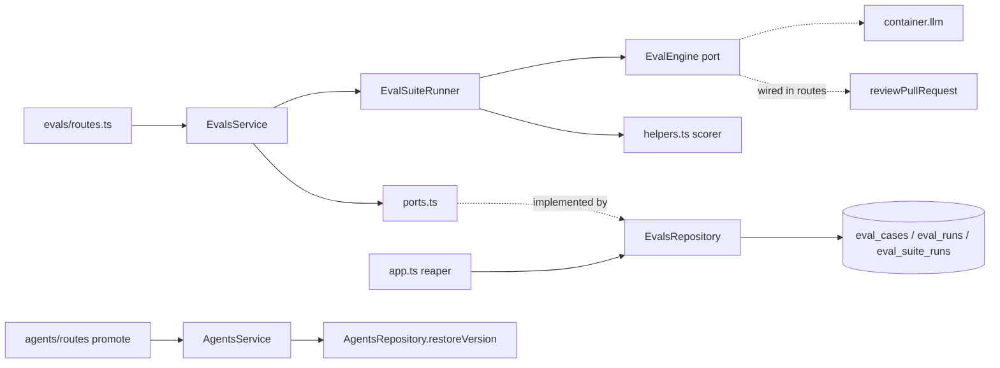

# 0016 — Eval pipeline

**Status:** ready
**Execution mode:** multi-agent — chosen by the user
**Spec:** [specs/spec-0003-eval-pipeline.md](../../specs/spec-0003-eval-pipeline.md)
**Citations valid as of:** `269a2c6` (dirty tree: untracked `specs/spec-0003-eval-pipeline.md`, `specs/images/spec-0003/`, stray `*/pnpm-workspace.yaml`, modified `INSIGHTS.md`)

## Goal
Build the eval pipeline in `specs/spec-0003-eval-pipeline.md`. Users create eval cases from findings or by hand, run an agent over its eval set with fixed inputs in the background, score it with pure code, compare two runs and promote a version. This is accepted when every `must`/`should` AC, EC and NFR in the spec's *Traceability and verification* table is met.

## Requirements review
- **Source:** `specs/spec-0003-eval-pipeline.md` (Status: approved). Outranked by the design frames in `specs/images/spec-0003/*.png`. There is no rubric or reverted commit (`git log --all -S'EvalDashboard'` finds only the squashed snapshot `587c46a`).

| # | Requirement (cited) | Status | Evidence | Resolution |
|---|---|---|---|---|
| AC-1–AC-4, EC-2–EC-4, EC-21–EC-24 | Create a case from a finding | clear | `pr_files.patch` has no header (`reviews/diff-loader.ts:33-44`); `reviews.agent_id` has no FK (`db/schema/reviews.ts:18`); `pr_files` has no unique `(pr_id, path)` (`db/schema/pulls.ts:36`) | — |
| AC-5, EC-15, EC-18 | 422 `validation_error` | clear | zod → 422 (`app.ts:118-152`); `ValidationError` (`platform/errors.ts:25`) | — |
| AC-9–AC-11, EC-10, EC-27, NFR-8 | Fixed-input suite run | clear | `reviewPullRequest` takes resolved inputs (`reviewer-core/src/review/run.ts`) | — |
| AC-13–AC-17, EC-6, EC-9, EC-12, NFR-1 | Pure scorer | clear | `outcome.review.findings` / `outcome.dropped` (`run.ts` `ReviewOutcome`) | — |
| AC-32, AC-33, EC-8, EC-17 | Async runs, one per agent, reaper | clear | Reaper pattern at `app.ts:80-85` | — |
| AC-34 | Per-case run | ambiguous | sync vs async | User: **synchronous**; EC-8 for it is a read-check |
| AC-40, AC-41, EC-25 | Promote by restore | missing | A snapshot stores only the ids of enabled skills (`agents/repository.ts:174-176`); a skill can be deleted later | User: **409, change nothing, name the missing skills** |
| AC-18, AC-36–AC-39, NFR-6 | Tiles, deltas, trend | conflict (code) | Vendored `MetricCard` shows `Math.abs(delta)` with no sign and an unlabelled arrow (`vendor/ui/charts/MetricCard.tsx:53-66`); `LineChart` turns null into 0 (`LineChart.tsx:34`) | Build local components (Step 11); vendor/ui charts are not edited |
| AC-22 | Sidebar item | conflict (do-not-touch) | `client/src/vendor/ui/nav.ts:29-36`; the spec sanctions it; `activeKeyFor` already maps `/eval` (`app-shell/helpers.ts:35`) | Deliberate vendor edit, Step 14 |
| AC-6–AC-8, AC-12, AC-19–AC-31, AC-35, AC-42, EC-1, EC-5, EC-7, EC-11, EC-13, EC-14, EC-16, EC-19, EC-20, EC-26, NFR-2–NFR-5, NFR-7 | Remaining UI and API items | clear | `messages/en/eval.json` exists; `ConfirmModal` (`components/confirm-modal`); polling ~4 s | — |
| EC-16 (server side) | Promote of the current version | missing | The spec gives only the client rule | Open question Q1 |
| AC-27 | Edit the expected output | ambiguous | Is a `must_find` edit re-checked against the diff? | Open question Q2 |

Module tags: every tag matches the code. `reviewer-core` is untagged and needs no change.

## Recommendations
- Show "already an eval case" on the finding card at page load as well, using an `eval_case_id` in the reviews DTO. Improves: EC-2 visibility. Cost: a reviews-module change. Status: not asked; out of scope.
- Add `meta: { silent: true }` to the global mutation toast so the 409 reasons on the finding card are not shown twice (client INSIGHTS 2026-10-02). Improves: UX. Cost: a small `providers.tsx` change. Status: not asked; out of scope.

## Out of scope
- Spec non-goals: Run on save, Files/PR meta tabs, Finding skeleton, agent switcher, seeding, LLM-as-judge, CI, skill-owned cases, Learn/Reply buttons, the "empty []" expectation in the frame, `pnpm verify:l06`.
- Editing any spec, committing or pushing, running e2e, running `pnpm db:migrate` on the shared volume, reviewing code.

## Context
- **INSIGHTS applied:**
  - server: 2026-09-19 idempotent migrations and the shared volume; 2026-09-20 `pr_files.patch` has no header; 2026-09-20 override `llm` and `openrouter` in `.it` tests; 2026-09-19 stable ORDER BY; 2026-09-29 `no-cross-module-internals` applies to type imports too; 2026-09-29 `DbExecutor` for repository transactions; 2026-10-02 the rate limiter is off under `test` (NFR-4 uses `development`); 2026-10-03 a fire-and-forget promise must not leave an unhandled rejection.
  - client: 2026-09-17 null ≠ 0 for cost; 2026-09-19 import types only from `@devdigest/shared`; 2026-09-22 mock hooks by their exact module path; 2026-09-27 no `user-event`, use `fireEvent`; 2026-09-19 `Button` needs `type="button"`, `Modal` needs padding; 2026-09-20 `Badge` drops `aria-label`.
  - reviewer-core: 2026-09-16 cost is all-or-nothing.
  - root: 2026-09-16 `ERR_PNPM_IGNORED_BUILDS`.
- **History:** no earlier eval implementation. `eval_cases` and `eval_runs` exist from the starter and are empty in the dev DB. The last migration is `0018_harsh_sersi`.
- **Assumptions:**
  - `assemblePrompt` wraps the diff with `wrapUntrusted` and appends `INJECTION_GUARD` (`reviewer-core/AGENTS.md`); Step 9 tests this.
  - The `FlaskConical` icon is in the UI registry (imported at `vendor/ui/icons.tsx:31`).

## Modules & files
### shared contracts
- `server/src/vendor/shared/contracts/eval-ci.ts:19-89` — rework the eval section (Step 1).
- `client/src/vendor/shared/contracts/eval-ci.ts` — mirror the eval section.
- `client/src/vendor/shared/contracts/knowledge.ts` — add `AgentVersionConfig` and `AgentVersion` (as at server `knowledge.ts:329-347`).
### server
- `server/src/db/schema/eval.ts:7-35` — new `evalSuiteRuns`; new columns on `evalCases` and `evalRuns`.
- `server/src/db/migrations/0019_*.sql` + `meta/` — generated, then hand-edited to be idempotent.
- `server/src/modules/evals/{constants,helpers,ports,repository,service,suite-runner,routes}.ts` — new.
- `server/src/modules/index.ts:29-43` — register `evals`.
- `server/src/app.ts:80-85` — eval reaper.
- `server/src/modules/agents/{routes.ts:149,service.ts:138,repository.ts:171}` — promote / `restoreVersion`.
- `server/test/evals-*.test.ts`, `evals-*.it.test.ts`, `agents-promote.it.test.ts` — new.
### client
- `client/src/lib/hooks/evals.ts` (new), `lib/hooks/index.ts`, `lib/hooks/agents.ts` (`useAgentVersions`, `usePromoteVersion`).
- `client/src/components/text-diff/` (new; takes `lineDiff`/`diffStats` from `app/skills/.../VersionsTab/helpers.ts`), `VersionsTab.tsx`.
- `client/src/components/eval-metrics/` (new: `MetricTile`, `MetricTrendChart`, `RunStatusLabel`, `helpers.ts`).
- `client/src/app/repos/[repoId]/pulls/[number]/_components/FindingCard/FindingCard.tsx:98-119` + `_components/EvalCaseAction/` (new).
- `client/src/app/agents/_components/AgentEditor/{constants.ts:11-15, AgentEditor.tsx:43-47}` + `_components/EvalsTab/` (new).
- `client/src/app/eval/page.tsx`, `app/eval/_components/EvalDashboardView/` (new).
- `client/src/app/eval/[agentId]/page.tsx`, `app/eval/[agentId]/_components/AgentEvalView/` (new).
- `client/src/vendor/ui/nav.ts:29-36`; `client/messages/en/{eval,prReview,agents}.json`.

## Component map
| Module | Component | Status | Layer | Path | Depends on | Step |
|---|---|---|---|---|---|---|
| shared | eval contracts | changed | contract | `server/src/vendor/shared/contracts/eval-ci.ts` | zod | 1 |
| shared | eval contracts mirror + `AgentVersion` | changed | contract | `client/src/vendor/shared/contracts/{eval-ci,knowledge}.ts` | Step 1 | 2 |
| server | `eval_cases`, `eval_runs`, `eval_suite_runs` | changed/new | schema | `server/src/db/schema/eval.ts`, `migrations/0019_*` | — | 3 |
| server | scorer, diff, period and regression helpers | new | domain | `server/src/modules/evals/helpers.ts`, `constants.ts` | `lib/diff-parser.ts`, `buildLineIndex` | 4 |
| server | `EvalStore`, `EvalEngine`, `EvalAgentSource`, `EvalLogger` | new | port | `server/src/modules/evals/ports.ts` | contracts | 5 |
| server | `EvalsRepository` | new | repository | `server/src/modules/evals/repository.ts` | schema | 5 |
| server | `EvalsService` | new | service | `server/src/modules/evals/service.ts` | ports, helpers | 6 |
| server | `EvalSuiteRunner` | new | service | `server/src/modules/evals/suite-runner.ts` | ports, helpers | 6 |
| server | evals routes + engine wiring | new | route | `server/src/modules/evals/routes.ts`, `modules/index.ts` | service, `reviewPullRequest`, `container.llm` | 7 |
| server | boot reaper | changed | composition | `server/src/app.ts` | `EvalsRepository` | 7 |
| server | promote | changed | route/service/repository | `server/src/modules/agents/*` | `AgentVersionConfig` | 8 |
| server | eval test suites | new | test | `server/test/evals-*`, `agents-promote.it.test.ts` | `MockLLMProvider` | 4, 6, 8, 9 |
| client | eval hooks | new | hook | `client/src/lib/hooks/evals.ts`, `agents.ts` | `api.ts` | 10 |
| client | `TextDiff` | new | shared component | `client/src/components/text-diff/` | — | 11 |
| client | `VersionsTab` | changed | `_components` | `app/skills/.../VersionsTab/` | `TextDiff` | 11 |
| client | `MetricTile`, `MetricTrendChart`, `RunStatusLabel` | new | shared component | `client/src/components/eval-metrics/` | `Sparkline`, recharts | 11 |
| client | `EvalCaseAction` | new | `_components` | `.../FindingCard/_components/EvalCaseAction/` | eval hooks | 12 |
| client | `FindingCard` | changed | `_components` | `.../FindingCard/FindingCard.tsx` | `EvalCaseAction` | 12 |
| client | `EvalsTab` (+ `EvalCaseRow`, `EvalCaseModal`) | new | `_components` | `app/agents/_components/AgentEditor/_components/EvalsTab/` | hooks, eval-metrics, `ConfirmModal` | 13 |
| client | `AgentEditor` tabs | changed | `_components` | `AgentEditor/{constants.ts,AgentEditor.tsx}` | `EvalsTab` | 13 |
| client | Eval Dashboard page | new | page | `app/eval/page.tsx`, `_components/EvalDashboardView/` | hooks, eval-metrics | 14 |
| client | nav item | changed | vendor | `client/src/vendor/ui/nav.ts` | — | 14 |
| client | Agent eval page | new | page | `app/eval/[agentId]/page.tsx`, `_components/AgentEvalView/` (`RegressionBanner`, `PeriodFilter`, `RunsTable`, `CompareRunsModal`) | hooks, eval-metrics, `TextDiff` | 15 |

## Diagrams
Server request and run flow (target design):

## Steps
1. **Server eval contracts** (module: server; depends on: —; requirements: AC-5)
   - Change: in `eval-ci.ts` (the eval section only) add:
     - `EvalExpectationKind` and `EvalExpectation` (`{kind, file, start_line ≥1, end_line}` with a refine `start ≤ end`);
     - `EvalCaseInput` reshaped to `{name, input_diff min 1, expected_output: EvalExpectation, notes?}`, and `EvalCaseUpdate {name?, expected_output?}`;
     - `EvalCaseFromFindingInput {kind?}` and `EvalCaseFromFindingResult {case, created}`;
     - `EvalCaseResult` (case snapshot name and expectation, pass, expected/produced counts, kept/dropped, grounded findings, duration, nullable cost, ran_at, nullable `suite_run_id`/`case_id`);
     - `EvalSuiteRunStatus`, `EvalSuiteRun` (nullable metrics, cost, error, failing case; `agent_version`, model, provider), `EvalSuiteRunDetail` (+ `effective_prompt`, `case_results`), `EvalRunAccepted`;
     - `EvalDashboard` reshaped: nullable `current`/`delta`, `trend` points with nullable metrics and version, `recent_runs: EvalSuiteRun[]`, `regression: {version, metrics: [{metric, drop_pts}]} | null`;
     - `EvalOverview` (agent rows + recent runs with agent name);
     - `EvalPeriod` enum `7d|30d|90d|all`.
     - Also give `EvalCase` the fields `created_at`, nullable `source_finding_id`, nullable title/severity/category and a nullable `latest_result` (`knowledge.ts:73-84`).
     - Remove the now-unused `EvalRunRecord`, `EvalRunResult` and `EvalTrendPoint` only after checking `server/test/contracts.test.ts` (server INSIGHTS 2026-09-20).
   - Files: `server/src/vendor/shared/contracts/eval-ci.ts`, `server/src/vendor/shared/contracts/knowledge.ts`
   - Skills: `zod`, `typescript-expert`
   - Verify: `pnpm typecheck` and `./node_modules/.bin/vitest run test/contracts.test.ts` in `server/`
2. **Client contract mirror** (module: client; depends on: 1; requirements: EC-6)
   - Change: copy the Step 1 eval section and the `EvalCase` change into the client copies. Add `AgentVersionConfig` and `AgentVersion` to the client `knowledge.ts`. Then `diff` the two eval sections; the only expected drift is the pre-existing `AgentManifest` and the `provider` enum at `eval-ci.ts:220`.
   - Files: `client/src/vendor/shared/contracts/eval-ci.ts`, `client/src/vendor/shared/contracts/knowledge.ts`
   - Skills: `zod`
   - Verify: `pnpm typecheck` in `client/`
3. **Schema + migration 0019** (module: server; depends on: 1; requirements: EC-2, EC-8, EC-14, EC-24, EC-26, AC-31)
   - Change, `evalCases`:
     - add `createdAt` (timestamptz, not null, default now);
     - add `sourceFindingId` (FK `findings.id` ON DELETE SET NULL) with a partial unique index `WHERE source_finding_id IS NOT NULL`;
     - add an index on `(workspace_id, owner_kind, owner_id, created_at, id)`.
   - Change, new `evalSuiteRuns`:
     - columns: id, workspaceId (FK cascade), agentId (FK `agents` ON DELETE CASCADE, EC-26), agentVersion, status (text with a `running|done|failed` CHECK), startedAt, finishedAt, recall, precision, citationAccuracy, casesPassed (nullable), casesTotal, costUsd (nullable), error, failingCaseName, effectivePrompt, model, provider;
     - partial unique index on `(agent_id) WHERE status='running'`, and indexes on `(agent_id, started_at DESC, id)` and `(workspace_id, started_at DESC)`.
   - Change, `evalRuns`:
     - `case_id` becomes nullable with FK ON DELETE SET NULL;
     - add `suiteRunId` (FK cascade, nullable), `workspaceId`, `agentId`, `caseName`, `expected` (jsonb), `keptCount`, `droppedCount`, `expectedCount`, `producedCount`; `actual_output` holds the grounded findings;
     - indexes on `(case_id, ran_at DESC)` and `(suite_run_id)`.
   - Generate with `./node_modules/.bin/drizzle-kit generate </dev/null` (adds and alters only, no drops). Then hand-edit to `IF NOT EXISTS`, put `DO $$ … pg_constraint` guards around the FK swap and the CHECK, and keep the `meta/` snapshot and journal. Never run `db:migrate`.
   - Files: `server/src/db/schema/eval.ts`, `server/src/db/migrations/0019_*.sql`, `server/src/db/migrations/meta/*`
   - Skills: `postgresql-table-design`, `drizzle-orm-patterns`
   - Verify: `pnpm typecheck` in `server/`; the migration is proven by the Step 9 `.it` run
4. **Pure eval helpers** (module: server; depends on: 1; requirements: AC-3, AC-13, AC-14, AC-15, AC-16, AC-17, AC-36, AC-39, EC-6, EC-9, EC-12, EC-18, EC-22, EC-23)
   - Change:
     - `constants.ts`: `EVAL_TASK_LINE` (one fixed line), `REGRESSION_THRESHOLD` = 0.01, `PERIOD_DAYS`, `EVAL_RUN_RATE_LIMIT` = 10/min.
     - `helpers.ts`, diff handling: `headeredPatch(path, patch)` (header logic as at `diff-loader.ts:38-41`); `hunkLineIndex(diff)` using `parseUnifiedDiff` + `buildLineIndex`; `rangeIntersects`; `pickPatchRow(rows by id, finding)` (deterministic first match, EC-23).
     - `helpers.ts`, expectations: `validateExpectationAgainstDiff` (EC-18); `matches(finding, expectation)` (equal file, inclusive overlap); `expectationFromDecision`.
     - `helpers.ts`, scoring: `scoreCase`; `scoreSuite` (recall, precision and citation, each null on a zero denominator); `sumCostOrNull`.
     - `helpers.ts`, dashboard: `effectivePrompt(system, skillBlocks)`; `deltas` and `regression` (≥1 pt, null-aware); `periodCutoff`; row → DTO mappers that take port record types, never Drizzle rows.
     - Unit tests use the spec's Examples rows.
   - Files: `server/src/modules/evals/constants.ts`, `server/src/modules/evals/helpers.ts`, `server/test/evals-scoring.test.ts`
   - Skills: `onion-architecture`
   - Verify: `./node_modules/.bin/vitest run test/evals-scoring.test.ts` and `pnpm typecheck` in `server/`
5. **Ports + repository** (module: server; depends on: 3, 4; requirements: EC-2, EC-8, EC-14, EC-24, EC-26, AC-31)
   - Change, `ports.ts`:
     - `EvalStore`: case CRUD by `createdAt, id`; `findingForEval` returns the finding, its review's agent and PR, and the workspace; `agentWorkspace(agentId)`; `prFilesForPath` ordered by id; `insertSuiteRun` returns `null` on unique violation 23505; `finishSuiteRun` writes the case results and the run update in one `db.transaction`; `failSuiteRun`; `insertCaseResult`; list/get runs; `runningSuiteRun(agentId)`; `reapRunning()`; dashboard and overview reads joined to live `agents` (EC-26).
     - Plus `EvalAgentSource`, `EvalEngine` and `EvalLogger`, declared here. Never import `Logger` from `reviews/run-executor`.
   - Change, `repository.ts`: implement `EvalStore`, scope every query by `workspaceId`, give every list a stable ORDER BY.
   - Files: `server/src/modules/evals/ports.ts`, `server/src/modules/evals/repository.ts`
   - Skills: `onion-architecture`, `drizzle-orm-patterns`
   - Verify: `pnpm typecheck` and `pnpm arch:check` in `server/`
6. **Service + suite runner** (module: server; depends on: 5; requirements: AC-1, AC-2, AC-3, AC-4, AC-7, AC-8, AC-9, AC-10, AC-11, AC-12, AC-18, AC-19, AC-21, AC-23, AC-24, AC-26, AC-27, AC-29, AC-31, AC-33, AC-34, AC-35, AC-36, AC-37, AC-39, EC-1, EC-2, EC-3, EC-4, EC-5, EC-7, EC-8, EC-10, EC-11, EC-15, EC-18, EC-21, EC-22, EC-23, EC-27, NFR-1, NFR-2, NFR-3, NFR-8)
   - Change, `createFromFinding` (in this order):
     1. Not found or wrong workspace → 404.
     2. An existing case for this finding → return it with `created: false`.
     3. No producing agent → 409.
     4. Agent missing → 409 "agent no longer exists"; agent in another workspace → 404.
     5. Choose the kind: from the decision, else from the body; no kind → 422.
     6. No patch → 409 "no diff available for <file>"; no intersecting row → 409 "diff changed since the review".
     7. Insert the headered patch with a title/severity/category snapshot in `input_meta`, re-reading the row on a unique race.
   - Change, case CRUD with EC-18 validation.
   - Change, `startSuiteRun`:
     1. Load the agent (404).
     2. Load all cases (empty → 409, no model call).
     3. Build the snapshot: agent version, effective prompt, model, provider, strategy, skill blocks via `toSkillPromptBlock`, and case snapshots.
     4. `insertSuiteRun`; `null` → 409.
     5. Fire-and-forget `runner.execute(snapshot).catch(log)`.
     6. Return `{run_id, status: 'running'}`.
   - Change, `EvalSuiteRunner`:
     - Review the cases sequentially, one `EvalEngine.review` call per case, with no retry. The engine input is only `input_diff`, prompt, skills and `EVAL_TASK_LINE`; no repo-intel, project context, memory, intent or PR description.
     - On the first engine error, `failSuiteRun` with the failing case and reason, and null metrics.
     - Otherwise score the run and `finishSuiteRun`.
     - Log agent, version, case count, passed and duration (plus the failure reason when it fails), and never diff or prompt text.
   - Change, `runCase`: if a run is in progress → 409 (read-check); one engine call; score; `insertCaseResult` with `suite_run_id` null; return the result.
   - Change, the read methods: cases with their latest result, runs by period, run detail, dashboard and overview.
   - Unit tests with fakes: two runs send identical engine inputs; `repo_intel` and `context_paths` are ignored; NFR-1 calls are counted.
   - Files: `server/src/modules/evals/service.ts`, `server/src/modules/evals/suite-runner.ts`, `server/test/evals-service.test.ts`
   - Skills: `onion-architecture`, `security`
   - Verify: `./node_modules/.bin/vitest run test/evals-service.test.ts`, `pnpm typecheck`, `pnpm arch:check` in `server/`
7. **Routes, registration, reaper** (module: server; depends on: 6; requirements: AC-5, AC-32, EC-17, NFR-4)
   - Change, routes:
     - `POST /findings/:id/eval-case`;
     - `GET|POST /agents/:id/eval-cases`; `PUT|DELETE /eval-cases/:id`;
     - `POST /eval-cases/:id/run` (rate limit 10/min);
     - `POST /agents/:id/eval-runs` (202, rate limit 10/min);
     - `GET /agents/:id/eval-runs?period=`; `GET /eval-runs/:id`; `GET /agents/:id/eval-dashboard?period=`; `GET /eval/overview`.
     - All with zod params, body and response schemas.
   - Change, wiring in `routes.ts`: build `EvalsRepository(container.db)`; build `EvalEngine` from `reviewPullRequest` + `container.llm(provider)`; build `EvalAgentSource` from `container.agentsRepo`; pass `app.log` as the runner logger.
   - Change: register `evals` in `modules/index.ts`. In `app.ts`, await `new EvalsRepository(db).reapRunning()` (sets `failed` with "interrupted") beside the agent_runs reaper.
   - Files: `server/src/modules/evals/routes.ts`, `server/src/modules/index.ts`, `server/src/app.ts`
   - Skills: `fastify-best-practices`, `onion-architecture`, `zod`
   - Verify: `pnpm typecheck` and `pnpm arch:check` in `server/` (0 errors, warnings ≤ 15)
8. **Promote a version** (module: server; depends on: 1; requirements: AC-40, AC-41, EC-25)
   - Change: add `POST /agents/:id/versions/:version/promote` (`VersionParams`, `routes.ts:14`).
   - Change, `AgentsService.promoteVersion`:
     - agent missing, or version < 1 or > `agent.version` → 404;
     - no snapshot → 409;
     - `AgentVersionConfig.parse`, then `skillIdsInWorkspace`; any missing → 409 naming them, change nothing.
   - Change, `AgentsRepository.restoreVersion(workspaceId, agentId, config)` in one `db.transaction`: set provider, model, prompt, output schema, strategy, ci_fail_on and repo_intel; replace links in snapshot order (all enabled); bump the version in SQL; `snapshotVersion(row, row.version, tx)`. Existing snapshots are untouched. Return the `Agent` DTO.
   - Files: `server/src/modules/agents/routes.ts`, `server/src/modules/agents/service.ts`, `server/src/modules/agents/repository.ts`, `server/test/agents-promote.it.test.ts`
   - Skills: `onion-architecture`, `drizzle-orm-patterns`, `fastify-best-practices`
   - Verify: `./node_modules/.bin/vitest run test/agents-promote.it.test.ts` (needs Docker; check the skipped count) and `pnpm typecheck` in `server/`
9. **Server integration tests** (module: server; depends on: 7; requirements: AC-1–AC-5, AC-7, AC-9, AC-11, AC-18, AC-19, AC-23, AC-24, AC-26, AC-27, AC-29, AC-31–AC-34, AC-39, EC-1–EC-5, EC-7, EC-8, EC-10, EC-11, EC-14, EC-15, EC-17, EC-18, EC-21–EC-24, EC-26, EC-27, NFR-1–NFR-4, NFR-8)
   - Change: three new `.it` suites.
     - `evals-cases.it.test.ts`: case creation and CRUD.
     - `evals-runs.it.test.ts`: runs, using `MockLLMProvider` overriding both `llm` and `openrouter`, a slow provider (for EC-8 and EC-27), and a failing-on-case-2 provider.
     - `evals-rate-limit.it.test.ts`: `buildApp` with `NODE_ENV=development`; the 11th request gets 429.
   - Put the ID in each test title.
   - Files: `server/test/evals-cases.it.test.ts`, `server/test/evals-runs.it.test.ts`, `server/test/evals-rate-limit.it.test.ts`
   - Skills: `onion-architecture`
   - Verify: `./node_modules/.bin/vitest run test/evals-` then `pnpm test` in `server/` (check the skipped count)
10. **Client hooks** (module: client; depends on: 2; requirements: AC-12, AC-33, AC-35, NFR-7)
    - Change:
      - one hook per endpoint above;
      - `useAgentEvalRuns` sets `refetchInterval` to 4000 while any run is `running`, and when running ends it invalidates the cases, dashboard and runs queries;
      - `useEvalOverview` polls the same way;
      - add `useAgentVersions` and `usePromoteVersion` to `agents.ts`;
      - export from the `index.ts` barrel.
    - Files: `client/src/lib/hooks/evals.ts`, `client/src/lib/hooks/agents.ts`, `client/src/lib/hooks/index.ts`
    - Skills: `frontend-ui-architecture`, `react-best-practices`
    - Verify: `pnpm typecheck` in `client/`
11. **Shared components** (module: client; depends on: 10; requirements: AC-21, AC-37, AC-38, EC-6, EC-12, NFR-6)
    - Change:
      - Move `lineDiff`/`diffStats` and their test into `components/text-diff/`, add a `TextDiff` component, and point `VersionsTab` at it.
      - `components/eval-metrics/`:
        - `MetricTile`: % value or "—", a signed delta with an arrow and an accessible name, and a `Sparkline` from the barrel.
        - `MetricTrendChart`: recharts used directly, with gaps for nulls.
        - `RunStatusLabel`: text and icon for running/failed.
        - `helpers.ts`: `formatPct` (null → "—") and `formatDelta`.
      - Cost uses `formatUsd`.
    - Files: `client/src/components/text-diff/*`, `client/src/components/eval-metrics/*`, `client/src/app/skills/_components/SkillEditor/_components/VersionsTab/{VersionsTab.tsx,helpers.ts,helpers.test.ts}`
    - Skills: `frontend-ui-architecture`, `react-best-practices`, `react-testing-library`
    - Verify: `pnpm test` and `pnpm typecheck` in `client/`
12. **"Turn into eval case" on FindingCard** (module: client; depends on: 10; requirements: AC-1, AC-2, AC-6, EC-1, EC-2, EC-3, EC-4, EC-22)
    - Change:
      - Add `EvalCaseAction` in the actions row (`FindingCard.tsx:98-119`).
      - Accepted or dismissed finding: one click.
      - Undecided finding: a `must_find`/`must_not_flag` choice, sent as `kind`.
      - On success, or when `created: false`, show "Eval case · <kind>".
      - Show a 409 `message` inline with `role="alert"`.
      - Add strings to `prReview.json`. Tests mock `@/lib/hooks/evals` by its exact path.
    - Files: `.../FindingCard/FindingCard.tsx`, `.../FindingCard/_components/EvalCaseAction/*`, `.../FindingCard/FindingCard.test.tsx`, `client/messages/en/prReview.json`
    - Skills: `frontend-ui-architecture`, `react-best-practices`, `react-testing-library`
    - Verify: `pnpm test` and `pnpm typecheck` in `client/`
13. **Agent editor Evals tab** (module: client; depends on: 11; requirements: AC-7, AC-8, AC-12, AC-18, AC-26–AC-30, AC-33, AC-34, AC-42, EC-5, EC-6, EC-12, EC-20, EC-24, NFR-6, NFR-7)
    - Change:
      - Add an `evals` entry to `TABS` and render `EvalsTab` in `AgentEditor`.
      - The tab shows: tiles, "N / M passing", case rows (passed/failed/never run with an icon and a word; expected vs produced; severity · category; no source link), and a run control per row.
      - "Run all evals": disabled when the set is empty or a run is in progress.
      - "New eval case" and edit use `EvalCaseModal`: read-only diff on edit, JSON editor with a valid/invalid indicator, Save disabled while invalid, latest result.
      - Delete goes through `ConfirmModal` naming the case.
      - A "View full dashboard" link to `/eval/<id>`.
      - Use `eval.json` keys.
    - Files: `client/src/app/agents/_components/AgentEditor/{constants.ts,AgentEditor.tsx,AgentEditor.test.tsx}`, `.../AgentEditor/_components/EvalsTab/**`, `client/messages/en/eval.json`, `client/messages/en/agents.json`
    - Skills: `frontend-ui-architecture`, `react-best-practices`, `react-testing-library`
    - Verify: `pnpm test` and `pnpm typecheck` in `client/`
14. **Sidebar + Eval Dashboard page** (module: client; depends on: 11; requirements: AC-22, AC-23, AC-24, AC-25, AC-35, AC-38, EC-7, EC-19, EC-26)
    - Change:
      - Add an "Eval Dashboard" item to the SKILLS LAB group in `nav.ts` (key `eval`, href `/eval`, icon `FlaskConical`).
      - Thin `app/eval/page.tsx` with `EvalDashboardView`.
      - Agent rows: name, model, version, time, passed/total, metrics and sparklines; a row click opens `/eval/<id>`.
      - "Run all agents": starts every agent with cases; a 409 shows "already running" and the rest continue.
      - Recent runs list; failed runs labelled as failed.
    - Files: `client/src/vendor/ui/nav.ts`, `client/src/app/eval/page.tsx`, `client/src/app/eval/_components/EvalDashboardView/**`, `client/messages/en/eval.json`
    - Skills: `frontend-ui-architecture`, `react-best-practices`, `next-best-practices`, `react-testing-library`
    - Verify: `pnpm test` and `pnpm typecheck` in `client/`
15. **Per-agent eval page + Compare** (module: client; depends on: 11, 14; requirements: AC-18, AC-19, AC-20, AC-21, AC-33, AC-36, AC-37, AC-38, AC-39, AC-40, AC-42, EC-7, EC-12, EC-13, EC-16, EC-25, NFR-5, NFR-6, NFR-7)
    - Change:
      - `app/eval/[agentId]/page.tsx`, thin (async `params`), with `AgentEvalView`.
      - `AgentEvalView`: back link, "Run eval", `PeriodFilter` (7d/30d/90d/all in `?period=`, default 30d), `RegressionBanner`, tiles, trend.
      - `RunsTable`: checkboxes on `done` rows; Compare enabled only when exactly two are selected.
      - `CompareRunsModal`: old/new/delta for the three metrics and cost; `TextDiff` of the two `effective_prompt`s, or "prompt unchanged"; model/provider shown when they differ; "Promote vN" for each run's version, disabled with a reason when N is the current version (EC-16) or has no snapshot (from `useAgentVersions`).
      - Keyboard-only select, open and close with a visible focus ring (`fireEvent` tests).
    - Files: `client/src/app/eval/[agentId]/page.tsx`, `client/src/app/eval/[agentId]/_components/AgentEvalView/**`, `client/messages/en/eval.json`
    - Skills: `frontend-ui-architecture`, `react-best-practices`, `next-best-practices`, `react-testing-library`
    - Verify: `pnpm test` and `pnpm typecheck` in `client/`

## Work split
| Wave | Track | Agent | Steps | Files owned | Depends on |
|---|---|---|---|---|---|
| 1 | foundation | implementer | 1, 2, 3 | `server/src/vendor/shared/**`, `client/src/vendor/shared/**`, `server/src/db/schema/eval.ts`, `server/src/db/migrations/0019_*`, `migrations/meta/*` | — |
| 2 | server | implementer | 4, 5, 6, 7, 8, 9 | `server/src/modules/evals/**`, `server/src/modules/agents/**`, `server/src/modules/index.ts`, `server/src/app.ts`, `server/test/evals-*`, `server/test/agents-promote.it.test.ts` | wave 1 |
| 2 | client | implementer | 10, 11, 12, 13, 14, 15 | `client/src/**` (except `vendor/shared`), `client/messages/en/**` | wave 1 |

## Skills for implementer
| Step | Skill | Rule from the skill that governs this step |
|---|---|---|
| 1, 2 | `zod` | Schema and inferred type share one name; `nullable` (not `optional`) for a value that can be unknown |
| 3 | `postgresql-table-design` | Index the FK columns by hand; a partial unique index for one running row per agent; CHECK on the status text |
| 3, 5, 8 | `drizzle-orm-patterns` | Writes that must succeed together go in one `db.transaction` owned by the repository |
| 4–9 | `onion-architecture` | `helpers.ts` is pure; no `Db`/Drizzle types in `ports.ts` or service deps; no LLM call inside a transaction; no import of another module's `routes`/`service`/`repository`/`run-executor` |
| 7, 8 | `fastify-best-practices` | Routes validate → call one service method → return; per-route `config.rateLimit` |
| 6 | `security` | `input_diff` is untrusted and reaches the model only through the engine wrapper; never log diff or prompt text |
| 10–15 | `frontend-ui-architecture` | Colocate in `_components/`; promote to `src/components/` on the second consumer (TextDiff, eval-metrics) |
| 10–15 | `react-best-practices` | Derive, don't store; fetching happens in hooks; `count > 0 &&`, never `count &&` |
| 14, 15 | `next-best-practices` | Thin `page.tsx`; async `params`; `"use client"` at the leaves |
| 11–15 | `react-testing-library` | Query by role/name; mock at the hook module path; `fireEvent` (no user-event) |

## Architecture constraints
- Imports point inward (`server/AGENTS.md:39-43`). `pnpm arch:check` must show 0 errors and at most 15 warnings (server INSIGHTS 2026-09-29).
- `suite-runner.ts` must not import `db/schema` (the `run-executor.ts` debt is not a pattern).
- The evals module may import `reviews/helpers.ts` (`toSkillPromptBlock`, pure) but must not import `reviews/run-executor` types.
- Contracts change on both sides deliberately and are diffed (root AGENTS.md "Do not touch").
- The client imports `@devdigest/shared` as types only (`client/AGENTS.md:41-46`).
- Migrations are new and idempotent; never drop and add on the same table (`server/AGENTS.md:44-53`).
- Server tests live in `server/test/` and DB-backed ones end `.it.test.ts`; client tests sit beside the component.

## Do-not-touch that this task hits
- `server/src/vendor/shared/**` and `client/src/vendor/shared/**`: edit both, server first (Steps 1 and 2).
- `client/src/vendor/ui/nav.ts`: one deliberate entry, sanctioned by the spec (Step 14).
- Merged migrations: untouched; new file `0019` only.

## Verification (whole task)
- server: `pnpm typecheck`, `pnpm arch:check` (0 errors, ≤15 warnings), `pnpm test` (all `evals-*`/`agents-promote` `.it` files ran, none skipped).
- client: `pnpm typecheck`, `pnpm test`; manual load of `/eval`, `/eval/<agentId>` and the agents Evals tab compared with the frames (the runtime-import trap is caught only by a page load).

## Risks
- **Long suite runs:** cases run sequentially, so N cases mean N model round trips. A restart marks the run failed through the reaper, and the UI must poll until then.
- **EC-8 race for a case run:** a check-then-run for a single case is not serialized against a suite start (the user accepted this).
- **Effective-prompt diff size:** the LCS diff is O(n·m) in lines. Skill bodies can be up to 100k characters (`SkillInput`), so check how big compare prompts get.
- **Duplicate error messages:** a 409 shows inline and also in the global toast (client INSIGHTS 2026-10-02).
- **FindingCard tests:** `EvalCaseAction` needs a mocked hooks module or a QueryClient wrapper.

## Open questions
- Q1: may the server promote the version that is already current? Why it matters: it would create a duplicate config version. Default: allowed (the spec only disables it in the client).
- Q2: is a `must_find` edit (AC-27) re-validated against the stored diff? Why it matters: the error path on edit. Default: yes, the same 422 as EC-18.

## Support requests
- none

## Could not establish
- Whether `server/test/contracts.test.ts` uses `EvalRunRecord`, `EvalTrendPoint` or `EvalDashboard`. Step 1 checks it.
- Whether `FlaskConical` is in the icon registry map, not just the import list (`vendor/ui/icons.tsx:31`).
- Whether `assemblePrompt` wraps the diff with `wrapUntrusted` (assumed from `reviewer-core/AGENTS.md`); the NFR-2 test proves it.

## Insight candidates
- client: vendored `MetricCard` renders an unsigned delta with an unlabelled arrow, and `LineChart` coerces null to 0. Metric UI that needs signed, accessible deltas or null gaps must be built locally (`vendor/ui/charts/MetricCard.tsx:53-66`, `LineChart.tsx:34`).
- server: `agent_versions.config_json.skills` stores only the skills enabled at snapshot time, so restoring a version re-enables exactly those and drops the disabled links (`agents/repository.ts:174-176`).
