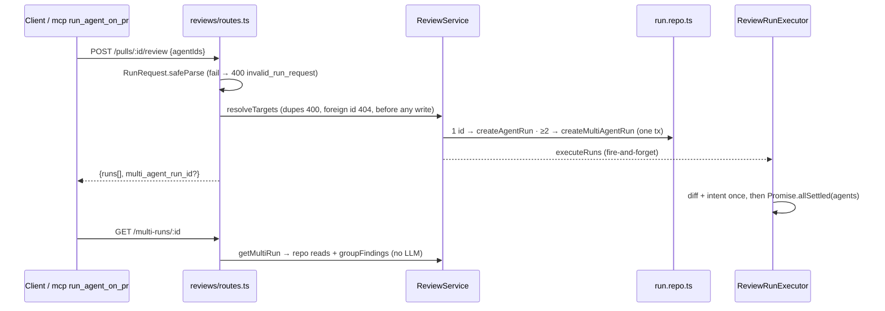

# 0018 — Multi-Agent Review

**Status:** ready
**Source:** specs/spec-0004-multi-agent-review.md
**Execution mode:** multi-agent — chosen by the user (wave 1 contracts, wave 2 server ∥ client; e2e flows by test-writer in the run-sdd test phase)
**Citations valid as of:** `139aa48` (dirty tree: untracked `specs/spec-0004-multi-agent-review.md`, `specs/images/spec-0004/`, `docs/plans/0018-multi-agent-review.md`)

## Goal
Implement SPEC-0004 Multi-Agent Review (`specs/spec-0004-multi-agent-review.md`, Status: approved; Modules: client (owner), server, mcp): AC-1…AC-41, EC-1…EC-14, NFR-1…NFR-6, verified as the spec's *Traceability and verification* table says. The run request becomes only `POST /pulls/:id/review {agentIds}` (D-30). One id runs today's single-agent review. Two or more create a `multi_agent_runs` parent whose child runs execute concurrently. `GET /multi-runs/:id` returns the runs plus file+line groups. The client adds a landing page, Configure run, a Columns/Tabs results page and a PR-page agent picker. mcp's `run_agent_on_pr` sends `{agentIds:[id]}`. Two new deterministic e2e flows cover the new journeys up to (never past) the button that would start a model call. The user does the D-5 measurement by hand.

## Requirements review
- **Source:** the spec above (approved; no `[NEEDS CLARIFICATION]`; no `Superseded by:`). Outranked by the design frames `specs/images/spec-0004/*.png`, as reconciled in the spec's "Design vs brief and data". No rubric. Remote-only prior art is ignored, per the spec.

| ID | Status | Evidence | Resolution | Step | Verification (test) |
|---|---|---|---|---|---|
| AC-1 | clear | `{agentIds}` ≥2 → parent + child FKs; `multi_agent_runs` exists `server/src/db/schema/runs.ts:57-66`; FK new (D-3) | — | 2,3,6 | it `multi-agent-review.it.test.ts` "AC-1 2 and 3 agentIds" (Examples row AC-1) |
| AC-2 | clear | `ReviewRunResponse` `review-api.ts:52-56` gains `multi_agent_run_id` | — | 1,6,14,17 | it on response body; RTL AC-17/AC-19 |
| AC-3 | clear | diff + intent before the loop `run-executor.ts:102-122` | — | 5,8 | it: counting git mock + intent mock called once for 3 agents |
| AC-4 | clear | per-job try/catch `run-executor.ts:130-150` kept per promise | — | 5,8 | it: one agent with no provider key, the others `done` |
| AC-5 | clear | sequential `for…await` `run-executor.ts:124`; rows are already `running` up front (`service.ts:173-183`), so status alone proves nothing | executeRuns concurrent (settled) | 5,8 | it: slow mock records peak in-flight calls ≥2 |
| AC-6 | clear | length 1 → today's path (`service.ts:157-192`) | — | 6,8 | it "AC-6 single id" (Examples row AC-6) |
| AC-7 | clear | `RunSummary` mapping `run.repo.ts:39-69`; `ReviewRecord` reused | — | 1,3,6,8 | it on the `GET /multi-runs/:id` shape |
| AC-8 | clear | pure helper (D-2, D-7, D-22) | — | 4 | unit `multi-run-grouping.test.ts` (6 Examples rows AC-8) |
| AC-9 | clear | members = finding id + agent id + run id | — | 4 | unit: member count = input count, ids intact |
| AC-10 | clear | only `done` agents count (D-8, D-19) | — | 4 | unit (3 Examples rows AC-10) |
| AC-11 | clear | new query; SQL `AVG` skips NULL | — | 7,8 | it `agents-run-estimates.it.test.ts` (2 Examples rows AC-11) |
| AC-12 | conflict (minor) | no GLOBAL group in `client/src/vendor/ui/nav.ts:20-38`; `shell.json` already has `nav.multi-agent` | add a GLOBAL group holding only Multi-Agent Review | 12,14,18 | RTL `nav.test.tsx` + landing; e2e flow 11 |
| AC-13 | clear | `configure-run-no-pr.png` | — | 14,18 | RTL `ConfigureRun.test.tsx`; e2e flow 11 |
| AC-14 | clear | `Agent` has no icon field | `Icon.Cpu` (settled) | 14,18 | RTL; e2e flow 11 |
| AC-15 | clear | null → "—" (`client/AGENTS.md` null ≠ 0) | — | 11,14 | RTL with a null estimate |
| AC-16 | clear | max/sum of known values (D-9) | — | 11,14,18 | unit `run-estimate.test.ts` + RTL; e2e flow 11 (footer present) |
| AC-17 | clear | — | — | 14 | RTL: one POST `{agentIds}`, push `/multi-agent/<id>` |
| AC-18 | clear | `Dropdown` closes on item click (`vendor/ui/kit/Dropdown.tsx`) | hand-rolled panel | 17,18 | RTL `RunReviewDropdown.test.tsx`; e2e flow 12 |
| AC-19 | clear | D-29 | — | 17 | RTL: 2 checked → one POST, push |
| AC-20 | clear | route `/multi-agent/[id]` | — | 15 | RTL with an id param |
| AC-21 | clear | wall clock = max(child `ran_at`+`duration_ms`) − parent `ran_at` (D-26); "parallel" (D-27) | — | 11,15 | RTL header |
| AC-22 | clear | `CircularScore` primitive | — | 15 | RTL `AgentColumn.test.tsx` |
| AC-23 | clear | `useRunEvents` `lib/hooks/reviews.ts:175` | — | 15 | RTL with a mocked hook |
| AC-24 | clear | stream end → `refetch()` (`RunStatus.tsx` pattern) | — | 15 | RTL |
| AC-25 | clear | — | — | 15 | RTL failed child |
| AC-26 | clear | `FindingCard` reused unchanged (D-11, D-16) | — | 10,15 | RTL `AgentTabs.test.tsx` |
| AC-27 | clear | `useFindingAction` `reviews.ts:148-172` | — | 15 | RTL mocked fetch |
| AC-28 | clear | drawer takes `runId` | — | 10,15 | RTL |
| AC-29 | clear | `running` prop exists (`RunTraceDrawer.tsx:27,41`), never passed by the PR page (`page.tsx:229-237`) | — | 15 | RTL running child |
| AC-30 | clear | unchanged drawer body | — | 10,15 | RTL; manual frame compare (user) |
| AC-31 | clear | failed runs get a buffer trace (`run-executor.ts:95-97`) | — | 15 | RTL failed child |
| AC-32 | clear | move only + opt-in prop | — | 10 | existing `RunTraceDrawer.test.tsx` green |
| AC-33 | clear | participating agents only (D-4) | — | 16 | RTL `DisagreementBlock.test.tsx` |
| AC-34 | clear | — | — | 16 | RTL |
| AC-35 | clear | client filter on `group.conflict` | — | 16 | RTL (Examples AC-10 row 3 "hidden when on") |
| AC-36 | clear | `usePrReviews` newest first → first per `agent_id`, else description | — | 14 | RTL |
| AC-37 | clear | set in the handler, not an effect | — | 14,17,18 | RTL on both surfaces; e2e flows 11, 12 |
| AC-38 | clear | `{agentIds:[id]}` (D-30) | — | 17 | RTL: body `{agentIds:[id]}`, no push |
| AC-39 | clear | no selection timestamp | tie → agent list order (settled); server orders `runs[]` by `agents.created_at, agents.id` | 3,16 | RTL WARNING+SUGGESTION |
| AC-40 | clear | mcp hand-types the body `mcp/src/modules/reviews/repository.ts:63`; doc `ports.ts:51`; `repositories.test.ts:89-99` asserts `{agentId}` today; `tools.test.ts:93` fake ignores the body | — | 9 | mcp `repositories.test.ts` + `tools.test.ts` body assertion; existing tests green |
| AC-41 | clear | "Run all" item `RunReviewDropdown.tsx:72-77` | remove; default checked set = all enabled | 17,18 | RTL: no "Run all"; default submit sends every enabled id; e2e flow 12 |
| EC-1 | conflict (code) | body-schema failures → 422 `validation_error` (`app.ts:126-137`); spec wants 400 `invalid_run_request` | route body is permissive; the route `safeParse`s `RunRequest` and throws `AppError('invalid_run_request', …, 400)` | 1,6,8 | it `{}` and `{agentIds:[]}` → 400 code, 0 rows |
| EC-2 | clear | resolve every id before any write | — | 6,8 | it (Examples row EC-2) |
| EC-3 | conflict (code) | `z.object` strips unknown keys, so `{agentIds,all}` would pass; schema errors give 422 | `RunRequest.strict()` + the same route `safeParse` → 400 | 1,6,8 | it (both Examples rows EC-3) |
| EC-4 | clear | D-23 | service → 400 `invalid_run_request` | 6,8 | it |
| EC-5 | clear | `failAll` `run-executor.ts:79-111`; `loadDiff` falls back to `pr_files` (`diff-loader.ts:19-29`) | test must make both fail | 5,8 | it: every child `failed` "Failed to load PR diff…" |
| EC-6 | clear | workspace-scoped read | — | 3,6,8 | it, two workspaces |
| EC-7 | clear | SSE replay + `useRunEvents` resubscribes on mount | — | 15 | RTL replayed events |
| EC-8 | clear | end = start when `end_line` null | — | 4 | unit (Examples row EC-8) |
| EC-9 | clear | — | — | 16 | RTL |
| EC-10 | clear | — | — | 16 | RTL |
| EC-11 | clear | — | — | 15 | RTL |
| EC-12 | clear | — | — | 14,17,18 | RTL; e2e flow 12 (Clear → button disabled) |
| EC-13 | conflict (minor) | dropdown text hardcoded English (`RunReviewDropdown.tsx:61`), which breaks NFR-6 | move to `prReview.json` | 13,14,17 | RTL |
| EC-14 | clear | `useRunTrace` `retry:false` (`lib/hooks/trace.ts:17`); server INSIGHTS 2026-09-19 | opt-in `awaitTrace` (settled) | 10 | RTL 404 then 200 |
| NFR-1 | clear | GET paths call no LLM | — | 6,7,8 | it: throwing mock during GETs |
| NFR-2 | clear | sort before union | — | 4 | unit: shuffled input, identical output |
| NFR-3 | clear | `lib/format-usd.ts` already "—" | — | 11,14,15,17 | RTL null cost/duration |
| NFR-4 | clear | `workspaceId` in every new query | — | 3,6,7,8 | it, two workspaces |
| NFR-5 | clear | same route config `routes.ts:45` | — | 6,8 | it under `NODE_ENV=development` (11th POST → 429) |
| NFR-6 | clear | next-intl namespaces | — | 13–17 | RTL renders from messages |

**Examples coverage** — every row of the spec's Examples table, by test title prefix:
- **`server/test/multi-run-grouping.test.ts` (unit):** AC-8 r1 "3 members at ratelimit.ts:52"; AC-8 r2 "gap 3 joins"; AC-8 r3 "gap 4 splits"; AC-8 r4 "transitive 10↔13↔16"; AC-8 r5 "27/28 one group despite topic"; AC-8 r6 "paths compared exactly (config/Config)"; EC-8 "null end line, gap 2"; AC-10 r1 "done agent did not flag"; AC-10 r2 "severities differ"; AC-10 r3 "same severity, all flagged → not a conflict".
- **`server/test/multi-agent-review.it.test.ts`:** AC-1 "A,B,C → 1 parent, 3 children, multi_agent_run_id"; AC-6 "[A] → FK NULL, no parent, no field"; EC-3 "{agentId:A} and {all:true} → 400, 0 rows"; EC-3 "{agentIds:[A,B], all:true} → 400, 0 rows"; EC-2 "[A, C from V] → 404, 0 rows".
- **`server/test/agents-run-estimates.it.test.ts`:** AC-11 "mean of 10 durations, mean of 8 known costs"; AC-11 "no done run → both null".
- **Client RTL tests:** AC-11 r2 "card shows —" in `ConfigureRun.test.tsx`; AC-10 r3 "hidden when Show only conflicts is on" in `DisagreementBlock.test.tsx`.

## Recommendations
- Order child runs by agent list order, not insert time. Improves: a deterministic AC-39 tie-break with no extra column. Cost: one `LEFT JOIN agents` ORDER BY. Status: accepted (settled).
- Prove AC-5 with an in-flight LLM call counter, not `status='running'`. Improves: the test really proves concurrency. Cost: a test-local `MockLLMProvider` subclass. Status: applied (test technique).
- Return the spec's 400 codes through route-level `safeParse` instead of changing the global 422 handler. Improves: no behaviour change for other routes. Cost: the one route does not use schema-first body validation. Status: applied (technical; the spec fixes the codes).

## Out of scope
- `agent-runner/`, `ci/`, any CI file. Persisting groups or conflicts. History list or PR-page link. Learn, Reply to author, cancel-all, text similarity. Any mcp change beyond the `run_agent_on_pr` body (no tool name, argument, description or output change).
- Editing any spec, `docs/specs/**`, or `client/README.md` route map (left to `doc-writer`).
- Real-LLM runs: no clicking Run Review and no model routes. Mocks only; e2e flows stop before any button that starts a model call. The D-5 measurement is the user's.
- An e2e flow for the results page (needs a seeded multi-agent run; covered by RTL). Editing or reordering existing e2e flows.
- Review, commit, push; `pnpm db:migrate` against the shared volume.

## Context
- **INSIGHTS applied:**
  - **server:** 2026-09-19 (`completeAgentRun` runs before `saveRunTrace` → EC-14, `waitForRunTrace`; stable ORDER BY); 2026-09-20 (override `openrouter` in it-tests; `secrets.get → undefined` gives a deterministic provider failure → AC-4); 2026-09-29 (`no-cross-module-internals` also applies to `import type`); 2026-10-02 (the per-route rate limit only applies under `NODE_ENV=development`).
  - **client:** 2026-09-17 null ≠ 0; 2026-09-18 alias the UI `Severity`; 2026-09-22 mock each hook's exact module path; 2026-10-02 global mutation error toast.
  - **mcp:** 2026-09-26 (`tools.test.ts`'s double is the HTTP client `FakeApiClient`; a nominally typed client needs `as unknown as`); 2026-09-27 (`tools/list` budget is 5,952/6,000 → touch no tool schema or description).
  - **e2e:** 2026-09-17 (deterministic verbs only, no hover; PR #482 seed limits); 2026-09-29 (`agent-browser` is a global install, absent on a fresh machine).
  - **root:** 2026-09-16 shared volume → idempotent migration; 2026-09-29 `rg`/rtk failure in read-only agents.
- **History:** `multi_agent_runs` came with `0000_init.sql` and is empty. The `observability.ts` Multi-Agent stubs have zero consumers (only in `587c46a`). `git log main..` is empty. The latest migration is `0019_nostalgic_timeslip.sql` → next is `0020`. There is no `server/src/modules/ci` in this tree. Latest e2e flow is `10-finding-eval-case` → next are `11`, `12`.
- **Assumptions:** client routes are `/multi-agent`, `/multi-agent/configure[?pr=<prId>]` and `/multi-agent/[id]`; the Columns/Tabs mode is local state; the drawer is opened by `?trace=<runId>`, as `page.tsx:77` does.

## Modules & files
### contracts (both copies, identical text)
- `{server,client}/src/vendor/shared/contracts/platform.ts:294-298` — `RunRequest = z.object({ agentIds: z.array(z.string().uuid()).min(1) }).strict()`; `agentId`/`all` removed
- `{server,client}/src/vendor/shared/contracts/review-api.ts:52-56` — `multi_agent_run_id: z.string().optional()`
- `{server,client}/src/vendor/shared/contracts/observability.ts:18-86` — replace the Multi-Agent stub section with `FindingGroupMember`, `FindingGroup`, `MultiAgentRun`, `AgentRunEstimate`
### server
- `server/src/db/schema/runs.ts:8-47` — `multiAgentRunId` nullable FK (`onDelete: 'set null'`) + index
- `server/src/db/migrations/0020_<drizzle-name>.sql` + `meta/` — generated, then hand-edited to be idempotent
- `server/src/modules/reviews/repository/run.repo.ts` (after `createAgentRun` ~`:117`) — `createMultiAgentRun` (tx), `getMultiAgentRun`, `listRunsForMultiRun`
- `server/src/modules/reviews/repository/review.repo.ts` — `reviewsForRuns(runIds)`
- `server/src/modules/reviews/repository.ts:~186` — façade methods
- `server/src/modules/reviews/multi-run/{helpers,constants}.ts` — new pure grouping
- `server/src/modules/reviews/run-executor.ts:124-151` — concurrent fan-out
- `server/src/modules/reviews/service.ts:100-111,157-192` — `resolveTargets(agentIds)`, multi branch, `getMultiRun`
- `server/src/modules/reviews/routes.ts:11-18,22,41-63` — permissive body + `safeParse` → 400; doc comment; `GET /multi-runs/:id`
- `server/src/modules/agents/{repository,service,routes}.ts` — `GET /agents/run-estimates`
- `server/test/multi-run-grouping.test.ts`, `multi-agent-review.it.test.ts`, `agents-run-estimates.it.test.ts` (new); `reviews.it.test.ts:196,268,301,321,355,372` + any other test posting `{agentId}`/`{all:true}`
### mcp
- `mcp/src/modules/reviews/repository.ts:63` — body `{ agentIds: [agentId] }`
- `mcp/src/modules/reviews/ports.ts:51` — doc comment
- `mcp/test/repositories.test.ts:89-99` — expect `{ agentIds: ['a1'] }`
- `mcp/test/tools.test.ts:59-101` — fake records POST body; new `run_agent_on_pr` body assertion
### client
- `…/pulls/[number]/_components/FindingCard/**` → `client/src/components/finding-card/**` (importers `FindingsPanel/FindingsPanel.tsx`, `SmartDiffViewer/_components/InlineFindings/InlineFindings.tsx`)
- `…/pulls/[number]/_components/RunTraceDrawer/**` → `client/src/components/run-trace-drawer/**` (importer `pulls/[number]/page.tsx:20`) + `awaitTrace` prop
- `client/src/lib/hooks/trace.ts:12-19` — optional `{ awaitMissing }`
- `client/src/lib/hooks/reviews.ts:123-145` — `RunReviewInput {prId, agentIds}`; new `useMultiRun`
- `client/src/lib/hooks/agents.ts` — `useAgentRunEstimates`
- `client/src/lib/run-estimate.ts` (+ `.test.ts`) — new
- `client/src/vendor/ui/nav.ts:20-38` — GLOBAL group; `client/src/components/app-shell/nav.test.tsx`
- `client/messages/en/multiAgent.json` (new); `client/messages/en/prReview.json` (`runReview.*`)
- `client/src/app/multi-agent/{page.tsx,configure/page.tsx,configure/_components/ConfigureRun/**,[id]/page.tsx,[id]/_components/{MultiRunResults,AgentColumn,AgentTabs,DisagreementBlock}/**}` — new
- `…/pulls/[number]/_components/RunReviewDropdown/**` (+ `_components/AgentPickerPanel/`) — checkbox picker
### e2e (new files only — test-writer)
- `e2e/specs/11-multi-agent-configure.flow.json`, `e2e/specs/12-pr-agent-picker.flow.json` — new
- `e2e/README.md` — two rows in the *Coverage* table

## Component map
| Module | Component | Status | Layer | Path | Depends on | Step |
|---|---|---|---|---|---|---|
| shared | `RunRequest`, `ReviewRunResponse` | changed | contract | `vendor/shared/contracts/{platform,review-api}.ts` (both) | — | 1 |
| shared | `MultiAgentRun`, `FindingGroup`, `FindingGroupMember`, `AgentRunEstimate` | changed (replace stub) | contract | `vendor/shared/contracts/observability.ts` (both) | `RunSummary`, `ReviewRecord` | 1 |
| server | `agent_runs.multi_agent_run_id` | new | schema | `db/schema/runs.ts`, migration 0020 | `multi_agent_runs` | 2 |
| server | run/review repo functions | changed | repository | `reviews/repository/{run,review}.repo.ts`, `reviews/repository.ts` | schema | 3 |
| server | `groupFindings` | new | domain | `reviews/multi-run/{helpers,constants}.ts` | contracts | 4 |
| server | `ReviewRunExecutor.executeRuns` | changed | service | `reviews/run-executor.ts` | — | 5 |
| server | `ReviewService` (`resolveTargets`, `runReview`, `getMultiRun`) | changed | service | `reviews/service.ts` | repo, `groupFindings` | 6 |
| server | reviews routes (`POST /pulls/:id/review`, `GET /multi-runs/:id`) | changed | route | `reviews/routes.ts` | service, `RunRequest` | 6 |
| server | agents run estimates | changed | repository/service/route | `agents/{repository,service,routes}.ts` | `agent_runs` | 7 |
| server | multi-agent suites + legacy payloads | new/changed | test | `server/test/*` | all above | 4,8 |
| mcp | `ReviewsApiRepository.startReview` | changed | repository | `mcp/src/modules/reviews/repository.ts` | — | 9 |
| mcp | repositories + tools tests | changed | test | `mcp/test/{repositories,tools}.test.ts` | — | 9 |
| client | `FindingCard` | changed (moved) | cross-route component | `src/components/finding-card/` | `useCreateEvalCaseFromFinding` | 10 |
| client | `RunTraceDrawer` | changed (moved + prop) | cross-route component | `src/components/run-trace-drawer/` | `useRunTrace`, `useRunEvents` | 10 |
| client | `useRunTrace` | changed | api client | `lib/hooks/trace.ts` | — | 10 |
| client | `useRunReview`, `useMultiRun`, `useAgentRunEstimates` | changed/new | api client | `lib/hooks/{reviews,agents}.ts` | contracts | 11 |
| client | run-estimate formatting | new | domain lib | `lib/run-estimate.ts` | `formatUsd` | 11 |
| client | sidebar NAV | changed | shell | `vendor/ui/nav.ts` | — | 12 |
| client | Multi-Agent landing | new | page | `app/multi-agent/page.tsx` | — | 14 |
| client | `ConfigureRun` | new | page + `_components` | `app/multi-agent/configure/**` | `usePulls`, `useAgents`, `useAgentRunEstimates`, `usePrReviews`, `useRunReview` | 14 |
| client | `MultiRunResults`, `AgentColumn`, `AgentTabs` | new | page + `_components` | `app/multi-agent/[id]/**` | `useMultiRun`, `useRunEvents`, `FindingCard`, `RunTraceDrawer`, `useFindingAction` | 15 |
| client | `DisagreementBlock` | new | `_components` | `app/multi-agent/[id]/_components/DisagreementBlock/` | `MultiAgentRun.groups` | 16 |
| client | `RunReviewDropdown`, `AgentPickerPanel` | changed/new | `_components` | `…/pulls/[number]/_components/RunReviewDropdown/**` | `useAgents`, `useAgentRunEstimates`, `useRunReview` | 17 |
| e2e | flows 11, 12 | new | e2e flow | `e2e/specs/1{1,2}-*.flow.json`, `e2e/README.md` | steps 12, 14, 17 | 18 |

## Diagrams
Starting and reading a multi-agent run (target design).

## Steps
1. **Contracts in both vendored copies** (module: contracts; depends on: —; requirements: AC-2, AC-7, AC-11, EC-1, EC-3)
   - Change: `RunRequest` as in *Modules & files*, with `.strict()`. `ReviewRunResponse.multi_agent_run_id` optional. Replace the Multi-Agent stub section in `observability.ts` (AgentStats and Curator untouched): `MultiAgentRun = { id, pr_id, pr_number, pr_title, ran_at, runs: RunSummary[], reviews: ReviewRecord[], groups: FindingGroup[] }`; `FindingGroup = { file, start_line, end_line, conflict, members: FindingGroupMember[] }`; `FindingGroupMember = { finding_id, agent_id, run_id }`; `AgentRunEstimate = { agent_id, avg_duration_ms: number|null, avg_cost_usd: number|null }`. Schema and inferred type share one name. Edit server first, then the client mirror with identical text.
   - Files: `{server,client}/src/vendor/shared/contracts/{platform,review-api,observability}.ts`
   - Skills: `zod`, `typescript-expert`
   - Verify: from the repo root, `diff server/src/vendor/shared/contracts/<f>.ts client/src/vendor/shared/contracts/<f>.ts` prints nothing for each of the 3 files; in `server/`: `pnpm typecheck` + `./node_modules/.bin/vitest run test/contracts.test.ts` (typecheck errors are expected in routes, service and tests until steps 6 and 8).
2. **Schema + migration** (server; 1; AC-1)
   - Change: add `multiAgentRunId: uuid('multi_agent_run_id').references(() => multiAgentRuns.id, { onDelete: 'set null' })` plus an index (move `multiAgentRuns` above `agentRuns` if tsc complains). Run `pnpm db:generate` (or `./node_modules/.bin/drizzle-kit generate </dev/null`). Hand-edit the SQL to `ADD COLUMN IF NOT EXISTS` and `CREATE INDEX IF NOT EXISTS`, with the FK inside a `DO $$ … pg_constraint` guard. Keep `meta/` and the journal. Never run `db:migrate` on the shared volume.
   - Files: `server/src/db/schema/runs.ts`, `server/src/db/migrations/0020_*.sql`, `server/src/db/migrations/meta/*`
   - Skills: `postgresql-table-design`, `drizzle-orm-patterns`
   - Verify: `pnpm typecheck` in `server/`; step 8's it-tests apply the migration (testcontainers).
3. **Repository reads/writes** (server; 2; AC-1, AC-7, AC-39 ordering, EC-6, NFR-4)
   - Change: `createMultiAgentRun(db, {workspaceId, prId, agents})` — one `db.transaction` inserts the parent, then the children (`running`, `local`, FK set); returns `{multiRunId, runs}`. `getMultiAgentRun(db, workspaceId, id)` joins `pull_requests` for number and title. `listRunsForMultiRun(db, workspaceId, id)` maps like `listRunsForPull` (`run.repo.ts:39-69`), ordered by `agents.created_at, agents.id, agent_runs.id`. `reviewsForRuns(db, runIds)` mirrors `reviewsForPull`. Add the façade methods.
   - Files: `reviews/repository/run.repo.ts`, `reviews/repository/review.repo.ts`, `reviews/repository.ts`
   - Skills: `onion-architecture`, `drizzle-orm-patterns`
   - Verify: `pnpm typecheck` + `pnpm arch:check` in `server/`
4. **Pure grouping helper + unit tests** (server; 1; AC-8, AC-9, AC-10, EC-8, NFR-2)
   - Change: `groupFindings(findings, runs)` with findings `{id, agent_id, run_id, file, start_line, end_line|null, severity}` and runs `{run_id, agent_id, status}`. Sort by file, start, end, run order, id. Union same-file pairs whose gap ≤ `GROUP_LINE_GAP = 3`, transitively. `conflict` = a `done` participant has no member, or the members' severities differ. No I/O imports. Test titles follow *Examples coverage*.
   - Files: `reviews/multi-run/helpers.ts`, `reviews/multi-run/constants.ts`, `server/test/multi-run-grouping.test.ts`
   - Skills: `onion-architecture`
   - Verify: `./node_modules/.bin/vitest run test/multi-run-grouping.test.ts` in `server/`
5. **Concurrent executor** (server; —; AC-3, AC-4, AC-5, EC-5)
   - Change: replace the `for…await` at `run-executor.ts:124-151` with `await Promise.allSettled(jobs.map(async ({agent, runId}) => { same body + same try/catch }))`. Diff, intent and `failAll` are unchanged, before the fan-out. Unconditional: a single-job call behaves as today, and only `reviews` uses the executor.
   - Files: `reviews/run-executor.ts`
   - Skills: `onion-architecture`
   - Verify: `pnpm typecheck` in `server/` (behaviour proven in step 8)
6. **Service + routes** (server; 1,3,4,5; AC-1, AC-2, AC-6, AC-7, EC-1, EC-2, EC-3, EC-4, EC-6, NFR-1, NFR-4, NFR-5)
   - Change, route side: replace `RunRequestBody` (`routes.ts:11-18`) with a permissive body schema. The handler does `RunRequest.safeParse(req.body ?? {})`; on failure it throws `AppError('invalid_run_request', 'Provide agentIds: a non-empty list of agent ids', 400)` — covers missing, empty, malformed-uuid, and the removed `agentId`/`all` fields via `.strict()`. Forward `parsed.data.agentIds` (drop the spread at `:52-55`) and update the doc comment at `:22`.
   - Change, service side: `resolveTargets(workspaceId, agentIds)` — duplicates → `AppError('invalid_run_request', …, 400)`; resolve every id with `agents.getById` before any write; a missing id → `NotFoundError`. `runReview`: length 1 → today's path, no `multi_agent_run_id`; length ≥2 → `createMultiAgentRun`, response carries `multi_agent_run_id`. `getMultiRun(workspaceId, id)`: parent + runs + reviews (`reviewToDto`) + `groupFindings`; 404 if missing or in another workspace.
   - Change, new route: `GET /multi-runs/:id` with `IdParams`, `getContext` and one service call. No new rate-limit config (`:45` reused).
   - Files: `reviews/service.ts`, `reviews/routes.ts`
   - Skills: `onion-architecture`, `fastify-best-practices`, `zod`, `security`
   - Verify: `pnpm typecheck` + `pnpm arch:check` in `server/`
7. **Run estimates** (server; 1; AC-11, NFR-1, NFR-4)
   - Change: `AgentsRepository.runEstimates(workspaceId)` — per workspace agent, its last 10 `done` runs by `ran_at desc` → `AVG(duration_ms)`, `AVG(cost_usd)` (NULL skipped; NULL when there is no data). Service passthrough. `GET /agents/run-estimates`, registered before `/agents/:id`.
   - Files: `agents/repository.ts`, `agents/service.ts`, `agents/routes.ts`
   - Skills: `onion-architecture`, `drizzle-orm-patterns`, `fastify-best-practices`
   - Verify: `pnpm typecheck` + `pnpm arch:check` in `server/`
8. **Server integration tests + legacy payloads** (server; 2–7; AC-1…AC-7, AC-11, EC-1…EC-6, NFR-1, NFR-4, NFR-5)
   - Change: `multi-agent-review.it.test.ts`, set up like `reviews.it.test.ts:130-146` (always override `openrouter`). Cases: the Examples rows as in *Examples coverage*; EC-1/EC-4 `{}` and `{agentIds:[]}` → 400 `invalid_run_request`, duplicate ids → 400, 0 rows written in each; AC-3 counting git/intent mocks called once; AC-4 a no-key agent fails while the others reach `done`; AC-5 a slow `MockLLMProvider` subclass records peak in-flight calls ≥2; EC-5 the git mock throws AND the `pr_files` fallback rejects (e.g. a test-local `ReviewRepository` subclass whose `getPrFiles` rejects, with the executor built from `app.container` as `ReviewService` builds it) → every child `failed` with "Failed to load PR diff…"; EC-6/NFR-4 two workspaces; NFR-1 a throwing mock during the GETs; NFR-5 11 multi-agent POSTs under `NODE_ENV=development` → the 11th gets 429. Use `waitForPrRuns` and `waitForRunTrace`.
   - Change: `agents-run-estimates.it.test.ts` — both Examples rows AC-11.
   - Change, legacy payloads: migrate every `{agentId}` / `{all:true}` POST in `server/test/` to `{agentIds:[…]}`. In `reviews.it.test.ts` that is `:196,268,301,321,355,372`; `:368-377` becomes a run with every enabled agent's id, asserting `multi_agent_run_id`.
   - Files: the three new suites, `server/test/reviews.it.test.ts` and other files with legacy payloads
   - Skills: `onion-architecture`, `drizzle-orm-patterns`
   - Verify: `pnpm test` in `server/`, with skipped = 0 (Docker); otherwise report "not verified".
9. **mcp `run_agent_on_pr` body** (mcp; 1 — the shape only, no import; AC-40)
   - Change: `startReview` posts `{ agentIds: [agentId] }`; update the `ports.ts:51` comment. Update `repositories.test.ts:89-99`. In `tools.test.ts`, make `FakeApiClient.post` record its body and add a `run_agent_on_pr` case asserting `{agentIds:['agent-1']}`. Tool names, schemas and descriptions are unchanged (tools/list budget).
   - Files: `mcp/src/modules/reviews/{repository,ports}.ts`, `mcp/test/{repositories,tools}.test.ts`
   - Skills: `onion-architecture`
   - Verify: in `mcp/` (npm): `npm ci` if `node_modules` is missing (never pnpm), then `npm test` + `npm run typecheck`.
10. **Promote FindingCard + RunTraceDrawer; EC-14** (client; —; AC-26, AC-28, AC-30, AC-32, EC-14)
    - Change: move both folders unchanged to `src/components/finding-card/` and `src/components/run-trace-drawer/`. Switch the moved files to `@/lib/...` imports, and fix the message imports and `vi.mock` paths in the moved tests. Update the 3 importers. `useRunTrace(runId, enabled, {awaitMissing})` retries only on a 404 (~5 tries, 1 s apart). The drawer gets `awaitTrace?: boolean` (default false) and keeps its loading note while retrying. The PR page does not pass it.
    - Files: as listed under client; plus the EC-14 case in `run-trace-drawer/RunTraceDrawer.test.tsx`
    - Skills: `frontend-ui-architecture`, `react-best-practices`, `react-testing-library`
    - Verify: in `client/`: `pnpm install --frozen-lockfile` if `node_modules` is missing, then `pnpm test` + `pnpm typecheck`.
11. **Data hooks + estimate formatting** (client; 1; AC-15, AC-16, AC-17, AC-21, NFR-3)
    - Change: `useRunReview({prId, agentIds})`. `useMultiRun(id)` — key `["multi-run", id]`, polls every 4 s while any run is `running`. `useAgentRunEstimates()` — key `["agent-run-estimates"]`. `lib/run-estimate.ts`: `formatSeconds(ms|null)`, `footerEstimate`, `wallClockMs`. Contracts are imported as types only. tsc flags any remaining caller of the old input.
    - Files: `lib/hooks/reviews.ts`, `lib/hooks/agents.ts`, `lib/run-estimate.ts`, `lib/run-estimate.test.ts`
    - Skills: `frontend-ui-architecture`, `typescript-expert`, `react-testing-library`
    - Verify: `./node_modules/.bin/vitest run src/lib/run-estimate.test.ts` + `pnpm typecheck` in `client/`
12. **Sidebar GLOBAL entry** (client; —; AC-12)
    - Change: append `{ section: "GLOBAL", items: [{ key: "multi-agent", label: "Multi-Agent Review", icon: <existing IconName>, href: "/multi-agent" }] }`; extend `nav.test.tsx`.
    - Files: `client/src/vendor/ui/nav.ts`, `client/src/components/app-shell/nav.test.tsx`
    - Skills: `frontend-ui-architecture`, `react-testing-library`
    - Verify: `./node_modules/.bin/vitest run src/components/app-shell` in `client/`
13. **Messages** (client; —; NFR-6, EC-13)
    - Change: `messages/en/multiAgent.json` — every string for steps 14–16. `prReview.json` `runReview.{pickAgents,clear,runMulti,noAgents,estimate}`. Drop `runReview.runAll` only if a grep finds no other user.
    - Files: `client/messages/en/multiAgent.json`, `client/messages/en/prReview.json`
    - Skills: `frontend-ui-architecture`
    - Verify: `pnpm test` in `client/`
14. **Landing + Configure run** (client; 11, 13; AC-12, AC-13, AC-14, AC-15, AC-16, AC-17, AC-36, AC-37, EC-12, EC-13, NFR-3)
    - Change: landing `EmptyState` "No agents selected" + Configure run button; `configure/page.tsx` stays thin over `ConfigureRun`. PR select from `usePulls(activeRepo)`, with `?pr=` prefill; the PR-change handler checks the enabled agents. Cards: checkbox, `Icon.Cpu`, name, estimate, summary (latest review per `agent_id` on the PR, else the description). Select all; footer. "Pick a pull request first", "Pick at least one agent", and the no-agents link. Submit: one POST with `agentIds` in agent list order → `router.push('/multi-agent/'+multi_agent_run_id)`.
    - Files: `client/src/app/multi-agent/page.tsx`, `…/configure/page.tsx`, `…/configure/_components/ConfigureRun/{ConfigureRun.tsx,helpers.ts,styles.ts,index.ts,ConfigureRun.test.tsx}`
    - Skills: `frontend-ui-architecture`, `react-best-practices`, `next-best-practices`, `react-testing-library`
    - Verify: `pnpm test` + `pnpm typecheck` in `client/`
15. **Results page: header, Columns, Tabs, trace, actions** (client; 10, 11, 13; AC-20…AC-32, EC-7, EC-11, NFR-3)
    - Change: `[id]/page.tsx` → `MultiRunResults` header (counts, "parallel", PR, Configure run → `?pr=`, Columns/Tabs toggle with Columns first, wall clock, summed known cost). `AgentColumn`: running → `useRunEvents([runId])` + `LiveLogStream`, `refetch()` on the falling edge; done → findings, "N findings" / "No findings"; failed/cancelled → status + error, no ring, "—". `AgentTabs`: summary card + `FindingCard`s; `onAction` → `useFindingAction().mutate({…, prId}, {onSuccess: refetch})`. "View trace" sets `?trace=` and mounts `RunTraceDrawer` with `running` and `awaitTrace`.
    - Files: `client/src/app/multi-agent/[id]/page.tsx`, `…/[id]/_components/{MultiRunResults,AgentColumn,AgentTabs}/**` (`.tsx`, `styles.ts`, `index.ts`, `.test.tsx`, `helpers.ts` where needed)
    - Skills: `frontend-ui-architecture`, `react-best-practices`, `next-best-practices`, `react-testing-library`
    - Verify: `pnpm test` + `pnpm typecheck` in `client/`
16. **Where agents disagree** (client; 15; AC-33, AC-34, AC-35, AC-39, EC-9, EC-10)
    - Change: pure helpers — `rowTitle` (highest severity by `lib/severity.ts` order; a tie goes to the earlier `runs[]` position; line = smallest start) and `cellFor(run, group)` (member → severity + title; `done` with no member → "did not flag"; running/failed/cancelled → status). "Show only conflicts" is local state, initially off. Fewer than 2 `done` runs → the hint instead of rows. Rendered under both modes.
    - Files: `…/[id]/_components/DisagreementBlock/{DisagreementBlock.tsx,helpers.ts,styles.ts,index.ts,DisagreementBlock.test.tsx}`
    - Skills: `frontend-ui-architecture`, `react-best-practices`, `react-testing-library`
    - Verify: `pnpm test` in `client/`
17. **PR page agent picker** (client; 11, 13; AC-2, AC-18, AC-19, AC-37, AC-38, AC-41, EC-12, EC-13, NFR-3, NFR-6)
    - Change: replace `Dropdown` with `_components/AgentPickerPanel` (outside-click close). Keep the trigger, the merged warning and `onRunStart`/`onRunsStarted`/`onRunSettled`. Opening checks the enabled agents. Rows: checkbox, name, "~Ns" / "—". Clear; no "Run all" item. Button disabled at 0. Exactly 1 → `{agentIds:[id]}` and stay on the page (call `onRunsStarted`). 2+ → `{agentIds}`, then `router.push`. "Configure agents…" → `/agents`. Extend the test and its hook mocks (`useAgentRunEstimates`).
    - Files: `…/RunReviewDropdown/{RunReviewDropdown.tsx,RunReviewDropdown.test.tsx,constants.ts,styles.ts}`, `…/RunReviewDropdown/_components/AgentPickerPanel/{AgentPickerPanel.tsx,styles.ts,index.ts}`
    - Skills: `frontend-ui-architecture`, `react-best-practices`, `react-testing-library`
    - Verify: `pnpm test` + `pnpm typecheck` in `client/`
18. **e2e flows for the new journeys** (e2e; agent: `test-writer`, in the run-sdd test phase; depends on 12, 14, 17; AC-12, AC-13, AC-14, AC-16, AC-18, AC-37, AC-41, EC-12)
    - Change: two NEW flows, following `test-writer`'s e2e rules (deterministic verbs only; seeded data; never click a control that starts a model call; never touch existing flows). Put the AC IDs in each flow's `description`, and add both rows to `e2e/README.md` *Coverage*.
      - `11-multi-agent-configure.flow.json`: open `{BASE}/` → wait `/pulls` → click sidebar "Multi-Agent Review" → wait `/multi-agent` → text "No agents selected" → click "Configure run" → wait `/multi-agent/configure` → text "Pick a pull request first" → pick PR "#482 · Add rate limiting to public API endpoints" → seeded agent names visible and checked → footer "parallel fan-out" visible → button "Run multi-agent review" present. Stop — no click on it.
      - `12-pr-agent-picker.flow.json`: open `{BASE}/` → wait `/pulls` → open PR "Add rate limiting to public API endpoints" → wait `/pulls/482` → click "Run Review" → text "Pick agents to run" → seeded agent rows visible → no "Run all" text → click "Clear" → "Run multi-agent review" disabled. Stop — no run.
    - Files: `e2e/specs/11-multi-agent-configure.flow.json`, `e2e/specs/12-pr-agent-picker.flow.json`, `e2e/README.md`
    - Skills: — (rules in `.claude/agents/test-writer.md` and `e2e/AGENTS.md`)
    - Verify: `npm run e2e:hermetic` in `e2e/` (all flows, incl. 01–10 green after the `FindingCard` move). Needs Docker + the global `agent-browser`; if missing, report "written, not run" → manual check.

## Work split
| Wave | Track | Agent | Steps | Files owned | Depends on |
|---|---|---|---|---|---|
| 1 | contracts | implementer | 1 | `{server,client}/src/vendor/shared/contracts/{platform,review-api,observability}.ts` | — |
| 2 | server | implementer | 2, 3, 4, 5, 6, 7, 8, 9 | `server/src/db/**`, `server/src/modules/{reviews,agents}/**`, `server/test/**`, `mcp/src/modules/reviews/{repository,ports}.ts`, `mcp/test/{repositories,tools}.test.ts` | wave 1 |
| 2 | client | implementer | 10, 11, 12, 13, 14, 15, 16, 17 | `client/src/{components/finding-card,components/run-trace-drawer,components/app-shell/nav.test.tsx,lib/**,vendor/ui/nav.ts,app/multi-agent/**,app/repos/[repoId]/pulls/[number]/**}`, `client/messages/en/{multiAgent,prReview}.json` | wave 1 |
| tests | e2e | test-writer | 18 | `e2e/specs/11-*.flow.json`, `e2e/specs/12-*.flow.json`, `e2e/README.md` | wave 2 |

## Skills for implementer
| Step | Skill | Rule from the skill that governs this step |
|---|---|---|
| 1, 6 | `zod` | schema and inferred type share one name; `.strict()` rejects unknown keys; `safeParse` for user input; no `z.any` |
| 1, 11 | `typescript-expert` | contract types imported with `import type` only (client) |
| 2 | `postgresql-table-design` | index FK columns manually; spell out `ON DELETE` |
| 2, 3, 7, 8 | `drizzle-orm-patterns` | multi-row write in one `db.transaction` inside the repository |
| 3–9 | `onion-architecture` | routes → service → repository; no Drizzle in service/routes; `helpers`/`constants` import no I/O; `workspaceId` in every `where`; no cross-module internals, even `import type`; mcp: `repository.ts` owns its HTTP body, `npm test` incl. `architecture.test.ts` |
| 6, 7 | `fastify-best-practices` | validate at the edge; errors via `AppError`, never `reply` in a service; static path before `/:id` |
| 6 | `security` | A01: resolve every `agentIds` id in the workspace before any write; ids are never interpolated into SQL |
| 10–17 | `frontend-ui-architecture` | promote on the second consumer to `src/components/<kebab>/`; thin pages; rules in pure `helpers.ts`; text via i18n |
| 10–17 | `react-best-practices` | derive, don't store (selection set in handlers); fetching only in hooks; no `{n && …}` with 0 |
| 14, 15 | `next-best-practices` | `"use client"` at the leaves; `useParams`/`useSearchParams` in client components |
| 10–17 | `react-testing-library` | userEvent, role queries, 1–3 flow tests per component; mock each hook's exact module path |

## Architecture constraints
- `arch:check`: 0 errors, no new warnings. `run-executor.ts` is existing debt, so add no imports to it. `multi-run/helpers.ts` imports only contracts and `./constants`.
- Contract edits land in both copies with identical text (verified by `diff`). Pre-existing drift elsewhere stays.
- Migration 0020 is new and idempotent (`server/AGENTS.md` "New migrations must be idempotent").
- Server tests go in `server/test/`, with DB-backed ones ending `.it.test.ts`. Client tests are colocated.
- mcp never imports `@devdigest/shared` (`mcp/AGENTS.md`); it hand-types the body. npm only. e2e is npm only.
- Client: shared contracts as types only; null cost/duration → "—", never `?? 0`.

## Do-not-touch that this task hits
- `{server,client}/src/vendor/shared/**`: step 1 edits both deliberately, server first.
- `server/src/db/migrations/**`: only the new `0020_*` + drizzle `meta/`.
- `e2e/specs/*.flow.json`: existing flows untouched; step 18 adds new files only (test-writer's e2e rules).
- Lock files, `devdigest_pgdata`: not touched.

## Verification (whole task)
- `server/`: `pnpm test` (skipped = 0), `pnpm typecheck`, `pnpm arch:check` — green, no new arch warnings.
- `mcp/`: `npm test` (incl. `architecture.test.ts`, tools/list budget), `npm run typecheck` — green.
- `client/`: `pnpm test`, `pnpm typecheck` — green, including the unchanged `RunTraceDrawer`/`FindingCard` tests (AC-32).
- `e2e/`: `npm run e2e:hermetic` — flows 01–12 green (or "not run" with reason).
- Contracts: the three `diff` commands print nothing.
- No real-LLM runs. Manual frame comparison and the D-5 measurement are the user's.

## Risks
- Concurrent `runOneAgent`s share one `RunLogger` parent: check that the per-run `forRun` buffers stay separate (`platform/run-logger.ts`). Stdout lines will interleave.
- Running all enabled agents is now concurrent, so provider rate limits may hit more often.
- D-30 breaks every old caller with a 400. Grep `server/`, `client/`, `mcp/`, `e2e/` for `agentId:` bodies and `all: true`. tsc catches client callers of `useRunReview`; grep for `runReview.runAll`.
- One-transaction inserts give every child the same `ran_at`; step 3 orders by agent, not by `ran_at`.
- The `FindingCard`/`RunTraceDrawer` move is easy to get wrong in `vi.mock` paths; run the full client suite.
- `/agents/run-estimates` sits next to `/agents/:id`; find-my-way prefers static paths, but confirm it.
- `client/` and `mcp/` have no `node_modules` at this sha. Install with each package's own manager without changing its lockfile, and check `git status` for a stray `pnpm-lock.yaml`/`pnpm-workspace.yaml` in `mcp/`.
- e2e flow 12 depends on the panel's visible texts ("Pick agents to run", "Clear"); flow 11 on the seeded agents being enabled. If the seed has no enabled agent, the flow asserts the no-agents state instead.
- Other sessions share this worktree and DB: re-read files before each edit.

## Open questions
- A body mixing `agentIds` with `agentId`/`all` — default: 400 with nothing written, as spec EC-3 and its Examples row state; `.strict()` delivers it. Non-blocking.

## Support requests
- none

## Could not establish
- The full list of old `{agentId}`/`{all:true}` POSTs in `server/test/` beyond the six read in `reviews.it.test.ts`, and other users of `runReview.runAll`; the implementer must grep.
- Whether the shared dev DB already has `agent_runs.multi_agent_run_id` (not checked). The idempotent migration covers either case.
- The exact EC-5 wiring (how to make the `pr_files` fallback reject). The strategy is in step 8; the implementer confirms it against `ReviewService`'s constructor.
- Which `IconName` best matches the design's sidebar icon.

## Insight candidates
- Body-schema failures return 422 `validation_error` (`app.ts:126-137`), and a non-strict `z.object` silently drops removed fields. A spec that demands 400 or "reject the old field" needs `.strict()` plus a route-level `safeParse`.
- `RunTraceDrawer`'s `running` prop is never passed by the PR page (`page.tsx:229-237`).
- All `agent_runs` rows are created `running` up front (`service.ts:173-183`), so "two runs running" proves nothing about concurrency.
- The mcp body assertion lives in `test/repositories.test.ts`; `tools.test.ts`'s `FakeApiClient.post` ignores the body.
