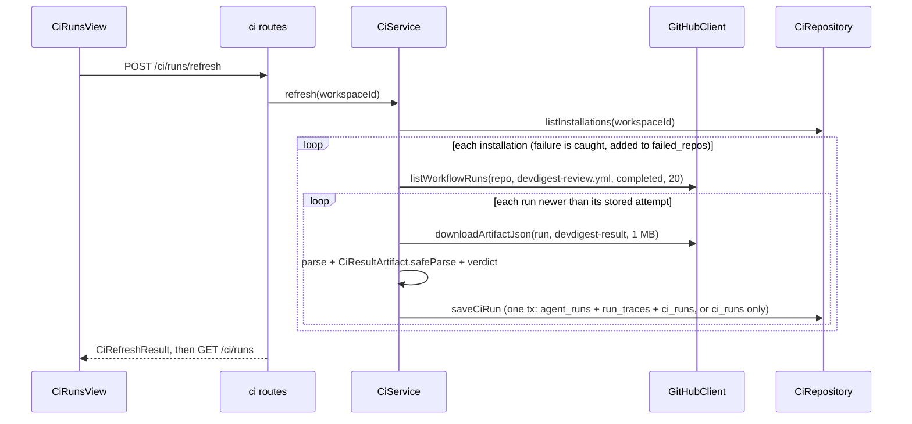
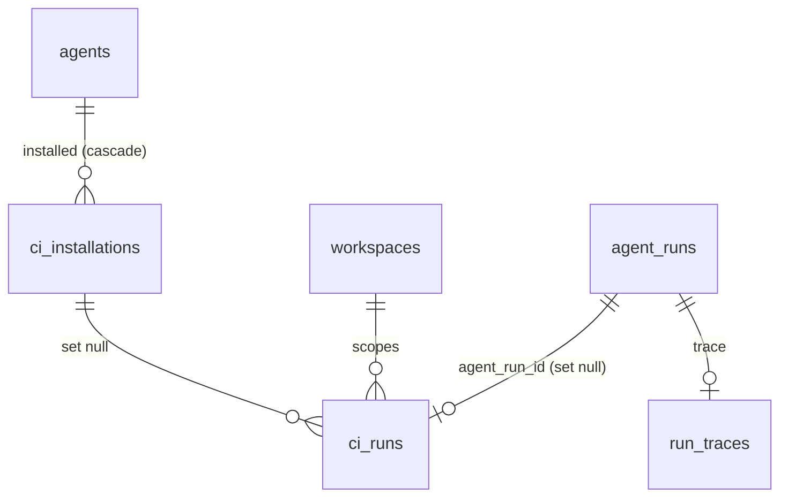

# 0018 — Export to CI

**Status:** ready
**Execution mode:** multi-agent — chosen by the user
**Source:** specs/spec-0005-export-to-ci.md
**Citations valid as of:** `c7b5c9f` + dirty tree (untracked `specs/spec-0005-export-to-ci.md`, `specs/images/spec-0005/`)

## Goal
Implement SPEC-0005 (`specs/spec-0005-export-to-ci.md`, Status: approved). An "Add to CI" wizard turns an agent into repository files and either opens a PR on `devdigest/ci` or downloads them as a zip. The exported workflow runs the bundled `agent-runner`. CI results are pulled back from GitHub Actions artifacts into `agent_runs` (`source = 'ci'`) and shown on a CI Runs page and on the agent's CI tab. Acceptance is the spec's AC-1…AC-32, EC-1…EC-17 and NFR-1…NFR-4. This is a deliberately simple first iteration (spec D-1): pick the simplest option every time.

## Requirements review
- **Source:** `specs/spec-0005-export-to-ci.md` (Status: approved). It is outranked by the design frames in `specs/images/spec-0005/*.png`; the spec already reconciles them in "Inputs and provenance". No rubric was found.

| # | Requirement | Status | Evidence | Resolution |
|---|---|---|---|---|
| AC-1, AC-2, AC-10…AC-14 | wizard steps, target card, Configure/Install content | clear | frames `wizard-*.png`; `client/src/vendor/ui/ExportWizardSteps.tsx` exists | — |
| AC-3 | Preview files incl. `.devdigest/runner/index.js` | clear | no `agent-runner/dist` on branch; `agent-runner/.gitignore` ignores `dist/` | user: `scripts/dev.sh` builds it when missing; EC-7 error stays as the fallback |
| AC-4, AC-20 | only the workflow is editable; Configure regenerates it | clear | — | — |
| AC-5 | manifest YAML parses with `AgentManifest` | clear | schema at `server/src/vendor/shared/contracts/eval-ci.ts:242`; runner parses with `yaml` (`agent-runner/src/manifest.ts`) | user: add `yaml@^2.6.1` to server |
| AC-6 | skill body of the enabled version | clear | `skills.body` is the live version; `AgentsRepository.linkedSkills` `server/src/modules/agents/repository.ts:279` | — |
| AC-7…AC-9, AC-24 | workflow content | clear | runner already reads `DEVDIGEST_POST_AS` (`agent-runner/src/index.ts`) and writes `devdigest-result.json` in cwd | — |
| AC-15, AC-16, EC-3, EC-4 | branch + PR, never the default branch | clear | `GitHubClient.commitFiles`/`findOpenPr`/`openPullRequest` exist (`server/src/adapters/github/octokit.ts:245,264,332`); `repos.default_branch` is never set from GitHub (`server/src/modules/repos/repository.ts:34`) | the default branch comes from the GitHub API (new port method) |
| AC-17 | zip download | clear | `fflate` already a server dep (`server/package.json`) | — |
| AC-18, AC-22 | installation incl. `agent_version` | missing in schema | `server/src/db/schema/ci.ts:4` has no version column | new migration (step 3) |
| AC-19 | OpenRouter model id mapping | clear | — | — |
| AC-21, AC-23 | CI tab, Fail CI on via the agent update | clear | `useUpdateAgent` `client/src/lib/hooks/agents.ts:62`; i18n key `editor.tabs.ci` exists in `client/messages/en/agents.json:52` | — |
| AC-25…AC-29 | artifact pull, `agent_runs` row, trace, validation | clear | `agent_runs.source` exists (`server/src/db/schema/runs.ts:33`); `ci_runs` pre-created (`server/src/db/schema/ci.ts:14`) | — |
| AC-30…AC-32 | CI Runs page, verdict, refresh | clear | `activeKeyFor` already maps `/ci-runs` (`client/src/components/app-shell/helpers.ts`); `client/messages/en/ci.json` has `runs.*` | — |
| EC-9 vs AC-31 | invalid artifact | ambiguous | EC-9 forbids an `agent_runs` row; AC-31 says "Failed" | user: `ci_runs` row with verdict Failed, no `agent_runs` row |
| EC-1, EC-2, EC-5…EC-8, EC-10…EC-17 | edge states | clear | — | — |
| NFR-1…NFR-4 | secrets, 1 MB cap, PR feed untouched, zero LLM calls | clear | PR timeline/cost queries filter by `pr_id` (`server/src/modules/reviews/repository/run.repo.ts:49`); CI rows are stored with `pr_id` NULL | — |

## Recommendations
- Store CI rows with `pr_id = NULL` instead of matching a local PR. This gives NFR-3 without touching the PR feed. Cost: CI runs never link to a local PR page (not required). Status: adopted as a technical decision, not a requirement change.
- Snapshot the exported manifest on the installation. Ingest then knows `ci_fail_on`, model and skills without depending on the live agent. Cost: one jsonb column. Status: adopted (user did not object).
- Future iteration: delete stale `.devdigest/agents/*.yaml` and `skills/*.md` from the `devdigest/ci` branch on re-export. Today a renamed agent leaves two manifests and the runner refuses to run. Status: not asked; listed under Risks.

## Out of scope
- No review, commit, push or PR by the implementer. No edits to any spec or to `docs/specs/**`.
- No changes to `agent-runner/src/**`, the multi-agent run service, the PR feed (`pulls`, `reviews` run queries) or `e2e/specs/*.flow.json`.
- None of the spec's non-goals: other CI targets, live secret checks, the published action, "Update CI config", a repo picker, zip installations, background polling, inbound result endpoint, `memory.jsonl`, CI Runs filters.
- Future iteration: removing stale manifest/skill files on re-export, a CI run trace drawer, and pagination beyond the latest 20 completed runs per repository per refresh.

## Context
- **INSIGHTS applied:**
  - root `INSIGHTS.md` 2026-09-16 (install `reviewer-core` before typecheck/build), 2026-09-16 `ERR_PNPM_IGNORED_BUILDS` (use `./node_modules/.bin/*`), 2026-09-16 shared volume ahead of branch (never `db:migrate`), 2026-09-29 (`rg` broken in read-only agents, so call sites marked "check" need verification).
  - `server/INSIGHTS.md` 2026-09-19 idempotent migrations, 2026-09-20 grep `server/test` before reshaping a contract, 2026-09-27 lazy `container.github()` must be resolved once (blast `PriorPrSource`), 2026-09-29 baseline 0 errors / 15 warnings, 2026-09-29 `no-cross-module-internals` applies to `import type` too, 2026-09-20 `.it` tests must override `openrouter`.
  - `client/INSIGHTS.md` 2026-09-19 type-only shared imports, 2026-09-19 `Button`/`Modal` traps, 2026-09-17 null cost renders "—", 2026-10-02 global mutation error toast (inline errors also show a toast), 2026-09-27 no `user-event` dependency, so use `fireEvent`.
  - `agent-runner/insights/INSIGHTS.md` 2026-07-08 (build needs `reviewer-core/node_modules`; the `DEVDIGEST_POST_AS` gap, now closed by AC-8).
- **History:** the fork branches `upstream/full-functionality` (`488acfb` committed an ncc dist containing an extra `310.index.js` chunk) and `upstream/emdash/export-to-ci-4sp` (`1980dea`). The spec says these were read for corner cases only. No `DROP COLUMN` touches the CI tables.
- **Assumptions:**
  - `ci_installations`/`ci_runs` in the shared dev DB may hold rows from other branches, so every new column is nullable and every read filters by `workspace_id`.
  - Node ≥ 22 in Actions runs the ESM bundle (`actions/setup-node@v4`, node 22).

## Modules & files
### contracts
- `server/src/vendor/shared/contracts/eval-ci.ts:219-329` — reshape the Export-to-CI section: `CiTrigger`, `CiVerdict`, `CiPreviewInput`, `CiPreview`, `CiExportInput` (repo regex, enum triggers, optional `workflow`, drop `base`), `CiInstallation` (+`agent_version`, `latest_run`), `CiRun` (page row), `CiRefreshResult`
- `client/src/vendor/shared/contracts/eval-ci.ts` — mirror the same section, including `AgentManifest` and the `Provider`/`CiFailOn` imports
### server
- `server/src/vendor/shared/adapters.ts:146` — `GitHubClient` gains `getDefaultBranch`, `listWorkflowRuns`, `downloadArtifactJson` (server copy only)
- `server/src/adapters/github/octokit.ts` — implement the three methods (artifact unzip with `fflate`, 1 MB cap)
- `server/src/adapters/mocks.ts:138` — `MockGitHubClient` implements them from options
- `server/src/adapters/runner-bundle/fs.ts` (new) — reads the bundle file, returns null when absent
- `server/src/platform/config.ts` — `runnerBundlePath` (optional env `DEVDIGEST_RUNNER_BUNDLE`, default resolved from `import.meta.url` to `agent-runner/dist/index.js`)
- `server/src/platform/container.ts:46,202` — `runnerBundle` getter + `ContainerOverrides.runnerBundle`
- `server/src/db/schema/ci.ts` — new columns and indexes; new migration `server/src/db/migrations/0021_*.sql` + `meta/`
- `server/src/modules/ci/{constants,helpers,ports,repository,service,routes}.ts` (new)
- `server/src/modules/index.ts` — register `ci`
- `server/package.json`, `server/pnpm-lock.yaml` — `yaml@^2.6.1` via `pnpm add`
- `server/test/ci-helpers.test.ts`, `server/test/ci-service.test.ts`, `server/test/ci-export.it.test.ts`, `server/test/ci-runs.it.test.ts` (new)
- `scripts/dev.sh` (~line 86) — build `agent-runner` when `agent-runner/dist/index.js` is missing
### client
- `client/src/lib/api.ts:65` — a blob POST for the zip
- `client/src/lib/hooks/ci.ts` (new), `client/src/lib/hooks/index.ts` — export it
- `client/src/app/agents/_components/AgentEditor/{AgentEditor.tsx:45-48,constants.ts:11}` — CI tab; `CI_FAIL_ON_VALUES` promoted from `ConfigTab/constants.ts:10`
- `client/src/app/agents/_components/AgentEditor/_components/CiTab/` (new) and `.../ExportCiWizard/` (new, steps under `_components/`)
- `client/src/app/ci-runs/page.tsx` + `client/src/app/ci-runs/_components/CiRunsView/` (new)
- `client/src/vendor/ui/nav.ts:21-38` — "CI Runs" item (precedent: Eval Dashboard was added here in `f4aabec`)
- `client/messages/en/ci.json` — rewrite `exportWizard`, `ciTab`, `runs` keys to the spec copy

## Component map
| Module | Component | Status | Layer | Path | Depends on | Step |
|---|---|---|---|---|---|---|
| contracts | CI contracts (`CiExportInput`, `CiPreview*`, `CiInstallation`, `CiRun`, `CiVerdict`, `CiTrigger`, `CiRefreshResult`) | changed | contract | `server/src/vendor/shared/contracts/eval-ci.ts` | `AgentManifest` | 1 |
| contracts | client mirror | changed | contract | `client/src/vendor/shared/contracts/eval-ci.ts` | server copy | 2 |
| server | `ci_installations`, `ci_runs` | changed | schema | `server/src/db/schema/ci.ts` | `agent_runs`, `workspaces` | 3 |
| server | `GitHubClient` port + Octokit + mock | changed | adapter | `server/src/vendor/shared/adapters.ts`, `server/src/adapters/github/octokit.ts`, `server/src/adapters/mocks.ts` | `fflate` | 4 |
| server | ci constants/helpers/ports | new | domain | `server/src/modules/ci/{constants,helpers,ports}.ts` | `AgentManifest`, `CiResultArtifact`, `yaml`, `fflate` | 5 |
| server | runner bundle adapter + config + container | new / changed | adapter | `server/src/adapters/runner-bundle/fs.ts`, `server/src/platform/{config,container}.ts` | `RunnerBundleSource` port | 6 |
| server | `CiRepository` | new | repository | `server/src/modules/ci/repository.ts` | schema | 7 |
| server | `CiService` | new | service | `server/src/modules/ci/service.ts` | ports | 8 |
| server | ci routes + registration | new / changed | route | `server/src/modules/ci/routes.ts`, `server/src/modules/index.ts` | `CiService`, `container.agentsRepo`, `container.reposRepo` | 8 |
| server | ci tests | new | test | `server/test/ci-*.test.ts` | all above | 5, 8, 9 |
| server | dev bootstrap | changed | script | `scripts/dev.sh` | `agent-runner` build | 10 |
| client | api blob + ci hooks | new / changed | api client / hook | `client/src/lib/api.ts`, `client/src/lib/hooks/ci.ts`, `client/src/lib/hooks/index.ts` | contracts | 11 |
| client | `ExportCiWizard` (+ Target/Preview/Configure/Install steps, `useExportCiWizard`) | new | `_components` | `client/src/app/agents/_components/AgentEditor/_components/ExportCiWizard/` | ci hooks, `useActiveRepo`, `ExportWizardSteps`, `Modal` | 12 |
| client | `CiTab` | new | `_components` | `client/src/app/agents/_components/AgentEditor/_components/CiTab/` | `ExportCiWizard`, `useCiInstallations`, `useUpdateAgent` | 13 |
| client | `AgentEditor` tabs | changed | `_components` | `client/src/app/agents/_components/AgentEditor/{AgentEditor.tsx,constants.ts}` | `CiTab` | 13 |
| client | `ConfigTab` constants | changed | `_components` | `.../ConfigTab/constants.ts`, `.../ConfigTab/ConfigTab.tsx` | `AgentEditor/constants.ts` | 13 |
| client | `/ci-runs` page + `CiRunsView` | new | page / `_components` | `client/src/app/ci-runs/` | `useCiRuns`, `useRefreshCiRuns`, `AppShell`, `githubPrUrl`, `formatUsd` | 14 |
| client | sidebar nav | changed | shared ui | `client/src/vendor/ui/nav.ts` | — | 14 |
| client | `ci.json` copy | changed | i18n | `client/messages/en/ci.json` | — | 12, 13, 14 |

## Diagrams
CI refresh (AC-25…AC-29, EC-8, EC-9, EC-15, EC-17). All network calls finish before the per-run transaction.

Data model after the migration:

## Steps
1. **Server CI contracts** (module: contracts; depends on: —; requirements: AC-3, AC-15, AC-17, AC-18, AC-21, AC-22, AC-30, AC-31, AC-32, EC-15)
   - Change: in the "Export-to-CI + CI Runs" section of `eval-ci.ts`:
     - Add `CiTrigger` (enum `opened|synchronize|reopened`) and `CiVerdict` (`passed|changes_requested|failed`).
     - `CiExportInput`: `repo` matches `^[\w.-]+/[\w.-]+$`; `triggers` is `z.array(CiTrigger).min(1)`, default `[opened, synchronize]`; add optional `workflow` (string, max 100k); remove `base`; keep `target`, `action` and `post_as`.
     - Add `CiPreviewInput` = pick `triggers` + `post_as`, and `CiPreview = { files: CiFile[] }`.
     - `CiInstallation` adds `agent_version` (int, nullable) and `latest_run` (`{ verdict, ran_at }` or null).
     - `CiRun` becomes the page row: `id, repo, pr_number, agent_name, verdict, findings_count, cost_usd, duration_ms, job_url, ran_at` (nullable where unknown).
     - Add `CiRefreshResult = { ingested, failed_repos: string[] }`.
     - Leave `AgentManifest` and `CiResultArtifact` unchanged; `agent-runner` aliases to them.
     - Before reshaping, check for consumers: `rg -n 'CiRun\b|CiInstallation|CiExportInput|CiExport\b' server client mcp`.
   - Files: `server/src/vendor/shared/contracts/eval-ci.ts`
   - Skills: `zod`, `typescript-expert`
   - Verify: `./node_modules/.bin/tsc --noEmit -p tsconfig.json` and `./node_modules/.bin/vitest run test/contracts.test.ts` in `server/`; `./node_modules/.bin/tsc --noEmit -p tsconfig.json` in `agent-runner/` once its deps are installed
2. **Client contract mirror** (module: contracts; depends on: 1; requirements: same as step 1)
   - Change: copy the whole Export-to-CI section verbatim into the client copy, including `AgentManifest` and its `Provider`/`CiFailOn` imports.
   - Files: `client/src/vendor/shared/contracts/eval-ci.ts`
   - Skills: `zod`
   - Verify: `diff server/src/vendor/shared/contracts/eval-ci.ts client/src/vendor/shared/contracts/eval-ci.ts` from the repo root shows only the pre-existing `ConformanceInput.provider` drift; `pnpm typecheck` in `client/`
3. **Schema + migration** (module: server; depends on: 1; requirements: AC-18, AC-22, AC-27, AC-30, EC-8, EC-9, EC-14)
   - Change in `ci.ts`:
     - `ci_installations` adds `agent_version integer` (nullable) and `manifest jsonb` (the exported `AgentManifest` snapshot).
     - `ci_runs` adds `workspace_id uuid` (FK workspaces, cascade; nullable for the shared volume), `repo text`, `github_run_id bigint`, `run_attempt integer`, `agent_run_id uuid` (FK `agent_runs`, set null).
     - New indexes: unique `(workspace_id, github_run_id)` and `(workspace_id, ran_at desc)`.
   - Migration: generate it, then hand-edit to `ADD COLUMN IF NOT EXISTS` / `CREATE [UNIQUE] INDEX IF NOT EXISTS`, with constraints guarded by `DO $$ … pg_constraint`. If Docker is up, check `\d ci_runs` and `\d ci_installations` first.
   - Files: `server/src/db/schema/ci.ts`, `server/src/db/migrations/0021_*.sql`, `server/src/db/migrations/meta/*`
   - Skills: `postgresql-table-design`, `drizzle-orm-patterns`
   - Verify: `./node_modules/.bin/drizzle-kit generate </dev/null` in `server/`, then `pnpm typecheck`. Then apply it with `pnpm db:migrate` against the running Docker DB (user-approved). The shared DB may differ from this branch because another worktree migrates it too: expected, do not "fix" drift.
4. **GitHub port: default branch, workflow runs, artifact** (module: server; depends on: —; requirements: AC-15, AC-25, NFR-2, EC-2, EC-15)
   - Change: add three methods to `GitHubClient`:
     - `getDefaultBranch(repo)`.
     - `listWorkflowRuns(repo, workflowFile, limit)` returns `{ id, attempt, head_sha, html_url, pr_number|null, started_at }`, completed `pull_request` runs, newest first.
     - `downloadArtifactJson(repo, runId, name, maxBytes)` returns `{ kind: 'missing' } | { kind: 'too_large' } | { kind: 'ok', text }`. It refuses before download when `size_in_bytes > maxBytes`, unzips with `fflate`, and refuses again when the unzipped `devdigest-result.json` is over `maxBytes`.
   - Implement them in Octokit (wrapped in `withRetry`/`withTimeout`) and in `MockGitHubClient` (new options: `defaultBranch`, `workflowRuns`, `artifacts` keyed by run id, `commitError`).
   - Never put token or headers into error messages.
   - Files: `server/src/vendor/shared/adapters.ts`, `server/src/adapters/github/octokit.ts`, `server/src/adapters/mocks.ts`
   - Skills: `onion-architecture`, `typescript-expert`, `security`
   - Verify: `pnpm typecheck` and `./node_modules/.bin/vitest run test/adapters.test.ts` in `server/`
5. **ci domain: constants, helpers, ports + `yaml` dependency** (module: server; depends on: 1; requirements: AC-3, AC-5, AC-6, AC-7, AC-8, AC-9, AC-19, AC-24, AC-29, AC-31, EC-5, EC-9, NFR-1, NFR-2)
   - Change:
     - Run `pnpm add yaml@^2.6.1` in `server/`.
     - `constants.ts`:
       - Paths: `WORKFLOW_PATH`, `RUNNER_PATH`, `CI_BRANCH = 'devdigest/ci'`.
       - PR copy: `PR_TITLE = 'Add DevDigest CI review'` and a static PR body.
       - GitHub artifact and run settings: `ARTIFACT_NAME = 'devdigest-result'`, `MAX_ARTIFACT_BYTES = 1_048_576`, `RUNS_PER_REFRESH = 20`.
     - `helpers.ts` (pure):
       - `slugify` gives `[a-z0-9-]` only and de-duplicates with `-2`, `-3`; path safety depends on this.
       - `toManifest(agent, skillSlugs)` applies the AC-19 model mapping and validates with `AgentManifest.parse`.
       - `manifestYaml` (via `yaml`).
       - `buildWorkflow(triggers, postAs)` is a fixed template with only the enum values substituted:
         - `pull_request` types are the chosen triggers; the job has `if` head repo == `github.repository` (AC-9).
         - Steps: checkout v4, setup-node v4 on node 22, then `run: node .devdigest/runner/index.js`.
         - The run step's env: `OPENROUTER_API_KEY` from `secrets`, `GITHUB_TOKEN` from `secrets.GITHUB_TOKEN`, `GITHUB_REPOSITORY`, `PR_NUMBER` from the event, `DEVDIGEST_POST_AS`.
         - Then `actions/upload-artifact@v4` named `devdigest-result` with `if: always()` and `if-no-files-found: ignore`.
         - No `devdigest/review-action` anywhere.
       - `buildFiles(...)` returns `CiFile[]` where only the workflow has `editable: true`.
       - `buildZip(files)` uses `fflate.zipSync`.
       - `parseResultArtifact(text)` does a guarded `JSON.parse` then `CiResultArtifact.safeParse`.
       - `ciVerdict(counts, ciFailOn)`: never → passed; critical → critical > 0; warning → critical + warning > 0; any → `findings_count > 0`.
       - `isGithubUrl`.
     - `ports.ts`:
       - Interfaces `CiStore`, `RunnerBundleSource` (`read(): Promise<string|null>`) and `CiGitHubResolver` (`resolve(): Promise<GitHubClient>`).
       - Records: `CiInstallationRecord`, `CiRunInput`, `CiRunTrace` `{ kind:'ci', agent_version, model, runner_version, skills, head_sha, github_run_id, run_attempt }`.
       - No Drizzle or Db types.
   - Files: `server/src/modules/ci/{constants,helpers,ports}.ts`, `server/package.json`, `server/pnpm-lock.yaml`, `server/test/ci-helpers.test.ts`
   - Tests (AC IDs in titles): the Examples rows AC-5 (round-trip, `---` and `: ` kept), AC-19, AC-8, AC-31 and EC-9; EC-5 (no skills: empty list, no skill file); AC-9/AC-24 workflow text; NFR-1 (a fixture token string never appears in files or zip); NFR-2 (oversized text refused).
   - Skills: `onion-architecture`, `zod`, `typescript-expert`, `security`
   - Verify: `./node_modules/.bin/vitest run test/ci-helpers.test.ts` and `pnpm typecheck` in `server/`
6. **Runner bundle adapter, config, container** (module: server; depends on: 5; requirements: AC-3, EC-7)
   - Change:
     - `config.ts`: optional env `DEVDIGEST_RUNNER_BUNDLE` becomes `AppConfig.runnerBundlePath`. The default is resolved from `import.meta.url` up to `agent-runner/dist/index.js`.
     - `adapters/runner-bundle/fs.ts`: `FsRunnerBundle.read()` returns the file text, or null on ENOENT.
     - Container: getter `runnerBundle` typed as `RunnerBundleSource` (precedent: `DocSource` imported from `project-context/ports`, `server/src/platform/container.ts:36`) plus a `ContainerOverrides.runnerBundle` field.
   - Files: `server/src/platform/config.ts`, `server/src/platform/container.ts`, `server/src/adapters/runner-bundle/fs.ts`
   - Skills: `onion-architecture`, `fastify-best-practices`, `security`
   - Verify: `pnpm typecheck` and `pnpm arch:check` in `server/` (0 errors, warnings ≤ 15)
7. **`CiRepository`** (module: server; depends on: 3, 5; requirements: AC-18, AC-22, AC-27, AC-28, AC-30, EC-8, EC-9, EC-14, EC-16, EC-17)
   - Change: implement `CiStore`. Every query is scoped by workspace, through `agents.workspace_id` or `ci_runs.workspace_id`.
     - `findInstallationByRepo(ws, repo)`, joined with the agent name.
     - `upsertInstallation(agentId, repo, version, manifest)` in one tx: select by `(agent_id, repo)`, then update or insert.
     - `listInstallations(ws, agentId?)` with `latest_run`.
     - `storedAttempt(ws, githubRunId)`.
     - `saveCiRun(ws, input)` in one tx:
       - With a valid result: upsert the `agent_runs` row (`source 'ci'`, `pr_id` NULL, `provider 'openrouter'`, model, `cost_usd`, `duration_ms`, `findings_count`, status `done`, or `failed` for EC-17), save the `run_traces` row, and upsert `ci_runs` on `(workspace_id, github_run_id)`, updating the same `agent_runs` row on a re-attempt.
       - Invalid result: write the `ci_runs` row only (verdict failed).
     - `listRuns(ws)`, newest first: `ci_runs` left join `agent_runs` and agents, with the agent name falling back through the installation.
   - Files: `server/src/modules/ci/repository.ts`
   - Skills: `onion-architecture`, `drizzle-orm-patterns`
   - Verify: `pnpm typecheck` and `pnpm arch:check` in `server/`
8. **`CiService` + routes + registration** (module: server; depends on: 4, 6, 7; requirements: AC-3, AC-15, AC-16, AC-17, AC-18, AC-21, AC-22, AC-25, AC-26, AC-27, AC-28, AC-30, AC-31, AC-32, EC-1, EC-2, EC-3, EC-4, EC-7, EC-15, EC-16, EC-17, NFR-1, NFR-3, NFR-4)
   - Change in the service:
     - `preview(ws, agentId, input)`: load the agent and enabled skills (link AND skill enabled, in order). If the bundle is missing, throw `AppError('runner_bundle_missing', …, 503)` naming `agent-runner/dist/index.js` and the build command.
     - `export(ws, agentId, input)`:
       - Build the files and substitute `input.workflow` when it is set. Check the repo is in the workspace (`reposRepo.findByFullName`, else `NotFoundError`).
       - EC-16: another agent installed in the repo gives `AppError('ci_repo_taken', '<repo> already runs <name>', 409, { agent_name })` and nothing is committed.
       - `action: 'files'` returns a zip and records nothing.
       - `action: 'open_pr'`:
         - Resolve GitHub once; a `ConfigError` becomes `AppError('github_not_configured', …, 400)`.
         - Read the default branch, refuse if it equals `CI_BRANCH`, then `commitFiles` onto `CI_BRANCH` from the default branch. A 403, 404 or 422 from the commit becomes `AppError('github_workflow_permission', …, 403)`.
         - Then `findOpenPr`, else `openPullRequest`.
         - Only after that, `upsertInstallation` with `agent.version` and the manifest.
     - `refresh(ws)` follows the diagram:
       - Skip a run when its stored attempt is ≥ the listed attempt. The PR number is taken from the run, else from the artifact.
       - `missing` / `too_large` / invalid follow EC-17 / NFR-2 / EC-9.
       - A failure per installation, including a missing token, goes into `failed_repos`. Log `err.message` only.
     - `listRuns`, `listInstallations`. No `container.llm` anywhere (NFR-4).
   - Change in the routes:
     - `POST /agents/:id/export-ci/preview` (body `CiPreviewInput`, response `CiPreview`).
     - `POST /agents/:id/export-ci` (body `CiExportInput`): JSON `CiExport` for `open_pr`, `application/zip` with `content-disposition` for `files`.
     - `GET /agents/:id/ci/installations`, `GET /ci/runs`, `POST /ci/runs/refresh`.
     - No route accepts results (AC-26).
     - The plugin wires the `CiStore`, `container.runnerBundle` and `{ resolve: () => container.github() }`. Register `ci` in `modules/index.ts`.
   - Files: `server/src/modules/ci/{service,routes}.ts`, `server/src/modules/index.ts`, `server/test/ci-service.test.ts`
   - Tests: a fake store, GitHub and bundle; AC-16, EC-1, EC-2, EC-3, EC-4, EC-7, EC-16; refresh with a run 403 → `failed_repos` (EC-15); NFR-4 with a throwing LLM.
   - Skills: `onion-architecture`, `fastify-best-practices`, `zod`, `security`
   - Verify: `./node_modules/.bin/vitest run test/ci-service.test.ts`, `pnpm typecheck`, `pnpm arch:check` in `server/`
9. **Integration tests** (module: server; depends on: 8; requirements: AC-3, AC-15, AC-16, AC-17, AC-18, AC-21, AC-25, AC-26, AC-27, AC-28, AC-30, EC-2, EC-8, EC-9, EC-15, EC-16, EC-17, NFR-3, NFR-4)
   - Change:
     - `ci-export.it.test.ts`: build the app with `MockGitHubClient` and a fake bundle override; preview file list; PR export commits to `devdigest/ci` and records `agent_version`; zip entries; EC-2 records no installation; EC-16; no-ingest-route assertion.
     - `ci-runs.it.test.ts`: run Examples EC-8 (attempt 2 replaces attempt 1, one row), EC-9 next to a valid run, EC-17 (no artifact gives Failed), the trace contents, and NFR-3 (the PR timeline and the PR-list cost are unchanged after ingest).
     - Override `llm.openrouter` with a provider that throws (NFR-4).
   - Files: `server/test/ci-export.it.test.ts`, `server/test/ci-runs.it.test.ts`
   - Skills: `onion-architecture`, `drizzle-orm-patterns`
   - Verify: `./node_modules/.bin/vitest run test/ci-export.it.test.ts test/ci-runs.it.test.ts` in `server/` (needs Docker; check the skipped count), then the full `./node_modules/.bin/vitest run`
10. **dev.sh auto-build + bundle check** (module: server track, `scripts/`; depends on: 6; requirements: AC-3, EC-7)
    - Change: after the `reviewer-core` install line in `scripts/dev.sh`, build the runner when `agent-runner/dist/index.js` is missing (`cd agent-runner && pnpm install && pnpm build`). Then run that build once and list `agent-runner/dist/`.
    - Amended 2026-10-10 (user decision): ncc emits `index.js` + `300.index.js` + `package.json`. Export EVERY file in `agent-runner/dist/` under `.devdigest/runner/` (AC-3 amended); `RunnerBundleSource.read()` returns all files (relative path + contents), null when `index.js` is absent. If `pnpm build` hits `ERR_PNPM_IGNORED_BUILDS`, `dev.sh` should call `./node_modules/.bin/ncc build src/index.ts -o dist` directly.
    - Files: `scripts/dev.sh`
    - Skills: `security`
    - Verify: `bash -n scripts/dev.sh`; `cd agent-runner && pnpm install && pnpm build && ls dist`
11. **Client API + hooks** (module: client; depends on: 2; requirements: AC-3, AC-15, AC-17, AC-18, AC-21, AC-30, AC-32)
    - Change:
      - `api.ts`: a `postBlob` that reuses the `ApiError` normalisation.
      - `hooks/ci.ts`:
        - Queries: `useCiInstallations(agentId)` and `useCiRuns()`.
        - Mutations: `useCiPreview(agentId)`, `useExportCi(agentId)` (invalidates installations) and `useRefreshCiRuns()` (invalidates runs).
        - `downloadCiZip(agentId, input)` returns a Blob.
      - Export it from the hooks barrel.
    - Files: `client/src/lib/api.ts`, `client/src/lib/hooks/ci.ts`, `client/src/lib/hooks/index.ts`
    - Skills: `frontend-ui-architecture`, `react-best-practices`, `typescript-expert`
    - Verify: `pnpm typecheck` in `client/`
12. **Export wizard** (module: client; depends on: 11; requirements: AC-1, AC-2, AC-3, AC-4, AC-10, AC-11, AC-12, AC-13, AC-14, AC-15, AC-17, AC-20, EC-1, EC-2, EC-5, EC-6, EC-7, EC-16)
    - Change: `ExportCiWizard` uses `Modal` with a 24px padding wrapper and `ExportWizardSteps`. The title is "Run <agent name> automatically on pull requests".
    - Step components under `_components/`:
      - `TargetStep`: one GitHub Actions card.
      - `PreviewStep`: file list, contents, the workflow in an editable textarea, others read-only; error state for `runner_bundle_missing` that blocks Continue.
      - `ConfigureStep`: trigger chips (default opened + synchronize); "Continue" disabled with a message when none are selected; a static secrets table; post-as radios; the merge-blocking note.
      - `InstallStep`: two radio cards with the active repo `full_name`, PR title and file count; the PR link (only when it starts with `https://github.com/`) or zip save; errors mapped by `ApiError.code` (`github_not_configured` → points to Settings, `github_workflow_permission` → suggest zip, `ci_repo_taken` → "<repo> already runs <name>").
    - `useExportCiWizard.ts` holds step, choices, files, selected path and edited workflow. It re-calls preview when the choices change, discards the edit and sets the AC-20 notice. It saves the zip Blob via an object URL.
    - The runtime trigger/post-as lists live in local `constants.ts`, not runtime shared imports.
    - `ci.json` `exportWizard.*` gets the spec copy; drop the `circle`/`jenkins`/`cli` usage.
    - Files: `client/src/app/agents/_components/AgentEditor/_components/ExportCiWizard/**`, `client/messages/en/ci.json`
    - Tests: `ExportCiWizard.test.tsx` (mocked `fetch`, `fireEvent`), with AC IDs in titles.
    - Skills: `frontend-ui-architecture`, `react-best-practices`, `react-testing-library`, `security`
    - Verify: `./node_modules/.bin/vitest run src/app/agents/_components/AgentEditor/_components/ExportCiWizard` and `pnpm typecheck` in `client/`
13. **CI tab** (module: client; depends on: 12; requirements: AC-1, AC-18, AC-21, AC-22, AC-23, EC-12, EC-13)
    - Change: add `{ key: "ci" }` to `TABS` and render `CiTab` in `AgentEditor`. Move `CI_FAIL_ON_VALUES` to `AgentEditor/constants.ts` and import it from `ConfigTab` (second consumer).
    - `CiTab`:
      - Heading "CI deployment"; badge "Active in N repos" (hidden when N = 0, which shows "Not deployed to CI yet"); "Add to CI".
      - One row per installation: `owner/name`, "GitHub Actions" chip, `v{agent_version}`, latest verdict + relative time or "No runs yet", and a "View runs" link to `/ci-runs`.
      - A dashed "+ Add repository" row opens the same wizard.
      - "Fail CI on" select saved via `useUpdateAgent` with the hint.
    - `helpers.ts` holds the relative time and the verdict label key. `ci.json` gets the `ciTab.*` copy.
    - Files: `client/src/app/agents/_components/AgentEditor/{AgentEditor.tsx,constants.ts}`, `.../_components/ConfigTab/{constants.ts,ConfigTab.tsx}`, `.../_components/CiTab/**`, `client/messages/en/ci.json`
    - Skills: `frontend-ui-architecture`, `react-best-practices`, `react-testing-library`
    - Verify: `./node_modules/.bin/vitest run src/app/agents` and `pnpm typecheck` in `client/`
14. **CI Runs page + nav** (module: client; depends on: 11; requirements: AC-30, AC-31, AC-32, EC-10, EC-11, EC-14, EC-15)
    - Change:
      - `app/ci-runs/page.tsx` stays thin and renders `CiRunsView`.
      - `CiRunsView` inside `AppShell` (crumb `runs.title`):
        - Refreshes once on mount (ref guard) and on "Refresh".
        - Table newest first: repo, PR number linked with `githubPrUrl`, agent or "—", verdict label, findings, cost via `formatUsd` ("—" when null), duration, job link only for `https://github.com/` URLs.
        - Empty state "No CI runs yet" with the body text; no table.
        - A "could not refresh" notice when `failed_repos` is non-empty or the refresh fails, while still showing stored runs.
      - Add `{ key: "ci-runs", label: "CI Runs", href: "/ci-runs" }` to `NAV` "SKILLS LAB", with an existing `IconName`.
      - `ci.json` gets the `runs.*` table columns and verdict keys.
    - Files: `client/src/app/ci-runs/page.tsx`, `client/src/app/ci-runs/_components/CiRunsView/**`, `client/src/vendor/ui/nav.ts`, `client/messages/en/ci.json`
    - Skills: `frontend-ui-architecture`, `react-best-practices`, `next-best-practices`, `react-testing-library`, `security`
    - Verify: `./node_modules/.bin/vitest run src/app/ci-runs src/components/app-shell` and `pnpm typecheck` in `client/`
15. **Client regression pass** (module: client; depends on: 12–14; requirements: —)
    - Change: none. Run the full suite and fix only regressions caused by this plan.
    - Files: —
    - Skills: `react-testing-library`
    - Verify: `pnpm test` and `pnpm typecheck` in `client/`

## Work split
| Wave | Track | Agent | Steps | Files owned | Depends on |
|---|---|---|---|---|---|
| 1 | contracts | implementer | 1, 2 | `server/src/vendor/shared/contracts/eval-ci.ts`, `client/src/vendor/shared/contracts/eval-ci.ts` | — |
| 2 | server | implementer | 3, 4, 5, 6, 7, 8, 9, 10 | `server/**` except `contracts/eval-ci.ts`, `scripts/dev.sh` (`agent-runner/dist` is built, gitignored) | wave 1 |
| 2 | client | implementer | 11, 12, 13, 14, 15 | `client/**` except `vendor/shared/**` | wave 1 |

## Skills for implementer
| Step | Skill | Rule that governs this step |
|---|---|---|
| 1, 2, 5 | `zod` | export schema + inferred type under one name; `safeParse` untrusted input (artifact) |
| 3 | `postgresql-table-design` | index FK and filter columns; `timestamptz`; unique index for the upsert target |
| 3, 7, 9 | `drizzle-orm-patterns` | multi-write in one `db.transaction`; `onConflictDoUpdate` needs a matching unique index |
| 4–9 | `onion-architecture` | routes → service → ports ← repository/adapters; no `Db`/Drizzle types in `ports.ts`; no GitHub call inside a transaction; new adapter = port + container getter + override + mock |
| 6, 8 | `fastify-best-practices` | zod type provider for body/response; binary reply via `reply.type(...)` |
| 4, 5, 8, 10, 12, 14 | `security` | never log/emit secrets (NFR-1); cap untrusted input size (NFR-2); only enum values interpolated into the workflow; links only for `https://github.com/` |
| 11–14 | `frontend-ui-architecture` | colocate in `_components/<Name>/`; promote `CI_FAIL_ON_VALUES` on its second consumer; fetches only in `lib/hooks` |
| 11–14 | `react-best-practices` | no derived state in `useState`; one effect (mount refresh) syncing with an external system |
| 12–15 | `react-testing-library` | 1–3 flow tests per component, mock at the network boundary, role queries |
| 14 | `next-best-practices` | thin `page.tsx`; `"use client"` at the leaf view |

## Architecture constraints
- `pnpm arch:check` must stay at 0 errors with warnings ≤ 15 (`server/INSIGHTS.md` 2026-09-29). `ci` imports nothing from another module's routes/service/repository; agents and repos come through `container.agentsRepo` and `container.reposRepo`.
- Resolve GitHub once per use case before any loop (`server/INSIGHTS.md` 2026-09-27).
- Client imports from `@devdigest/shared` are `import type` only (`client/AGENTS.md`). Import UI from `@devdigest/ui` only.
- Server tests live in `server/test/`; DB-backed ones end in `.it.test.ts`. Client tests are colocated.
- One package manager per package: `pnpm add` in `server/`, `pnpm` in `agent-runner/`. Never hand-edit a lockfile.

## Do-not-touch that this task hits
- `server/src/vendor/shared/contracts/eval-ci.ts` + client copy — both edited deliberately (steps 1–2).
- `server/src/vendor/shared/adapters.ts` — `GitHubClient` extended in the server copy only. The client copy already lacks `commitFiles`/`findOpenPr` and never uses this port.
- Migrations — a new `0021_*` only, idempotent; merged ones are untouched.
- `server/pnpm-lock.yaml` — changed only by `pnpm add yaml@^2.6.1`.

## Verification (whole task)
- server: `pnpm typecheck`, `./node_modules/.bin/vitest run` (0 skipped `.it` files), `pnpm arch:check`. A pass means everything is green and the warning count is ≤ 15.
- client: `pnpm test`, `pnpm typecheck`. A pass means everything is green.
- agent-runner: the build produces `dist/index.js` (extra chunks allowed; all exported).
- No real-LLM runs: no Run Review, no model routes. e2e is not required.

## Risks
- **The ncc build may emit extra chunks** (the fork's had `310.index.js`). Step 10 stops if so; that case needs a spec change to AC-3.
- **Re-exporting after renaming an agent or a skill leaves stale files on `devdigest/ci`.** Two manifests make the runner refuse to run. Deferred to a future iteration.
- **The GitHub status for a missing `workflow` scope is not verified.** It is mapped from 403/404/422 on commit; a 404 could also be a missing repo.
- **The shared dev DB may hold stale `ci_*` rows**, so columns are nullable and every read is workspace-filtered.
- **Agent card or stat aggregates that count all `agent_runs` per agent will now include CI runs.** That is out of NFR-3's scope.
- **The installation's manifest snapshot is replaced on re-export**, so a run ingested later is judged with the new `ci_fail_on`.
- **Failed export/refresh mutations also raise the global error toast** (`client/INSIGHTS.md` 2026-10-02).

## Open questions
- None blocking. Defaults applied: CI runs list the latest 20 completed runs per repository per refresh; the CI Runs nav item goes in the "SKILLS LAB" group.

## Support requests
- The exact GitHub REST response (status + message) when a PAT lacks `workflow` scope and a commit touches `.github/workflows/*` — `researcher`. This refines the EC-2 mapping in step 8; the default (403/404/422) stands without it.

## Could not establish
- **Consumers of `CiRun`/`CiInstallation`/`CiExportInput`/`CiExport`, and whether `latestCostByPr` filters on `pr_id`.** `rg` failed in the planner, so the implementer must run step 1's `rg` check and read the PR-list cost query in `server/src/modules/pulls/` before step 9's NFR-3 test.
- **Live `ci_*` columns and row counts.** Docker was down.
- **Whether `ncc` currently emits a single file.** Not built during planning.
- **Whether an existing relative-time helper exists.** `client/src/components/eval-metrics/helpers.ts` has none in its first 40 lines, so `CiTab/helpers.ts` adds one.
