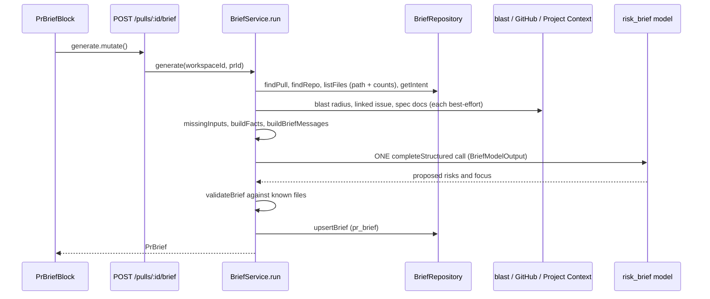

# PR Brief

Documented against `64699d4` (staged, uncommitted tree: the feature is in the
index, not yet in a commit — line numbers cite the working tree).

The PR Brief is the Overview tab's model-written summary of a pull request: a
short summary, a list of risks and a list of places to read first. It is
generated on demand only — nothing calls the model on page load. Spec:
`specs/spec-0002-pr-brief.md`; plan: `docs/plans/0015-pr-brief.md`.

It **replaces** the deterministic Risk Areas scanner
(`GET /pulls/:id/risks`, plan 0003). That route, its detectors
(`server/src/modules/reviews/risks/`) and the IntentCard `RiskAreas` UI are
deleted; there is no `/risks` endpoint any more.

## API

Registered by `server/src/modules/brief/routes.ts:16`.

| Route | Behaviour |
|---|---|
| `GET /pulls/:id/brief` | The stored brief or `null`; never a model call (`routes.ts:61-68`, `service.ts:38-42`). Unknown PR is a `NotFoundError`. |
| `POST /pulls/:id/brief` | (Re)generates the brief — one model call. Rate-limited to 10/min, like `POST /review` (`routes.ts:71-81`). |

Concurrent `POST`s for one PR share a single in-flight call
(`service.ts:33`, `service.ts:44-51`).

The wire shape is `PrBrief` (`server/src/vendor/shared/contracts/brief.ts:199-210`):
`summary`, `risks` (`Risk`, `:127-134`), `review_focus` (`ReviewFocusItem`,
`:189-193`), `generated_for_sha`, `generated_at`, `missing_inputs`, `cost_usd`,
`tokens_in`, `tokens_out`. Risk `kind` is free text; `severity` is
`high | medium | low` (`:112`). The client copy is vendored separately
(`client/src/vendor/shared/contracts/brief.ts`) — keep them in sync.

## How a generation runs

Steps are `service.ts:61-160`. Facts only go to the model: file paths,
add/delete counts, Smart Diff role (`classifyFile`), the blast map's names,
stored intent, linked issue and spec documents — never diff hunks.
`BriefRepository.listFiles` selects path and counts only and never reads the
`patch` column (`repository.ts:38-48`); `buildFacts` caps every section and
the total (`helpers.ts:253-309`, limits in `constants.ts`).
The model call goes through `featureModels.completeStructured` with feature
id `risk_brief` (`routes.ts:38-55`; feature id declared in
`server/src/vendor/shared/contracts/platform.ts:17`). Text is wrapped as
untrusted in the prompt (`prompt.ts:24-49`).

### File validation

`validateBrief` (`helpers.ts:89-127`) grounds the output. The allowed file set
is the PR's files plus every file the blast map names (`knownFiles`,
`helpers.ts:45-47`). A risk loses refs to unknown files and is dropped if none
remain; a review-focus item on an unknown file or without a positive line is
dropped. One leading `./` is stripped (`normalizePath`, `helpers.ts:28-30`).
An `end_line` below `start_line` is discarded. Results are capped in the
model's order at `MAX_RISKS` / `MAX_FOCUS` (`constants.ts:9`, `:11`).

### Missing inputs

Intent, blast radius, linked issue and spec documents are collected
best-effort: a failure is never a request failure (`service.ts:72-105`).
`missingInputs` (`helpers.ts:139-156`) labels what was unavailable —
`intent`, `blast radius (<reason>)`, `issue #<n>` — and the labels are stored
in `missing_inputs` and told to the model. A missing or uncloned spec doc is
silently omitted, not labelled. Only the model call can fail the request
(`service.ts:120-129`): an `AppError` propagates as-is, anything else becomes
`ExternalServiceError`, and the stored brief is left untouched.

## Cache and staleness

One row per PR in `pr_brief` (`server/src/db/schema/reviews.ts:66-71`:
`pr_id` primary key, `json` jsonb). `upsertBrief` overwrites it
(`repository.ts:70-75`); `getBrief` is workspace-scoped and treats a row that
no longer parses as `PrBrief` as "no brief" (`repository.ts:58-68`).
Generation stores `generated_for_sha` = the PR's `headSha`
(`service.ts:132-135`). The server does not compute staleness: the client
shows a "Stale — regenerate" badge when `generated_for_sha !== headSha`
(`PrBriefBlock.tsx:52`, badge `:66-70`, text `client/messages/en/brief.json:12`).
A failed regenerate keeps the previous brief on screen
(`client/src/lib/hooks/brief.ts:20-28`).

## Overview UI

`PrBriefBlock` (`client/src/app/repos/[repoId]/pulls/[number]/_components/PrBriefBlock/PrBriefBlock.tsx:36`)
shows the Generate call to action when no brief exists (`:100-118`), else the
`BriefBanner` (reuses `VerdictBanner` when a completed review exists;
`BriefBanner.tsx:35-60`), the Intent and Blast radius blocks passed as
children, `BriefRisks`, `ReviewFocus` and the missing-inputs line
(`PrBriefBlock.tsx:121-143`). Hooks: `usePrBrief` / `useGenerateBrief`
(`client/src/lib/hooks/brief.ts:12`, `:23`).

### Deep link into Files changed

A file ref to a PR file is a button calling `onOpenFile`; a ref to a
blast-only file is a GitHub blob link at the index's `indexed_sha`, or the
PR head (`FileRefLink.tsx:24-42`, `helpers.ts:14-22`). The page's
`onOpenFile` sets `?tab=diff&file=<path>` and clears `finding`
(`client/src/app/repos/[repoId]/pulls/[number]/page.tsx:93`); `DiffTab` takes
that as `focusPath` to open and scroll to the file (`DiffTab.tsx:20-24`).

## Deliberate deviations from the plan

- **Model-facing schema differs from the contract.** `BriefModelOutput`
  (`server/src/modules/brief/output.ts:34-38`) makes `start_line` / `end_line`
  `.nullable()` because OpenAI strict structured outputs require every
  property (`output.ts:10-13`); the stored `RiskFileRef` keeps them optional
  (`contracts/brief.ts:119-123`). `validateBrief` maps null or invalid lines to
  "no line". It lives in its own file to avoid an import cycle with the prompt
  builder (`output.ts:4-8`).
- **Spec documents = enabled agents' `contextPaths` plus their enabled skills'
  paths** (`collectSpecPaths`, `helpers.ts:59-67`; sources wired in
  `routes.ts:32-36`), read once by Project Context under its own caps — not a
  brief-specific document list.
- Intent and the changed-file list are also wrapped as untrusted input in the
  prompt (recorded in `docs/plans/0015-pr-brief.state.json`).
