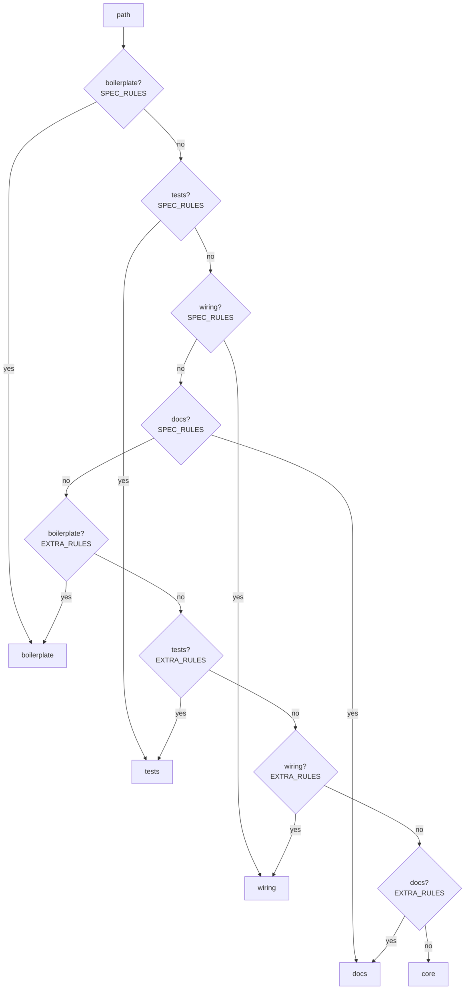
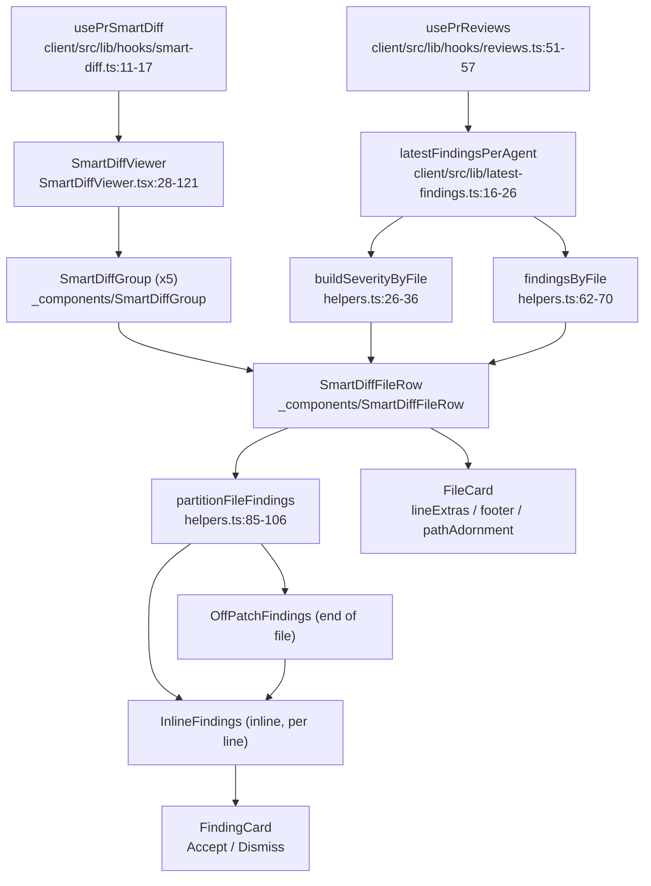

# Smart Diff

Documents **uncommitted work on top of `4c48764`** — a rewrite of Smart Diff
from the earlier 3-role (`core`/`wiring`/`boilerplate`) version this page used
to describe. Design intent is in
[`docs/plans/0009-smart-diff-spec-completion.md`](../plans/0009-smart-diff-spec-completion.md);
this page documents the code as it reads in the working tree, not the plan's
intentions — where they disagree, the code wins (see *Documented deviation*
below).

Smart Diff sorts a PR's changed files into five review-risk groups —
`core → tests → wiring → docs → boilerplate` — so a reviewer sees business
logic before tests, wiring, docs and generated churn. It makes **no LLM
call**: it classifies files by path alone and joins in finding line numbers
already stored in Postgres from a past run.

## Product view

The "Files changed" tab (`DiffTab`,
`client/src/app/repos/[repoId]/pulls/[number]/_components/DiffTab/DiffTab.tsx:22-86`)
renders `SmartDiffViewer`
(`.../SmartDiffViewer/SmartDiffViewer.tsx:28-121`), which always shows all
five groups, in order, via `SmartDiffGroup`
(`.../SmartDiffViewer/_components/SmartDiffGroup/SmartDiffGroup.tsx:16-60`):

- Each group header shows its label/blurb (`GROUP_META`,
  `.../SmartDiffViewer/constants.ts:33-39`) and either a `● N`
  files-with-findings counter (`FindingsDot`, once a `kind: "review"` review
  has run — `hasReviewRun`, `.../SmartDiffViewer/helpers.ts:115-120`) or the
  literal string "review not run yet" (`SmartDiffGroup.tsx:49-54`,
  `smartDiff.reviewNotRun` in
  `client/messages/en/prReview.json:75`). `docs`/`boilerplate` groups start
  collapsed (`filesCollapsed: true`, `constants.ts:37-38`); the others obey
  `AUTO_EXPAND_MAX_LINES` per file instead.
- Each file row (`SmartDiffFileRow.tsx:18-110`) shows a plain, non-clickable
  "has findings" dot (`FindingsDot`,
  `.../SmartDiffViewer/_components/FindingsDot/FindingsDot.tsx:8-15`) next to
  the path when `file.finding_lines.length > 0`
  (`SmartDiffFileRow.tsx:100`) — one marker, not a per-severity count.
- A flagged line renders a coloured left border plus a right-hand badge
  reading `blocker`/`warning`/`suggestion` (`LINE_BADGE_LABEL`,
  `client/src/components/diff-viewer/constants.ts:13-17`, deliberately not
  `@devdigest/ui`'s "Critical"/"Warning"/"Suggestion" labels). Clicking the
  badge (`onLineSeverityClick`, `CodeLine.tsx:84-93`) opens the file card and
  scrolls to the matching inline finding card
  (`SmartDiffFileRow.tsx:67-74`, `reveal` state remounts the card via a
  `revealNonce`, `InlineFindings.tsx:14-41`).
- A finding whose flagged line renders in the current patch gets an
  `InlineFindings` card (`.../InlineFindings/InlineFindings.tsx:43-70`)
  directly under that line, each with Accept/Dismiss buttons
  (`FindingCard.tsx:100-119`). A finding whose line isn't in the patch (a
  `null` patch, or a line GitHub's diff doesn't render) goes to an
  "Findings outside the diff" block at the end of the file
  (`OffPatchFindings.tsx:11-28`, `smartDiff.offPatchTitle`).
- One hide toggle in `DiffTab` (`DiffTab.tsx:69-82`) hides both GitHub review
  comments and Smart Diff findings together; it starts ON (visible) whenever
  there are findings (`showComments = showOverride ?? findingCount > 0`,
  `DiffTab.tsx:42`) and stays a manual override once clicked.
- A "Smart order" / "Original order" toggle
  (`SmartDiffViewer.tsx:76-83`) switches between the five grouped columns and
  the plain, unsorted `DiffViewer` (`SmartDiffViewer.tsx:86-87`) — the latter
  is also the fallback while loading, on error, or when `prId` is null
  (`SmartDiffViewer.tsx:46-48`).
- After a review run finishes, the PR page invalidates both `["reviews",
  prId]` and `["pr-smart-diff", prId]`
  (`client/src/app/repos/[repoId]/pulls/[number]/page.tsx:65-71`, on the
  falling edge of `reviewRunning`), so the Diff tab's counters, dots and
  cards refresh even if the reader is still on that tab — `useRunReview`,
  `useFindingAction`, `useDeleteRun` and `useDeleteReview`
  (`client/src/lib/hooks/reviews.ts:67-74`, `:89-93`, `:138-145`,
  `:166-175`) invalidate the same pair for their own triggers.

Smart Diff makes no LLM call anywhere in this path: `ReviewService.getSmartDiff`
(`server/src/modules/reviews/service.ts:316-351`) only reads `pr_files` and
finding rows already in Postgres.

## API

`GET /pulls/:id/smart-diff`
(`server/src/modules/reviews/routes.ts:191-196`) returns the `SmartDiff`
contract (`server/src/vendor/shared/contracts/brief.ts:145-177`,
mirrored byte-for-byte in `client/src/vendor/shared/contracts/brief.ts`), now
validated against a `response: { 200: SmartDiff }` schema
(`routes.ts:192`). `SmartDiffRole` is a 5-value enum:

```ts
export const SmartDiffRole = z.enum(['core', 'tests', 'wiring', 'docs', 'boilerplate']);
```
(`brief.ts:145`)

Handled by `ReviewService.getSmartDiff` (`service.ts:316-351`), which reads
`pr_files` and `latestFindingRangesForPull` concurrently
(`service.ts:320-323`) and hands them to the pure `buildSmartDiff`
(`server/src/modules/reviews/smart-diff/build.ts:19-52`). Per file:

- `finding_lines` — the unique, sorted `start_line` values of every
  **non-dismissed** finding from the **newest review per agent**
  (`startLinesByFile`,
  `server/src/modules/reviews/smart-diff/helpers.ts:19-29`, fed by
  `latestFindingRangesForPull`,
  `server/src/modules/reviews/repository/review.repo.ts:104-119`). No range
  expansion — only `start_line`.
- `pseudocode_summary` — always `null` (`build.ts:34`); the field stays in
  the contract (hand-vendored, both copies keep it) but nothing populates it.
- `additions`/`deletions` — copied straight from the `pr_files` row
  (`build.ts:35-36`).

`split_suggestion` is a minimal placeholder, matching the assignment: `{
too_big: false, total_lines: <sum of every file's additions+deletions>,
proposed_splits: [] }` (`build.ts:44-51`) — `too_big` is always `false` and
`proposed_splits` always empty; the split-suggestion feature was never built
past this.

Code lines are **not** part of this response. They come from `GET
/pulls/:id` (`server/src/modules/pulls/routes.ts:37`), whose `PrDetail.files`
is an array of `PrFile { path, additions, deletions, patch }`
(`server/src/vendor/shared/contracts/platform.ts:197-203`). The client joins
`SmartDiff`'s per-file metadata to a `PrFile.patch` by `path`
(`filesByPath`, `SmartDiffViewer.tsx:37`; used in `SmartDiffFileRow.tsx:45-50`).

## Classifier

`classifyFile(path)` (`server/src/modules/reviews/smart-diff/classify.ts:20-29`)
is path-only and pure — arity 1, no size/line-count params
(pinned by `server/test/smart-diff-classify.test.ts:98-100`). Reusable
without HTTP: it has no I/O import, so any caller can classify a path off the
critical path of a request.

Two ordered passes, both walking `CLASSIFY_PRIORITY = ['boilerplate', 'tests',
'wiring', 'docs']`
(`server/src/modules/reviews/smart-diff/constants.ts:51`): all of
`SPEC_RULES` first, then all of `EXTRA_RULES`, first match wins, else `core`.
The priority is enforced by the loop over `CLASSIFY_PRIORITY`, not by the
literal order inside `SPEC_RULES`/`EXTRA_RULES` (both are `Record<NonCoreRole,
…>`, so there is no array order to get wrong) — `classify.ts:22-27`.



### Rule table (`constants.ts`)

`SPEC_RULES` (`constants.ts:76-116`) — the assignment's own glob list:

| Role | Patterns |
|---|---|
| boilerplate | `*.lock`, `pnpm-lock.yaml`, `package-lock.json`, `yarn.lock`, `dist/**`, `build/**`, `**/__snapshots__/**`, `*.snap`, `*.generated.*`, `*.min.js` |
| tests | `*.test.ts(x)`, `*.it.test.ts`, `*.spec.ts`, `**/test/**`, `**/tests/**`, `**/__tests__/**`, `e2e/**` |
| wiring | `index.ts`/`index.js`, `*.config.*`, `tsconfig*.json`, `.eslintrc*`, `.env*`, `docker-compose*.yml`, `.github/**`, `.claude/**` |
| docs | `*.md`, `docs/**`, `README*`, `CHANGELOG*`, `LICENSE` |

`EXTRA_RULES` (`constants.ts:166-171`) — project-specific patterns that only
ever fire where a `SPEC_RULES` glob would have called the path `core`:

| Role | Patterns |
|---|---|
| boilerplate | `npm-shrinkwrap.json`/`bun.lockb`/`go.sum`; a `dist`/`build`/`out`/`coverage`/`node_modules`/`.next`/`__snapshots__`/`generated`/`vendor`/`fixtures` path segment; `.min.css`/`.map`/`.svg`/`.png`/`.jpe?g`/`.gif`/`.ico`/`.woff2?`/`.pdf` extensions |
| tests | any `.test`/`.spec` extension combo (`.spec.tsx`, `.test.jsx`, …); `__mocks__`/`e2e` at any depth |
| wiring | basenames `index.tsx`/`package.json`/`Dockerfile`; a `config(s)`/`route(s)`/`middleware`/`migrations`/`scripts`/`messages`/`type(s)`/`constants`/`schema(s)` path segment |
| docs | a `doc(s)` path segment at any depth; `.mdx`/`.txt` extensions |

### Pinned edge cases (`server/test/smart-diff-classify.test.ts`)

Three priority-order cases, called out in the test file itself
(lines 15-17):

- `src/__tests__/__snapshots__/x.snap` → `boilerplate` (a snapshot inside a
  test dir is still boilerplate: `boilerplate` precedes `tests` in
  `CLASSIFY_PRIORITY`).
- `.claude/skills/security/SKILL.md` → `wiring` (`.claude/**` precedes the
  `docs` `*.md` glob).
- `e2e/README.md` → `tests` (`e2e/**` precedes the `docs` `*.md` glob).

And the three deliberate `EXTRA_RULES` decisions the assignment doesn't
specify, pinned in the same table:

- `server/src/vendor/shared/contracts/brief.ts` → `boilerplate` (the `vendor`
  path segment).
- `server/docs/diagram.png` → `boilerplate`, not `docs` — within the EXTRA
  pass, `boilerplate` is still checked before `docs`
  (`CLASSIFY_PRIORITY`), so an image extension under a `docs/` folder never
  reaches the `docs?` segment rule.
- `server/src/modules/reviews/smart-diff/constants.ts`,
  `client/src/lib/types.ts`, `server/src/db/schema/reviews.ts` → `wiring`
  (the classifier's own source file, and any `constants.ts`/`types.ts`/
  `schema/` file, match the `WIRING_PATH_RE` segment rule) — same rule that
  also routes `server/src/modules/reviews/routes.ts` to `wiring`.

## Client structure



`SmartDiffViewer` (`SmartDiffViewer.tsx:28-121`) calls both `usePrSmartDiff`
and `usePrReviews`, builds `severityByFile`/`findingsByFileMap` once per
render (`:35-36`), and renders one `SmartDiffGroup` per `GROUP_ORDER` entry
(`constants.ts:11-17`), each containing a `SmartDiffFileRow` per file.
`SmartDiffFileRow` (`SmartDiffFileRow.tsx:18-110`) wires the reused
`FileCard` (`client/src/components/diff-viewer/FileCard/FileCard.tsx:52-168`)
with `lineExtras` (a `Map<lineKey, ReactNode>` of `InlineFindings`,
`SmartDiffFileRow.tsx:76-91`) and a `footer` slot for `OffPatchFindings`
(`:103-107`) when there are off-patch findings.

`partitionFileFindings` (`.../SmartDiffViewer/helpers.ts:85-106`) decides
where each finding renders:

- **inline** — its `lineKey("RIGHT", start_line)` is a line actually rendered
  by the current patch (`renderedKeys`, from `lineKeysForPatch`) **and**
  either its `start_line` is in the server's `finding_lines`, or the finding
  is dismissed (a dismissed finding is excluded from `finding_lines` by
  construction, so it needs its own admission rule to still render as a
  muted card, `helpers.ts:78-83`);
- **off-patch** — its key isn't rendered by the patch at all (including every
  finding on a file with a `null` patch);
- **shown nowhere** — a non-dismissed finding whose key IS rendered but whose
  `start_line` is missing from `finding_lines`: treated as transient skew
  between the two queries racing, not an error state.

Dismissed findings are never filtered out before this point —
`findingsByFile` (`helpers.ts:62-70`) keeps them so `partitionFileFindings`
can still place them inline as muted cards; only `buildSeverityByFile`
(`helpers.ts:26-36`) drops a dismissed finding's line marker (`:29`) since a
dismissed finding has no severity to show on the line itself.

## Documented deviation: "latest review" = newest per agent

The assignment's "the latest review" is interpreted as the **newest review
per agent**, not the single newest `reviews` row overall — both server
(`server/src/modules/reviews/repository/review.repo.ts:89-103`) and client
(`client/src/lib/latest-findings.ts:1-26`) implement the same rule
independently (the client can't reuse the server's SQL, and duplicating a
few lines was preferred over adding a new endpoint). Reason, from the
server-side docblock: a PR can carry one `reviews` row per agent from a
multi-agent run; taking the single newest row across all agents would
silently drop every agent's findings but the most recently run one. A `null`
`agent_id` (the seeded demo review has none) collapses every agent-less
review into one distinct-on group and contributes at most one review's
findings — accepted, since a real multi-agent PR always sets `agentId`
(`review.repo.ts:99-102`). Non-dismissed only: `isNull(findings.dismissedAt)`
on the server (`review.repo.ts:117`), `!finding.dismissed_at` where the
client needs the exclusion (e.g. `buildSeverityByFile`,
`.../SmartDiffViewer/helpers.ts:29`).
