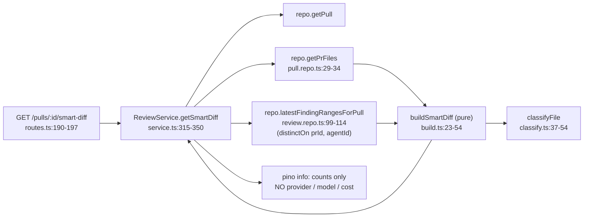

# Smart Diff

Documented against `59eb758` (dirty tree — several files below are staged/
modified but not yet committed; see `git status --short` for the exact file
list).

Smart Diff sorts a PR's changed files by review risk — `core` before `wiring`
before `boilerplate` — so a reviewer sees business logic before lock files and
generated churn. It is deterministic and makes **no LLM call**: it joins
`pr_files` (already imported from GitHub) with the findings of the latest
review already stored in Postgres. It mirrors [Risk Areas](risk-areas.md)'s
precedent (recomputed on every read, one counts-only log line) but lives in
the "Files changed" tab rather than the Overview tab's Intent card.

**Where the shipped UI differs from the driving plans:** `docs/plans/0004-smart-diff.md`
and `docs/plans/0005-smart-diff-ui-fidelity.md` describe the design intent and
are useful for *why*, but several UI details moved after they were written —
including the summariser both plans specify, which was built and then removed
entirely (see *The summary field: computed as null, on purpose* below). This
page documents the code as it reads today; divergences are called out under
*Where the code and the plans disagree*.

## API surface

`GET /pulls/:id/smart-diff` → `SmartDiff`
(`server/src/modules/reviews/routes.ts:190-197`, module docblock at
`routes.ts:20`), handled by `ReviewService.getSmartDiff`
(`server/src/modules/reviews/service.ts:315-350`). It sits directly after
`getRisks` (`service.ts:275-305`), which is the precedent it mirrors: no rate
limit (`routes.ts:187-189` — "spends no money, like `/risks`"), recomputed on
every call, and a single `logger?.info` line carrying only counts —
`prId`, `files`, `core`/`wiring`/`boilerplate` counts, `totalLines`,
`findingLines` — never a provider, model or cost field
(`service.ts:334-347`).

`getSmartDiff` does exactly three things: `this.repo.getPull` (404 via
`NotFoundError` if missing), `this.repo.getPrFiles(pull.id)`, and
`this.repo.latestFindingRangesForPull(pull.id)`, run concurrently
(`service.ts:316-322`), then hands the results to the pure `buildSmartDiff`.
It never calls `loadDiff` or `PullsService.getDetail` — both of those can
reach out to GitHub — so the route performs **zero network I/O**;
`getPrFiles` (`server/src/modules/reviews/repository/pull.repo.ts:29-34`) is a
plain `select` from the `pr_files` table already populated at import time.

## The pure domain: `server/src/modules/reviews/smart-diff/`

A five-file module with no adapter import, no `container.db`, and no network.

- `constants.ts` — every pattern and threshold, in one place
  (`server/src/modules/reviews/smart-diff/constants.ts`).
- `classify.ts` — `classifyFile(path, additions, deletions): SmartDiffRole`
  (`classify.ts:37-54`), pure.
- `helpers.ts` — `expandFindingLines`, `sortFiles`
  (`server/src/modules/reviews/smart-diff/helpers.ts:22`, `:41`).
- `build.ts` — `buildSmartDiff(files, findingRows): SmartDiff`
  (`build.ts:23-54`), pure.
- `index.ts` — barrel re-exporting `buildSmartDiff`, `classifyFile`
  (`index.ts:3-4`).

### The classifier — rule order is the contract

`classifyFile` (`classify.ts:37-54`) evaluates seven rules in a fixed order,
documented in the function's own comment (`classify.ts:21-36`):

1. basename ∈ `LOCK_BASENAMES` → `boilerplate`
   (`constants.ts:13-25` — `package-lock.json`, `pnpm-lock.yaml`, `yarn.lock`,
   `npm-shrinkwrap.json`, `bun.lockb`, `Cargo.lock`, `composer.lock`,
   `Gemfile.lock`, `poetry.lock`, `Pipfile.lock`, `go.sum`);
2. `GENERATED_PATH_RE` or `GENERATED_FILE_RE` → `boilerplate`
   (`constants.ts:29-34`);
3. `TEST_FILE_RE` (a filename ending `.test.`/`.spec.` + `[cm]?[jt]sx?`, so
   `*.test.ts`, `*.spec.tsx`, `*.it.test.ts` all match), or `TEST_PATH_RE` (a
   path segment `test/`, `tests/`, `__tests__/`, `__mocks__/`, `e2e/`)
   **unless** the file also matches `WIRING_FILE_RE` → `boilerplate`
   (`classify.ts:47-48`, patterns at `constants.ts:61-70`). The `WIRING_FILE_RE`
   exception keeps markdown/prose that merely *lives* inside a test directory
   (`e2e/CLAUDE.md`) classified as `wiring`, not `boilerplate` — it is prose,
   not a test (`classify.ts:45-46`);
4. `additions + deletions >= BOILERPLATE_MIN_CHANGED_LINES` (800,
   `constants.ts:75`) → `boilerplate`;
5. basename ∈ `WIRING_BASENAMES`, or `WIRING_PATH_RE`, or `WIRING_FILE_RE`
   (markdown/`.mdx`/`.txt`, `constants.ts:47`) → `wiring`;
6. `additions + deletions <= WIRING_MAX_CHANGED_LINES` (6, `constants.ts:79`)
   → `wiring`;
7. else → `core`.

Rule order is: **lock basenames → generated path/ext → tests → size ≥ 800 →
wiring (basenames/path/markdown) → size ≤ 6 → core.** Both the lock-file rule
and the new test rule are checked before every size rule, and are
size-independent for the same reason: a lock file must be `boilerplate`
regardless of size (`classify.ts:23-27`), and a tiny test edit must not fall
through to `wiring` via the size rule just because it is small
(`classify.ts:44` comment, `server/test/smart-diff-classify.test.ts:102-105`).
`WIRING_FILE_RE` (`constants.ts:47`) is not in the plan's original spec — it
was added so a root-level `CLAUDE.md`/`INSIGHTS.md` groups with wiring instead
of falling through to `core` and crowding out real source changes (comment at
`constants.ts:42-46`).

Adding the test rule changes classification results on real PRs used for
manual verification during this feature's development: PR #4 went from
core×5/boilerplate×0 to core×3/boilerplate×2, and PR #1 from
core×11/boilerplate×6 to core×8/boilerplate×11 — every `*.test.ts`/
`*.it.test.ts`/`*.spec.tsx` file that previously read as `core` (or, if small,
`wiring`) now collapses into the collapsed-by-default `boilerplate` group.

`expandFindingLines` (`helpers.ts:22-33`) turns finding ranges into a
per-file, deduped, ascending array of new-side line numbers, each range capped
at `MAX_FINDING_RANGE_LINES` (200, `constants.ts:87`). `sortFiles`
(`helpers.ts:41-51`) orders files within a group by findings count desc, then
changed lines desc, then path asc.

### The summary field: computed as `null`, on purpose

`buildSmartDiff` always sets `pseudocode_summary: null` for every file
(`build.ts:34-38`). The rule-based summariser that used to fill this field
(`summarizePatch`, plus its `EXPORT_SYMBOL_RE`/`HUNK_HEADER_RE`/
`CONTEXT_SYMBOL_RE`/`NEW_FILE_RE`/`MAX_SUMMARY_SYMBOLS`/
`MAX_SUMMARY_SCAN_LINES` constants) has been deleted from `helpers.ts` and
`constants.ts` entirely, and the `✦ summary` chip / `✦ What this does:` row
that rendered it in the UI are gone too (see *Shipped UI* below). The
`pseudocode_summary` field itself stays in the `SmartDiff` contract — it is
hand-vendored and both `server/src/vendor/shared` and `client/src/vendor/shared`
copies still declare it — but nothing populates it any more
(`build.ts:34-37` comment).

**Why:** the summariser was regexes over the diff text, never a model call
(this feature's constraint is no LLM on the Smart Diff path). Regexes can only
*name* a symbol — "exports X", "changes Y", "new file · N added lines" — they
cannot say what the code *does*, so a UI label reading "What this does" was
promising something the mechanism could never deliver. The rule-based text
was also hardcoded English generated server-side, bypassing the client's
`smartDiff.json` i18n namespace entirely.

## The findings query — newest review per agent, not the single newest row

`latestFindingRangesForPull(db, prId)`
(`server/src/modules/reviews/repository/review.repo.ts:99-114`) is modelled
on `PullsRepository.latestScores`. It uses
`db.selectDistinctOn([t.reviews.prId, t.reviews.agentId], …)` with the
distinct columns leading `orderBy` (`review.repo.ts:100-104`), then fetches
`{file, startLine, endLine}` from `findings` for those review ids
(`review.repo.ts:109-113`). This matters because a PR can carry several
agents' reviews: a single-latest-row query would silently hide every finding
but one agent's most recent pass. `reviews.agentId` is nullable, so every
NULL-agent review (the seeded demo data) collapses into one distinct-on group
and contributes at most one review's findings (`review.repo.ts:94-97`).
`ReviewRepository.latestFindingRangesForPull` (`server/src/modules/reviews/repository.ts:71-73`)
delegates straight through.

## Client: the server owns *which* lines, the client owns their *colour*

`usePrSmartDiff(prId)` (`client/src/lib/hooks/smart-diff.ts:11-17`) is a
`useQuery` on `["pr-smart-diff", prId]`, `GET /pulls/:id/smart-diff`. The
global TanStack defaults apply — `staleTime: 30_000`,
`refetchOnWindowFocus: false` (`client/src/lib/providers.tsx:28-29`). All four
mutations that can change findings invalidate `["pr-smart-diff", prId]`
alongside `["reviews", prId]`: `useDeleteRun`
(`client/src/lib/hooks/reviews.ts:67-71`), `useDeleteReview` (`:89-90`),
`useRunReview` (`:139-142`), and `useFindingAction` (`:168-171`) — each
comment notes why: "Smart Diff joins these findings with its own query;
invalidating only one half leaves coloured markers with no badge until a
reload."

`SmartDiffViewer`
(`client/src/app/repos/[repoId]/pulls/[number]/_components/SmartDiffViewer/SmartDiffViewer.tsx`)
is rendered by `DiffTab` in place of a direct `<DiffViewer>` call
(`.../DiffTab/DiffTab.tsx:9`, `:62`). It composes the shared `diff-viewer`'s
`FileCard` (`client/src/components/diff-viewer/index.ts:4-6` — the barrel
exports exactly `DiffViewer`, `DiffCommentApi`, `FileCard`) rather than
duplicating its rendering.

The split is the architectural idea: `SmartDiffFile.finding_lines`
(server-computed, already capped at `MAX_FINDING_RANGE_LINES`) is the single
authoritative set of flagged lines (`SmartDiffViewer.tsx:57-58`); the client
only supplies each line's colour, by joining the `/pulls/:id/reviews` payload
the page already has. `buildSeverityByFile` (`.../SmartDiffViewer/helpers.ts:43-55`)
builds a `Map<path, Map<line, Severity>>`, worst severity wins on a shared
line (`helpers.ts:12-14`), ordered by `SEVERITIES` from
`client/src/lib/severity.ts`. `severityForFlaggedLines` (`helpers.ts:106-117`)
then intersects that map with the server's `finding_lines`, so **a marker can
never render from the raw client map** — only from a line the server actually
flagged.

The client re-implements the server's latest-per-agent rule in
`latestFindingsPerAgent` (`.../SmartDiffViewer/helpers.ts:25-35`): only
`kind === "review"` rows, only the newest per `agent_id`, null agent ids
collapsed into one group — deliberately duplicated rather than touching the
hand-vendored `SmartDiff` contract or adding a new endpoint. Both
`buildSeverityByFile` and `countFindingsBySeverityByFile` (`helpers.ts:65-79`,
the per-severity, findings-count-not-lines dot numbers) go through this one
function so the dots' counts and the line colours can never disagree about
which review they describe. `firstLineOfSeverity` (`helpers.ts:88-97`) then
picks a dot's click target from `severityForFlaggedLines`'s **markers** map,
never the raw per-file severity map — the target line can never fall outside
the server's `finding_lines`.

`GROUP_META` (`.../SmartDiffViewer/constants.ts:20-42`) is one
`Record<SmartDiffRole, …>` carrying `labelKey`/`blurbKey`/`defaultOpen`
(`boilerplate.defaultOpen: false`) and `dotColor` for the group header dot —
there is no per-role summary-visibility policy any more; the field the old
`showSummary` flag gated (`pseudocode_summary`) is always `null` now, so there
is nothing left to conditionally show. `GROUP_ORDER` is a local
`as const satisfies readonly SmartDiffRole[]` literal (`constants.ts:11`),
never a runtime import of the vendored `SmartDiffRole` `z.enum` — that 500s
the page under `next dev` per `client/INSIGHTS.md`. Every `@devdigest/shared`
import in this feature is `import type` only.

## Shipped UI (verified in a browser) — where the plans are stale

- **Header**: a two-row block — `t("header")` ("Reviewer-ordered diff") then a
  stats line built with `t.rich("stats", …)` rendering `<add>`/`<del>` tags in
  `var(--code-add-text)`/`var(--code-del-text)`
  (`SmartDiffViewer.tsx:141-151`, `client/messages/en/smartDiff.json:3`), and
  a Smart/Original toggle (`SmartDiffViewer.tsx:152-167`).
- **Group headers** are a single flex row — a coloured dot
  (`s.groupDot(meta.dotColor)`), the bold label, the muted blurb, and a
  right-aligned `t("groups.fileCount", …)` ICU-plural count
  (`SmartDiffViewer.tsx:184-188`). **A group with zero files renders
  nothing** — `if (!group || group.files.length === 0) return null;`
  (`SmartDiffViewer.tsx:181`), even though the server contract always emits
  all three groups.
- **Per-line badges** are icon + lowercase text, not a bare dot: `CodeLine`
  renders `<SevIcon size={11}/>{sevMeta?.label}` inside `lineBadge(severity)`
  (`client/src/components/diff-viewer/CodeLine/CodeLine.tsx:77-85`), reading
  colour/background from `@devdigest/ui`'s `SEV[sev].c`/`.bg`
  (`client/src/components/diff-viewer/styles.ts`) and lowercasing via
  `textTransform: "lowercase"` rather than a second i18n string — the DOM text
  is still `SEV[sev].label` ("Critical"). The badge carries no `aria-hidden`,
  since its text is now its accessible name (comment at `CodeLine.tsx:78-80`).
- **The per-file findings indicator is one dot-with-count per present
  severity**, beside the file path, worst-first. `FileCard` has exactly one
  slot left for this: `pathAdornment` (`client/src/components/diff-viewer/FileCard/FileCard.tsx:57-61`,
  rendered inside `s.pathWrap` right after the path, `:102-107`) — a generic
  `React.ReactNode`. The two other slots that used to exist for the removed
  summary UI, `headerExtras` and `bodyLead`, are gone; `FileCard`'s props are
  now `open`/`onOpenChange`/`severityByLine`/`lineIdPrefix`/`scrollToLine`/
  `pathAdornment` (`FileCard.tsx:34-62`). `SmartDiffViewer` renders
  `<FindingSeverityDots>` in that slot
  (`.../SmartDiffViewer/_components/FindingSeverityDots/FindingSeverityDots.tsx`):
  one `<button>` per severity present in `counts` (`counts[sev] > 0`),
  iterating `SEVERITIES` so the order can never disagree with the rest of the
  app (`FindingSeverityDots.tsx:30-31`, `:49-51`), each carrying its count as
  a **visible text child** (`{counts[sev]}`, `FindingSeverityDots.tsx:62`) and
  a real accessible name via `aria-label` (e.g. `"3 Critical findings"`, from
  `t("severityFindingsBadge", { count, severity })`,
  `messages/en/smartDiff.json:23`) — not `@devdigest/ui`'s `Badge`, which
  drops `aria-label` silently. Colours come from `SEV[sev].c`/`.bg`
  (`FindingSeverityDots.tsx:55`). Clicking a dot opens the card and scrolls to
  **the first line flagged with that severity**
  (`SmartDiffViewer.tsx:60-63`, `firstLineOfSeverity`) — no round-robin
  through all flagged lines any more. A review the client cannot join to any
  severity but that still has flagged lines (`flaggedLineCount > 0`) renders
  one neutral fallback dot instead (`FindingSeverityDots.tsx:32-46`), which
  scrolls to the first flagged line on click (`SmartDiffViewer.tsx:65-69`).
  This supersedes both plans' "N findings chip" text and the single-dot
  aria-label-only version shipped between them.
- **The rule-based summary UI is gone.** There is no `✦ summary` chip and no
  `✦ What this does: …` row anywhere in `SmartDiffViewer` or `FileCard` — see
  *The summary field: computed as `null`, on purpose* above for why.
- **`DiffTab` no longer shows its own "Files changed · N files" label** — the
  comment at `DiffTab.tsx:47-49` explains the count now lives in
  `SmartDiffViewer`'s own header row instead. Plan 0004 step 10 said
  `DiffTab` "keeps its `SectionLabel`"; the shipped code drops it.
- The `diff-viewer` barrel exports exactly `DiffViewer`, `DiffCommentApi`,
  `FileCard` (`client/src/components/diff-viewer/index.ts:4-6`) — **not**
  `parsePatch`/`type Line`, which plan 0004 step 8 originally called for;
  plan 0005's architecture constraints correct that, and the code matches
  0005, not 0004.

## Where the code and the plans disagree

| Topic | Plan said | Code does |
|---|---|---|
| Findings indicator | Plan 0004: an "N findings" chip next to the path; Plan 0005: a single dot, count in `aria-label` only | One `<FindingSeverityDots>` `<button>` per present severity, worst-first, as a `pathAdornment` **inside** `FileCard`'s header, beside the path, each with a visible count and a real accessible name |
| Per-file summary | Both plans specify a rule-based `pseudocode_summary` rendered as a `✦` chip/row | Removed entirely: `buildSmartDiff` always emits `pseudocode_summary: null` (`build.ts:34-38`), and no UI renders it |
| `diff-viewer` barrel | Plan 0004 step 8: export `FileCard`, `parsePatch`, `type Line` | Exports exactly `DiffViewer`, `DiffCommentApi`, `FileCard` (plan 0005's correction; `index.ts:4-6`) |
| `DiffTab`'s own file-count label | Plan 0004 step 10: `DiffTab` keeps its `SectionLabel` ("Files changed · N files") | Removed; `SmartDiffViewer`'s own stats row is the only file count (`DiffTab.tsx:47-49`) |
| Wiring classification of prose files | Not in plan 0004's constants list | `WIRING_FILE_RE` (`.md`/`.mdx`/`.txt`) was added so root docs don't crowd `core` (`constants.ts:42-47`) |
| Boilerplate classification of tests | Not in either plan | Added later: `TEST_FILE_RE`/`TEST_PATH_RE` route test files to `boilerplate` regardless of size, ahead of the size rules (`classify.ts:47-48`) |

## Tests

- Server: `server/test/smart-diff-classify.test.ts`, `smart-diff-helpers.test.ts`,
  `smart-diff-build.test.ts` (unit, no DB — `smart-diff-helpers.test.ts` covers
  only `expandFindingLines`/`sortFiles` now; it no longer has a `summarizePatch`
  suite), and `smart-diff.it.test.ts` (`*.it.test.ts`, testcontainers-backed,
  exercises three agents on one PR to prove `latestFindingRangesForPull` keeps
  the newest review **per agent** rather than one newest row overall).
- Client: `.../SmartDiffViewer/SmartDiffViewer.test.tsx` and `helpers.test.ts`
  (per-severity dot rendering, findings-vs-lines counts, latest-per-agent
  collapsing), plus `client/src/components/diff-viewer/CodeLine.test.tsx` and
  `FileCard.test.tsx` covering the surviving optional props (`severity`,
  `domId`, `pathAdornment`) — `FileCard.test.tsx` no longer exercises
  `headerExtras`/`bodyLead`, since neither prop exists any more.

## Known gaps (recorded, not papered over)

- `e2e/specs/05-pr-diff.flow.json` has **never been run** against this work.
  The expectation that it still passes (a collapsed `FileCard` hides only its
  body, never its path header; the loading/error path falls back to the plain
  `DiffViewer`, `SmartDiffViewer.tsx:123-125`) is reasoning from reading the
  code, not a passing run. More generally, `pnpm e2e:hermetic` has still never
  been run for this feature in this worktree.
- `hasDocker()`/`dockerAvailable()`-style gates on `*.it.test.ts` files
  (including `smart-diff.it.test.ts`) can silently skip a whole test file when
  Docker is unavailable or flaky — **a green exit code is not sufficient
  evidence that the DB-backed assertions ran**; the skipped-test count must be
  checked, not just the process exit code.
- The dev DB used for manual verification had **zero lock-file rows**, so the
  live "lock file is boilerplate regardless of size" check passed vacuously.
  `server/test/smart-diff-classify.test.ts` is what actually proves that
  acceptance criterion (every `LOCK_BASENAMES` entry at both a tiny and a huge
  size).
- `reviews`/`findings` carry no index, and this route adds a per-view query on
  `findings.review_id` (`review.repo.ts:109-112`) — flagged as a future
  migration candidate, deliberately not addressed here.
- `pr_files` has no `status` column (`server/src/db/schema/pulls.ts:36-45`);
  GitHub's per-file `status` is fetched by `listFiles` but dropped before the
  row reaches the DB (`server/src/adapters/github/octokit.ts:79-84`,
  `:106-111` — the mapped object has no `status` field). The same adapter
  method also calls `per_page: 100` with no pagination
  (`octokit.ts:83`), so a PR with more than 100 changed files loses the tail
  — Smart Diff only ever sees what `pr_files` was seeded with.

## Diagrams

Request path — every hop is deterministic and DB-only; nothing here reaches
an LLM or GitHub:



`pseudocode_summary` is intentionally absent from this diagram: `buildSmartDiff`
sets it to `null` for every file and calls nothing to derive it.

Client severity join — the server decides *which* lines are flagged, the
client decides only their *colour*:

```mermaid
flowchart TD
  SD["usePrSmartDiff\ngroups[].files[].finding_lines"] --> V["SmartDiffViewer"]
  RV["usePrReviews\ncached under [\"reviews\", prId]"] --> LFA["latestFindingsPerAgent\nhelpers.ts:25-35"]
  LFA --> M["buildSeverityByFile\nMap path -> line -> Severity\nworst severity wins"]
  M --> J["severityForFlaggedLines\nintersect with server's finding_lines\nhelpers.ts:106-117"]
  SD --> J
  J --> V
  V --> FC["FileCard\nseverityByLine / pathAdornment (FindingSeverityDots)"]
  FC --> CL["CodeLine\nicon + lowercase severity badge"]
```
