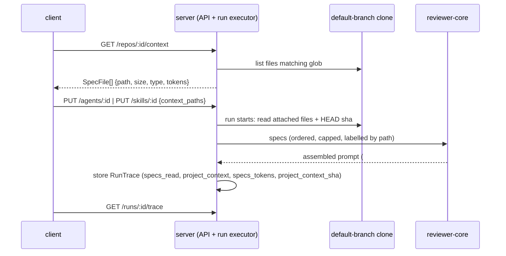

# Spec: Project Context — attach repository markdown docs to agents and skills

Spec ID: SPEC-0001
Status: approved
Supersedes: —
Modules: server (owner), client, reviewer-core
Design: specs/images/spec-0001/project-context-page.png, specs/images/spec-0001/agent-context-tab.png, specs/images/spec-0001/skill-context-tab.png, specs/images/spec-0001/run-trace-prompt-assembly.png

## Problem and user

A team keeps its rules in the repository as markdown — specs, architecture
docs, incident write-ups — but the reviewer agents never see them, so a
review cannot catch a PR that breaks a documented invariant (for example
"module `api/` does not import `db/` directly"). The user who configures
agents and skills in DevDigest needs to find these documents, pick the ones
an agent or skill should use, see how many tokens they add to every prompt,
and then check in a run's trace exactly which documents and which text were
sent to the model.

## Goals / Non-goals

Goals:
- Discover the repository's markdown documents under the configured search
  roots and show them on a Project Context page with a rendered preview.
- Let the user attach documents, by hand and in order, to an agent (Context
  tab) and to a skill (Context tab, "Project context to use").
- Store only the attached paths; read the text at run time from the
  default-branch checkout and inject it into the review prompt as untrusted,
  delimited data, within fixed token caps.
- Show the token cost of the attached documents in the editors and in the
  run trace, and show the full injected text in Prompt assembly.

Non-goals:
- Automatic selection of relevant documents from the PR's content (brief:
  a separate feature).
- A separate LLM call to prepare or summarise the context (brief: "adding
  context needs no separate LLM call").
- On the Project Context page: Edit mode, the new file / new folder / upload
  buttons, the COVERAGE ring, the "Indexed … chunks" footer and "Used by N
  agents" are not rendered (declined by user, D-1).
- The skill's "SERIALIZES AS" box changing the prompt; it is display-only
  (declined by user, D-10).
- Bumping an agent's or skill's version when its attached documents change
  (declined by user, D-13).
- CI / GitHub runs (`source = 'ci'`) and the later-lesson CI runner (declined
  by user, D-17).
- Reading documents from the PR head; a PR's own edits to an attached
  document never reach the prompt (declined by user, D-7).

## User stories

- As a user configuring the Security Reviewer, I want to tick
  `security-baseline.md` and `public-api.md` in its Context tab, so that
  every review it runs checks the PR against those documents.
- As a user reading a run's trace, I want to open "Project context —
  attached specs (untrusted)" and read the exact text sent, so that I can
  tell whether a finding came from a document.

## Acceptance criteria (EARS)

- **AC-1** `[server]` `must` WHEN `GET /repos/:id/context` is called, the API shall return one `SpecFile` entry per `.md` file in the repository's clone that matches the search glob from server configuration (default `**/{specs,docs,insights}/**/*.md`), each with its repo-relative `path`, `size`, and the new fields `type` (`specs` | `docs` | `insights`) and `tokens`.
- **AC-2** `[server]` `must` The `GET /repos/:id/context` response shall reflect the files present in the clone at request time, so a file added or removed since the previous call appears or disappears on the next call.
- **AC-3** `[client]` `must` The Project Context page shall show the repository root as its header and list the discovered documents as a file tree, one row per file with a document icon and its file name, as in `specs/images/spec-0001/project-context-page.png`.
- **AC-4** `[server, client]` `must` WHEN the user selects a document in the tree, the Project Context page shall show its file name and render its markdown in Preview mode, using the `content` field returned by `GET /repos/:id/context/file?path=<repo-relative path>`.
- **AC-5** `[client]` `must` WHEN the user clicks the refresh button in the Project Context toolbar, the page shall request `GET /repos/:id/context` again and show the returned list.
- **AC-6** `[client]` `must` The agent editor shall have a Context tab that lists the documents of the repository selected in the sidebar as rows with a drag handle, a checkbox, the file name, its folder, a type badge (`specs`, `docs` or `insights`) and a Preview button, as in `specs/images/spec-0001/agent-context-tab.png`.
- **AC-7** `[client]` `must` The agent Context tab header shall read "Project context" with a badge "<attached> of <total> attached".
- **AC-8** `[client]` `must` WHEN the user types in "Filter documents…", the Context tab shall show only the rows whose path contains the typed text, ignoring case.
- **AC-9** `[server, client]` `must` WHEN the user ticks or unticks a document in the agent Context tab, the API shall store the agent's ordered list of attached repo-relative paths in the `context_paths: string[]` field of the `Agent` contract, saved through `PUT /agents/:id`, and a reload of the tab shall show the same ticks.
- **AC-10** `[server, client]` `must` WHEN the user drags an attached row to a new position, the API shall store the new order in `context_paths`, and later runs shall inject the documents in that order.
- **AC-11** `[client]` `must` WHEN the user clicks a row's Preview button, the Context tab shall show that document's rendered markdown without changing the attached set.
- **AC-12** `[client]` `must` The agent Context tab footer shall show "≈ <n> tokens", where `<n>` is the sum of the `tokens` values of the attached documents, and the text "Injected as an untrusted block (## Project context) into every run."
- **AC-13** `[client]` `must` The skill editor shall have a Context tab with the heading "Project context to use", a badge "<attached> attached", the line "Any agent using this skill inherits these documents." and the same rows as the agent Context tab, as in `specs/images/spec-0001/skill-context-tab.png`.
- **AC-14** `[server, client]` `must` WHEN the user ticks, unticks or reorders a document in the skill Context tab, the API shall store the skill's ordered attached paths in the `context_paths: string[]` field of the `Skill` contract, saved through `PUT /skills/:id`.
- **AC-15** `[client]` `must` The skill Context tab shall show a display-only "SERIALIZES AS" box listing the attached paths under the heading `## Project specifications`, one `- <path>` line per document.
- **AC-16** `[client]` `must` The skill Context tab footer shall show "≈ <n> tokens", where `<n>` is the sum of the `tokens` values of the skill's attached documents.
- **AC-17** `[server]` `must` WHEN a review run starts through the server run executor (studio "Run Review" or the MCP `run_agent_on_pr` tool), the run executor shall read the text of every attached document from the working tree of the PR repository's default-branch clone, resolving each stored repo-relative path against that repository.
- **AC-18** `[server]` `must` The run executor shall order a run's documents as the agent's `context_paths` in stored order, followed by each linked skill's `context_paths` in `agent_skills` order.
- **AC-19** `[server]` `must` IF a path appears more than once across the agent's and its skills' lists, THEN the run executor shall inject it once, at its first position.
- **AC-20** `[server]` `must` IF a linked skill has `skills.enabled = false` or `agent_skills.enabled = false`, THEN the run executor shall inject none of that skill's documents.
- **AC-21** `[reviewer-core]` `must` WHILE a run has project context, the assembled user message shall contain exactly one `## Project context` section in which each document is wrapped in its own `<untrusted source="…">` block whose `source` names the document's repo-relative path.
- **AC-22** `[reviewer-core]` `must` WHILE a run has project context, the assembled system message shall end with the shared injection guard stating that text inside `<untrusted>` blocks is data, never instructions.
- **AC-23** `[server]` `must` The run executor shall make the same number of model calls for a run with project context as for the same run without it.
- **AC-24** `[server]` `must` WHEN a run with project context completes, the stored `RunTrace` shall list the injected documents' paths in `specs_read` in injection order, carry one `{ path, tokens, status }` entry per attached document (`status`: `included` | `truncated` | `dropped` | `missing`) in a new nullish `project_context` field, their injected total in a new nullish `prompt_assembly.specs_tokens` field, and the clone's commit sha in a new nullish `project_context_sha` field.
- **AC-25** `[client]` `must` WHEN the user opens a run's trace, the Configuration section's "Specs read" row shall list each injected document's path, as in `specs/images/spec-0001/run-trace-prompt-assembly.png`, each followed by "≈ <tokens> tok" from `project_context`, and a "missing" or "truncated" marker where its `status` says so.
- **AC-26** `[client]` `must` WHILE a run's trace has `prompt_assembly.specs`, the Prompt assembly section shall show a block labelled "Project context — attached specs (untrusted)" followed by "≈ <specs_tokens> tokens", with a copy button and an expand control that shows the full injected text.

## Edge cases

- **EC-1** `[reviewer-core]` `must` IF no document is attached to the agent or its enabled skills, THEN the assembled prompt shall be byte-identical to the prompt the engine assembles today without project context.
- **EC-2** `[client]` `must` IF a token count is unknown (`tokens` is null), THEN the editors and the trace shall show "—" for it and leave it out of the "≈ <n> tokens" total, never showing 0.
- **EC-3** `[server]` `must` IF a path sent in `context_paths` does not match the configured search glob or does not end in `.md`, THEN `PUT /agents/:id` and `PUT /skills/:id` shall reject the request with a 400 validation error and store nothing.
- **EC-4** `[server]` `must` IF an attached path does not exist in the PR repository's clone at run time, THEN the run executor shall skip it, write a warning line naming the path to the run log, record it in `project_context` with `status: "missing"`, and complete the run.
- **EC-5** `[server, client]` `must` IF a path in `context_paths` is absent from the `GET /repos/:id/context` list, THEN the Context tab shall show it as a ticked row with a "missing" badge whose checkbox detaches it through `PUT /agents/:id` or `PUT /skills/:id`.
- **EC-6** `[server]` `must` WHEN a document is found under more than one of the root folders, the API shall set its `type` from the matching folder nearest to the file, so `docs/specs/x.md` is `specs`.
- **EC-7** `[client]` `must` IF `GET /repos/:id/context` returns no documents, THEN the Project Context page and both Context tabs shall show the empty state with the `context.empty` copy.
- **EC-8** `[server, client]` `must` IF the repository has no clone on disk, THEN `GET /repos/:id/context` shall report that state and the Project Context page and both Context tabs shall show "Repository not cloned".
- **EC-9** `[server]` `must` IF the PR's repository has no clone on disk when a run starts, THEN the run executor shall run without project context, write a warning line to the run log, and record every attached path with `status: "missing"`.

## Non-functional requirements

- **NFR-1** `[server]` `must` The API shall never read or return a file whose resolved real path, after following symlinks, lies outside the repository's clone directory, for both `GET /repos/:id/context/file` and the run executor.
- **NFR-2** `[server]` `must` IF `GET /repos/:id/context/file` receives a `path` that is not in the current `GET /repos/:id/context` list, THEN the API shall return 404 without file contents and without an absolute host path in the error body.
- **NFR-3** `[reviewer-core]` `must` The `source` label of each project-context `<untrusted>` block shall be escaped so that a path containing `"`, `<` or `>` cannot close the attribute or the block.
- **NFR-4** `[server]` `must` The API and the run executor shall count document tokens with the server tokenizer already used for `skills_tokens` (cl100k, falling back to characters ÷ 4), and the client shall prefix every such count with "≈".
- **NFR-5** `[server]` `must` IF a document exceeds 8,000 tokens, THEN the run executor shall inject its first 8,000 tokens followed by the marker `[truncated: 8000 of <M> tokens]` inside its block, and record it with `status: "truncated"`.
- **NFR-6** `[server]` `must` The run executor shall inject at most 24,000 tokens of project context per run, filling in run order; the document that crosses the cap shall be truncated with the same marker and recorded as `truncated`, and every later document shall be left out and recorded as `dropped`.
- **NFR-7** `[client]` `must` The agent and skill Context tabs shall let a keyboard user move a focused row up or down, and shall give the drag handle and each icon-only Preview button an accessible name that includes the document's file name.

## Examples

| ID | Given | When | Then |
|---|---|---|---|
| AC-21 | agent has `context_paths: ["specs/security-baseline.md", "specs/public-api.md"]`; `public-api.md` contains "Rate-limited responses MUST return 429 with a `Retry-After` header." | a review of PR #482 runs | the user message has one `## Project context` with two `<untrusted>` blocks, `source="specs/security-baseline.md"` first and `source="specs/public-api.md"` second, the second containing the 429 sentence |
| AC-24 | the same run; the documents measure 212 and 105 tokens; the clone HEAD is `e694ac8…` | the trace is stored | `specs_read = ["specs/security-baseline.md","specs/public-api.md"]`, `project_context = [{path:"specs/security-baseline.md",tokens:212,status:"included"},{path:"specs/public-api.md",tokens:105,status:"included"}]`, `prompt_assembly.specs_tokens = 317`, `project_context_sha = "e694ac8…"` |
| AC-17 | default branch `specs/public-api.md` says "MUST return 429"; PR #482 edits it to "MAY return 200" | the review runs | the injected text says "MUST return 429"; the PR's wording appears only in the diff |
| AC-18 | agent `context_paths: ["docs/architecture.md"]`; linked skill A (enabled) `["specs/public-api.md","docs/architecture.md"]`; skill B with `agent_skills.enabled = false` `["insights/perf-budget.md"]` | a run starts | injection order is `docs/architecture.md`, `specs/public-api.md`; `insights/perf-budget.md` is absent |
| NFR-6 | attached in order: `a.md` 9,500 tokens, `b.md` 12,000, `c.md` 6,000, `d.md` 300 | a run starts | `a.md` 8,000 (`truncated`, marker "8000 of 9500"), `b.md` 12,000 (`included`), `c.md` 4,000 (`truncated`), `d.md` (`dropped`); total 24,000 |
| EC-6 | clone has `docs/specs/payments.md` and `.devdigest/insights/q2.md` | `GET /repos/:id/context` | types `specs` and `insights` |
| NFR-1 | the clone contains `docs/notes.md`, a symlink to `/Users/me/.devdigest/secrets.json` | `GET /repos/:id/context/file?path=docs/notes.md` | 404; the response holds no file contents and no absolute path |
| NFR-2 | the list holds `specs/public-api.md` | `GET /repos/:id/context/file?path=specs/../../../etc/passwd.md` | 404; nothing read from disk outside the clone |
| EC-3 | an agent update | `PUT /agents/:id` with `context_paths: ["src/app.ts"]` | 400; the agent's stored `context_paths` is unchanged |

## Traceability and verification

| ID | Source | Verification hint |
|---|---|---|
| AC-1 | brief 1 "Reader… default glob `**/{specs,docs,insights}/**/*.md`"; D-2; D-3 | server `*.it.test.ts` on a fixture clone with files in and out of the glob |
| AC-2 | brief 2 "user can find all specs or other MD documents in the project" | server `*.it.test.ts`: add a file between two calls |
| AC-3 | frame `project-context-page.png`; D-1; D-2 | client RTL test; manual against `project-context-page.png` |
| AC-4 | frame `project-context-page.png` (Preview); brief 1 "preview"; D-1 | client RTL test with mocked fetch; server `*.it.test.ts` for the file route |
| AC-5 | frame `project-context-page.png` (refresh button); D-1 | client RTL test |
| AC-6 | brief 1 "list with checkbox, path, document type, search and preview"; frame `agent-context-tab.png`; D-8 | client RTL test; manual against `agent-context-tab.png` |
| AC-7 | frame `agent-context-tab.png` ("2 of 7 attached") | client RTL test |
| AC-8 | brief 1 "search"; frame `agent-context-tab.png` (filter box) | client RTL test |
| AC-9 | brief 1 "metadata stores paths, not text"; frame `agent-context-tab.png`; D-8 | server `*.it.test.ts` round-trip; client RTL test |
| AC-10 | frame `agent-context-tab.png` ("Order matters — earlier docs appear earlier") | server `*.it.test.ts`; client RTL test for the reorder request |
| AC-11 | frame `agent-context-tab.png` (Preview button) | client RTL test |
| AC-12 | brief 2 "tokens counted per document size"; frame `agent-context-tab.png` footer | client RTL test with fixture token values |
| AC-13 | brief 1 "for a skill the same section Project context to use"; frame `skill-context-tab.png` | client RTL test; manual against `skill-context-tab.png` |
| AC-14 | brief 1; frame `skill-context-tab.png`; D-8 | server `*.it.test.ts` round-trip |
| AC-15 | frame `skill-context-tab.png` ("SERIALIZES AS"); D-10 | client RTL test |
| AC-16 | D-11 | client RTL test |
| AC-17 | brief 1 "run-executor reads the selected files"; D-7; D-8; D-17; research R1, R2 | server `*.it.test.ts` with a fake LLM capturing the prompt (Examples row AC-17) |
| AC-18 | D-5; frame `skill-context-tab.png` ("inherits") | server unit test (Examples row AC-18) |
| AC-19 | D-5 | server unit test |
| AC-20 | D-5 | server unit test (Examples row AC-18) |
| AC-21 | brief 1 "adds them to ## Project context as untrusted data, with delimiters"; D-10 | reviewer-core unit test (Examples row AC-21) |
| AC-22 | brief 1 "and injection guard" | reviewer-core unit test |
| AC-23 | brief 1 "adding context needs no separate LLM call" | server unit test counting fake-LLM calls |
| AC-24 | brief 1 "Trace shows specs_read, the list of documents and their size in tokens"; D-4; D-6; D-7 | server `*.it.test.ts` reading `/runs/:id/trace` (Examples row AC-24) |
| AC-25 | frame `run-trace-prompt-assembly.png` ("Specs read"); D-16 | client RTL test on the trace drawer |
| AC-26 | brief 2 "must say 'project context attached specs' so they can be opened and read in full"; frame `run-trace-prompt-assembly.png`; D-16 | client RTL test; manual against `run-trace-prompt-assembly.png` |
| EC-1 | `reviewer-core/INSIGHTS.md` 2026-09-21 (byte-identical prompt golden test) | reviewer-core unit test with a hand-written literal |
| EC-2 | `client/AGENTS.md` "null ≠ 0 in run usage"; `client/INSIGHTS.md` 2026-09-17 | client RTL test with `tokens: null` |
| EC-3 | brief 1 reader roots; `server/INSIGHTS.md` 2026-09-20 (allowlist after normalize) | server `*.it.test.ts` (Examples row EC-3) |
| EC-4 | D-6; D-8 | server `*.it.test.ts` with an attached path absent from the fixture clone |
| EC-5 | D-6 | client RTL test with a `context_paths` entry absent from the list |
| EC-6 | D-14 | server unit test (Examples row EC-6) |
| EC-7 | D-15 | client RTL test with an empty list |
| EC-8 | D-15; `server/INSIGHTS.md` 2026-09-21 (`clone_path` can point into a deleted worktree) | server `*.it.test.ts`; client RTL test |
| EC-9 | D-15 | server `*.it.test.ts` with no clone on disk |
| NFR-1 | `server/INSIGHTS.md` 2026-09-20 (lexical containment does not stop a symlink) | server `*.it.test.ts` with a symlink fixture (Examples row NFR-1) |
| NFR-2 | `server/INSIGHTS.md` 2026-09-20 (traversal via `..`; no absolute path in errors) | server `*.it.test.ts` (Examples row NFR-2) |
| NFR-3 | brief 1 "delimiters and injection guard"; *Untrusted inputs* (file paths) | reviewer-core unit test with a path containing `"` and `>` |
| NFR-4 | D-3 | server unit test with a mock tokenizer; client RTL test for "≈" |
| NFR-5 | D-4 | server unit test (Examples row NFR-6) |
| NFR-6 | D-4 | server unit test (Examples row NFR-6) |
| NFR-7 | D-12 | client RTL test with keyboard events and accessible-name queries |

## Decisions

Answers given by the user via `AskUserQuestion` in the coordinating session and relayed to `spec-creator`; D-4, D-5 and D-8 are options chosen after `brainstorm`.

- **D-1** Which Project Context page elements are in scope? → the file tree, rendered Preview and refresh only; Edit mode, new file/folder/upload, COVERAGE ring, "Indexed … chunks" footer and "Used by N agents" are not rendered.
- **D-2** Where do search roots live, and what does the header show? → a server configuration value defaulting to `**/{specs,docs,insights}/**/*.md`; the header shows the repository root.
- **D-3** How are tokens counted? → the server tokenizer already used for `skills_tokens` (cl100k, falls back to chars ÷ 4), shown with "≈".
- **D-4** Size caps? → 8,000 tokens per document and 24,000 per run, applied at run time; over-cap text truncated with a `[truncated: N of M tokens]` marker; the trace flags it; documents past the run cap are cut or dropped in attach order (option 4b).
- **D-5** How do agent and skill documents merge? → agent's first in its order, then each enabled linked skill's in `agent_skills` order; a duplicate keeps its first position; a skill contributes nothing if `skills.enabled` or `agent_skills.enabled` is false (option 5a).
- **D-6** Missing, renamed or deleted file? → skip it, run-log warning, "missing" in the trace, a "missing" row in the Context tab for detaching; the run is not failed.
- **D-7** Which revision is read? → the default-branch checkout as of the last resync; the trace records the commit sha (reading the PR head declined).
- **D-8** Attachment scope? → repo-relative paths stored per agent or skill, resolved against the PR's repository at run time; the tab lists the repository selected in the sidebar; a path absent there is missing (option 8a).
- **D-9** Is the "`api/` must not import `db/`" course check an AC? → no; a manual verification step for the plan.
- **D-10** Does the skill's "SERIALIZES AS" box change the prompt? → no, display-only; the prompt always has one `## Project context` block.
- **D-11** Token footer on the skill Context tab? → yes, same "≈ N tokens" footer.
- **D-12** Keyboard reorder and accessible names? → yes to both (accepted UX proposal).
- **D-13** Does changing `context_paths` bump the version? → no (declined).
- **D-14** Document type for a path under two root folders? → the matching folder nearest the file.
- **D-15** Empty and degraded states? → empty state with `context.empty` copy; no clone → "Repository not cloned"; a run without a clone proceeds without context and logs a warning.
- **D-16** Where does the trace show tokens? → both: per document in "Specs read" and the total on the Prompt assembly block label.
- **D-17** CI runs? → out of scope (declined); context applies to every run through the server run executor, including the MCP `run_agent_on_pr` tool.

## Inputs and provenance

- Repository files on disk — the `.md` documents matching the search glob,
  read from the working tree of the repository's clone (`repos.clone_path`).
  Research R1: the clone is a depth-1 checkout of the default branch; only
  `POST /repos/:id/resync` advances it, and starting a review touches no git
  state. So a PR's edits to a document never reach the prompt, and documents
  can be stale until the next resync (D-7); `project_context_sha` records
  which commit was read.
- Agent and skill rows — `context_paths` is new stored data on the `Agent`
  and `Skill` contracts; no column for it exists today.
- Linked skills — `agent_skills` (order, `enabled`) and `skills.enabled`
  decide which skills' documents an agent inherits (AC-18 – AC-20).
- Run trace — `run_traces.trace` (`RunTrace`): `specs_read` and
  `prompt_assembly.specs` exist but the executor always writes `[]` / `null`
  today (research R2); `project_context`, `project_context_sha` and
  `prompt_assembly.specs_tokens` are new nullish fields so older traces
  still parse. Both vendored copies of `@devdigest/shared` receive them.
- Review engine — research R2: the only prompt path is the server run
  executor → `reviewer-core` `assemblePrompt`, which already renders a
  `specs` slot under `## Project context`, labelled `spec-<index>` today
  (AC-21 labels by path). No CI runner exists; `mcp` only calls the API, so
  its `run_agent_on_pr` tool gets project context with no `mcp` change.
- Client scaffolding — `client/src/lib/hooks/core.ts` already calls
  `GET /repos/:id/context`; `client/messages/en/context.json` has the
  `context.empty` copy; no server route and no page exist yet.
- Disagreements resolved: the frame shows the page root as
  `.devdigest/specs/`, the brief a glob over `specs/`, `docs/`, `insights/` —
  resolved by D-2 (configurable glob, header shows the repository root). The
  skill frame's `## Project specifications` heading vs the prompt's
  `## Project context` — resolved by D-10.
- The course check "attach a doc with the invariant `api/` does not import
  `db/`, open a violating PR, and see the reviewer cite that document" is a
  manual verification step for the plan, not an AC (D-9).

## Untrusted inputs

- **Document contents** (repository `.md` files on the default branch,
  changeable by anyone who can push there; not by the PR under review, D-7):
  sent to the model only inside `<untrusted>` blocks with the shared
  injection guard (AC-21, AC-22); an embedded `</untrusted>` is neutralised
  by the existing wrapper; capped per document and per run (NFR-5, NFR-6).
  Rendered in the client as markdown with raw HTML disabled, never via raw
  HTML injection.
- **Document paths / file names**: escaped in the `source` label (NFR-3),
  rendered as text in the client, validated against the search glob on write
  (EC-3) and checked for real-path containment on read (NFR-1, NFR-2).
- **`path` query parameter and `context_paths` request bodies**: never joined
  onto a filesystem path before normalisation and containment checks; never
  interpolated into shell or SQL.
- **LLM output** citing a document: treated like any other finding text —
  escaped when rendered.

## Open questions

None.
